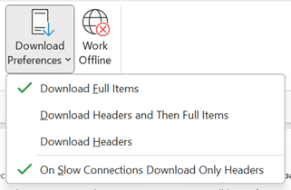

# Frequently asked questions

This section contains the frequently asked questions and the answers.

## Registration process

I am trying to fill in the registration form but getting error while submitting. How can I proceed?

This might happen if there are some fields where the value is unexpected. 

1.	Please recheck all the fields again. 
2.	Try to use smaller size payload and check that HTML tags are not used.
3.	In case you do not find any discrepancy, please remove the card payload json and submit again. If the form is submitted, please send the card payload separately on onboardoam@microsoft.com along with originator id. 

I have submitted a registration request with organization scope. Who will approve my registration?

For an org scope registration of Actionable Messages, the approval of the registration depends on the policies of your organization. Typically, the person or team responsible for managing the M365 tenant will need to approve the registration of Actionable Messages. This could be an IT administrator, a security team, or another group within the organization that is responsible for managing Office 365.
To check who are your org IT admins, follow the following steps :
1.  Go to graph explorer :https://developer.microsoft.com/en-us/graph/graph-explorer
2.  Make a GET request using https://graph.microsoft.com/v1.0/directoryRoles request URL. This will show the list of roles in your tenant.
3.  In the response you can search for “Exchange Administrator” and “Global Administrator.”\
4.  In some tenants exchange Admins might not be present. If exchange Admin role is not listed then you can use the “id” from the global administrator role to fetch the list of tenant admins. 

How can I update sender email adress for a approved registered provider?

To update the sender list for you Actionable message provider, you can reach out to onboardoam@microsoft.com with updated details. Our team will acknowledge and  update it in backend. Please note that any update will take 2 weeks after the team acknowledges your update. 

## Actionable Message Rendering

Actionable card does not show up in Outlook Win32 desktop but works fine in Outlook Web.

If you don’t see the Actionable Message in Outlook desktop, please confirm the following:
1.  Your download preferences are set to “Download full items”. It should look like below image 

2.  You are not using any screen reader.
3.  Please also check if the following registry key is set to 0 - HKEY_CURRENT_USER\Control Panel\Accessibility\Blind Access\On.

Actionable messages is worked as expected with user mailbox but not with Group or shared mailboxes.

This is the expected beahviour. Actionable Messages works only with single user mailboxses, Group or shared mailboxes are not supported.

Users from my organizer are not able to use Actionable Messages and the action redirects them to webpage.

Please check if the organization usese Mimecase or other similar services. Mimecast changes emails in ways that prevent Actionable Messages workflow . Please perform the following actions to check if it really the issue
1.  Disable Mimecast temporarily and check if  AMs (new mails)are working in that case .
2.  Add "schema.org" domain or "http://schema.org/extensions" to Mimecast exception list.

Is there a limit to number of Actionable messages that can be opened in Outlook at one time ?

To maintain optimal performance, we allow a maximum of 5 actionable messages emails to be opened at one time. Trying to open more than that simulaneously will shown an error.

## Upgrading to Adaptive Card 1.4 and above

I have upgraded the Adaptive card version from 1.0 to 1.4, but I don't see the Action buttons anymore.

Action execution paradigm has changed from Adaptive card version 1.4. We have started supporting  [Action.Execute](https://adaptivecards.io/explorer/Action.Execute.html) in place of Action.Http. For more information, see [code sample using Adaptive cards 1.4+](./adaptive-card-code-sample-1.md) .

