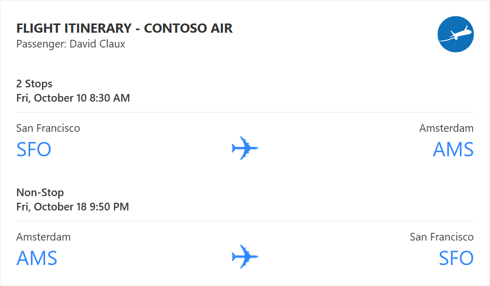
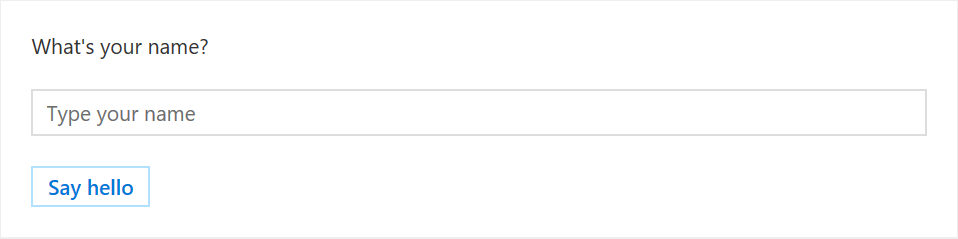
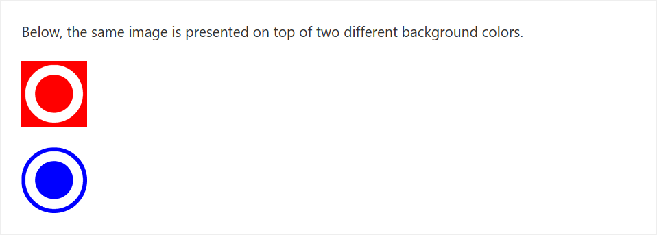

# Designing Outlook Actionable Message cards with the Adaptive Card format

Outlook Actionable Messages cards are designed using the Adaptive Card format. The Adaptive Card format is a simple yet powerful declarative layout format that provides a lot of flexibility, allowing for visually rich cards. In this topic we'll cover the Outlook-specific features of the Adaptive Card format.

> [!IMPORTANT]
> The Adaptive Card format is only available for Actionable Messages sent via email. The MessageCard format is still supported but is now de-emphasized. Office 365 Connectors do not currently support the Adaptive Card format. If you are implementing an Office 365 Connector, please refer to the [MessageCard format reference](https://docs.microsoft.com/outlook/actionable-messages/message-card-reference).
>
> For information on which Outlook versions support the Adaptive Card format, see [Outlook version requirements for actionable messages](index.md#outlook-version-requirements-for-actionable-messages).

## Card Playground

Our [Card Playground tool](https://messagecardplayground.azurewebsites.net) has been updated to support the Adaptive Card format. There you will find Adaptive Card samples (including the one below) that can help you get started crafting your own cards and also allows you to send those cards to your own Office 365 email account to see how they look in Outlook.

## Adaptive Cards Designer (preview)

The [Adaptive Cards Designer](https://acdesignerbeta.azurewebsites.net/) provides a drag-and-drop experience to quickly build and tweak adaptive cards.

## A simple Adaptive Card example



The above card illustrates some of the core and most powerful capabilities of the Adaptive Card format:

- The ability to stack elements of various types in any order
- The ability to control the amount of space between those elements
- The ability to layout elements in multiple columns
- The ability to align elements horizontally and vertically

Here is how this card is crafted:

```json
{
  "$schema": "https://adaptivecards.io/schemas/adaptive-card.json",
  "version": "1.0",
  "type": "AdaptiveCard",
  "speak": "<s>Your flight is confirmed for you and 3 other passengers from San Francisco to Amsterdam on Friday, October 10 8:30 AM</s>",
  "body": [
    {
      "type": "ColumnSet",
      "columns": [
        {
          "width": "stretch",
          "verticalContentAlignment": "center",
          "items": [
            {
              "type": "TextBlock",
              "size": "medium",
              "text": "**FLIGHT ITINERARY - CONTOSO AIR**"
            },
            {
              "type": "TextBlock",
              "spacing": "none",
              "text": "Passenger: David Claux",
              "isSubtle": true
            }
          ]
        },
        {
          "width": "auto",
          "items": [
            {
              "type": "Image",
              "width": "48px",
              "url": "http://lh3.googleusercontent.com/ik5VKcUE5U7qGSpU3XWwAwe_zeOnHU5x_79o-VXf-C_EGrFPHp4-NcKRCtblrJM5iO61=w300"
            }
          ]
        }
      ]
    },
    {
      "type": "TextBlock",
      "text": "2 Stops",
      "weight": "bolder",
      "spacing": "medium"
    },
    {
      "type": "TextBlock",
      "text": "Fri, October 10 8:30 AM",
      "weight": "bolder",
      "spacing": "none"
    },
    {
      "type": "ColumnSet",
      "separator": true,
      "columns": [
        {
          "type": "Column",
          "width": 1,
          "items": [
            {
              "type": "TextBlock",
              "text": "San Francisco",
              "isSubtle": true
            },
            {
              "type": "TextBlock",
              "size": "extraLarge",
              "color": "accent",
              "text": "SFO",
              "spacing": "none"
            }
          ]
        },
        {
          "type": "Column",
          "width": "auto",
          "items": [
            {
              "type": "TextBlock",
              "text": "&nbsp;"
            },
            {
              "type": "Image",
              "url": "https://messagecardplayground.azurewebsites.net/assets/airplane.png",
              "size": "small",
              "spacing": "none"
            }
          ]
        },
        {
          "type": "Column",
          "width": 1,
          "items": [
            {
              "type": "TextBlock",
              "horizontalAlignment": "right",
              "text": "Amsterdam",
              "isSubtle": true
            },
            {
              "type": "TextBlock",
              "horizontalAlignment": "right",
              "size": "extraLarge",
              "color": "accent",
              "text": "AMS",
              "spacing": "none"
            }
          ]
        }
      ]
    },
    {
      "type": "TextBlock",
      "text": "Non-Stop",
      "weight": "bolder",
      "spacing": "medium"
    },
    {
      "type": "TextBlock",
      "text": "Fri, October 18 9:50 PM",
      "weight": "bolder",
      "spacing": "none"
    },
    {
      "type": "ColumnSet",
      "separator": true,
      "columns": [
        {
          "type": "Column",
          "width": 1,
          "items": [
            {
              "type": "TextBlock",
              "text": "Amsterdam",
              "isSubtle": true
            },
            {
              "type": "TextBlock",
              "size": "extraLarge",
              "color": "accent",
              "text": "AMS",
              "spacing": "none"
            }
          ]
        },
        {
          "type": "Column",
          "width": "auto",
          "items": [
            {
              "type": "TextBlock",
              "text": "&nbsp;"
            },
            {
              "type": "Image",
              "url": "https://messagecardplayground.azurewebsites.net/assets/airplane.png",
              "size": "small",
              "spacing": "none"
            }
          ]
        },
        {
          "type": "Column",
          "width": 1,
          "items": [
            {
              "type": "TextBlock",
              "horizontalAlignment": "right",
              "text": "San Francisco",
              "isSubtle": true
            },
            {
              "type": "TextBlock",
              "horizontalAlignment": "right",
              "size": "extraLarge",
              "color": "accent",
              "text": "SFO",
              "spacing": "none"
            }
          ]
        }
      ]
    }
  ]
}
```

## Adaptive Card design tips

An Adaptive Card can be very simple or quite complex depending on the layout you wish to achieve. It is always a good idea to plan your design ahead of writing the Adaptive Card payload, using a paint tool for instance or even just pen and paper; this will make it a lot easier to translate visuals into the appropriate Adaptive Card constructs. Below are a few design tips to help you get started.

### Text formatting

All `TextBlock` elements in a card can be formatted using Markdown. Outlook supports basic Markdown.

> [!IMPORTANT]
> Since all `TextBlock` elements are processed as Markdown, be sure to escape Markdown special characters (such as `*` or `#`) if needed.

| Effect | Markdown syntax |
|--------|-----------------|
| Italics | `*This text is in italics*` |
| Bold | `**This text is bold**` |
| Bold + italics | `***This text is bold and in italics***` |
| Strike-through | `~~This text is struck through~~` |
| Link | `[Microsoft](http://www.microsoft.com)` |
| Headings (level 1 through 6) | `# Heading` through `###### Heading` |
| Bulleted list | `* List item` or `- List item` |

> [!TIP]
> - **Do** use Markdown to format text.
> - **Don't** use HTML markup in your cards. HTML is ignored and treated as plain text.

### Design for a narrow screen

Just like when designing the HTML body of an email, you have to assume that your Adaptive Card might be displayed on both wide and narrow screens (e.g. a desktop and a mobile phone.)

> [!TIP]
> - **Do** design your Adaptive Card in such a way that it looks great on a narrow screen. Typically, a card  designed for a narrow screen will scale well to a wide screen. The opposite is however not true.
> - **Don't** design your Adaptive Card assuming that only users of Outlook on the desktop will see it.

### Craft your images with high DPI screens in mind

Not so long ago, most screens had a somewhat low resolution (1024x768 pixels for instance) and were operating at 96 DPI (Dots Per Inch), meaning that 96 pixels would fit within an actual inch of the screen. But in the past few years, screens have grown considerably in terms of resolution and DPI, especially on mobile devices, and it is now very common for a screen to operate at 192 DPI or even more.

When designing your Adaptive Cards, you need to make sure your images will look good on any screen regardless of its DPI.

> [!TIP]
> - **Do** design your images assuming they will be displayed on a high DPI screen. An image designed for a low (96) DPI screen will be blown up when displayed on a higher DPI screen and will therefore look pixelated. An image designed for a high DPI screen will be shrunk on a lower DPI screen which usually yields good results. In other words, it is better to design a 100x100 pixels image and display it at 50x50 pixels than to design a 50x50 pixels image and display it at 100x100 pixels.
> - **Do** use the `width` and `height` properties of the **Image** element if you need to precisely control the actual size of the images in your card.
> - **Don't** design your images with a fixed background color, like white, unless that background color is supposed to be visible to the user. In Outlook, your Adaptive Cards will not necessarily be displayed on top of a white background, and your images should be able to superimpose themselves on top of any background color. For that reason, **do** make the background of your images transparent.
> - **Don't** craft your images with built-in paddings. Such paddings usually interfere with the overall layout by introducing undesirable spacing on the side of your image.

### Use of containers

Use the `Container` element only when necessary. The `Container` element makes it possible to group a set of elements together.

> [!TIP]
> - **Do** use a `Container` to **emphasize a group of elements**: by setting the `style` property of the `Container` to `emphasis` you can make that `Container`, and the elements it contains, stand out.
> - **Do** use a `Container` to **associate an action with group of elements**: by setting the `selectAction` property of a `Container`, the `Container` and its content become a single clickable area that triggers the specified action.
> - **Do** use a `Container` to make a portion of your card collapsible: by using an `Action.ToggleVisibility` targeted to a `Container`, you can easily make a group of elements collapsible.
> - **Don't** use `Container` for any other reason.

### Use of columns

Use `ColumnSet` only when you need to align several elements on a single horizontal line.

> [!TIP]
> - **Do** use `ColumnSet` for table-like layouts in general.
> - **Do** use `ColumnSet` if you need to, for example, display an image of the far left of the card and some text on the same line at the far right of the card.
> - **Do** use the appropriate sizing approach for columns:
>   - Use `"width": "auto"` for a `Column` to use as much width as is necessary to fit its content.
>   - Use `"width": "stretch"` for a `Column` to use the remaining width in the `ColumnSet`. When multiple `Columns` have `"width": "stretch"`, they all equally share the remaining width.
>   - Use `"width": <number>` for a `Column` to use a proportion of the available width in the `ColumnSet`. If you have three columns with their `width` property set to `1`, `4` and `5` respectively, they will end up using 10%, 40% and 50% of the available width, respectively.
>   - Use `"width": "<number>px"` to have a specific pixel width. This is particularly useful (and necessary) when creating table layouts.
> - **Don't** use `ColumnSet` if all you need is stack elements vertically.

## Outlook-specific Adaptive Card properties and features

Outlook introduces a set of additional Adaptive Card properties and features for use in the context of Actionable Messages.

> [!IMPORTANT]
> Outlook-specific Adaptive Card properties and features **only work in the context of Actionable Messages**. They will NOT work in other Adaptive Card enabled applications and are therefore not documented on the [official Adaptive Cards site](https://adaptivecards.io/).

### Adaptive Card features not supported with Outlook Actionable Messages

#### Action.Submit

The `Action.Submit` action type is **NOT** supported with Outlook Actionable Messages. If you include an `Action.Submit` in your card, it will not be displayed.

#### Input.Time

The `Input.Time` element type is **NOT** supported with Outlook Actionable Messages. If you include an `Input.Time` element in your card, it will not be displayed. If you need to allow users to input a time, use an `Input.Text` instead and validate its value server-side.

### Action.Http

Outlook Actionable Messages use an HTTP-based action model via the `Action.Http` type. `Action.Http` makes it possible to make a GET or POST request to a specific target url as a result of a user taking an action in a card.

| Property name | Type | Required | Description |
|---------------|------|----------|-------------|
| `type` | String | Yes | Must be set to `Action.Http`. |
| `title` | String | No | The title of the action as it will appear on screen on a button control, for instance. |
| `method` | String | Yes | Valid values are `GET` and `POST`. When `method` is set to `POST` the `body` property must be specified. |
| `url` | String | Yes | The url of the request's target endpoint. The `url` property supports [input value substitution](#input-value-substitution). |
| `headers` | Array of [HttpHeader](#httpheader) objects | No | An optional list of headers that should be sent to the target endpoint .|
| `body` | String | Only if `method` is set to `POST` | The body of the POST request. The `body` property supports [input value substitution](#input-value-substitution). |

#### HttpHeader

| Property name | Type | Required | Description |
|---------------|------|----------|-------------|
| `name` | String | Yes | The name of the HTTP header. For example, `Content-Type`. |
| `value` | String | Yes | The value of the HTTP header. For example, `application/json`. The `value` property supports [input value substitution](#input-value-substitution). |

#### Action.Http example

```json
{
  "type": "AdaptiveCard",
  "version": "1.0",
  "body": [
    {
      "type": "TextBlock",
      "text": "Hello world!"
    }
  ],
  "actions": [
    {
      "type": "Action.Http",
      "title": "Click me!",
      "method": "POST",
      "url": "https://contoso.com/api/...",
      "body": "<body of the POST request>",
      "headers": [
        { "name": "Content-Type", "value": "application/json" }
      ]
    }
  ]
}
```


#### Input value substitution

Adaptive Cards may contain inputs, and it may be necessary to pass the values of these inputs to the target endpoint via an `Action.Http` action. This is done using input value substitution. Consider the following example:

```json
{
  "type": "AdaptiveCard",
  "version": "1.0",
  "body": [
    {
      "type": "TextBlock",
      "text": "What's your name?"
    },
    {
      "type": "Input.Text",
      "id": "nameInput",
      "placeholder": "Type your name"
    }
  ],
  "actions": [
    {
      "type": "Action.Http",
      "title": "Say hello",
      "method": "GET",
      "url": "https://contoso.com/sayhello?name={{nameInput.value}}"
    }
  ]
}
```



The above card defines a text input and sets it `id` property to `nameInput`. It also defines an `Action.Http` action that makes a GET call to an endpoint on domain contoso.com. With the inclusion of `?name={{nameInput.value}}` on the target URL, the value of the input with id `nameInput` will be dynamically substituted at the time the action is taken by the user. So if the user had entered the name David in the text input, the target URL after substitution would be `https://contoso.com/sayhello?name=David`

Input value substitution also works in the body property of an `Action.Http` action. For example:

```json
{
  "type": "AdaptiveCard",
  "version": "1.0",
  "body": [
    {
      "type": "TextBlock",
      "text": "What's your name?"
    },
    {
      "type": "Input.Text",
      "id": "nameInput",
      "placeholder": "Type your name"
    }
  ],
  "actions": [
    {
      "type": "Action.Http",
      "title": "Say hello",
      "method": "POST",
      "url": "https://contoso.com/sayhello",
      "body": "{{nameInput.value}}"
    }
  ]
}
```

#### Reporting Action.Http execution success or failure

Your service should return an HTTP 200 status code when it successfully executes an `Action.Http` action. If the action execution fails, your service should return an HTTP 4xx status code, and it should also include the `CARD-ACTION-STATUS` HTTP header in its response to specify a custom error message. The value of that header will be displayed to the end-user in case the `Action.Http` fails to execute.

> [!TIP]
> Follow these guidelines when returning a response to `Action.Http` actions.
>
> - **Do** return the `CARD-ACTION-STATUS` header in your error responses.
> - **Do** make the message in that header as informative and meaningful as possible.
> - **Don't** mention either the name of the person taking the action nor the time the action is being taken in your `CARD-ACTION-STATUS` header.

#### Refresh cards

Refresh cards are a very powerful mechanism that allow `Action.Http` actions to fully update the card on the fly as the action successfully completes. There are many scenarios that benefit from refresh cards:

- Approval scenario (e.g. expense report)
  - Once the request is approved or rejected, the card is refreshed to remove the approve/decline actions and update its content so it reflects the fact that it's been approved or declined.
- Task status
  - When an action is taken on a task, such as setting its due date, the card refreshes to include the updated due date in its facts.
- Survey
  - Once the question has been answered, the card is refreshed so:
    - It no longer allows the user to respond.
    - It shows updated status, like "Thanks for responding to this survey" alongside the user's actual response.
    - Potentially include a new `Action.OpenUrl` action that allows the user to consult the survey online.

To refresh a card as a result of an `Action.Http` action, a service needs to do the following:

- Include the JSON payload of the new card in the body of the response to the HTTP POST request it received.
- Add the `CARD-UPDATE-IN-BODY: true` HTTP header to the response, in order to let the receiving client know that it should parse the response body and extract a new card (this is to avoid unnecessary processing when no refresh card is included.)

> [!TIP]
> Follow these guidelines when returning refresh cards.
>
> - **Do** use refresh cards with actions that can only be taken a single time. In those cases, the refresh card would not include any action that cannot be taken anymore.
> - **Do** use refresh cards with actions that change the state of the entity they are performed on. In those cases, the refresh card should include updated information about the entity, and MAY change the set of actions that can be performed.
> - **Don't** use refresh cards to lead a conversation with the user. For instance, don't use refresh cards for a multi-step "wizard".
> - **Do** include at least an `Action.OpenUrl` action to view the entity in the external app it comes from.

### Action.InvokeAddInCommand

The `Action.InvokeAddInCommand` action opens an Outlook add-in task pane. If the add-in is not installed, the user is prompted to install the add-in with a single click.

When an `Action.InvokeAddInCommand` action is executed, Outlook first checks if the requested add-in is installed and turned on for the user. If it is not, the user is notified that the action requires the add-in, and is able to install and enable the add-in with a single click. Outlook opens the requested task pane, making any initialization context specified by the action available to the add-in.

For more information, see [Invoke an Outlook add-in from an actionable message](invoke-add-in-from-actionable-message.md).

| Property name | Type | Required | Description |
|---------------|------|----------|-------------|
| `type` | String | Yes | Must be set to `Action.InvokeAddInCommand`. |
| `title` | String | No | The title of the action as it will appear on screen on a button control, for instance. |
| `addInId` | String | Yes | Specifies the add-in ID of the required add-in. The add-in ID is found in the [Id element in the add-in's manifest](https://docs.microsoft.com/javascript/office/manifest/id). |
| `desktopCommandId` | String | Yes | Specifies the ID of the add-in command button that opens the required task pane. The command button ID is found in the `id` attribute of the [Control element](https://docs.microsoft.com/javascript/office/manifest/control) that defines the button in the add-in's manifest. The specified `Control` element MUST be defined inside a [MessageReadCommandSurface extension point](https://docs.microsoft.com/javascript/office/manifest/extensionpoint), be of type `Button`, and the control's `Action` must be of type `ShowTaskPane`. |
| `initializationContext` | Object | Yes | Developers may specify any valid JSON object in this field. The value is serialized into a string and made available to the add-in when the action is executed. This allows the action to pass initialization data to the add-in. |

### Action.DisplayMessageForm

The `Action.DisplayMessageForm` action opens the read form of a message given that message's ID. Message IDs can be retrieved via the [Outlook REST APIs](../rest/reference.md).

| Property name | Type | Required | Description |
|---------------|------|----------|-------------|
| `type` | String | Yes | Must be set to `Action.DisplayMessageForm`. |
| `title` | String | No | The title of the action as it will appear on screen on a button control, for instance. |
| `itemId` | String | Yes | Specifies the ID of the message to open. |

### Action.DisplayAppointmentForm

The `Action.DisplayAppointmentForm` action opens the read form of a calendar item given that calendar item's ID. Calendar item IDs can be retrieved via the [Outlook REST APIs](../rest/reference.md).

| Property name | Type | Required | Description |
|---------------|------|----------|-------------|
| `type` | String | Yes | Must be set to `Action.DisplayAppointmentForm`. |
| `title` | String | No | The title of the action as it will appear on screen on a button control, for instance. |
| `itemId` | String | Yes | Specifies the ID of the calendar item to open. |

### Action.ToggleVisibility

The `Action.ToggleVisibility` action makes it possible to show and/or hide specific elements of a card as a result of a user clicking on a button or other actionable element. Coupled with the `isVisible` property, `Action.ToggleVisibility` allows for an extra degree of interactivity within a single card.

| Property name | Type | Required | Description |
|---------------|------|----------|-------------|
| `type` | String | Yes | Must be set to `Action.ToggleVisibility`. |
| `title` | String | No | The title of the action as it will appear on screen on a button control, for instance. |
| `targetElements` | Array of String or TargetElement | Yes | The list of elements that should have their visibility toggled. When elements of the `targetElements` array are specified as strings, they must represent the Id of an element in the card; when the action is executed, these elements become visible if they were not, and invisible otherwise. When elements of the array are specified as `TargetElement` objects, the visibility of each targeted element is defined by the `isVisible` property of the `TargetElement` object.|

#### TargetElement

| Property name | Type | Required | Description |
|---------------|------|----------|-------------|
| `elementId` | String | Yes | The Id of the target element. |
| `isVisible` | Boolean | Yes | Specifies whether the target element should be visible once the action has completed. |

#### Action.ToggleVisibility example

```json
{
  "type": "AdaptiveCard",
  "version": "1.0",
  "body": [
    {
      "type": "TextBlock",
      "text": "**Action.ToggleVisibility example**: click the button to show or hide a welcome message"
    },
    {
      "type": "TextBlock",
      "id": "helloWorld",
      "isVisible": false,
      "text": "**Hello World!**",
      "size": "extraLarge"
    }
  ],
  "actions": [
    {
      "type": "Action.ToggleVisibility",
      "title": "Click me!",
      "targetElements": [ "helloWorld" ]
    }
  ]
}
```

The example card renders similar to the following before the button is clicked:


The example card renders similar to the following after the button is clicked:


### Action.Transaction

> [!IMPORTANT]
> The `Action.Transaction` action has been deprecated. Payment request messages should be sent using the [ActionRequest format](../payments/action-request.md) instead.

The `Action.Transaction` action triggers the [payments in Outlook](../payments/index.md) experience. When the user invokes the action, Outlook retrieves the latest invoice details from the merchant. This information is displayed in a pane in Outlook, allowing the user to click through the Microsoft Pay experience to pay the invoice. See [Get started with payments in Outlook](../payments/get-started.md) for more information.

> [!NOTE]
> Before you can use the `Action.Transaction` type, you must register in the [partner dashboard for payments in Outlook](../payments/partner-dashboard.md) to receive a merchant ID and display ID.

| Property name | Type | Required | Description |
|---------------|------|----------|-------------|
| `type` | String | Yes | Must be set to `Action.Transaction`. |
| `title` | String | No | The title of the action as it will appear on screen on a button control, for instance. |
| `initializationContext` | Object | Yes | Contains required information for the payments in Outlook experience. |
| `initializationContext.merchantId` | GUID | Yes | Your merchant ID obtained by registering in the [partner dashboard for payments in Outlook](../payments/partner-dashboard.md). |
| `initializationContext.displayId` | GUID | Yes | Your display ID obtained by registering in the [partner dashboard for payments in Outlook](../payments/partner-dashboard.md). |
| `initializationContext.productContext` | Object | Yes | Developers may specify any valid JSON object in this field. The value is included in the payloads sent to your payment request and payment complete webhooks. |

#### Action.Transaction example

```json
{
  "type": "AdaptiveCard",
  "version": "1.0",
  "body": [
    {
      "type": "TextBlock",
      "weight": "bolder",
      "size": "large",
      "color": "accent",
      "text": "Invoice from Contoso"
    },
    {
      "type": "TextBlock",
      "weight": "bolder",
      "size": "medium",
      "text": "$57.28 due on May 30, 2018"
    }
  ],
  "actions": [
    {
      "type": "Action.Transaction",
      "title": "Review and pay",
      "initializationContext": {
          "merchantId": "6b810c7b-4dc5-40dd-82b2-916189ed4524",
          "displayId": "0a55e631-60b1-4bad-b77a-3c3b1749a12f",
          "productContext": {
              "invoiceId": "INV-0115"
          }
      }
    }
  ]
}
```

### ActionSet element

Outlook Actionable Messages add support for the `ActionSet` element that makes it possible to add action buttons anywhere in a card.

| Property name | Type | Required | Description |
|---------------|------|----------|-------------|
| `type` | String | Yes | Must be set to `ActionSet`. |
| `id` | String | No | The unique ID of the element. |
| `spacing` | String | No | Controls the amount of spacing between this element and the previous element. |
| `separator` | Boolean | No | Controls whether or not a separator line should be displayed between this element and the previous element. The separator line is displayed in the middle of the space defined by the `spacing` property. |
| `horizontalAlignment` | String | No | Controls the horizontal alignment of this element within its container. |
| `actions` | Array of `Action` objects | No | The actions to be displayed in the set. |

Aside from the fact that `ActionSet` can be placed anywhere in the card, it behaves exactly like the actions property of an `AdaptiveCard`.

#### ActionSet example

```json
{
  "type": "AdaptiveCard",
  "version": "1.0",
  "body": [
      {
        "type": "ActionSet",
        "actions": [
          {
            "type": "Action.ToggleVisibility",
            "title": "Click me!",
            "targetElements": [ "helloWorld" ]
          }
        ]
      },
      {
        "type": "TextBlock",
        "text": "**Action.ToggleVisibility example**: click the button above to show or hide a welcome message"
      },
      {
        "type": "TextBlock",
        "id": "helloWorld",
        "isVisible": false,
        "text": "**Hello World!**",
        "size": "extraLarge"
      }
  ]
}
```


### Additional properties on all Adaptive Card element types

| Property name | Type | Required | Description |
|---------------|------|----------|-------------|
| `isVisible` | Boolean | No. Defaults to **true**. | The initial visibility state of the element. When `isVisible` is set to `false`, the element is initially not visible in the card. It can be made visible using an `Action.ToggleVisibility` action, as documented above. |

Please refer to the previous example for an illustration of how to use `isVisible`.

### Additional properties on the AdaptiveCard type

The following additional properties can be specified on an [AdaptiveCard object](https://adaptivecards.io/explorer/AdaptiveCard.html) in the context of Outlook Actionable Messages:

| Property name | Type | Required | Description |
|---------------|------|----------|-------------|
| `correlationId` | String | No | The `correlationId` property simplifies the process of locating logs for troubleshooting issues. We recommend that when sending an actionable card, your service should set and log a unique UUID in this property. When the user invokes an `Action.Http` action on the card, Office 365 sends the `Card-Correlation-Id` and `Action-Request-Id` headers in the POST request to your service. `Card-Correlation-Id` contains the same value as the `correlationId` property in the card. `Action-Request-Id` is a unique UUID generated by Office 365 to help locate specific action performed by a user. Your service should log both of these values when receiving action POST requests. |
| `expectedActors` | Array of String | No | `expectedActors` contains a list of expected email addresses of the users that may take `Action.Http` actions on the card. A user can have multiple email addresses and the `Action.Http` target endpoint might not be expecting the particular email address presented in the `sub` claim of the bearer token. For example, a user could have both the `john.doe@contoso.com` or `john@contoso.com` email address, but the `Action.Http` target endpoint expects to receive `john@contoso.com` in the sub claim of the bearer token. By setting the `expectedActors` property to `["john@contoso.com"]`, the `sub` claim will have the expected email address. |
| `originator` | String | Yes | For actionable email, MUST be set to the provider ID generated by the [Actionable Email Developer Dashboard](actionable-email-dev-dashboard.md). |
| `hideOriginalBody` | Boolean | No. Defaults to **false**. | When set to true, causes the HTML body of the message to be hidden. This is very useful in scenarios where the card is a better or more useful representation of the content than the HTML body itself, which is especially true when the card contains actions. **Consider** hiding the original HTML body if the card itself contains all the information a user would need, or if the content of the card is redundant with the content of the body. Do always include a nice, meaningful HTML body, even if it is going to be hidden. The HTML body is the only thing an email client that doesn't support cards will be able to display. Furthermore, cards are not included when replying to or forwarding emails, only the HTML body. **Don't** hide the body when it is complementary to the information presented in the card. For example, the body of an expense report approval might describe the report in great details while the card just presents a quick summary along with approve/decline actions. |

### Additional properties on the Column type

The following additional properties can be specified on a [Column object](https://adaptivecards.io/explorer/Column.html) in the context of Outlook Actionable Messages:

| Property name | Type | Required | Description |
|---------------|------|----------|-------------|
| `width` | Number or String | No (defaults to `auto`) | This property allows for precise control of the width of a `Column` within its `ColumnSet`. See [Column width values](#column-width-values) for details. |
| `verticalContentAlignment` | String. Valid values are `top`, `center` and `bottom`. | No. Defaults to `top`. | The `verticalContentAlignment` property makes it possible to vertically position the content of the column (e.g. all its elements.) This is particularly useful for table-like layouts. |
| `backgroundImage` | String | No | The `backgroundImage` property represents the URL to an image that is to be used as the background of the `Column`. The background image covers the entirety of the `Column`'s surface and is scaled so as to preserve its original aspect ratio. |

#### Column width values

If `width` is expressed as a number, it represents the relative weight of the `Column` within its `ColumnSet`. For a weighted `Column` to really be useful, there should be at least one more weighted `Column` in the set. For example, if column A has its `width` set to `1` and column B has its `width` set to `2`, then column A will use a third of the available space in the set, while column B will use the remaining two-thirds.

If `width` is expressed as a string, it can have the following values:

- `auto`: The `Column` will use as much of the available space as is required to fit its content.
- `stretch`: The `Column` will use whatever space remains in the set. If multiple columns have their `width` property set to `stretch`, they all share the remaining space equally.
- `<number>px` (ex. `50px`): The column will spread across the specified number of pixels.
- `<number>*`, (ex. `1*`): This is equivalent to specifying `width` as a number.

#### Column example

```json
{
  "$schema": "https://adaptivecards.io/schemas/adaptive-card.json",
  "type": "AdaptiveCard",
  "version": "1.0",
  "body": [
    {
      "type": "ColumnSet",
      "columns": [
        {
          "width": "50px",
          "items": [
            {
              "type": "Image",
              "url": "https://adaptivecards.io/content/cats/1.png",
              "size": "stretch"
            }
          ]
        },
        {
          "width": "stretch",
          "verticalContentAlignment": "center",
          "items": [
            {
              "type": "TextBlock",
              "text": "This card has two ColumnSets on top of each other. In each, the left column is explicitly sized to be 50 pixels wide.",
              "wrap": true
            }
          ]
        }
      ]
    },
    {
      "type": "ColumnSet",
      "columns": [
        {
          "width": "50px"
        },
        {
          "width": "stretch",
          "verticalContentAlignment": "center",
          "items": [
            {
              "type": "TextBlock",
              "text": "In this second ColumnSet, columns align perfectly even though there is nothing in the left column.",
              "wrap": true
            }
          ]
        }
      ]
    }
  ]
}
```


### Additional properties on the Container type

The following additional properties can be specified on a [Container object](https://adaptivecards.io/explorer/Container.html) in the context of Outlook Actionable Messages:

| Property name | Type | Required | Description |
|---------------|------|----------|-------------|
| `verticalContentAlignment` | String. Valid values are `top`, `center` and `bottom`. | No. Defaults to `top`. | The `verticalContentAlignment` property makes it possible to vertically position the content of the column (e.g. all its elements.) This is particularly useful for table-like layouts. |
| `backgroundImage` | String | No | The `backgroundImage` property represents the URL to an image that is to be used as the background of the `Container`. The background image covers the entirety of the `Container`'s surface and is scaled so as to preserve its original aspect ratio. |

These properties behave exactly like their counterpart on the `Column` type. Please refer to the above example.

### Additional properties on the Image type

The following additional properties can be specified on an [Image object](https://adaptivecards.io/explorer/Image.html) in the context of Outlook Actionable Messages:

| Property name | Type | Required | Description |
|---------------|------|----------|-------------|
| `width` | String | No | This property allows for precise control over the width of an image, in pixels. The allowed format is `<number>px` where `<number>` is an integer. When `width` is specified, the `size` property is ignored. If `width` is specified but `height` isn't, the height of the image is automatically computed so as to respect its aspect ratio. |
| `height` | String | No | This property allows for precise control over the height of an image, in pixels. The allowed format is `<number>px` where `<number>` is an integer. When `height` is specified, the `size` property is ignored. If `height` is specified but `width` isn't, the width of the image is automatically computed so as to respect its aspect ratio. |
| `backgroundColor` | String | No | The `backgroundColor` property specifies the color the image should be rendered on top of. `backgroundColor` is particularly useful in cases where a single image should be used on top of a variety of background colors, as it removes the need to craft multiple versions of a single image. The format of the `backgroundColor` property is `#RRGGBB` where `RR`, `GG` and `BB` are the hexadecimal values of the red, green and blue components of the color, respectively. |

#### Image properties example

```json
{
  "$schema": "https://adaptivecards.io/schemas/adaptive-card.json",
  "type": "AdaptiveCard",
  "version": "1.0",
  "body": [
    {
      "type": "TextBlock",
      "text": "Below, the same image is presented on top of two different background colors."
    },
    {
      "type": "Image",
      "width": "64px",
      "url": "https://messagecardplayground.azurewebsites.net/assets/circleontransparentbackground.png",
      "backgroundColor": "#FF0000"
    },
    {
      "type": "Image",
      "style": "person",
      "width": "64px",
      "url": "https://messagecardplayground.azurewebsites.net/assets/circleontransparentbackground.png",
      "backgroundColor": "#0000FF"
    }
  ]
}
```



## See also

- [Adaptive Card portal](https://adaptivecards.io)