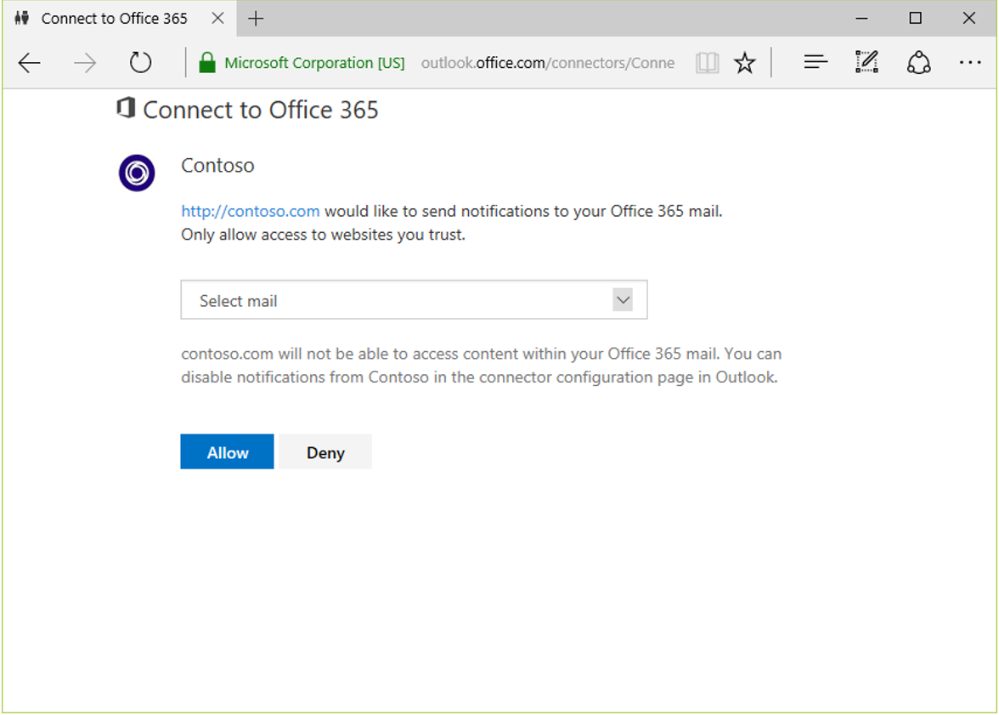

# Register your connector with the Office 365 Connectors developer dashboard

Building an Office 365 Connector for your application is easy. All you need to do is register your connector in our developer portal, add a **Connect to Office 365** button to your application and implement your connector. Once you add a Connect button to your application, your users are able to use it to authorize their Office 365 Groups or Inbox to receive your actionable message cards. You can make it easy for your users to discover the connector by publishing to our catalog.

## Build your own Connector

### Registering your Connector

1. Visit the [Connector Developer Portal](https://aka.ms/publishconnector) and login with your Office 365 credentials. If you do not have an Office 365 subscription you can get a one year [FREE Office 365 Subscription](https://dev.office.com/devprogram) under the Office 365 Developer Program.  Alternately, if you have an existing MSDN subscription, you can activate your [free Office 365 benefit](https://msdn.microsoft.com/en-us/subscriptions/manage).

1. Click on **New Connector**.

1. Fill out the basic information such as name, logo, description & redirect URL. When developing the connector you can provide your localhost redirect URL.

1. To enable your connector with actionable message, you can provide one or more target URLs. This is one or more domains corresponding to URLs that will process the actions. Your target URL can correspond to the top level domain or the subdomain of the TLD. They need to be **https** enabled URLs. Example: `https://api.myservice.com`.

1. Your connector can work on Office 365 Groups and Inbox. Make sure your users will benefit from those Connectors in those communication spaces.

1. Once you save the connector information, the html code snippet for the **Connect to Office 365** button is generated. The name, logo, description, company website & events you shared are displayed to a user when he tries to add a new configuration or view an existing one.

Once your connector is published to our catalog, users would be able to configure your connector from within Office 365. When users try to configure your connector from within Office 365, they would be taken to the link you provide in the **Landing page for your users**. So we recommend that you provide a deep link to the page in your product where you would add the connect button. Alternately, you can direct the user to documentation on your website on how to configure the connector on your website.

### Adding the **Connect to Office 365** button

The Connect button helps your app obtain a webhook to the Group authorized by your users. Copy the generated html snippet for the **Connect to Office 365** button and add it to your app. To use the Connect button your application would need an HTTPS redirect URL to receive the response. Implement the redirect URL you specified at the time of registration to listen on the query parameters `state`, `group_name`, `webhook_url`, `error`, and `app_type`. 

```
<a href="https://outlook.office.com/connectors/Connect?state=myAppsState&app_id=a3c4ef20-68aa-42e1-b037-f75624dacf21&callback_url=http://localhost:3000/callback">
  </img>
</a>
```

The query parameters in the html snippet are:

| Parameter    | Details |
|--------------|---------|
| `state`        | You can use the `state` parameter to save your application state. If you supply a value for `state` it is returned back to the specified `callback_url` when the application returns. This is an optional parameter. |
| `app_id`    | This is a GUID that uniquely identifies your application. This is a part of the auto-generated HTML snippet that is generated when you create a new connector & save your connector information. |
| `callback_url` | This is the redirect URL provided when registering the connector. The callback URL should be a valid HTTPS URL without any query parameters. When the application returns successfully, the state passed, name and webhook URL of the selected group are returned as query parameters to the `callback_url`. If the application encounters a failure the state passed and the error code are returned to the `callback_url`. |

When a user clicks on the button, the user is redirected to an Office 365 login page if the user isn't already logged in. After login the user is taken to a page with a picker that lists all the groups and/or inbox available to the user. Once the user selects a target to receive notifications on & authorizes the application, the user is redirected to the callback URL specified by the developer at the time of application registration. The selected `app_type`, `group_name` (if applicable) and the corresponding webhook URL are returned as query parameters. Ensure that you persist the `app_type` and the webhook URL to send connector cards. Also, make sure to prevent accidental disclosure of the webhook information by following the instructions in [Secure the webhook URL](#secure-the-webhook-url). To learn more about sending connector cards see [Get started with actionable messages via connectors](actionable-messages-via-connectors.md).

Once you have registered your connector and implemented it using the connect button, it is fully functional & available to all your users. If you would like your users to discover your connector in our catalog, use the **Publish to Store** button to submit to us for approval.



The following query parameters are sent back in the response:

| Parameter   | Details |
|-------------|---------|
| `state`       | The `state` parameter provided as a query parameter with the request. |
| `group_name`  | The name of the group selected by the user. The `group_name` is returned only when the application returns successfully and the user selected a group from the picker page. If the user is configuring the connector for the inbox, this parameter will not be returned. |
| `webhook_url` | The webhook URL for the selected group. Persist the webhook URL & use it to POST structured JSON to send connector cards to the group. The `webhook_url` is returned only when application returns successfully. |
| `error`       | The error code that is returned if the application doesn't return successfully. |
| `app_type` | The values returned can be `mail`, `groups` or `teams` corresponding to the Office 365 Mail, Office 365 Groups or Microsoft Teams respectively. |
| `user_objectId` | This is the unique id corresponding to the Office 365 user who initiated set up of the connector. It is returned only when the application returns successfully. It should be secured. This value can be used to associate the user in Office 365 who set up the configuration to the user in your service. |

### Secure the webhook URL

The URL returned in `webhook_url` must be persisted securely and not disclosed publicly. If your `callback_url` webpage has external links (to other websites) there is a possibility of accidentally disclosing the webhook URL (which is present as a query parameter) through the `Referrer` header to these websites when users click on these links. In order to prevent such accidental disclosures, we recommend that you either implement a `302` redirect or implement a referrer policy.

#### Implement a `302` redirect

After persisting the values of `group_name`, `app_type`, `user_objectId`, and `webhook_url` securely, redirect back to your `callback_url` (or any other URL) without these query parameters. For example, if the connector configuration process redirected to: 

```http
http://contoso.com/integrations/Office365/callback?state=myState&webhook_url=myWebhookUrl&group_name=selectedGroupName&user_objectId=uniqueIdOfUser&app_type=Groups
```

Your app securely stores the values, then redirects to a URL without these query parameters:

```http
http://contoso.com/integrations/Office365/callback
```

#### Implement a referrer policy

Implement a referrer policy by adding a `meta` tag to the `head` section of your `callback_url` webpage. You can set it to one of the two options listed below.

| Meta tag | Description |
|----------|-------------|
| `<meta name="referrer" content="no-referrer">` | None: Never pass referral data. |
| `<meta name="referrer" content="origin">` | Origin Only: Sends the scheme, host, and port (basically, the subdomain) stripped of the full URL as a referrer, i.e. `https://contoso.com/example.html` would simply send `https://contoso.com`. |

### Error Handling

The error code `AccessDenied` is returned when the user clicks on the **Deny** button in group picker screen. Nothing is returned if the `callback_url` is not a valid HTTPS URL or the user closes the window without allowing access to your application. You would get an `Invalid Request` error if you modify the `app_id` or the `callback_url` in the generated html snippet. If there are no groups to select from the user is guided to try again after creating a group.

### Connect to Office 365 Sandbox

Now you can use our [Sandbox environment](https://connectplayground.azurewebsites.net/) to test out the **Connect to Office 365** button. Once authorized, the sandbox lets you preview your own connector cards by viewing/editing the structured JSON payload available in the sandbox. The preview shows how your connector card would look within Outlook Groups or Inbox. You can even post the message to the group or inbox you allowed access for directly from the playground.

## Publish your Connector to the Store

Once you have thoroughly tested your connector and it is ready to be listed in the Office 365 connector catalog, you can use the **Publish to Store** button to submit it for review. Once reviewed and approved your connector would be added to the connector catalog. 

### Connector submission checklist

-	Ensure that your connector is fully functional & thoroughly tested before submitting it to the Store.
-	Test your connector cards in various clients where your users would use it: Outlook on the Web, Outlook 2016 & Outlook Groups mobile apps.
-	Ensure that you strictly use Markdown for text decoration and not send HTML in your connector card payload.
-	Maintain a balance between adding value and generating too much noise. Ensure that the user is not bogged down with too many notifications.
-	Identify the right events to send connector cards for. Ensure that the information you send to the group is valuable to the members of the group.
-	When sending reports or summaries, use a digest format and allow the user to choose the time and frequency of the reports.
-	When sending connector cards make the best use of Markdown to highlight important parts of the card.
-	Make your connector cards actionable by providing relevant actions whenever possible.
- Actions invoked should be really low in failure rate and should have fast response by your endpoint.
-	Ensure that you have provisions for the user to pause or remove the configuration.
-	Have clear user-facing documentation on the capabilities your connector offers.
- Make sure that you have implemented a `302` redirect or a referrer policy on the `callback_url` webpage to prevent accidental disclosure of the webhook URL.
- When registering your connector:
  - Ensure that the name and logo of your connector does not infringe upon a trademark or copyright of any other product or service.
  -	Provide a high quality logo of type jpg, jpeg, png or gif that is under 60KB in size. 
  -	Provide a short description of your application (e.g. 'Contoso Helpdesk brings companies & customers together').
  -	Provide a detailed description of your connector (e.g. 'The Contoso Helpdesk connector notifies your Office 365 group about activity on your customer's tickets').
  -	The landing page for your users is the page where users would be directed to complete the connector configuration. Make sure that you deep link to the page where you have added the connect button. If this is not possible, point this to your documentation page that has detailed on how to setup your connector.
- When publishing your connector to Store:
  - Make sure to fill out step by step instructions and share test account information to let us test your connector.

## Next steps

If you have any feedback share it on <a target="_blank" href="https://officespdev.uservoice.com/forums/224641-general/category/146379-connectors">UserVoice</a>. Post your questions on Stack Overflow and tag them with [Office365Connectors](https://stackoverflow.com/questions/tagged/Office365Connectors?sort=newest).
