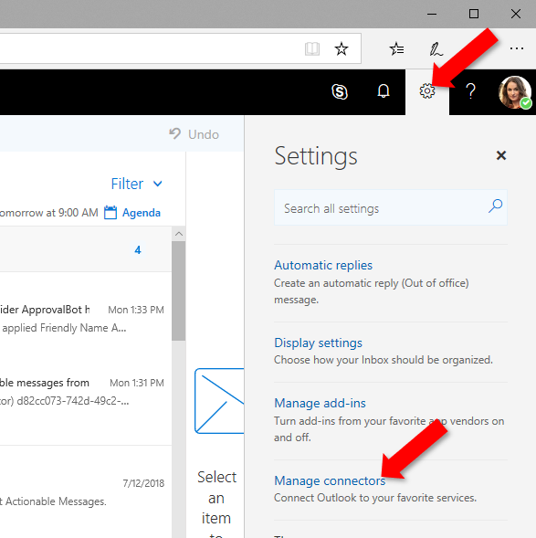
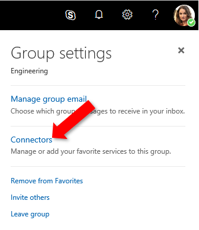

# Actionable messages in Outlook and Office 365 Groups

Whether you are filling out a survey, approving an expense report, or updating a CRM sales opportunity, Actionable Messages enable you to take quick actions right from within Outlook. Developers can now embed actions in their emails or notifications, elevating user engagement with their services and increasing organizational productivity.

Office 365 provides two solutions to enhance productivity with Outlook Actionable Messages: actionable messages via email, and actionable messages via Office 365 Connectors.

> [!NOTE]
> Actionable messages are also available in Microsoft Teams. See [Office 365 Connectors for Teams](/microsoftteams/platform/concepts/connectors/connectors) for more information.

## User experience

Let's take a look at the end-to-end user experience for both an email-based and a connectors-based actionable message scenario.

### Actionable messages via email: expense approval scenario

A Contoso employee submits an expense report to the internal system. That system sends an Actionable Message to the person who is to approve or reject the expense. The card included in the message contains all the information the approver might need to quickly understand who submitted the expense, the total amount, and more. It also includes **Approve** and **Reject** actions that can be taken right from Outlook:

The recipient decides to approve the request, and clicks the **Approve** action:

Outlook makes a request to the expense report approval system, and the expense report is marked as "approved" in the system. As a result, the card is refreshed to indicate the new status of the expense report:

### Actionable messages via Office 365 Connectors: task management scenario

Adele Vance and her team use Trello as their task management system. Adele has configured the Trello connector in her account, and will receive granular notifications as activity occurs in the Trello boards she is interested in.

Shiva, in Adele's team, creates a new Trello card in the "Hiring" board. He needs the latest job postings to be published. Adele receives an actionable message that tells her all about the new card and the task it represents: who created it, in which list, what the due date is, and more.

Adele has a few notes she recently took on a piece of paper with important things that should be mentioned in the job postings. She decides to add these as a comment to the Trello card. She clicks the **Add a comment** action, and is presented with a text input field in which she can type her notes:

Adele then clicks the **Save** button, and the notes are immediately saved to the Trello card. A confirmation appears at the bottom of the message:

## Office 365 Connectors

Office 365 Connectors are a great way to get useful information and content into your Office 365 Groups in Outlook or Microsoft Teams. Any user can connect their group or team to services like Trello, Bing News, Twitter, etc., and get notified of activity from that service. From tracking a team's progress in Trello, to following important hashtags in Twitter, Office 365 Connectors make it easier for an Office 365 group in Outlook, Microsoft Teams, or Yammer to stay in sync and get more done.

## Accessing Office 365 Connectors from Outlook

Office 365 Connectors are available for both the inbox and Groups for any Office 365 Mail user. Connectors can be managed in either Outlook on the web or Outlook for Windows.

### Accessing connectors in Outlook on the web

#### Inbox connectors

Users access inbox connectors from the **Settings** menu, accessed from the gear icon in the top-right corner.

#### Groups connectors

Users access group connectors from the **Group settings** menu, accessed from the gear icon in the group title bar.

#### Accessing connectors in Outlook on Windows

Users access both inbox and group connectors from the **Store** button. The Store button loads connectors for the inbox if Outlook is currently displaying a mail folder in the user's mailbox, and loads connectors for the currently selected group if displaying a group.

In the inbox case, the Store dialog displays the **Add-ins** tab by default. Connectors are available in the **Connectors** tab.

## Release Notes

Currently, you can only configure connectors from Outlook on the web or Outlook on Windows, but you can view information posted by Connectors to your Group or inbox in multiple clients such as Outlook on the web, Outlook, and the Office 365 Groups Mobile app.

For information on admin controls, look at the FAQ section of this <a target="_blank" href="https://support.office.com/en-us/article/Connect-apps-to-your-groups-ed0ce547-038f-4902-b9b3-9e518ae6fbab?ui=en-US&rs=en-US&ad=US">support article</a>.

### Outlook version requirements for actionable messages

Actionable messages are available to all customer mailboxes on Exchange Online in Office 365 with a supported client. The following table lists the availability of actionable messages for current Outlook clients. For information on the Office 365 release channels, see [Overview of update channels for Office 365 ProPlus](https://support.office.com/en-us/article/Overview-of-update-channels-for-Office-365-ProPlus-9ccf0f13-28ff-4975-9bd2-7e4ea2fefef4).

| Client | Actionable messages supported? | Adaptive card supported? |
|--------|--------------------------------|--------------------------|
| Outlook on the web for Office 365| Yes | Yes |
| Office 365 ProPlus Monthly Channel | Yes, in version 1705, Build 8201 | Yes, in version 1805, Build 9330 |
| Office 365 ProPlus Semi-Annual Channel (Targeted) | Yes, in version 1708, Build 8431 | Coming Soon |
| Office 365 ProPlus Semi-Annual Channel | Yes, in version 1708, Build 8431.2153 | Coming Soon |
| Outlook for Mac | Coming Soon | Coming Soon |
| Outlook for iOS | Coming Soon | Coming Soon |
| Outlook for Android | Coming Soon | Coming Soon |
| Office Professional Plus | Actionable Messages are available for Office 365 only | No |
| Exchange On-Premises Outlook on the web | Actionable Messages are available for Office 365 only | No |

## Submit feedback

There are multiple ways you can send us feedback.

- The in-product **Send Feedback** link (preferred)
- Post questions to [Stack Overflow](https://stackoverflow.com/questions/tagged/Office365Connectors?sort=newest) - Tag your questions with `Office365Connectors`.
- Post feedback and suggestions to <a target="_blank" href="https://officespdev.uservoice.com/forums/224641-general/category/146379-connectors">UserVoice</a>.
