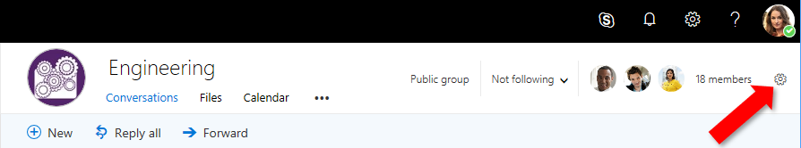
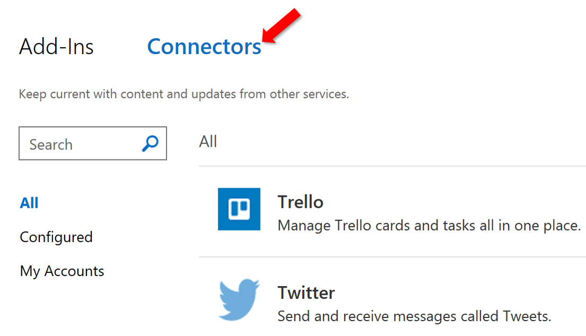

# Actionable messages in Outlook and Office 365 Groups

Whether you are filling out a survey, approving an expense report, or updating a CRM sales opportunity, Actionable Messages enable you to take quick actions right from within Outlook. Developers can now embed actions in their emails or notifications, elevating user engagement with their services and increasing organizational productivity.

Office 365 provides two solutions to enhance productivity with Outlook Actionable Messages: actionable messages via email, and actionable messages via Office 365 Connectors.

> [!NOTE]
> Actionable messages are also available in Microsoft Teams. See [Office 365 Connectors for Teams](https://docs.microsoft.com/microsoftteams/platform/concepts/connectors/connectors) for more information.

## User experience

Let's take a look at the end-to-end user experience for both an email-based and a connectors-based actionable message scenario.

### Actionable messages via email: group membership request approval scenario

A Contoso employee submits a request to join a private Office 365 group. Office 365 sends an Actionable Message to the person who owns the group to approve or decline the request. The card included in the message contains all the information the approver might need to quickly understand who submitted the request and any message they included to explain their request. It also includes **Approve** and **Decline** actions that can be taken right from Outlook. The owner approves the request, and the card updates to indicate the outcome.

The new member of the group submits a second request to add her team members to the group. Office 365 send an Actionable Message to the owner with clear information about who submitted the request and the new members to add. The recipient can approve all, some, or none of the proposed new members. The owner approves one new member, and the card updates to indicate the outcome.

The owner declines the other requested new member, and the card updates to indicate the outcome.

### Actionable messages via Office 365 Connectors: task management scenario

Adele Vance and her team use Trello as their task management system. Adele has configured the Trello connector in her account, and will receive granular notifications as activity occurs in the Trello boards she is interested in.

Shiva, in Adele's team, creates a new Trello card in the "Hiring" board. He needs the latest job postings to be published. Adele receives an actionable message that tells her all about the new card and the task it represents: who created it, in which list, what the due date is, and more.

Adele has a few notes she recently took on a piece of paper with important things that should be mentioned in the job postings. She decides to add these as a comment to the Trello card. She clicks the **Add a comment** action, and is presented with a text input field in which she can type her notes:

Adele then clicks the **Save** button, and the notes are immediately saved to the Trello card. A confirmation appears at the bottom of the message:

## Office 365 Connectors

Office 365 Connectors are a great way to get useful information and content into your Office 365 Groups in Outlook or Microsoft Teams. Any user can connect their group or team to services like Trello, Bing News, Twitter, etc., and get notified of activity from that service. From tracking a team's progress in Trello, to following important hashtags in Twitter, Office 365 Connectors make it easier for an Office 365 group in Outlook, Microsoft Teams, or Yammer to stay in sync and get more done.

## Accessing Office 365 Connectors from Outlook

Office 365 Connectors are available for both the inbox and Groups for any Office 365 Mail user. Connectors can be managed in either Outlook on the web, or Outlook 2016 or later for Windows.

### Accessing connectors in Outlook on the web

#### Inbox connectors

Users access inbox connectors from the **Settings** menu, accessed from the gear icon in the top-right corner.

#### Groups connectors

Users access group connectors from the **Group settings** menu, accessed from the gear icon in the group title bar.

#### Accessing connectors in Outlook 2016 on Windows

Users access both inbox and group connectors from the **Store** button. The Store button loads connectors for the inbox if Outlook is currently displaying a mail folder in the user's mailbox, and loads connectors for the currently selected group if displaying a group.

In the inbox case, the Store dialog displays the **Add-ins** tab by default. Connectors are available in the **Connectors** tab.

## Release Notes

Currently, you can only configure connectors from Outlook on the web, or Outlook 2016 or later on Windows, but you can view information posted by Connectors to your Group or inbox in multiple clients such as Outlook on the web, Outlook 2016 or later, and the Office365 Groups Mobile app.

For information on admin controls, look at the FAQ section of this <a target="_blank" href="https://support.office.com/en-us/article/Connect-apps-to-your-groups-ed0ce547-038f-4902-b9b3-9e518ae6fbab?ui=en-US&rs=en-US&ad=US">support article</a>.

### Outlook version requirements for actionable messages

Actionable messages are available to all customer mailboxes on Exchange Online in Office 365 with a supported client. The following table lists the availability of actionable messages for current Outlook clients. For information on the Office 365 release channels, see [Overview of update channels for Office 365 ProPlus](https://support.office.com/en-us/article/Overview-of-update-channels-for-Office-365-ProPlus-9ccf0f13-28ff-4975-9bd2-7e4ea2fefef4).

| Client                                            | Actionable messages supported?                        | Adaptive card supported? |
|---------------------------------------------------|-------------------------------------------------------|---|
| Outlook on the web for Office 365                 | Yes                                                   | Yes |
| Office 365 ProPlus Monthly Channel                | Yes, in version 1705, Build 8201                      | Yes, in version 1805, Build 9330 |
| Office 365 ProPlus Semi-Annual Channel (Targeted) | Yes, in version 1708, Build 8431                      | Yes, in version 1808, Build 10730.20262 |
| Office 365 ProPlus Semi-Annual Channel            | Yes, in version 1708, Build 8431.2153                 | Yes, in version 1808, Build 10730.20264 |
| Outlook 2016 for Mac                              | Coming Soon                                           | Coming Soon |
| Outlook for iOS                                   | Adaptive Card Only                                    | Yes - Support is rolling out in waves to users |
| Outlook for Android                               | Adaptive Card Only                                    | Q2 CY2019 |
| Office Professional Plus 2016                     | Actionable Messages are available for Office 365 only | No |
| Exchange 2016 On-Premises Outlook on the web      | Actionable Messages are available for Office 365 only | No |

## Submit feedback

There are multiple ways you can send us feedback.

- The in-product **Send Feedback** link (preferred)
- Post questions to [Stack Overflow](https://stackoverflow.com/questions/tagged/Office365Connectors?sort=newest) - Tag your questions with `Office365Connectors`.
- Post feedback and suggestions to <a target="_blank" href="https://officespdev.uservoice.com/forums/224641-general/category/146379-connectors">UserVoice</a>.
