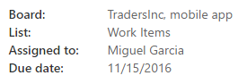
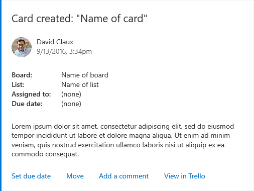
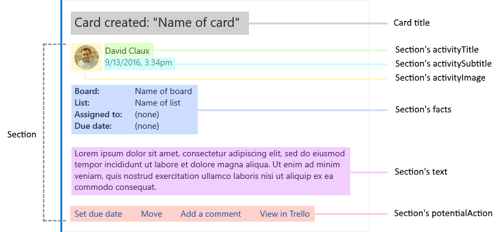
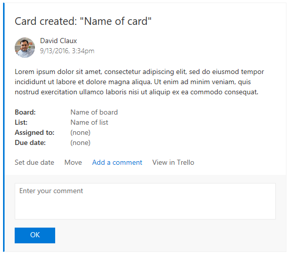
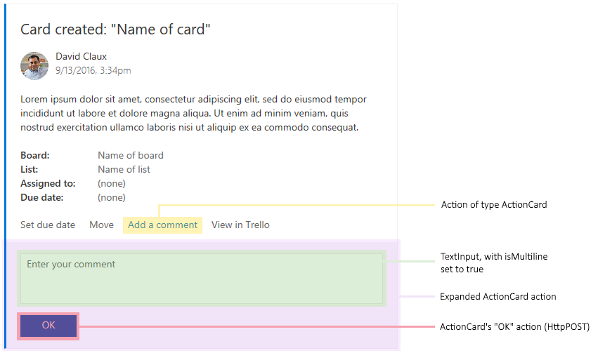
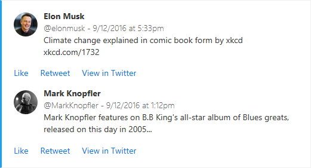

# Legacy actionable message card reference

> [!NOTE]
> This document describes the original JSON format for the actionable message card format. For actionable messages sent via email, this has been replaced with the [Adaptive Card format](adaptive-card.md). Microsoft recommends that new actionable message integrations use the Adaptive Card format, and existing integrations consider updating to Adaptive Card format. However, if you are sending actionable messages via an Office 365 connector, or to a Microsoft Teams connector, you must continue to use the message card format.

Cards are meant to provide easy to read, at-a-glance information that users can very quickly decipher and act upon when appropriate. As such, the guiding principle for designing great card is "content over chrome," which means cards are straight to the point and minimize the use of anything that would be distracting such as icons or custom colors.

## Card playground

Ready to experiment with your card design? Head to the [Card Playground](https://messagecardplayground.azurewebsites.net/) which allows you to see what your card will look like as you edit the associated JSON payload.

> [!NOTE]
> The Card Playground loads Adaptive Card examples by default. You can find message card format examples by selecting the **Select a sample** dropdown in the playground.

## Design guidelines

### Text formatting

All text fields in a card and its section can be formatted using Markdown. We support basic Markdown.

> [!IMPORTANT]
> Since all fields are processed as Markdown, be sure to escape Markdown special characters (such as `*` or `#`) if needed.

| Effect | Markdown |
|----------|--------|
| Italics | `*Italic*` |
| Bold | `**Bold**` |
| Bold italics | `***Bold Italic***` |
| Strike-through | `~~Strike-through~~` |
| Links | `[Microsoft](https://www.microsoft.com)` |
| Headings (`<h1>` through `<h6>`| `# Heading` through `###### Heading` |
| Bulleted lists | `* List item` or `- List item` |

> [!TIP]
> Follow these guidelines when formatting text fields.
>
> - **Do** use Markdown to format text.
> - **Don't** use HTML markup in your cards. HTML is ignored and treated as plain text.

### Using sections

If your card represents a single "entity", you may be able to get away with not using any section. That said, sections support the concept of an "activity" which is often a good way to represent data in a card.

If your card represents multiple "entities" or is, for instance, a digest for a particular news source, you will definitely want to use multiple sections, one per "entity."

> [!TIP]
> Follow these guidelines when planning the layout of your card.
>
> - **Do** use sections to logically group data together.
> - Sometimes, multiple sections MAY be used to represent a single logical group of data; this allows for more flexibility on ordering the information presented in the card. For example, it makes it possible to display a list of facts before an activity.
> - **Don't** include more than 10 sections. Cards are meant to be easy to read; if there is too much information in a card, it will be lost on the user.
> - For digest-like cards, consider adding a "View full digest" action at the end of the card.

## Card fields

| Field | Type | Description |
|-------|------|-------------|
| `@type` | String | Required. Must be set to `MessageCard`. |
| `@context` | String | Required. Must be set to `https://schema.org/extensions`. |
| `correlationId` | UUID | The `correlationId` property simplifies the process of locating logs for troubleshooting issues. We recommend that when sending an actionable card, your service should set and log a unique UUID in this property.<br><br>When the user invokes an action on the card, Office 365 sends the `Card-Correlation-Id` and `Action-Request-Id` headers in the POST request to your service. `Card-Correlation-Id` contains the same value as the `correlationId` property in the card. `Action-Request-Id` is a unique UUID generated by Office 365 to help locate specific action performed by a user. Your service should log both of these values when receiving action POST requests. |
| `expectedActors` | Array of String | Optional. This contains a list of expected email addresses of the recipient for the action endpoint.<br><br>A user can have multiple email addresses and the action endpoint might not be expecting the particular email address presented in the `sub` claim of the bearer token. For example, a user could have both the `john.doe@contoso.com` or `john@contoso.com` email address, but the action endpoint expects to receive `john@contoso.com` in the `sub` claim of the bearer token. By setting this field to `["john@contoso.com"]`, the `sub` claim will have the expected email address.|
| `originator` | String | Required when sent via email, not applicable when sent via connector. For actionable email, MUST be set to the provider ID generated by the [Actionable Email Developer Dashboard](email-dev-dashboard.md). |
| `summary` | String | The `summary` property is typically displayed in the list view in Outlook, as a way to quickly determine what the card is all about.<br><br>**Do** always include a summary.<br>**Don't** include details in the summary. For example, for a Twitter post, a summary might simply read "New tweet from @someuser" without mentioning the content of the tweet itself. |
| `themeColor` | String | Specifies a custom brand color for the card. The color will be displayed in a non-obtrusive manner.<br><br>**Do** use `themeColor` to brand cards to your color.<br>**Don't** use `themeColor` to indicate status. |
| `hideOriginalBody` | Boolean | *Only applies to cards in email messages*<br><br>When set to true, causes the HTML body of the message to be hidden. This is very useful in scenarios where the card is a better or more useful representation of the content than the HTML body itself, which is especially true when the card contains actions (see below.)<br><br>Consider hiding the original HTML body:<ul><li>If the card itself contains all the information a user would need</li><li>If the content of the card is redundant with the content of the body</li></ul>**Do** always include a nice HTML body, even if it is going to be hidden. The HTML body is the only thing an email client that doesn't support cards will be able to display. Furthermore, cards are not included when replying to or forwarding emails, only the HTML body.<br>**Don't** hide the body when it is complementary to the information presented in the card. For example, the body of an expense report approval might describe the report in great details while the card just presents a quick summary along with approve/decline actions. |
| `title` | String | The `title` property is meant to be rendered in a prominent way, at the very top of the card. Use it to introduce the content of the card in such a way users will immediately know what to expect.<br><br>Examples:<ul><li>Daily news</li><li>New bug opened</li><li>Task `<name of task>` assigned</li></ul>**Do** keep title short, don't make it a long sentence.<br>**Do** mention the name of the entity being referenced in the title.<br>**Don't** use hyperlinks (via Markdown) in the title. |
| `text` | String | The `text` property is meant to be displayed in a normal font below the card's title. Use it to display content, such as the description of the entity being referenced, or an abstract of a news article.<br><br>**Do** use simple Markdown, such as bold or italics to emphasize words, and links to external resources.<br>**Don't** include any call to action in the text property. Users should be able to not read it and still understand what the card is all about. |
| `sections` | Array of `Section` | A collection of sections to include in the card. See [Section fields](#section-fields). |
| `potentialAction` | Array of `Actions` | A collection of actions that can be invoked on this card. See [Actions](#actions). |

## Section fields

| Field | Type | Description |
|-------|------|-------------|
| `title` | String | The `title` property of a section is displayed in a font that stands out while not as prominent as the card's title. It is meant to introduce the section and summarize its content, similarly to how the card's title property is meant to summarize the whole card.<br><br>**Do** keep title short, don't make it a long sentence.<br>**Do** mention the name of the entity being referenced in the title.<br>**Don't** use hyperlinks (via Markdown) in the title. |
| `startGroup` | Boolean | When set to `true`, the `startGroup` property marks the start of a logical group of information. Typically, sections with `startGroup` set to `true` will be visually separated from previous card elements. For example, Outlook uses a subtle horizontal separation line.<br><br><br><br>**Do** use `startGroup` to separate sections that represent different objects; for example, multiple tweets in a digest. |
| `activityImage`<br>`activityTitle`<br>`activitySubtitle`<br>`activityText` | String | These four properties form a logical group. `activityTitle`, `activitySubtitle` and `activityText` will be displayed alongside `activityImage`, using a layout appropriate for the form factor of the device the card is being viewed on. For instance, in Outlook on the Web, `activityTitle`, `activitySubtitle` and `activityText` are displayed on the right of `activityImage`, using a two-column layout:<br><br><br><br>Use the activity fields for scenarios such as:<ul><li>Someone did something<ul><li>Use `activityImage` to display the picture of that person.</li><li>Use `activityTitle` to summarize what they did. Make it short and to the point.</li><li>Use `activitySubtitle` to show, for instance, the date and time the action was taken, or the person's handle.<ul><li>`activitySubtitle` will be rendered in a more subdued font</li><li>**Don't** include essential information</li><li>**Don't** include calls to action</li><li>**Avoid** Markdown formatting</li></ul></li><li>Use `activityText` to provide details about the activity.<ul><li>**Do** use simple Markdown to emphasize words or link to external sources</li><li>**Don't** include calls to action</ul></li></ul></li><li>A news article abstract<ul><li>Use `activityImage` to display the picture associated with the article</li><li>Use `activitySubtitle` to display the date and time the article was originally posted</li><li>Use `activityText` to display the actual abstract</li></ul></li></ul> |
| `heroImage` | Image | Use `heroImage` to make an image the centerpiece of your card. For example, a tweet that contains an image will want to put that image front and center:<br><br><br><br>`heroImage` can also be used to add a banner to your card, like the "TINYPulse – Engage" banner below:<br><br> |
| `text` | String | The section's `text` property is very similar to the `text` property of the card. It can be used for the same purpose. |
| `facts` | Array of name/value pairs | Facts are a very important component of a section. They often contain the information that really matters to the user.<br><br>Facts are displayed in such a way that they can be read quickly and efficiently. For example, in Outlook on the Web, facts are presented in a two-column layout, with fact names rendered in a slightly more prominent font:<br><br><br><br>There are many uses for facts. Some scenarios:<ul><li>A bug was created<ul><li>Bug ID: 1234</li><li>Opened by: Adele Vance</li><li>Assigned to: Alex Darrow</li></ul></li><li>Application usage report<ul><li>Application name: Contoso CRM App</li><li>Period: August 1, 2016 - September 30, 2016</li><li>Number of users: 542</li><li>Number of sessions: 2056</li><li>Average time spend in the application: 76 seconds</li></ul></li><li>Expense approval<ul><li>Submitted by: Pradeep Gupta</li><li>Date submitted: October 21, 2016</li><li>Total amount: $1,426.95</li></ul></li></ul>**Do** use facts instead of embedding important information inside the text property of either the card or the section.<br>**Do** keep fact names short.<br>**Avoid** making fact values too long.<br>**Avoid** using Markdown formatting for both fact names and values. Let facts be rendered as intended as that is how they will have the most impact.<br>**Do** however use Markdown for links in fact values only. For instance, if a fact references an external document, make the value of that fact a link to the document.<br>**Don't** add a fact without a real purpose. For instance, a fact that would always have the same value across all cards is not interesting and a waste of space. |
| `images` | Array of Image objects | The `images` property allows for the inclusion of a photo gallery inside a section. That photo gallery will always be displayed in a way that is easy to consume regardless of the form factor of the device it is being viewed on. For instance, in Outlook on the Web, images might be displayed as a horizontal strip of thumbnails with controls allowing to scroll through the collection if it doesn't all fit on the screen. On mobile, images might be displayed as a single thumbnail, with the user able to swipe through the collection with their finger. |
| `potentialAction` | Array of `Actions` | A collection of actions that can be invoked on this section. See [Actions](#actions).

## Image object

Defines an image as used by the `heroImage` and `images` property of a section.

| Field | Type | Description |
|-------|------|-------------|
| `image` | String | The URL to the image. |
| `title` | String | A short description of the image. Typically, `title` is displayed in a tooltip as the user hovers their mouse over the image. |

## Actions

Cards are very powerful in the sense that they allow users to take quick actions without leaving their email client. When designing cards, consider making them actionable, as that will increase user engagement and productivity.

Actions are specified using the `potentialAction` property which is available both on the card itself and on each section. There are four types of actions:

- [OpenUri](#openuri-action)
- [HttpPost](#httppost-action)
- [ActionCard](#actioncard-action)
- [InvokeAddInCommand](#invokeaddincommand-action)
- [Transaction](#transaction-action)

There can be a maximum of 4 actions (whatever their type) in a `potentialAction` collection.

- **Do** include actions that will make the biggest impact for the end user, like the most repetitive ones.
- **Don't** add 4 actions just because you can. In many cases, fewer actions will lead to a better experience.
- **Don't** craft your cards in an effort to replace an external application. Cards are meant to complement such applications, not to replace them.

### OpenUri action

Opens a URI in a separate browser or app.

Although links can be achieved through Markdown, an `OpenUri` action has the advantage of allowing you to specify different URIs for different operating systems, which makes it possible to open the link in an app on mobile devices.

- **Consider** using an `OpenUri` action rather than a link in Markdown if there is a clear advantage for your users in their ability to open the link in an app on their mobile device.
- **Do** include at least an `OpenUri` action to view the entity in the external app it comes from.
- **Do** make the `OpenUri` action the last one in the `potentialAction` collection.

| Field | Type | Description |
|-------|------|-------------|
| `name` | String | The `name` property defines the text that will be displayed on screen for the action.<br><br>**Do** use verbs. For instance, use "Set due date" instead of "Due date" or "Add note" instead of "Note." In some cases, the noun itself just works because it is also a verb: "Comment"<br>**Don't** name an `OpenUri` action in such a way that it suggests the action can be taken right from the client. Instead, name the action "View in &lt;name of site/app&gt;" or "Open in &lt;name of site/app&gt;" |
| `targets` | Array | The `targets` property is a collection of name/value pairs that defines one URI per target operating system.<br><br>Supported operating system values are `default`, `windows`, `iOS` and `android`. The `default` operating system will in most cases simply open the URI in a web browser, regardless of the actual operating system.<br><br>Example targets property:<pre><code class="lang-json">"targets": [<br>    { "os": "default", "uri": "https://yammer.com/.../123" },<br>    { "os": "iOS", "uri": "yammer://u/123" },<br>    { "os": "android", "uri": "yammer://u/123" },<br>    { "os": "windows", "uri": "yammer://u/123" }<br>]</code></pre> |

### HttpPOST action

Makes a call to an external Web service.

When an `HttpPOST` action is executed, a POST request is made to the URL in the `target` field, and the target service needs to authenticate the caller. This can be done in a variety of ways, including via a Limited Purpose Token embedded in the target URL. For more information and help on choosing the security mechanism that works best for your particular scenario, please see [Security requirements for actionable messages](security-requirements.md).

| Field | Type | Description |
|-------|------|-------------|
| `name` | String | The `name` property defines the text that will be displayed on screen for the action.<br><br>**Do** use verbs. For instance, use "Set due date" instead of "Due date" or "Add note" instead of "Note." In some cases, the noun itself just works because it is also a verb: "Comment" |
| `target` | String | Defines the URL endpoint of the service that implements the action. **Note:** this URL must be accessible from the internet, you cannot use `localhost`. |
| `headers` | Array of `Header` | A collection of `Header` objects representing a set of HTTP headers that will be emitted when sending the POST request to the target URL. See [Header](#header). |
| `body` | String | The body of the POST request. |
| `bodyContentType` | String | The `bodyContentType` is optional and specifies the MIME type of the body in the POST request. Some services require that a content type be specified. Valid values are `application/json` and `application/x-www-form-urlencoded`. If not specified, `application/json` is assumed. |

#### Header

The `Header` object is a name/value pair that represents an HTTP header.

| Field | Type | Description |
|-------|------|-------------|
| `name` | String | The header name |
| `value` | String | The header value |

#### Reporting an action's execution success or failure

`HttpPOST` actions can include the `CARD-ACTION-STATUS` HTTP header in their response. This header is meant to contain text that indicates the outcome of the action's execution, whether it has succeeded or failed.

The value of the header will be displayed in a consistent way in a reserved area of the card. It is also saved with the card so it can be displayed later on, so users can be reminded of the actions that have already been executed on a given card.

> [!TIP]
> Follow these guidelines when returning a response to `HttpPOST` actions.
>
> - **Do** return the `CARD-ACTION-STATUS` header in your responses.
> - **Do** make the message in that header as informative and meaningful as possible. For instance, for an "approve" action on an expense report:
>   - In case of success, don't return "The action was successful", instead return "The expense was approved"
>   - In case of failure, don't return "The action failed", instead return "The expense couldn't be approved at this time. Please try again later"
> - **Don't** mention either the name of the person taking the action nor the time the action is being taken in your `CARD-ACTION-STATUS` header. Both these pieces of information will be automatically added for you and displayed in a consistent way.

#### Refresh cards

Refresh cards are a very powerful mechanism that allow `HttpPOST` actions to fully update the card on the fly as the action successfully completes. There are many scenarios that benefit from refresh cards:

- Approval scenario (e.g. expense report)
  - Once the request is approved or rejected, the card is refreshed to remove the approve/decline actions and update its content so it reflects the fact that it's been approved or declined
- Task status
  - When an action is taken on a task, such as setting its due date, the card refreshes to include the updated due date in its facts
- Survey
  - Once the question has been answered, the card is refreshed so:
    - It no longer allows the user to respond
    - It shows updated status, like "Thanks for responding to this survey" alongside the user's actual response
    - Potentially include a new `OpenUri` action that allows the user to consult the survey online

To refresh a card as a result of an `HttpPOST` action, a service needs to do the following:

- Include the JSON payload of the new card in the body of the response to the HTTP POST request it received.
- Add the `CARD-UPDATE-IN-BODY: true` HTTP header to the response, in order to let the receiving client know that it should parse the response body and extract a new card (this is to avoid unnecessary processing when no refresh card is included.)

> [!TIP]
> Follow these guidelines when returning refresh cards.
>
> - **Do** use refresh cards with actions that can only be taken a single time. In those cases, the refresh card would not include any action that cannot be taken anymore
> - **Do** use refresh cards with actions that change the state of the entity they are performed on. In those cases, the refresh card should include updated information about the entity, and MAY change the set of actions that can be performed
> - **Don't** use refresh cards to lead a conversation with the user. For instance, don't use refresh cards for a multi-step "wizard"
> - **Do** include at least an `OpenUri` action to view the entity in the external app it comes from.

### ActionCard action

Presents additional UI that contains one or more [Inputs](#inputs), along with associated actions that can be either `OpenUri` or `HttpPOST` types.

**Do** use an `ActionCard` action if an action requires additional input from the user. Some scenarios:

- Responding to a survey
- Adding a comment to a bug
- Providing justification for declining an expense report

By default, an `ActionCard` action will be represented as a button or link in the card's UI. When clicked, that button will display an additional piece of UI containing the inputs and actions defined in the action card.

If there is a single `ActionCard` action in a `potentialAction` collection, then Outlook will represent that action "pre-expanded," e.g. its inputs and actions will be immediately visible.

| Field | Type | Description |
|-------|------|-------------|
| `name` | String | The `name` property defines the text that will be displayed on screen for the action.<br><br>**Do** use verbs. For instance, use "Set due date" instead of "Due date" or "Add note" instead of "Note." In some cases, the noun itself just works because it is also a verb: "Comment" |
| `inputs` | Array of `Inputs` | The `inputs` property defines the various inputs that will be displayed in the action card's UI. See [Inputs](#inputs) |
| `actions` | Array of `Actions` | The `actions` property is an array of `Action` objects, that can be either of type `OpenUri` or `HttpPOST`. The `actions` property of an `ActionCard` action cannot contain another `ActionCard` action. |

#### Example ActionCard

```json
{
  "@type": "ActionCard",
  "name": "Comment",
  "inputs": [
    {
      "@type": "TextInput",
      "id": "comment",
      "isMultiline": true,
      "title": "Input's title property"
    }
  ],
  "actions": [
    {
      "@type": "HttpPOST",
      "name": "Action's name prop.",
      "target": "https://yammer.com/comment?postId=123",
      "body": "comment={{comment.value}}"
    }
  ]
}
```

#### Inputs

Three types of inputs are supported: [TextInput](#textinput), [DateInput](#dateinput), and [MultichoiceInput](#multichoiceinput).

##### Common fields

The following fields are common to all input types.

| Field | Type | Description |
|-------|------|-------------|
| `id` | String | Uniquely identifies the input so it is possible to reference it in the URL or body of an `HttpPOST` action. See [Input value substitution](#input-value-substitution). |
| `isRequired` | Boolean | Indicates whether users are required to type a value before they are able to take an action that would take the value of the input as a parameter.<br><br>**Do** make an input required if users MUST provide a value.<br>**Consider** making an input required if its value is complementary to that of another required input. For instance, you could define a survey question that asks "How satisfied are you with your car" with a multi choice input followed by "Please explain your answer" as a free text input. Keep in mind that some users might not like being forced into providing such explanations, and might as a result not respond to the survey at all.<br>**Do** make sure users know which inputs are required. Include a label in the input's title property. For example: `Comment (optional)` or `Please rate your experience (required)`. |
| `title` | String | Defines a title for the input. |
| `value` | String | Defines the initial value of the input. For multi-choice inputs, value must be equal to the value property of one of the input's choices. |

##### TextInput

Use this input type when you need users to provide free text, such as the response to a survey question.

| Field | Type | Description |
|-------|------|-------------|
| `isMultiline` | Boolean | Indicates whether the text input should accept multiple lines of text. |
| `maxLength` | Number | Indicates the maximum number of characters that can be entered. |

###### Example TextInput

```json
{
  "@type": "TextInput",
  "id": "comment",
  "isMultiline": true,
  "title": "Input's title property"
}
```

##### DateInput

Use this input type when you need users to provide a date and or a time, such as for a task's due date.

| Field | Type | Description |
|-------|------|-------------|
| `includeTime` | Boolean | Indicates whether the date input should allow for the selection of a time in addition to the date. |

###### Example DateInput

```json
{
  "@type": "DateInput",
  "id": "dueDate",
  "title": "Input's title property"
}
```

##### MultichoiceInput

Use this input type when you need users to select from a list of pre-defined choices, such as a bug status, yes/no/maybe, etc.

| Field | Type | Description |
|-------|------|-------------|
| `choices` | Array of name/value pairs | Defines the values that can be selected for the multichoice input. |
| `isMultiSelect` | Boolean | If set to `true`, indicates that the user can select more than one choice. The specified choices will be displayed as a list of checkboxes. Default value is `false`.<br><br> |
| `style` | String (`normal`(default or `expanded`)) | When `isMultiSelect` is `false`, setting the `style` property to `expanded` will instruct the host application to try and display all choices on the screen, typically using a set of radio buttons.<br><br> |

###### Example compact MultichoiceInput

```json
{
  "@type": "MultichoiceInput",
  "id": "list",
  "title": "Pick an option",
  "choices": [
    { "display": "Choice 1", "value": "1" },
    { "display": "Choice 2", "value": "2" },
    { "display": "Choice 3", "value": "3" }
  ]
}
```

###### Example multi-select MultichoiceInput

```json
{
  "@type": "MultichoiceInput",
  "id": "list",
  "title": "Pick an option",
  "isMultiSelect": true,
  "choices": [
    { "display": "Choice 1", "value": "1" },
    { "display": "Choice 2", "value": "2" },
    { "display": "Choice 3", "value": "3" }
  ]
}
```

###### Example expanded MultichoiceInput

```json
{
  "@type": "MultichoiceInput",
  "id": "list",
  "title": "Pick an option",
  "style": "expanded",
  "choices": [
    { "display": "Choice 1", "value": "1" },
    { "display": "Choice 2", "value": "2" },
    { "display": "Choice 3", "value": "3" }
  ]
}
```

#### Input value substitution

The value of an input can be referenced in any URL of a `ViewAction` or `HttpPOST` action. It can also be referenced in an `HttpPOST` action's body. When an input value is referenced, it is substituted with the actual value of the input right before the action is executed.

To reference an input's value, use the following format:

`{{<id of input>.value}}`

##### Input value substitution example

```json
{
  "@type": "ActionCard",
  "name": "Comment",
  "inputs": [
    {
      "@type": "TextInput",
      "id": "comment",
      "isMultiline": true,
      "title": "Input's title property"
    }
  ],
  "actions": [
    {
      "@type": "HttpPOST",
      "name": "Action's name prop.",
      "target": "https://yammer.com/comment?postId=123",
      "body": "comment={{comment.value}}"
    }
  ]
}
```

### InvokeAddInCommand action

Opens an Outlook add-in task pane. If the add-in is not installed, the user is prompted to install the add-in with a single click.

When an `InvokeAddInCommand` action is executed, Outlook first checks if the requested add-in is installed and turned on for the user. If it is not, the user is notified that the action requires the add-in, and is able to install and enable the add-in with a single click. Outlook opens the requested  , making any initialization context specified by the action available to the add-in.

For more information, see [Invoke an Outlook add-in from an actionable message](invoke-add-in.md).

| Field | Type | Description |
|-------|------|-------------|
| `name` | String | The `name` property defines the text that will be displayed on screen for the action.<br><br>**Do** use verbs. For instance, use "Set due date" instead of "Due date" or "Add note" instead of "Note." In some cases, the noun itself just works because it is also a verb: "Comment" |
| `addInId` | UUID | Specifies the add-in ID of the required add-in. The add-in ID is found in the [Id element](https://docs.microsoft.com/office/dev/add-ins/reference/manifest/id) in the add-in's manifest. |
| `desktopCommandId` | String | Specifies the ID of the add-in command button that opens the required task pane. The command button ID is found in the `id` attribute of the [Control element](https://docs.microsoft.com/office/dev/add-ins/reference/manifest/control) that defines the button in the add-in's manifest. The specified `Control` element MUST be defined inside a [MessageReadCommandSurface extension point](https://docs.microsoft.com/office/dev/add-ins/reference/manifest/extensionpoint#messagereadcommandsurface), be of type `Button`, and the control's `Action` must be of type `ShowTaskPane`. |
| `initializationContext` | Object | Optional. Developers may specify any valid JSON object in this field. The value is serialized into a string and made available to the add-in when the action is executed. This allows the action to pass initialization data to the add-in. |

#### Example InvokeAddInCommand

```json
{
  "@type": "InvokeAddInCommand",
  "name": "Invoke My Add-in",
  "addInId": "527104a1-f1a5-475a-9199-7a968161c870",
  "desktopCommandId": "show ",
  "initializationContext": {
    "property1": "Hello world",
    "property2": 5,
    "property3": true
  }
}
```

### Transaction action

> [!IMPORTANT]
> The `Transaction` action has been deprecated. Payment request messages should be sent using the [ActionRequest format](../payments/action-request.md) instead.

Initiates an payments in Outlook scenario. For more information see [Payments in Outlook](../payments/index.md).

| Field | Type | Description |
|-------|------|-------------|
| `name` | String | The `name` property defines the text that will be displayed on screen for the action.<br><br>**Do** use verbs. For instance, use "Pay invoice" instead of "Invoice". |
| `isPrimaryAction` | Boolean | Indicates that the action should be highlighted as the primary action if multiple actions are present. It is recommended to set this to `true` for when including multiple actions. |
| `merchantId` | UUID | Your merchant ID provided by registering with the [partner dashboard for payments in Outlook](../payments/partner-dashboard.md). |
| `displayId` | UUID | Your display ID provided by registering with the [partner dashboard for payments in Outlook](../payments/partner-dashboard.md). |
| `productContext` | Object | Required. Developers may specify any valid JSON object in this field. The value is included in the payloads sent to your payment request and payment complete webhooks. |

#### Example Transaction

```json
{
  "@type" : "Transaction",
  "name" : "Pay invoice",
  "isPrimaryAction" : true,
  "merchantId": "SAMPLE_ID",
  "displayId": "SAMPLE_ID",
  "productContext": {
    "invoiceId": "103032",
    "createdDate" :"12/8/2017",
    "dueDate":"01/31/2019"
  },
  "environment": "ppe"
}
```

## Card Examples

### Trello

Card is created in a list:



Here is how that card is built:



Here's the same card with the **Add a comment** action expanded:



Here's how the **Add a comment** action is built:



#### Trello JSON

```json
{
  "summary": "Card \"Test card\"",
  "themeColor": "0078D7",
  "title": "Card created: \"Name of card\"",
  "sections": [
    {
      "activityTitle": "David Claux",
      "activitySubtitle": "9/13/2016, 3:34pm",
      "activityImage": "https://connectorsdemo.azurewebsites.net/images/MSC12_Oscar_002.jpg",
      "facts": [
        {
          "name": "Board:",
          "value": "Name of board"
        },
        {
          "name": "List:",
          "value": "Name of list"
        },
        {
          "name": "Assigned to:",
          "value": "(none)"
        },
        {
          "name": "Due date:",
          "value": "(none)"
        }
      ],
      "text": "Lorem ipsum dolor sit amet, consectetur adipiscing elit, sed do eiusmod tempor incididunt ut labore et dolore magna aliqua. Ut enim ad minim veniam, quis nostrud exercitation ullamco laboris nisi ut aliquip ex ea commodo consequat."
    }
  ],
  "potentialAction": [
    {
      "@type": "ActionCard",
      "name": "Set due date",
      "inputs": [
        {
          "@type": "DateInput",
          "id": "dueDate",
          "title": "Select a date"
        }
      ],
      "actions": [
        {
          "@type": "HttpPOST",
          "name": "OK",
          "target": "https://..."
        }
      ]
    },
    {
      "@type": "ActionCard",
      "name": "Move",
      "inputs": [
        {
          "@type": "MultichoiceInput",
          "id": "move",
          "title": "Pick a list",
          "choices": [
            { "display": "List 1", "value": "l1" },
            { "display": "List 2", "value": "l2" }
          ]
        }
      ],
      "actions": [
        {
          "@type": "HttpPOST",
          "name": "OK",
          "target": "https://..."
        }
      ]
    },
    {
      "@type": "ActionCard",
      "name": "Add a comment",
      "inputs": [
        {
          "@type": "TextInput",
          "id": "comment",
          "isMultiline": true,
          "title": "Enter your comment"
        }
      ],
      "actions": [
        {
          "@type": "HttpPOST",
          "name": "OK",
          "target": "https://..."
        }
      ]
    },
    {
      "@type": "OpenUri",
      "name": "View in Trello",
      "targets": [
        { "os": "default", "uri": "https://..." }
      ]
    }
  ]
}
```

### Twitter

Here's an example of a Twitter digest card:



Here's how that card is built:


#### Twitter JSON

```json
{
  "themeColor": "0078D7",
  "sections": [
    {
      "activityTitle": "**Elon Musk**",
      "activitySubtitle": "@elonmusk - 9/12/2016 at 5:33pm",
      "activityImage": "https://pbs.twimg.com/profile_images/782474226020200448/zDo-gAo0.jpg",
      "activityText": "Climate change explained in comic book form by xkcd xkcd.com/1732"
    },
    {
      "activityTitle": "**Mark Knopfler**",
      "activitySubtitle": "@MarkKnopfler - 9/12/2016 at 1:12pm",
      "activityImage": "https://pbs.twimg.com/profile_images/378800000221985528/b2ebfafca6fd7b565fdf3bf4ccdb4dc9.jpeg",
      "activityText": "Mark Knopfler features on B.B King's all-star album of Blues greats, released on this day in 2005..."
    }
  ]
}
```

### Actionable email

Here's an example of an HTML email body with an embedded message card.

```html
<html>
<head>
  <meta http-equiv="Content-Type" content="text/html; charset=utf-8">
  <script type="application/ld+json">{
    "@context": "https://schema.org/extensions",
    "@type": "MessageCard",
    "originator": "",
    "hideOriginalBody": "true",
    "themeColor": "0072C6",
    "title": "Visit the Outlook Dev Portal",
    "text": "Click **Learn More** to learn more about Actionable Messages!",
    "potentialAction": [
      {
        "@type": "ActionCard",
        "name": "Send Feedback",
        "inputs": [
          {
            "@type": "TextInput",
            "id": "feedback",
            "isMultiline": true,
            "title": "Let us know what you think about Actionable Messages"
          }
        ],
        "actions": [
          {
            "@type": "HttpPOST",
            "name": "Send Feedback",
            "isPrimary": true,
            "target": "http://..."
          }
        ]
      },
      {
        "@type": "OpenUri",
        "name": "Learn More",
        "targets": [
          { "os": "default", "uri": "https://docs.microsoft.com/outlook/actionable-messages" }
        ]
      }
    ]
  }
  </script>
</head>
<body>
Visit the <a href="https://docs.microsoft.com/outlook/actionable-messages">Outlook Dev Portal</a> to learn more about Actionable Messages.
</body>
</html>
```
