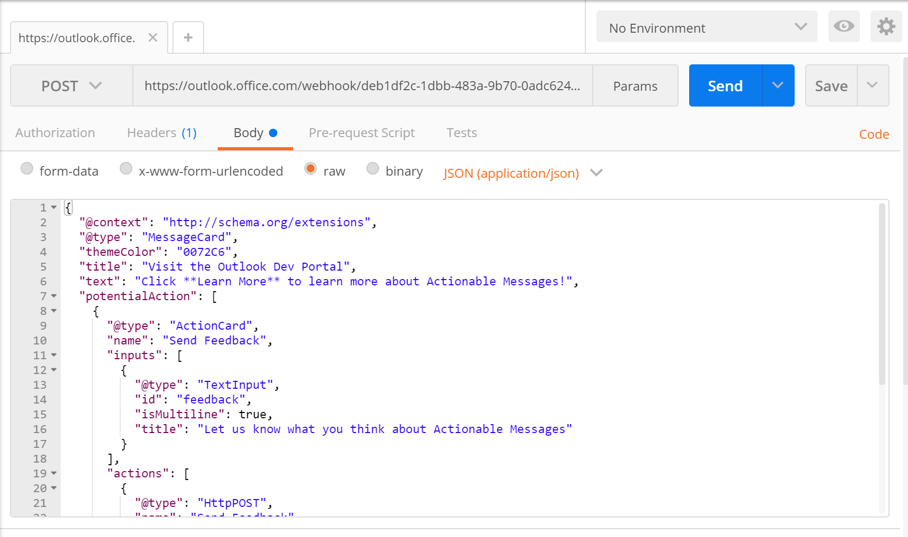

# Post an actionable message card to an Office 365 group

## Create an actionable message card

Let's start by creating an actionable message card. We'll start with something simple, just a basic card with an `HttpPOST` action and an `OpenUri` action. We'll use the [Card Playground](https://messagecardplayground.azurewebsites.net/) to design the card.

> [!IMPORTANT]
> Office connectors only support the [legacy MessageCard format](message-card-reference.md) for cards. They do not support the Adaptive Card format.

Go to [Card Playground](https://messagecardplayground.azurewebsites.net/) and paste in the following JSON:

```json
{
  "@context": "https://schema.org/extensions",
  "@type": "MessageCard",
  "themeColor": "0072C6",
  "title": "Visit the Outlook Dev Portal",
  "text": "Click **Learn More** to learn more about Actionable Messages!",
  "potentialAction": [
    {
      "@type": "ActionCard",
      "name": "Send Feedback",
      "inputs": [
        {
          "@type": "TextInput",
          "id": "feedback",
          "isMultiline": true,
          "title": "Let us know what you think about Actionable Messages"
        }
      ],
      "actions": [
        {
          "@type": "HttpPOST",
          "name": "Send Feedback",
          "isPrimary": true,
          "target": "http://..."
        }
      ]
    },
    {
      "@type": "OpenUri",
      "name": "Learn More",
      "targets": [
        { "os": "default", "uri": "https://docs.microsoft.com/outlook/actionable-messages" }
      ]
    }
  ]
}
```

Feel free to experiment with this simple example in the playground. You can see the [message card reference](message-card-reference.md) for details on the available fields. Once you have a card you're happy with, you can move on to sending it.

## Sending actionable messages via Office connectors

Connectors use webhooks to create Connector Card messages within an Office 365 group. Developers can create these cards by sending an HTTP request with a simple JSON payload to an Office 365 group webhook address. Let's try posting some basic cards to a group.

You'll need an Microsoft 365 subscription to proceed. If you do not have an Microsoft 365 subscription you can get a one year [FREE Microsoft 365 subscription](https://developer.microsoft.com/office/dev-program) under the Microsoft 365 Developer Program.

### Get a connector webhook URL for a Microsoft 365 Group

1. Log on to Outlook on the web at [https://outlook.office.com](https://outlook.office.com).

1. In the folder list, select a group under the **Groups** section. In the group's menu, select the ellipses (**...**), then select **Settings**.

    

1. In the **Group Settings** pane, select **Connectors**.

1. Locate and select the **Incoming Webhook** connector in the list of available connectors.

    

1. Enter a name for this connector and choose **Create**.

1. Copy the webhook URL that is displayed and save it. Choose **Done**.

    

The webhook URL should look similar to the following:

```http
https://outlook.office365.com/webhook/a1269812-6d10-44b1-abc5-b84f93580ba0@9e7b80c7-d1eb-4b52-8582-76f921e416d9/IncomingWebhook/3fdd6767bae44ac58e5995547d66a4e4/f332c8d9-3397-4ac5-957b-b8e3fc465a8c
```

### Send the message

Use [Postman](https://www.getpostman.com/) to post an actionable message payload to the webhook URL. Open Postman. Create a new tab if needed and configure the tab as follows:

1. Click the **GET** and change to **POST**.

2. In the text box labeled `Enter request URL` paste the webhook URL.

3. Click **Body** underneath the URL, then select the **raw** option.

4. Click **Text** and change to **JSON (application/json)**.

5. Enter the message card JSON in the text area below.

   The Postman window should look like this when you are done:

   

6. Click **Send** to post the message.
