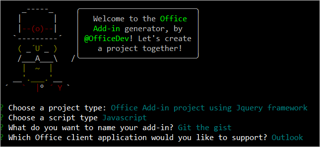
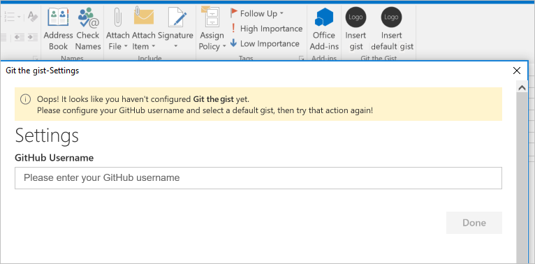
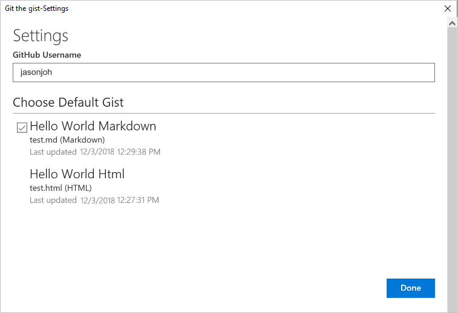

# Tutorial: Build a message compose Outlook add-in

This tutorial teaches you how to build an Outlook add-in that can be used in message compose mode to insert content into the body of a message.

In this tutorial, you will:

> [!div class="checklist"]
> * Create an Outlook add-in project
> * Define buttons that will render in the compose message window
> * Implement a first-run experience that collects information from the user and fetches data from an external service
> * Implement a UI-less button that invokes a function
> * Implement a task pane that inserts content into the body of a message

## Prerequisites

* [Node.js and npm](https://nodejs.org/en/)

* The latest version of [Yeoman](http://yeoman.io/) and the [Yeoman generator for Office Add-ins](https://www.npmjs.com/package/generator-office). To install these tools globally, run the following command via the command prompt:

    ```bash
    npm install -g yo generator-office
    ```

* The [Showdown](https://github.com/showdownjs/showdown) library (to convert Markdown to HTML) and the [URI.js](https://github.com/medialize/URI.js) library (to build relative URLs). To install these tools, run the following command via the command prompt:

    ```bash
    npm install showdown urijs --save
    ```

* Outlook 2016 or later for Windows (connected to an Office 365 account) or an Outlook.com account

* A [GitHub](https://www.github.com) account 

## Setup

The add-in that you'll create in this tutorial will read [gists](https://gist.github.com) from the user's GitHub account and add the selected gist(s) to the body of a message. Complete the following steps to create two new gists that you can use to test the add-in you're going to build.

1. [Login to GitHub](https://github.com/login).

1. [Create a new gist](https://gist.github.com). 

    - In the **Gist description...** field, enter **Hello World Markdown**.

    - In the **Filename including extension...** field, enter **test.md**.

    - Add the following markdown to the multiline textbox:
    
        ```markdown
        # Hello World

        This is content converted from Markdown!

        Here's a JSON sample:

          ```json
          {
            "foo": "bar"
          }
          ```
        ```

    - Choose the **Create public gist** button.

1. [Create another new gist](https://gist.github.com). 

    - In the **Gist description...** field, enter **Hello World Html**.

    - In the **Filename including extension...** field, enter **test.html**.

    - Add the following markdown to the multiline textbox:

        ```HTML
        <html>
          <head>
            <style>
            h1 {
              font-family: Calibri;
            }
            </style>      
          </head>
          <body>
            <h1>Hello World!</h1>
            <p>This is a test</p>
          </body>
        </html>
        ```

    - Choose the **Create public gist** button.

## Create an Outlook add-in project

Use the Yeoman generator to create an Outlook add-in project.

1. Run the following command and then answer the prompts as follows:

    ```bash
    yo office
    ```

    - **Choose a project type** - `Office Add-in project using Jquery framework`
    - **Choose a script type** - `Javascript`
    - **What do you want to name your add-in?** - `Git the gist`
    - **Which Office client application would you like to support?** - `Outlook`

    
    
    After you complete the wizard, the generator will create the project and install supporting Node components.
	
1. Navigate to the root directory of the project.

    ```bash
    cd "Git the gist"
    ```

### Update the manifest

The manifest for an add-in controls how it appears in Outlook. It defines the way the add-in appears in the add-in list, the buttons that appear on the ribbon, and it sets the URLs for the HTML and JavaScript files used by the add-in. 

#### Specify a support page

The manifest that the generator creates contains a placeholder value for the `SupportUrl` element that's not a valid URL. To prevent the file from failing validation, complete the following steps:

1. In the root directory of the project, add a new file named **support.html**.

1. Add the following markup to the **support.html** file and save the file.

    ```html
    <!DOCTYPE html>
    <html>
      <head>
        <meta charset="utf-8" />
        <meta name="viewport" content="width=device-width, inline-scale=1">
        <title>Support</title>
      </head>
      <body>
        <h1>Support</h1>
        <p>This is the support page for the <b>Git the gist</b> add-in.</p>
        <p>In a real-world scenario, this page should provide support information for the add-in.</p>
      </body>
    </html>
    ````

1. Open the **manifest.xml** file, update the `SupportUrl` element to point to the **support.html** file that you created, and save the file.

  ```xml
  <SupportUrl DefaultValue="https://localhost:3000/support.html" />
  ```

#### Specify basic information

Next, make the following updates in the **manifest.xml** file to specify some basic information about the add-in:

1. Locate the `ProviderName` element and replace the default value with your company name.

   ```xml
    <ProviderName>Contoso</ProviderName>
    ```
1. Locate the `Description` element, replace the default value with a description of the add-in, and save the file.

    ```xml
    <Description DefaultValue="Allows users to access their gists on GitHub"/>
   ```

#### Test the generated add-in

Before going any further, let's test the basic add-in that the generator created to confirm that the project is setup correctly. 

1. In your command prompt/shell, make sure you are in the root directory of your project, and enter `npm start`. This will start a web server at `https://localhost:3000`.

1. Open either Internet Explorer or Microsoft Edge and navigate to `https://localhost:3000`. If the page loads without any certificate errors, proceed to step 4. If your browser indicates that the site's certificate is not trusted, proceed to the following step.

1. Office Web Add-ins should use HTTPS, not HTTP, even when you are developing. If your browser indicates that the site's certificate is not trusted, you will need to add the certificate as a trusted certificate. See [Adding Self-Signed Certificates as Trusted Root Certificate](https://github.com/OfficeDev/generator-office/blob/master/src/docs/ssl.md) for details.

    > [!NOTE]
    > Chrome (web browser) may continue to indicate the the site's certificate is not trusted, even after you have completed the process described in [Adding Self-Signed Certificates as Trusted Root Certificate](https://github.com/OfficeDev/generator-office/blob/master/src/docs/ssl.md). Therefore, you should use either Internet Explorer or Microsoft Edge to verify that the certificate is trusted. 

1. After your browser loads the add-in page without any certificate errors, follow the instructions in [Sideload Outlook add-ins for testing](sideload-outlook-add-ins-for-testing.md) to sideload the **manifest.xml** file that's located in the root directory of the project.

1. In Outlook, open a message and choose the **Display all properties** button. If everything's been setup correctly, the task pane will open and render the add-in's welcome page.

    

## Define buttons

Now that you've verified the base add-in works, you can customize it to add additional functionality. By default, the manifest that the generator created only defines buttons for the read message window. Let's update the manifest to define two buttons for the compose message window:

- **Insert gist**: a button that opens a task pane

- **Insert default gist**: a button that invokes a function

### Add a new extension point to the manifest

Locate the line in the manifest that reads `</DesktopFormFactor>`. Above this line, insert the following XML markup. Note the following about this markup:

- The `ExtensionPoint` with `xsi:type="MessageComposeCommandSurface"` indicates that you're defining buttons to add to the message compose window.

- By using an `OfficeTab` element with `id="TabDefault"`, you're indicating you want to add the buttons to the default tab on the ribbon.

- The `Group` element defines the grouping for the new buttons, with a label set by the `groupLabel` resource.

- The first `Control` element contains an `Action` element with `xsi:type="ShowTaskPane"`, so this button will open a task pane.

- The second `Control` element contains an `Action` element with `xsi:type="ExecuteFunction"`, so this button will invoke a JavaScript function contained in the function file.

```xml
<ExtensionPoint xsi:type="MessageComposeCommandSurface">
  <OfficeTab id="TabDefault">
    <Group id="msgComposeCmdGroup">
      <Label resid="groupLabel"/>
      <Control xsi:type="Button" id="msgComposeInsertGist">
        <Label resid="insertGistLabel"/>
        <Supertip>
          <Title resid="insertGistTitle"/>
          <Description resid="insertGistDesc"/>
        </Supertip>
        <Icon>
          <bt:Image size="16" resid="icon16"/>
          <bt:Image size="32" resid="icon32"/>
          <bt:Image size="80" resid="icon80"/>
        </Icon>
        <Action xsi:type="ShowTaskpane">
          <SourceLocation resid="insertGistPaneUrl" />
        </Action>
      </Control>
      <Control xsi:type="Button" id="msgComposeInsertDefaultGist">
        <Label resid="insertDefaultGistLabel"/>
        <Supertip>
          <Title resid="insertDefaultGistTitle"/>
          <Description resid="insertDefaultGistDesc"/>
        </Supertip>
        <Icon>
          <bt:Image size="16" resid="icon16"/>
          <bt:Image size="32" resid="icon32"/>
          <bt:Image size="80" resid="icon80"/>
        </Icon>
        <Action xsi:type="ExecuteFunction">
          <FunctionName>insertDefaultGist</FunctionName>
        </Action>
      </Control>
    </Group>
  </OfficeTab>
</ExtensionPoint>
```

### Update resources in the manifest

The code above references labels, tooltips, and URLs that you need to define before the manifest will be valid. Specify this information by making the following changes in the `Resources` section of the manifest. 

1. Add the following element as a child of the `bt:Urls` element:

    ```xml
    <bt:Url id="insertGistPaneUrl" DefaultValue="https://localhost:3000/msg-compose/insert-gist.html"/>
    ```
1. Change the `DefaultValue` attribute of the `bt:String` element with `id="groupLabel"` to **Git the gist**.

    ```xml
    <bt:String id="groupLabel" DefaultValue="Git the gist"/>
    ```

1. Add the following elements as children of the `bt:ShortStrings` element.

    ```xml
    <bt:String id="insertGistLabel" DefaultValue="Insert gist"/>
    <bt:String id="insertGistTitle" DefaultValue="Insert gist"/>
    <bt:String id="insertDefaultGistLabel" DefaultValue="Insert default gist"/>
    <bt:String id="insertDefaultGistTitle" DefaultValue="Insert default gist"/>
    ```

1. Add the following elements as children of the `bt:LongStrings` element.

    ```xml
    <bt:String id="insertGistDesc" DefaultValue="Displays a list of your gists and allows you to insert their contents into the current message"/>
    <bt:String id="insertDefaultGistDesc" DefaultValue="Inserts the contents of the gist you mark as default into the current message"/>
    ```

1. Save your changes to the manifest. 


### Reinstall the add-in

Since you previously installed the add-in from a file, you must reinstall it in order for the manifest changes to take effect. 

1. Follow the instructions in [Sideload Outlook add-ins for testing](sideload-outlook-add-ins-for-testing.md) to locate the **Custom add-ins** section at the bottom of the **My add-ins** dialog box. 

1. Choose the **...** button next to the **Git the gist** entry and then choose **Remove**.

1. Close the **My add-ins** window.

1. The custom button should disappear from the ribbon momentarily.

1. Follow the instructions in [Sideload Outlook add-ins for testing](sideload-outlook-add-ins-for-testing.md) to reinstall the add-in using the updated **manifest.xml** file.

After you've completed these steps, you should the two new buttons when you compose a new message in Outlook: **Insert gist** and **Insert default gist**. 

## Implement a first-run experience

This add-in needs to be able to read gists from the user's GitHub account and identify which one the user has chosen as the default gist. In order to achieve these goals, the add-in must prompt the user to provide their GitHub URL and choose a default gist from their collection of existing gists. Complete the steps in this section to implement a first-run experience that will display a dialog to collect this information from the user.

### Collect data from the user

Let's start by creating the UI for the dialog itself. Create a new folder in the root folder of the project named **settings**. Then create a file in the **settings** folder named **dialog.html**, and add the following markup to define a very basic form with a text input for a GitHub username and an empty list for gists that'll be populated via JavaScript. Note that this dialog uses [Office Fabric](https://developer.microsoft.com/fabric#/get-started) for fonts and styles.

```html
<!DOCTYPE html>
<html>

<head>
  <meta charset="UTF-8" />
  <meta http-equiv="X-UA-Compatible" content="IE=Edge" />
  <title>Settings</title>

  <!-- Office JavaScript API -->
  <script type="text/javascript" src="https://appsforoffice.microsoft.com/lib/1.1/hosted/office.debug.js"></script>

  <!-- LOCAL -->
  <link rel="stylesheet" href="../node_modules/office-ui-fabric-js/dist/css/fabric.min.css" />
  <link rel="stylesheet" href="../node_modules/office-ui-fabric-js/dist/css/fabric.components.css" />

  <!-- Template styles -->
  <link href="../app.css" rel="stylesheet" type="text/css" />
  <link href="dialog.css" rel="stylesheet" type="text/css" />
</head>

<body class="ms-font-l">
  <main>
    <section class="ms-font-m ms-fontColor-neutralPrimary">
      <div class="not-configured-warning ms-MessageBar ms-MessageBar--warning">
        <div class="ms-MessageBar-content">
          <div class="ms-MessageBar-icon">
            <i class="ms-Icon ms-Icon--Info"></i>
          </div>
          <div class="ms-MessageBar-text">
            Oops! It looks like you haven't configured <strong>Git the gist</strong> yet.
            <br/>
            Please configure your GitHub user name and select a default gist, then try that action again!
          </div>
        </div>
      </div>
      <div class="ms-font-xxl">Settings</div>
      <div class="ms-Grid">
        <div class="ms-Grid-row">
          <div class="ms-TextField">
            <label class="ms-Label">GitHub Username</label>
            <input class="ms-TextField-field" id="github-user" type="text" value="" placeholder="Please enter your GitHub username">
          </div>
        </div>
        <div class="error-display ms-Grid-row">
          <div class="ms-font-l ms-fontWeight-semibold">An error occurred:</div>
          <pre><code id="error-text"></code></pre>
        </div>
        <div class="gist-list-container ms-Grid-row">
          <div class="list-title ms-font-xl ms-fontWeight-regular">Choose default gist</div>
          <ul id="gist-list" class="ms-List">
          </ul>
        </div>
      </div>
      <div class="ms-Dialog-actions">
        <div class="ms-Dialog-actionsRight">
          <button class="ms-Dialog-action ms-Button ms-Button--primary" id="settings-done" disabled>
            <span class="ms-Button-label">Done</span>
          </button>
        </div>
      </div>
    </section>
  </main>
  <script type="text/javascript" src="../node_modules/core-js/client/core.js"></script>
  <script type="text/javascript" src="../node_modules/jquery/dist/jquery.js"></script>
  <script type="text/javascript" src="../node_modules/office-ui-fabric-js/dist/js/fabric.js"></script>

  <script type="text/javascript" src="../helpers/gist-api.js"></script>
  <script type="text/javascript" src="dialog.js"></script>
</body>

</html>
```

Next, create a file in the **settings** folder named **dialog.css**, and add the following code to specify the styles that are used by **dialog.html**.

```CSS
section {
  margin: 10px 20px;
}

.not-configured-warning {
  display: none;
}

.error-display {
  display: none;
}

.gist-list-container {
  margin: 10px -8px;
  display: none;
}

.list-title {
  border-bottom: 1px solid #a6a6a6;
  padding-bottom: 5px;
}

ul {
  margin-top: 10px;
}
```

Now that the dialog UI has been defined, you can write the code that makes it actually do something. Create a file in the **settings** folder named **dialog.js** and add the following code. Note that this code uses jQuery to register events and uses the `messageParent` function to send the user's choices back to the caller.

```js
(function(){
  'use strict';

  // The Office initialize function must be run each time a new page is loaded
  Office.initialize = function(reason){
    jQuery(document).ready(function(){
      if (window.location.search) {
        // Check if warning should be displayed
        var warn = getParameterByName('warn');
        if (warn) {
          $('.not-configured-warning').show();
        } else {
          // See if the config values were passed
          // If so, pre-populate the values
          var user = getParameterByName('gitHubUserName');
          var gistId = getParameterByName('defaultGistId');

          $('#github-user').val(user);
          loadGists(user, function(success){
            if (success) {
              $('input:hidden').filter(function() {
                return this.value === gistId;
              }).parent().addClass('is-selected');
              $('#settings-done').removeAttr('disabled');
            }
          });
        }
      }

      // When the GitHub username changes,
      // try to load gists
      $('#github-user').on('change', function(){
        $('#gist-list').empty();
        var ghUser = $('#github-user').val();
        if (ghUser.length > 0) {
          loadGists(ghUser);
        }
      });

      // When the Done button is chosen, send the
      // values back to the caller as a serialized
      // object.
      $('#settings-done').on('click', function() {
        var settings = {};

        settings.gitHubUserName = $('#github-user').val();

        var selectedGist = $('li.is-selected');
        if (selectedGist) {
          settings.defaultGistId = selectedGist.children('.gist-id').val();

          sendMessage(JSON.stringify(settings));
        }
      });
    });
  };

  // Load gists for the user using the GitHub API
  // and build the list
  function loadGists(user, callback) {
    getUserGists(user, function(gists, error){
      if (error) {
        $('.gist-list-container').hide();
        $('#error-text').text(JSON.stringify(error, null, 2));
        $('.error-display').show();
        if (callback) callback(false);
      } else {
        $('.error-display').hide();
        buildGistList($('#gist-list'), gists, onGistSelected);
        $('.gist-list-container').show();
        if (callback) callback(true);
      }
    });
  }

  function onGistSelected() {
    $('.ms-ListItem').removeClass('is-selected');
    $(this).addClass('is-selected');
    $('.not-configured-warning').hide();
    $('#settings-done').removeAttr('disabled');
  }

  function sendMessage(message) {
    Office.context.ui.messageParent(message);
  }

  function getParameterByName(name, url) {
    if (!url) {
      url = window.location.href;
    }
    name = name.replace(/[\[\]]/g, "\\$&");
    var regex = new RegExp("[?&]" + name + "(=([^&#]*)|&|#|$)"),
      results = regex.exec(url);
    if (!results) return null;
    if (!results[2]) return '';
    return decodeURIComponent(results[2].replace(/\+/g, " "));
  }
})();
```

### Fetch data from GitHub

The **dialog.js** file you just created specifies that the add-in should load gists when the `change` event fires for the GitHub username field. To retrieve the user's gists from GitHub, you'll use the [GitHub Gists API](https://developer.github.com/v3/gists/).

Create a new folder in the root folder of the project named **helpers**. Then create a file in the **helpers** folder named **gist-api.js**, and add the following code to retrieve the user's gists from GitHub and build the list of gists.

```js
function getUserGists(user, callback) {
  var requestUrl = 'https://api.github.com/users/' + user + '/gists';

  $.ajax({
    url: requestUrl,
    dataType: 'json'
  }).done(function(gists){
    callback(gists);
  }).fail(function(error){
    callback(null, error);
  });
}

function buildGistList(parent, gists, clickFunc) {
  gists.forEach(function(gist, index) {

    var listItem = $('<li/>')
      .addClass('ms-ListItem')
      .addClass('is-selectable')
      .attr('tabindex', index)
      .appendTo(parent);

    var desc = $('<span/>')
      .addClass('ms-ListItem-primaryText')
      .text(gist.description)
      .appendTo(listItem);

    var desc = $('<span/>')
      .addClass('ms-ListItem-secondaryText')
      .text(buildFileList(gist.files))
      .appendTo(listItem);

    var updated = new Date(gist.updated_at);

    var desc = $('<span/>')
      .addClass('ms-ListItem-tertiaryText')
      .text('Last updated ' + updated.toLocaleString())
      .appendTo(listItem);

    var selTarget = $('<div/>')
      .addClass('ms-ListItem-selectionTarget')
      .appendTo(listItem);

    var id = $('<input/>')
      .addClass('gist-id')
      .attr('type', 'hidden')
      .val(gist.id)
      .appendTo(listItem);
  });

  $('.ms-ListItem').on('click', clickFunc);
}

function buildFileList(files) {

  var fileList = '';

  for (var file in files) {
    if (files.hasOwnProperty(file)) {
      if (fileList.length > 0) {
        fileList = fileList + ', ';
      }

      fileList = fileList + files[file].filename + ' (' + files[file].language + ')';
    }
  }

  return fileList;
}
```

> [!NOTE]
> You may have noticed that there's no button to invoke the settings dialog. Instead, the add-in will check whether it has been configured when the user chooses either the **Insert default gist** button or the **Insert gist** button. If the add-in has not yet been configured, the settings dialog will prompt the user to configure before proceeding. 

## Implement a UI-less button

This add-in's **Insert default gist** button is a UI-less button that will invoke a JavaScript function, rather than open a task pane like many add-in buttons do. When the user chooses the **Insert default gist** button, the corresponding JavaScript function will check whether the add-in has been configured. 

- If the add-in has already been configured, the function will load the content of the gist that the user has selected as default and insert it into the body of the message. 

- If the add-in hasn't yet been configured, then the settings dialog will prompt the user to provide the required information. 

### Update the function file (HTML)

A function that's invoked by a UI-less button must be defined in the file that's specified by the `FunctionFile` element in the manifest for the corresponding form factor. This add-in's manifest specifies `https://localhost:3000/function-file/function-file.html` as the function file. 

Open the file **./function-file/function-file.html**, replace the entire contents with the following code, and save the file.

```html
<!DOCTYPE html>
<html>

<head>
    <meta charset="UTF-8" />
    <meta http-equiv="X-UA-Compatible" content="IE=Edge" />

    <!-- Office JavaScript API -->
    <script type="text/javascript" src="https://appsforoffice.microsoft.com/lib/1.1/hosted/office.debug.js"></script>

    <script type="text/javascript" src="../node_modules/jquery/dist/jquery.js"></script>
    <script type="text/javascript" src="../node_modules/showdown/dist/showdown.min.js"></script>
    <script type="text/javascript" src="../node_modules/urijs/src/URI.min.js"></script>
    <script type="text/javascript" src="../helpers/addin-config.js"></script>
    <script type="text/javascript" src="../helpers/gist-api.js"></script>
    <script type="text/javascript" src="function-file.js"></script>
</head>

<body>
  <!-- NOTE: The body is empty on purpose. Since functions in function-file.js are
       invoked via a button, there is no UI to render. -->
</body>

</html>
```

### Create a helper file to manage configuration settings

The function file references a file named **addin-config.js**, which doesn't yet exist. Create a file named **addin-config.js** in the **helpers** folder, add the following code, and save the file. This code uses the [RoamingSettings object](/javascript/api/outlook_1_5/office.RoamingSettings) to get and set configuration values.

```js
function getConfig() {
  var config = {};

  config.gitHubUserName = Office.context.roamingSettings.get('gitHubUserName');
  config.defaultGistId = Office.context.roamingSettings.get('defaultGistId');

  return config;
}

function setConfig(config, callback) {
  Office.context.roamingSettings.set('gitHubUserName', config.gitHubUserName);
  Office.context.roamingSettings.set('defaultGistId', config.defaultGistId);

  Office.context.roamingSettings.saveAsync(callback);
}
```

### Update the function file (JavaScript)

Open the file **./function-file/function-file.js**, replace the entire contents with the following code, and save the file. Note that if the `insertDefaultGist` function determines the add-in has not yet been configured, it adds the `?warn=1` parameter to the dialog URL. Doing so makes the settings dialog render the message bar that's defined in **./settings/dialog.html**, to tell the user why they're seeing the dialog.

```js
var config;
var btnEvent;

// The initialize function must be run each time a new page is loaded
Office.initialize = function (reason) {
  config = getConfig();
};

// Add any ui-less function here
function showError(error) {
  Office.context.mailbox.item.notificationMessages.replaceAsync('github-error', {
    type: 'errorMessage',
    message: error
  }, function(result){
  });
}

var settingsDialog;

function insertDefaultGist(event) {

  // Check if the add-in has been configured
  if (config && config.defaultGistId) {
    // Get the default gist content and insert
    try {
      getGist(config.defaultGistId, function(gist, error) {
        if (gist) {
          buildBodyContent(gist, function (content, error) {
            if (content) {
              Office.context.mailbox.item.body.setSelectedDataAsync(content,
                {coercionType: Office.CoercionType.Html}, function(result) {
                  event.completed();
              });
            } else {
              showError(error);
              event.completed();
            }
          });
        } else {
          showError(error);
          event.completed();
        }
      });
    } catch (err) {
      showError(err);
      event.completed();
    }

  } else {
    // Save the event object so we can finish up later
    btnEvent = event;
    // Not configured yet, display settings dialog with
    // warn=1 to display warning.
    var url = new URI('../settings/dialog.html?warn=1').absoluteTo(window.location).toString();
    var dialogOptions = { width: 20, height: 40, displayInIframe: true };

    Office.context.ui.displayDialogAsync(url, dialogOptions, function(result) {
      settingsDialog = result.value;
      settingsDialog.addEventHandler(Microsoft.Office.WebExtension.EventType.DialogMessageReceived, receiveMessage);
      settingsDialog.addEventHandler(Microsoft.Office.WebExtension.EventType.DialogEventReceived, dialogClosed);
    });
  }
}

function receiveMessage(message) {
  config = JSON.parse(message.message);
  setConfig(config, function(result) {
    settingsDialog.close();
    settingsDialog = null;
    btnEvent.completed();
    btnEvent = null;
  });
}

function dialogClosed(message) {
  settingsDialog = null;
  btnEvent.completed();
  btnEvent = null;
}
```

### Add functions to existing helper file

Next, open the **./helpers/gist-api.js** file, add the following functions, and save the file. Note the following about this code: 

- If the specified gist contains HTML, the add-in will insert the HTML as-is into the body of the message. 

- If the specified gist contains Markdown, the add-in will use Showdown to convert the Markdown to HTML and insert the resulting HTML into the body of the message. 

- If the specified gist contains anything other than HTML or Markdown, the add-in will insert it as a code snippet.

```js
function getGist(gistId, callback) {
  var requestUrl = 'https://api.github.com/gists/' + gistId;

  $.ajax({
    url: requestUrl,
    dataType: 'json'
  }).done(function(gist){
    callback(gist);
  }).fail(function(error){
    callback(null, error);
  });
}

function buildBodyContent(gist, callback) {
  // Find the first non-truncated file in the gist
  // and use it.
  for (var filename in gist.files) {
    if (gist.files.hasOwnProperty(filename)) {
      var file = gist.files[filename];
      if (!file.truncated) {
        // We have a winner
        switch (file.language) {
          case 'HTML':
            // Insert as-is
            callback(file.content);
            break;
          case 'Markdown':
            // Convert Markdown to HTML
            var converter = new showdown.Converter();
            var html = converter.makeHtml(file.content);
            callback(html);
            break;
          default:
            // Insert contents as a <code> block
            var codeBlock = '<pre><code>';
            codeBlock = codeBlock + file.content;
            codeBlock = codeBlock + '</code></pre>';
            callback(codeBlock);
        }
        return;
      }
    }
  }
  callback(null, 'No suitable file found in the gist');
}
```

### Test the button

The **Insert default gist** button should now work. Save all of your changes and run `npm start` if the server isn't already running. Open Outlook and compose a new message. When you choose the **Insert default gist** button, you should be prompted to configure the add-in.



Enter your GitHub username. Press **Tab** to invoke the `change` event, which should load your list of gists. Select a gist to be the default, and choose **Done**.

> [!NOTE]
> If you don't have any gists on GitHub, go create some!



Now choose the **Insert default gist** button again. This time you should see the contents of the gist inserted into the body of the email.

## Implement a task pane

Now we can work on the **Insert gist** button. For this button we'll open a task pane and display all of the user's gists. The user can pick one and insert it. If the user has not yet configured the add-in, it will display a message asking them to do so.

Create a folder in the root of the project named **msg-compose**. In this folder, create a file named **insert-gist.html** and add the following markup.

> [!NOTE]
> The markup for the task pane borrows heavily from the **Landing page** design pattern described in [UX design pattern templates for Office Add-ins](https://docs.microsoft.com/office/dev/add-ins/design/ux-design-pattern-templates).

```html
<!DOCTYPE html>
<html>

<head>
  <meta charset="UTF-8" />
  <meta http-equiv="X-UA-Compatible" content="IE=Edge" />
  <title>Landing Page</title>

  <!-- Office JavaScript API -->
  <script type="text/javascript" src="https://appsforoffice.microsoft.com/lib/1.1/hosted/office.debug.js"></script>

  <!-- LOCAL -->
  <link rel="stylesheet" href="../node_modules/office-ui-fabric-js/dist/css/fabric.min.css" />
  <link rel="stylesheet" href="../node_modules/office-ui-fabric-js/dist/css/fabric.components.css" />

  <!-- Template styles -->

  <link href="insert-gist.css" rel="stylesheet" type="text/css" />
</head>

<body class="ms-font-l ms-landing-page">
  <main class="ms-landing-page__main">
    <section class="ms-landing-page__content ms-font-m ms-fontColor-neutralPrimary">
      <div id="not-configured" style="display: none;">
        <div class="centered ms-font-xxl ms-u-textAlignCenter">Welcome!</div>
        <div class="ms-font-xl" id="settings-prompt">Please choose the <strong>Settings</strong> icon at the bottom of this window to configure this add-in.</div>
      </div>
      <div id="gist-list-container" style="display: none;">
        <ul id="gist-list" class="ms-List">
        </ul>
      </div>
      <div id="error-display" style="display: none;" class="ms-u-borderBase ms-fontColor-error ms-font-m ms-bgColor-error ms-borderColor-error">
      </div>
    </section>
    <button class="ms-Button ms-Button--primary" id="insert-button" disabled>
      <span class="ms-Button-label">Insert</span>
    </button>
  </main>
  <footer class="ms-landing-page__footer ms-bgColor-themePrimary">
    <div class="ms-landing-page__footer--left">
      
      <h1 class="ms-font-xl ms-fontWeight-semilight ms-fontColor-white">Git the gist</h1>
    </div>
    <div id="settings-icon" class="ms-landing-page__footer--right">
      <i class="ms-Icon enlarge ms-Icon--Settings ms-fontColor-white"></i>
    </div>
  </footer>
  <script type="text/javascript" src="../node_modules/jquery/dist/jquery.js"></script>
  <script type="text/javascript" src="../node_modules/showdown/dist/showdown.min.js"></script>
  <script type="text/javascript" src="../node_modules/urijs/src/URI.min.js"></script>
  <script type="text/javascript" src="../helpers/addin-config.js"></script>
  <script type="text/javascript" src="../helpers/gist-api.js"></script>
  <script type="text/javascript" src="insert-gist.js"></script>
</body>

</html>
```

Create a file named **insert-gist.css** in the **msg-compose** folder and add the following code.

```CSS
/* Copyright (c) Microsoft. All rights reserved. Licensed under the MIT license. See full license in root of repo. */
html, body {
  width: 100%;
  height: 100%;
  margin: 0;
  padding: 0;
  overflow: auto; }

body {
  position: relative;
  font-size: 16px; }

main {
  height: 100%;
  overflow-y: auto; }

footer {
  width: 100%;
  position: relative;
  bottom: 0;
  margin-top: 10px;}

p, h1, h2, h3, h4, h5, h6 {
  margin: 0;
  padding: 0; }

ul {
  padding: 0; }

#settings-prompt {
  margin: 10px 0;
}

#error-display {
  padding: 10px;
}

#insert-button {
  margin: 0 10px;
}

.clearfix {
  display: block;
  clear: both;
  height: 0; }

.pointerCursor {
  cursor: pointer; }

.invisible {
  visibility: hidden; }

.undisplayed {
  display: none; }

.ms-Icon.enlarge {
  position: relative;
  font-size: 20px;
  top: 4px; }

.ms-landing-page {
  display: -webkit-flex;
  display: flex;
  -webkit-flex-direction: column;
          flex-direction: column;
  -webkit-flex-wrap: nowrap;
          flex-wrap: nowrap;
  height: 100%; }
  .ms-landing-page__main {
    display: -webkit-flex;
    display: flex;
    -webkit-flex-direction: column;
            flex-direction: column;
    -webkit-flex-wrap: nowrap;
            flex-wrap: nowrap;
    -webkit-flex: 1 1 0;
            flex: 1 1 0;
    height: 100%; }

  .ms-landing-page__content {
    display: -webkit-flex;
    display: flex;
    -webkit-flex-direction: column;
            flex-direction: column;
    -webkit-flex-wrap: nowrap;
            flex-wrap: nowrap;
    height: 100%;
    -webkit-flex: 1 1 0;
            flex: 1 1 0;
    padding: 20px; }
    .ms-landing-page__content h2 {
      margin-bottom: 20px; }
  .ms-landing-page__footer {
    display: -webkit-inline-flex;
    display: inline-flex;
    -webkit-justify-content: center;
            justify-content: center;
    -webkit-align-items: center;
            align-items: center; }
    .ms-landing-page__footer--left {
      transition: background ease 0.1s, color ease 0.1s;
      display: -webkit-inline-flex;
      display: inline-flex;
      -webkit-justify-content: flex-start;
              justify-content: flex-start;
      -webkit-align-items: center;
              align-items: center;
      -webkit-flex: 1 0 0px;
              flex: 1 0 0px;
      padding: 20px; }
      .ms-landing-page__footer--left:active, .ms-landing-page__footer--left:hover {
        background: #005ca4;
        cursor: pointer; }
      .ms-landing-page__footer--left:active {
        background: #005ca4; }
      .ms-landing-page__footer--left--disabled {
        opacity: 0.6;
        pointer-events: none;
        cursor: not-allowed; }
        .ms-landing-page__footer--left--disabled:active, .ms-landing-page__footer--left--disabled:hover {
          background: transparent; }
      .ms-landing-page__footer--left img {
        width: 40px;
        height: 40px; }
      .ms-landing-page__footer--left h1 {
        -webkit-flex: 1 0 0px;
                flex: 1 0 0px;
        margin-left: 15px;
        text-align: left;
        width: auto;
        max-width: auto;
        overflow: hidden;
        white-space: nowrap;
        text-overflow: ellipsis; }
    .ms-landing-page__footer--right {
      transition: background ease 0.1s, color ease 0.1s;
      padding: 29px 20px; }
      .ms-landing-page__footer--right:active, .ms-landing-page__footer--right:hover {
        background: #005ca4;
        cursor: pointer; }
      .ms-landing-page__footer--right:active {
        background: #005ca4; }
      .ms-landing-page__footer--right--disabled {
        opacity: 0.6;
        pointer-events: none;
        cursor: not-allowed; }
        .ms-landing-page__footer--right--disabled:active, .ms-landing-page__footer--right--disabled:hover {
          background: transparent; }
```

Now that the UI is implemented, let's add the code behind it. Create a file named **insert-gist.js** in the **msg-compose** folder and add the following code.

```js
(function(){
  'use strict';

  var config;
  var settingsDialog;

  Office.initialize = function(reason){
    config = getConfig();

    jQuery(document).ready(function(){
      // Check if add-in is configured
      if (config && config.gitHubUserName) {
        // If configured load the gist list
        loadGists(config.gitHubUserName);
      } else {
        // Not configured yet
        $('#not-configured').show();
      }

      // When insert button is chosen, build the content
      // and insert into the body.
      $('#insert-button').on('click', function(){
        var gistId = $('.ms-ListItem.is-selected').children('.gist-id').val();
        getGist(gistId, function(gist, error) {
          if (gist) {
            buildBodyContent(gist, function (content, error) {
              if (content) {
                Office.context.mailbox.item.body.setSelectedDataAsync(content,
                  {coercionType: Office.CoercionType.Html}, function(result) {
                    if (result.status == 'failed') {
                      showError('Could not insert gist: ' + result.error.message);
                    }
                });
              } else {
                showError('Could not create insertable content: ' + error);
              }
            });
          } else {
            showError('Could not retrieve gist: ' + error);
          }
        });
      });

      // When the settings icon is chosen, open the settings dialog
      $('#settings-icon').on('click', function(){
        // Display settings dialog
        var url = new URI('../settings/dialog.html').absoluteTo(window.location).toString();
        if (config) {
          // If the add-in has already been configured, pass the existing values
          // to the dialog
          url = url + '?gitHubUserName=' + config.gitHubUserName + '&defaultGistId=' + config.defaultGistId;
        }

        var dialogOptions = { width: 20, height: 40, displayInIframe: true };

        Office.context.ui.displayDialogAsync(url, dialogOptions, function(result) {
          settingsDialog = result.value;
          settingsDialog.addEventHandler(Microsoft.Office.WebExtension.EventType.DialogMessageReceived, receiveMessage);
          settingsDialog.addEventHandler(Microsoft.Office.WebExtension.EventType.DialogEventReceived, dialogClosed);
        });
      })
    });
  };

  function loadGists(user) {
    $('#error-display').hide();
    $('#not-configured').hide();
    $('#gist-list-container').show();

    getUserGists(user, function(gists, error) {
      if (error) {

      } else {
        buildGistList($('#gist-list'), gists, onGistSelected);
      }
    });
  }

  function onGistSelected() {
    $('.ms-ListItem').removeClass('is-selected');
    $(this).addClass('is-selected');
    $('#insert-button').removeAttr('disabled');
  }

  function showError(error) {
    $('#not-configured').hide();
    $('#gist-list-container').hide();
    $('#error-display').text(error);
    $('#error-display').show();
  }

  function receiveMessage(message) {
    config = JSON.parse(message.message);
    setConfig(config, function(result) {
      settingsDialog.close();
      settingsDialog = null;
      loadGists(config.gitHubUserName);
    });
  }

  function dialogClosed(message) {
    settingsDialog = null;
  }
})();
```

Save all of your changes and run `npm start` if the server isn't already running. Open Outlook and compose a new message. When you choose the **Insert gist** button, you should see a task pane open on the right-hand side. When you select a gist and choose **Insert**, the gist should be inserted into the body.


## Next steps

In this tutorial, you've created an Outlook add-in that can be used in message compose mode to insert content into the body of a message. To learn more about developing Outlook add-ins, continue to the following article: 

> [!div class="nextstepaction"]
> [Outlook add-in APIs](apis.md)
