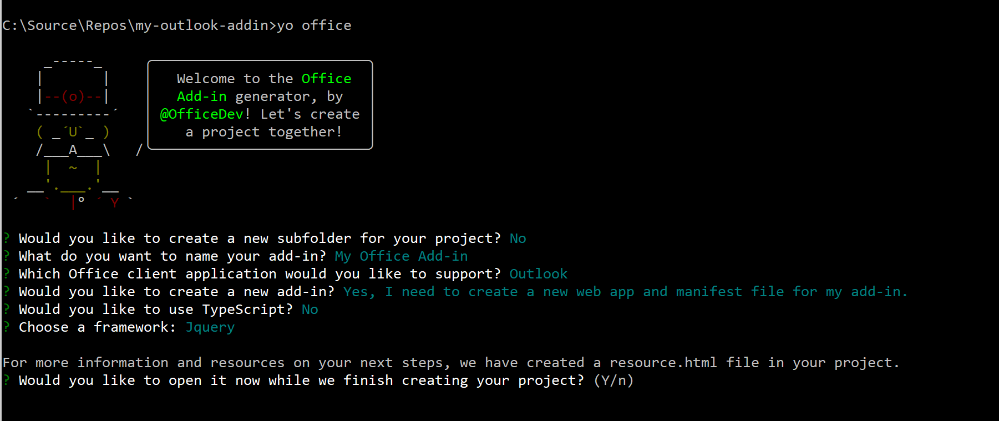

# Build your first Outlook add-in

In this article, you'll walk through the process of building an Outlook add-in by using jQuery and the Office JS API.

## Create the add-in 

You can create an Office Add-in by using Visual Studio or any other editor. Tell us what editor you'd like to use by choosing one of the following tabs:

# [Visual Studio](#tab/visual-studio)

### Prerequisites

- [Visual Studio 2017](https://www.visualstudio.com/vs/) with the **Office/SharePoint development** workload installed

    > [!NOTE]
    > If you've previously installed Visual Studio 2017, [use the Visual Studio Installer](https://docs.microsoft.com/en-us/visualstudio/install/modify-visual-studio) to ensure that the **Office/SharePoint development** workload is installed. 

- Office 365
    
    > [!NOTE]
    > If you don't already have Office 365, you can [register for a free 1-month trial](http://office.microsoft.com/en-us/try/?WT%2Eintid1=ODC%5FENUS%5FFX101785584%5FXT104056786).

### Create the add-in project

1. On the Visual Studio menu bar, choose  **File** > **New** > **Project**.
    
1. In the list of project types under **Visual C#** or **Visual Basic**, expand  **Office/SharePoint**, choose **Add-ins**, and then choose **Outlook Web Add-in** as the project type. 

1. Name the project, and then choose **OK**.

1. Visual Studio creates a solution and its two projects appear in **Solution Explorer**. The **MessageRead.html** file opens in Visual Studio.
    
### Explore the Visual Studio solution

When you've completed the wizard, Visual Studio creates a solution that contains two projects.

|**Project**|**Description**|
|:-----|:-----|
|Add-in project|Contains only an XML manifest file, which contains all the settings that describe your add-in. These settings help the Office host determine when your add-in should be activated and where the add-in should appear. Visual Studio generates the contents of this file for you so that you can run the project and use your add-in immediately. You change these settings any time by modifying the XML file.|
|Web application project|Contains the content pages of your add-in, including all the files and file references that you need to develop Office-aware HTML and JavaScript pages. While you develop your add-in, Visual Studio hosts the web application on your local IIS server. When you're ready to publish the add-in, you'll need to deploy this web application project to a web server.|

### Update the code

1. **MessageRead.html** specifies the HTML that will be rendered in the add-in's task pane. In **MessageRead.html**, replace the `<body>` element with the following markup and save the file.
 
    ```HTML
    <body class="ms-font-m ms-welcome">
        <div class="ms-Fabric content-main">
            <h1 class="ms-font-xxl">Message properties</h1>
            <table class="ms-Table ms-Table--selectable">
                <thead>
                    <tr>
                        <th>Property</th>
                        <th>Value</th>
                    </tr>
                </thead>
                <tbody class="prop-table"/>
            </table>
        </div>
    </body>
    ```

1. Open the file **MessageRead.js** in the root of the web application project. This file specifies the script for the add-in. Replace the entire contents with the following code and save the file. 

    ```js
    'use strict';

    (function () {

      // The initialize function must be run each time a new page is loaded
      Office.initialize = function (reason) {
        $(document).ready(function () {
          loadItemProps(Office.context.mailbox.item);
        });
      };

      function loadItemProps(item) {
        // Get the table body element
        var tbody = $('.prop-table');

        // Add a row to the table for each message property
        tbody.append(makeTableRow("Id", item.itemId));
        tbody.append(makeTableRow("Subject", item.subject));
        tbody.append(makeTableRow("Message Id", item.internetMessageId));
        tbody.append(makeTableRow("From", item.from.displayName + " &lt;" +
          item.from.emailAddress + "&gt;"));
      }

      function makeTableRow(name, value) {
        return $("<tr><td><strong>" + name + 
          "</strong></td><td class=\"prop-val\"><code>" +
          value + "</code></td></tr>");
      }

    })();
    ```

1. Open the file **MessageRead.css** in the root of the web application project. This file specifies the custom styles for the add-in. Replace the entire contents with the following code and save the file. 

    ```CSS
    html,
    body {
        width: 100%;
        height: 100%;
        margin: 0;
        padding: 0;
    }

    td.prop-val {
        word-break: break-all;
    }

    .content-main {
        margin: 10px;
    }
    ```

### Update the manifest

1. Open the XML manifest file in the Add-in project. This file defines the add-in's settings and capabilities.

1. The `ProviderName` element has a placeholder value. Replace it with your name.

1. The `DefaultValue` attribute of the `DisplayName` element has a placeholder. Replace it with `My Office Add-in`.

1. The `DefaultValue` attribute of the `Description` element has a placeholder. Replace it with `My First Outlook Add-in`.

1. Save the file.

    ```xml
    ...
    <ProviderName>Jason Johnston</ProviderName>
    <DefaultLocale>en-US</DefaultLocale>
    <!-- The display name of your add-in. Used on the store and various places of the Office UI such as the add-ins dialog. -->
    <DisplayName DefaultValue="My Office Add-in" />
    <Description DefaultValue="My First Outlook Add-in"/>
    ...
    ```

### Try it out

1. Using Visual Studio, test the newly created Outlook add-in by pressing F5 or choosing the **Start** button to launch Outlook on the web. The add-in will be hosted locally on IIS.

1. In Outlook on the web, select or open a message.

1. Within the message, locate the add-in's button.

    

1. Click the button to open the add-in's taskpane.

    

# [Any editor](#tab/visual-studio-code)

### Prerequisites

- [Node.js](https://nodejs.org)

- Install the latest version of [Yeoman](https://github.com/yeoman/yo) and the [Yeoman generator for Office Add-ins](https://github.com/OfficeDev/generator-office) globally.

    ```Shell
    npm install -g yo generator-office
    ```

### Create the add-in project

1. Create a folder on your local drive and name it `my-outlook-addin`. This is where you'll create the files for your add-in.
1. Navigate to your new folder.

    ```Shell
    cd my-outlook-addin
    ```

1. Use the Yeoman generator to create an Outlook add-in project. Run the following command and then answer the prompts as follows:

    ```Shell
    yo office
    ```

    - **Would you like to create a new subfolder for your project?:** `No`
    - **What do you want to name your add-in?:** `My Office Add-in`
    - **Which Office client application would you like to support?:** `Outlook`
    - **Would you like to create a new add-in?:** `Yes`
    - **Would you like to use TypeScript?:** `No`
    - **Choose a framework:** `Jquery`

    The generator will then ask you if you want to open resource.html. It isn't necessary to open it for this tutorial, but feel free to open it if you're curious! Choose yes or no to complete the wizard and allow the generator to do its work.

    

### Update the code

1. In your code editor, open **index.html** in the root of the project. This files contains the HTML that will be rendered in the add-in's task pane.
1. Replace the `<header>` and `<main>` elements inside the `<body>` element with the following markup and save the file.

    ```HTML
    <div class="ms-Fabric content-main">
        <h1 class="ms-font-xxl">Message properties</h1>
        <table class="ms-Table ms-Table--selectable">
            <thead>
                <tr>
                    <th>Property</th>
                    <th>Value</th>
                </tr>
            </thead>
            <tbody class="prop-table"/>
        </table>
    </div>
    ```

1. Open **app.js** in the root of the project, replace the entire contents with the following code, and save the file.

    ```js
    'use strict';

    (function () {

      // The initialize function must be run each time a new page is loaded
      Office.initialize = function (reason) {
        $(document).ready(function () {
          loadItemProps(Office.context.mailbox.item);
        });
      };

      function loadItemProps(item) {
        // Get the table body element
        var tbody = $('.prop-table');

        // Add a row to the table for each message property
        tbody.append(makeTableRow("Id", item.itemId));
        tbody.append(makeTableRow("Subject", item.subject));
        tbody.append(makeTableRow("Message Id", item.internetMessageId));
        tbody.append(makeTableRow("From", item.from.displayName + " &lt;" +
          item.from.emailAddress + "&gt;"));
      }

      function makeTableRow(name, value) {
        return $("<tr><td><strong>" + name + 
          "</strong></td><td class=\"prop-val\"><code>" +
          value + "</code></td></tr>");
      }

    })();
    ```

1. Open **app.css** in the root of the project, replace the entire contents with the following code, and save the file.

    ```CSS
    html,
    body {
        width: 100%;
        height: 100%;
        margin: 0;
        padding: 0;
    }

    td.prop-val {
        word-break: break-all;
    }

    .content-main {
        margin: 10px;
    }
    ```

### Update the manifest

1. Open the **my-office-add-in-manifest.xml** file.
1. The `ProviderName` element has a placeholder value. Replace it with your name.
1. The `DefaultValue` attribute of the `Description` element has a placeholder. Replace it with `My First Outlook Add-in`.
1. The `DefaultValue` attribute of the `SupportUrl` element has a placeholder. Replace it with `https://localhost:3000` and save the file.

    ```xml
    ...
    <ProviderName>Jason Johnston</ProviderName>
    <DefaultLocale>en-US</DefaultLocale>
    <!-- The display name of your add-in. Used on the store and various places of the Office UI such as the add-ins dialog. -->
    <DisplayName DefaultValue="My Office Add-in" />
    <Description DefaultValue="My First Outlook Add-in"/>

    <!-- Icon for your add-in. Used on installation screens and the add-ins dialog. -->
    <IconUrl DefaultValue="https://localhost:3000/assets/icon-32.png" />
    <HighResolutionIconUrl DefaultValue="https://localhost:3000/assets/hi-res-icon.png"/>

    <!--If you plan to submit this add-in to the Office Store, uncomment the SupportUrl element below-->
    <SupportUrl DefaultValue="https://localhost:3000" />
    ...
    ```

### Sideload the manifest

1. In your command prompt/shell, make sure you are in the root directory of your project, and enter `npm start`. This will start a web server at `https://localhost:3000` and open your default browser to that address.

1. If your browser indicates that the site's certificate is not trusted, you will need to add the certificate as a trusted certificate. Outlook will not load add-ins if the site is not trusted. See [Adding Self-Signed Certificates as Trusted Root Certificate](https://github.com/OfficeDev/generator-office/blob/master/src/docs/ssl.md) for details.

    > [!NOTE]
    > Chrome (web browser) may continue to indicate the the site's certificate is not trusted, even after you have completed the process described in [Adding Self-Signed Certificates as Trusted Root Certificate](https://github.com/OfficeDev/generator-office/blob/master/src/docs/ssl.md). You can disregard this warning in Chrome and can verify that the certificate is trusted by navigating to `https://localhost:3000` in either Internet Explorer or Microsoft Edge. 

1. After your browser loads the add-in page without any certificate errors, follow the instructions in [Sideload Outlook add-ins for testing](sideload-outlook-add-ins-for-testing.md) to sideload the **my-office-add-in-manifest.xml** file.

### Try it out

1. Once you've sideloaded the manifest, select or open a message in Outlook.

1. On the **Home** tab (**Message** tab if you opened the message in a new window), locate the add-in's **Display all properties** button.

    

1. Click the button to open the add-in's taskpane.

    

---

## Next steps

Congratulations, you've successfully created your first Outlook add-in! Next, learn more about the capabilities of an Outlook add-in and build a more complex add-in by following along with the Advanced Outlook add-in tutorial.

> [!div class="nextstepaction"]
> [Advanced Outlook add-in tutorial](addin-tutorial.md)