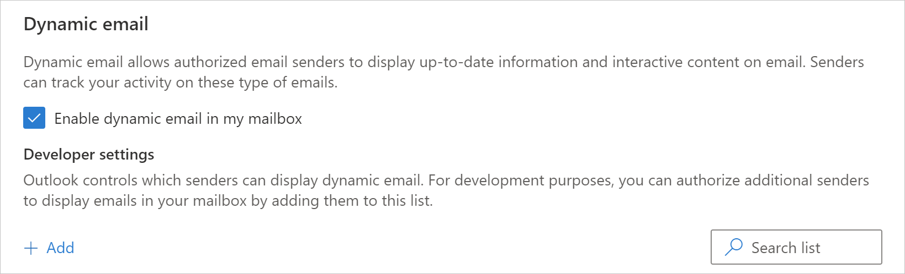

# Sender registration

The email address AMP emails originate from must be registered with Outlook to render AMP emails. If the address is not registered the AMP part will be ignored and the HTML version of the email will be rendered instead. There are two mechanisms to register an address with Outlook.

## Individual mailbox registration

During development, you can self-register to test AMP emails on your account. Follow these steps:

1. [Login](https://www.outlook.com) to you Outlook.com account.
1. Select **Settings**, then **View all Outlook settings**, then **Message Handling** and scroll to the **Dynamic email** section.
1. Check  **Enable dynamic email in my mailbox**.
1. Add any sender email addresses that you will use during your testing.

## Global registration

Once you are ready to send AMP emails to Outlook.com users (your customers), then you must register and be approved by Microsoft. Please note that AMP for email is not yet turned on by default for Outlook.com users but you can get a head start to become an authorized sender by registering now.

Follow these steps:

1. Ensure you meet all [security requirements](security-requirements.md).
1. [Fill out this form](https://forms.office.com/Pages/ResponsePage.aspx?id=v4j5cvGGr0GRqy180BHbRzX-CbfWK8dJr5uYgzqdeDJUMkRSRFpJUEoxRUVOTFpXVEpWR0xJVlpSTy4u) to request registration as an authorized sender.
1. Our team will review your request and contact you within 10 business days.
