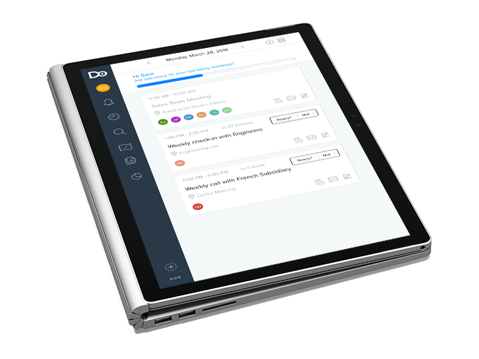
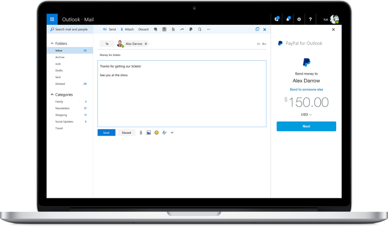
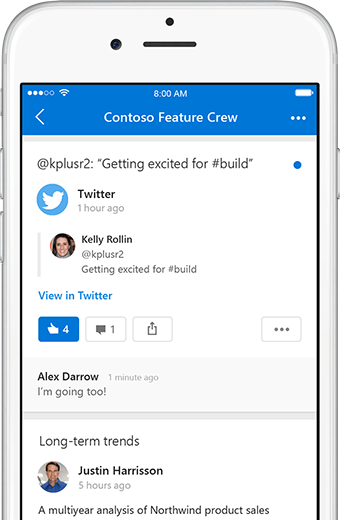

# Outlook Developer documentation

## How can I integrate with Outlook?

Outlook provides integrations that allow you to both access Outlook data from your app (REST APIs via Microsoft Graph) or bring your app into Outlook (add-ins or actionable messages).

### REST APIs

You can access Outlook data in Office 365 or Outlook.com via OData and REST by using OAuth2 and [Microsoft Graph](/graph/overview). These APIs empower your app to perform actions like search email, post events to user's calendars, synchronize contacts, and much more. Check our [Get Started](rest/get-started.md) section for guided walkthroughs on a number of popular platforms.

### Outlook add-ins

Outlook add-ins provide a way for you to bring your app or experience right into Outlook. Outlook add-ins work across desktop, web, and mobile versions of Outlook and allow users to take actions on the message or appointment they are currently reading or composing. Check out our [quick start](add-ins/quick-start.md) to get started with your first add-in.

### Actionable Messages

Whether you are filling out a survey, approving an expense report, or updating a CRM sales opportunity, Actionable Messages enable you to take quick actions right from within Outlook and Teams. Developers can now embed actions in their emails or notifications, elevating user engagement with their services and increasing organizational productivity. Check out our [Get Started](actionable-messages/get-started.md) section to try it out.

## Need help?

Connect with us on StackOverflow and join the Outlook developer community. We use the following tags for each of the integration types:

- REST APIs: [StackOverflow outlook-restapi tag](https://stackoverflow.com/questions/tagged/outlook-restapi)
- Outlook add-ins: [StackOverflow outlook-web-addins tag](https://stackoverflow.com/questions/tagged/outlook-web-addins)
- Actionable messages: [StackOverflow office365connectors tag](https://stackoverflow.com/questions/tagged/office365connectors)

## Feedback

We want to hear from you! If there are features that you'd like us to consider, or if you have feedback about existing features, please visit our [UserVoice page](https://officespdev.uservoice.com/).
