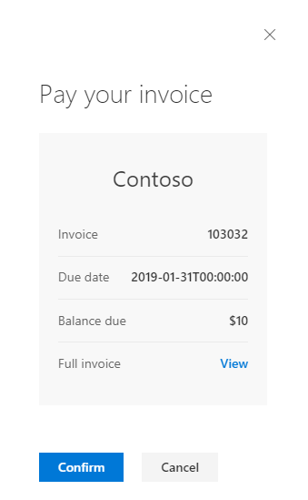

# Get started with Payments in Outlook in an ASP.NET Web API

The purpose of this guide is to walk through the process of implementing a simple Payments in Outlook solution in an ASP.NET C# Web API. The source code in this [repository](#) is what you should end up with if you follow the steps outlined here.

## Prerequisites

- Visual Studio 2017. If you don’t already have Visual Studio 2017 installed, you can download and use the free [Visual Studio 2017 Community Edition](https://www.visualstudio.com/downloads/). Make sure that you enable **Azure development** during the Visual Studio setup.
- An Office 365 subscription with Exchange Online. If you don't have an existing subscription, you can signup for a [25-user free trial](https://portal.office.com/Signup/Signup.aspx?OfferId=467eab54-127b-42d3-b046-3844b860bebf&dl=O365_BUSINESS_PREMIUM&alo=1&lc=1033&ali=1#0) of the Office 365 Business subscription.
- A Microsoft account (MSA) to receive the test payment request. If you don't have a Microsoft account, you can [sign up for one for free]((https://signup.live.com/signup?wa=wsignin1.0&rpsnv=12&ct=1454618383&rver=6.4.6456.0&wp=MBI_SSL_SHARED&wreply=https://mail.live.com/default.aspx&id=64855&cbcxt=mai&bk=1454618383&uiflavor=web&uaid=b213a65b4fdc484382b6622b3ecaa547&mkt=E-US&lc=1033&lic=1)).
- A [Stripe](https://stripe.com/) account. If you don't have an account, you can sign up for one on their website.
- [Ngrok](https://ngrok.com/).

## Overview

The solution we're creating in this guide consists of a Web API that implements both the payment request endpoint and the payment complete endpoint. We'll start by implementing the Web API on your local development machine, then we'll setup ngrok to make your locally hosted Web API reachable from the internet. Finally we'll onboard to Payments in Outlook using the ngrok URLs and test with the sample payment card provided by the dashboard.

## Create the project

1. Open Visual Studio 2017 and create a new Visual C# ASP.NET Web Application (.NET Framework) project. Name the project `OutlookPayments` and click **OK**.
1. Choose the **Web API** template and click **OK**.

### Set global JSON serialization options

Before we start, let's change a couple of global JSON serialization options. The reason we do this is to control how the default Web API serializers handle the models we create. Specifically, we want to make sure that the resulting JSON uses camelCase, and that null values are omitted.

Open **Global.asax.cs** and add the following lines to the end of the `Application_Start` function:

```C#
// Override default JSON serialization settings
var formatter = GlobalConfiguration.Configuration.Formatters.JsonFormatter;

// Omit null values
formatter.SerializerSettings.NullValueHandling = 
    Newtonsoft.Json.NullValueHandling.Ignore;

// Use camelCase
formatter.SerializerSettings.ContractResolver =
    new CamelCasePropertyNamesContractResolver();
```

### Create the models

The format of the payloads our endpoints need to handle are specified in the [Payments in Outlook webhook reference](reference.md). Most of the types are based on the [W3C Payment Request API spec](http://www.w3.org/TR/payment-request), so let's start by defining those types.

In **Solution Explorer**, right-click the **Models** folder and choose **Add...**, then **New Item...**. Choose **Code File**, name it **W3CPaymentTypes.cs**, and click **Add**. Add the following code to the file.

```C#
using System.Collections.Generic;

// Models for types defined in W3C Payment Request API spec
// http://www.w3.org/TR/payment-request

namespace OutlookPayments.Models
{
    // http://www.w3.org/TR/payment-request/#paymentmethoddata-dictionary
    public class PaymentMethodData
    {
        public string SupportedMethods { get; set; }
        public MethodDetails Data { get; set; }
    }

    // http://www.w3.org/TR/payment-request/#paymentoptions-dictionary
    public class PaymentOptions
    {
        public bool RequestPayerName { get; set; }
        public bool RequestPayerEmail { get; set; }
        public bool RequestPayerPhone { get; set; }
        public bool RequestShipping { get; set; }
        public string ShippingType { get; set; }
    }

    // http://www.w3.org/TR/payment-request/#paymentdetailsinit-dictionary
    public class PaymentDetailsInit
    {
        public string Id { get; set; }
        public PaymentItem Total { get; set; }
        public List<PaymentItem> DisplayItems { get; set; }
        public List<PaymentShippingOption> ShippingOptions { get; set; }
    }

    // http://www.w3.org/TR/payment-request/#paymentitem-dictionary
    public class PaymentItem
    {
        public string Label { get; set; }
        public PaymentCurrencyAmount Amount { get; set; }
        public bool Pending { get; set; }
    }

    // http://www.w3.org/TR/payment-request/#paymentshippingoption-dictionary
    public class PaymentShippingOption
    {
        public string Id { get; set; }
        public string Label { get; set; }
        public PaymentCurrencyAmount Amount { get; set; }
        public bool Selected { get; set; }
    }

    // http://www.w3.org/TR/payment-request/#paymentcurrencyamount-dictionary
    public class PaymentCurrencyAmount
    {
        public string Currency { get; set; }
        public string Value { get; set; }
        public string CurrencySystem { get; set; }
    }

    // http://www.w3.org/TR/payment-request/#addressinit-dictionary
    public class AddressInit
    {
        public string Country { get; set; }
        public string[] AddressLine { get; set; }
        public string Region { get; set; }
        public string City { get; set; }
        public string DependentLocality { get; set; }
        public string PostalCode { get; set; }
        public string SortingCode { get; set; }
        public string LanguageCode { get; set; }
        public string Organization { get; set; }
        public string Recipient { get; set; }
        public string Phone { get; set; }
    }

    // http://www.w3.org/TR/payment-request/#paymentresponse-interface
    public class PaymentResponse
    {
        public string RequestId { get; set; }
        public string MethodName { get; set; }
        public PaymentDetails Details { get; set; }
        public AddressInit ShippingAddress { get; set; }
        public string ShippingOption { get; set; }
        public string PayerName { get; set; }
        public string PayerEmail { get; set; }
        public string PayerPhone { get; set; }
    }
}
```

We also need to include a Schema.org [Invoice entity](http://schema.org/Invoice) in the payload, so let's define that as well.

In **Solution Explorer**, right-click the **Models** folder and choose **Add...**, then **New Item...**. Choose **Code File**, name it **SchemaOrgTypes.cs**, and click **Add**. Add the following code to the file.

```C#
using System;
using Newtonsoft.Json;

// Models for types defined by Schema.org
// http://schema.org

namespace OutlookPayments.Models
{
    // http://schema.org/Invoice
    public class Invoice
    {
        [JsonProperty(PropertyName = "@type")]
        public string Type { get { return "Invoice"; } }
        [JsonProperty(PropertyName = "@context")]
        public string Context { get { return "http://schema.org"; } }
        public string Identifier { get; set; }
        public string Url { get; set; }
        public LocalBusiness Broker { get; set; }
        public DateTime PaymentDueDate { get; set; }
        public string PaymentStatus { get; set; }
        public PriceSpecification TotalPaymentDue { get; set; }
        public string ConfirmationNumber { get; set; }
    }

    // http://schema.org/LocalBusiness
    public class LocalBusiness
    {
        [JsonProperty(PropertyName = "@type")]
        public string Type { get { return "LocalBusiness"; } }
        public string Name { get; set; }
    }

    // http://schema.org/PriceSpecification
    public class PriceSpecification
    {
        [JsonProperty(PropertyName = "@type")]
        public string Type { get { return "PriceSpecification"; } }
        public double Price { get; set; }
        public string PriceCurrency { get; set; }
    }
}
```

Next let's add a few more classes to represent the payload for the PaymentRequest endpoint.

In **Solution Explorer**, right-click the **Models** folder and choose **Add...**, then **New Item...**. Choose **Code File**, name it **InvoiceRequestTypes.cs**, and click **Add**. Add the following code to the file.

```C#
namespace OutlookPayments.Models
{
    // The format for payloads to and from the Invoices endpoint
    public class InvoicePayload
    {
        public PaymentMethodData[] MethodData { get; set; }
        public PaymentOptions Options { get; set; }
        public PaymentDetailsInit Details { get; set; }
        public AddressInit ShippingAddress { get; set; }
        public string ShippingOption { get; set; }
    }

    // Our implementation of the data member
    // in the methodDetails of a payment request
    public class MethodDetails
    {
        public string Event { get; set; }
        public InvoiceContext ProductContext { get; set; }
        public string[] SupportedNetworks { get; set; }
        public string[] SupportedTypes { get; set; }
        public Invoice Entity { get; set; }
        public string Mode { get; set; }
    }

    // Our implementation of productContext
    // Only has one member, the invoice ID
    public class InvoiceContext
    {
        public string InvoiceId { get; set; }
    }
}
```

Similarly, let's add classes to represent the payload for the PaymentComplete webhook.

In **Solution Explorer**, right-click the **Models** folder and choose **Add...**, then **New Item...**. Choose **Code File**, name it **PaymentRequestTypes.cs**, and click **Add**. Add the following code to the file.

```C#
using Newtonsoft.Json;
using System.Collections.Generic;

namespace OutlookPayments.Models
{
    // Our implementation of details
    // in a PaymentResponse
    public class PaymentDetails
    {
        public InvoiceContext ProductContext { get; set; }
        public string PaymentToken { get; set; }
        public PaymentCurrencyAmount Amount { get; set; }
    }

    public class PaymentCompleteResponse
    {
        public string RequestId { get; set; }
        public string Result { get; set; }
        public string Details { get; set; }
        public PaymentCompleteError Error { get; set; }
        public Invoice Entity { get; set; }
    }

    public class PaymentCompleteError
    {
        public string Code { get; set; }
        public string Message { get; set; }
        public string Target { get; set; }
        public List<PaymentCompleteErrorDetails> Details { get; set; }
        [JsonProperty(PropertyName = "innererror")]
        public PaymentCompleteError InnerError { get; set; }
    }

    public class PaymentCompleteErrorDetails
    {
        public string Code { get; set; }
        public string Message { get; set; }
    }
}
```

Finally, let's add a file for string values used by some of the fields (like the `event` field).

In **Solution Explorer**, right-click the **Models** folder and choose **Add...**, then **New Item...**. Choose **Code File**, name it **StringValues.cs**, and click **Add**. Add the following code to the file.

```C#
namespace OutlookPayments.Models
{
    // Used in the event field in MethodDetails
    public static class PayEvent
    {
        public static string LoadEntity = "loadentity";
        public static string ShippingAddressChange = "shippingaddresschange";
        public static string ShippingOptionChange = "shippingoptionchange";
    }

    // Used by the shippingType field in PaymentOptions
    public static class ShippingType
    {
        public static string Shipping = "shipping";
        public static string Delivery = "delivery";
        public static string Pickup = "pickup";
    }

    // Used by the id field in PaymentShippingOption
    public static class Shipping
    {
        public static string NoRush = "norush";
        public static string Priority = "priority";
    }

    // Used by the paymentStatus field in Invoice
    public static class PaymentStatus
    {
        public static string PaymentAutomaticallyApplied = "PaymentAutomaticallyApplied";
        public static string PaymentComplete = "PaymentComplete";
        public static string PaymentDeclined = "PaymentDeclined";
        public static string PaymentDue = "PaymentDue";
        public static string PaymentPastDue = "PaymentPastDue";
    }

    public static class PaymentResult
    {
        public static string Success = "success";
        public static string Fail = "fail";
    }
}
```

### Implement the payment request endpoint

In **Solution Explorer**, right-click the **Controllers** folder and choose **Add...**, then **Controller**. Choose **Web API 2 Controller - Empty** and click **Add**. Name the controller `InvoicesController` and click **Add**.

Add the following using statement to the top of the file:

```C#
using OutlookPayments.Models;
```

Add a new function to the `InvoicesController` class called `Post` to check the `event` property and return an appropriate response:

```C#
public InvoicePayload Post([FromBody]InvoicePayload incomingPayload)
{
    // Get the event type
    string eventType = incomingPayload.MethodData[0].Data.Event;

    if (eventType == PayEvent.LoadEntity)
    {
        return CreateMockLoadEntityResponse(incomingPayload);
    }

    if (eventType == PayEvent.ShippingAddressChange)
    {
        return CreateMockShippingAddressResponse(incomingPayload);
    }

    if (eventType == PayEvent.ShippingOptionChange)
    {
        return CreateMockShippingOptionResponse(incomingPayload);
    }

    throw new HttpResponseException(HttpStatusCode.BadRequest);
}
```

The `CreateMockLoadEntityResponse`, `CreateMockShippingAddressResponse`, and `CreateMockShippingOptionResponse` functions aren't defined yet, but that is our next step.

#### Respond to the loadentity event

The Payment service sends a `loadentity` event to request details about the recipient's invoice. The webhook should use the information from the `productContext` to locate the appropriate invoice and send the information back to the service.

For this sample, we're just going to send back a mock invoice.

Our sample payment solution is only going to accept credit card payments, and only Visa, MasterCard, or American Express. Add the following properties to the `InvoicesController` class:

```C#
private string[] supportedNetworks = { "visa", "mastercard", "amex" };
private string[] supportedTypes = { "credit" };
```

Add the following function to the `InvoicesController` class:

```C#
private InvoicePayload CreateMockLoadEntityResponse(InvoicePayload payload)
{
    // Returns a mock response
    // Typically this would be where you would retrieve the invoice details
    // from a database and build the response.
    // For our sample, the invoice ID is in the ProductContext as InvoiceId

    // Turn on "test" mode
    payload.MethodData[0].Data.Mode = "TEST";

    // Specify supported credit card networks
    payload.MethodData[0].Data.SupportedNetworks = supportedNetworks;
    payload.MethodData[0].Data.SupportedTypes = supportedTypes;

    // Add the schema.org Invoice entity
    payload.MethodData[0].Data.Entity = new Invoice()
    {
        Identifier = payload.MethodData[0].Data.ProductContext.InvoiceId,
        Url = "https://contoso.com/invoice",
        Broker = new LocalBusiness()
        {
            Name = "Contoso"
        },
        PaymentDueDate = new DateTime(2019, 1, 31),
        PaymentStatus = PaymentStatus.PaymentDue,
        TotalPaymentDue = new PriceSpecification()
        {
            Price = 10.00,
            PriceCurrency = "USD"
        }
    };

    // Set the options
    payload.Options = new PaymentOptions()
    {
        RequestPayerEmail = true,
        RequestPayerName = true,
        RequestPayerPhone = true,
        RequestShipping = true,
        ShippingType = ShippingType.Shipping
    };

    // Set the details on what gets displayed

    payload.Details = new PaymentDetailsInit()
    {
        Id = payload.MethodData[0].Data.ProductContext.InvoiceId,
        DisplayItems = new List<PaymentItem>()
        {
            new PaymentItem()
            {
                Label = "Large Widget",
                Amount = new PaymentCurrencyAmount()
                {
                    Currency = "USD",
                    Value = "7.00"
                }
            },
            new PaymentItem()
            {
                Label = "Small Widget",
                Amount = new PaymentCurrencyAmount()
                {
                    Currency = "USD",
                    Value = "3.00"
                }
            },
            new PaymentItem()
            {
                Label = "Shipping",
                Amount = new PaymentCurrencyAmount()
                {
                    Currency = "USD",
                    Value = "0.00"
                },
                // Set the total as pending since
                // we've set to 0 as the default
                Pending = true
            }
        },
        Total = new PaymentItem
        {
            Label = "Total Due",
            Amount = new PaymentCurrencyAmount()
            {
                Currency = "USD",
                Value = "10.00"
            },
            // Set the total as pending since
            // it is not final until shipping is added
            Pending = true
        }
    };

    return payload;
}
```

Notice a few key details about this payload.

- We set the `mode` property to `TEST`, which enables test credit cards to show up in the recipient's account. This will allow us to test the entire experience without actually charging a credit card.
- We're sending a $10.00 invoice from Contoso, due on January 31, 2019.
- We're requesting shipping information, so this example will include prompting the user for a shipping address and shipping option.
- We're including three line items on the invoice: $7.00 for a Large Widget, $3.00 for a Small Widget, and $0.00 for Shipping. The Shipping and Total amounts are marked as pending, since the user can choose a paid shipping option, which will change those amounts.

#### Respond to the shippingaddresschange event

The Payment service sends a `shippingaddresschange` event to request applicable shipping options for the specified address. For this sample, we'll just always return two options: regular shipping for free, and priority shipping for $3.00.

Add the following function to the `InvoicesController` class:

```C#
private InvoicePayload CreateMockShippingAddressResponse(InvoicePayload payload)
{
    // Returns a mock response
    // This method is typically used for scenarios where you are collecting a shipping
    // address from the user as part of the pay experience. Here you could
    // dynamically update what shipping options are available based on the address.
    // For example, maybe "rush" delivery is only available in certain areas.

    // The address is provided in the ShippingAddress property

    // Add static shipping options
    payload.Details.ShippingOptions = new List<PaymentShippingOption>()
    {
        new PaymentShippingOption()
        {
            Id = Shipping.NoRush,
            Label = "Regular Shipping",
            Amount = new PaymentCurrencyAmount()
            {
                Currency = "USD",
                Value = "0.00"
            },
            Selected = true
        },
        new PaymentShippingOption()
        {
            Id = Shipping.Priority,
            Label = "Priority Shipping",
            Amount = new PaymentCurrencyAmount()
            {
                Currency = "USD",
                Value = "3.00"
            }
        }
    };

    return payload;
}
```

#### Respond to the shippingoptionchange event

The Payment service sends a `shippingaddresschange` event to request an updated invoice based on the selected shipping option. The webhook should update the invoice total and shipping line item accordingly.

Add the following function to the `InvoicesController` class:

```C#
private InvoicePayload CreateMockShippingOptionResponse(InvoicePayload payload)
{
    // Returns a mock response
    // This method is typically used for scenarios where you are updating the
    // invoice based on shipping. For example, priority shipping may incur an
    // additional cost.

    // The shipping option selected is provided in the ShippingOption property

    string shippingOption = payload.ShippingOption;

    if (shippingOption == Shipping.Priority)
    {
        // If shipping is already present, just update it
        var shippingItem = payload.Details.DisplayItems.Find(i => i.Label.Equals("Shipping"));
        if (shippingItem != null)
        {
            shippingItem.Amount = new PaymentCurrencyAmount()
            {
                Currency = "USD",
                Value = "3.00"
            };
        }
        else
        {
            // Add a new item
            payload.Details.DisplayItems.Add(new PaymentItem()
            {
                Label = "Shipping",
                Amount = new PaymentCurrencyAmount()
                {
                    Currency = "USD",
                    Value = "3.00"
                }
            });
        }

        // Update the invoice total
        payload.Details.Total.Amount.Value = "13.00";

        // Update the total in the Invoice entity
        payload.MethodData[0].Data.Entity.TotalPaymentDue.Price = 13.00;
    }
    else
    {
        // Regular shipping, remove any shipping line item and reset total
        var shippingItem = payload.Details.DisplayItems.Find(i => i.Label.Equals("Shipping"));
        if (shippingItem != null)
        {
            shippingItem.Amount.Value = "0.00";
        }

        // Update total
        payload.Details.Total.Amount.Value = "10.00";

        // Update the total in the Invoice entity
        payload.MethodData[0].Data.Entity.TotalPaymentDue.Price = 10.00;
    }

    return payload;
}
```

That's it! We've implemented code to handle all three payment request events. The last step now is to implement the payment complete endpoint.

### Implement the payment complete endpoint

The Payment service calls the payment complete endpoint when the user finalizes payment. Payment is sent to the endpoint as a payment token, which may be a Stripe token or a Microsoft Pay token.

One of the first tasks for our payment complete webhook is to parse the payment token. Let's create a class to handle the parsing.

In **Solution Explorer**, right-click the **Models** folder and choose **Add...**, then **Class...**. Name the class `PaymentToken` and click **Add**.

Replace the contents of the file with the following code:

```C#
using Newtonsoft.Json.Linq;
using System;
using System.Text;

namespace OutlookPayments.Models
{
    public class PaymentToken
    {
        public string Format { get; private set; }
        public string Payload { get; private set; }
        public bool IsTestToken { get; private set; }

        public PaymentToken(string encodedToken)
        {
            // Payment tokens are encoded like
            // base64Header.base64token.base64Signature
            string[] parts = encodedToken.Split('.');

            // Decode header and check if in test mode
            JObject header = JObject.Parse(Base64UrlDecode(parts[0]));
            if (header.Value<bool>("TestMode"))
            {
                IsTestToken = true;
                // Since we're in test mode, we can skip any validation
                Format = header.Value<string>("Format");
                Payload = Base64UrlDecode(parts[1]);
            }
            else
            {
                // TODO: Should validate the signature on the encoded token
                // Then process the token for actual payment
                IsTestToken = false;
                Format = string.Empty;
                Payload = string.Empty;
            }
        }

        private string Base64UrlDecode(string encoded)
        {
            string padded = encoded.PadRight(encoded.Length + (4 - encoded.Length % 4) % 4, '=');
            padded = padded.Replace('-', '+').Replace('_', '/');
            var decodedBytes = Convert.FromBase64String(padded);
            return Encoding.UTF8.GetString(decodedBytes);
        }
    }
}
```

Now let's implement the actual webhook. In **Solution Explorer**, right-click the **Controllers** folder and choose **Add...**, then **Controller**. Choose **Web API 2 Controller - Empty** and click **Add**. Name the controller `PaymentsController` and click **Add**.

Add the following using statement to the top of the file:

```C#
using OutlookPayments.Models;
```

Add a new function to the `InvoicesController` class called `Post` to check the `event` property and return an appropriate response:

```C#
// POST /api/payments
public PaymentCompleteResponse Post([FromBody] PaymentResponse payment)
{
    // TODO: Add bearer token validation

    // Parse the token
    PaymentToken parsedToken = new PaymentToken(payment.Details.PaymentToken);

    // The sample only supports test tokens
    if (!parsedToken.IsTestToken)
    {
        throw new HttpResponseException(HttpStatusCode.BadRequest);
    }

    // Check the format
    switch (parsedToken.Format.ToLower())
    {
        case "stripe":
            return CreateMockStripePaymentResponse(parsedToken, payment);
        default:
            throw new HttpResponseException(HttpStatusCode.BadRequest);
    }
}
```

The `CreateMockStripePaymentResponse` function isn't defined yet, but that is our next step.

#### Process a Stripe payment

Since this sample enables "test" mode (by setting the `mode` to `TEST` in the `loadentity` response), we're only going to handle test tokens. Test tokens are Stripe tokens as described in the [Stripe documentation](https://stripe.com/docs/testing#cards).

Add the following function to the `PaymentsController` class:

```C#
private PaymentCompleteResponse CreateMockStripePaymentResponse(PaymentToken token, PaymentResponse payment)
{
    // Returns a mock response
    // Typically you would use the Stripe API here to submit the payment
    // token for processing, then build your response based on the Stripe
    // API response.

    // Since we only handle test tokens, we can do simple
    // string compares for the values specified in
    // https://stripe.com/docs/testing#cards
    if (token.Payload == "tok_chargeDeclined")
    {
        return CreateMockCardDeclinedResponse(
            payment.RequestId, payment.Details.ProductContext.InvoiceId,
            payment.Details.Amount);
    }

    if (token.Payload == "tok_visa" ||
        token.Payload == "tok_mastercard" ||
        token.Payload == "tok_amex")
    {
        return new PaymentCompleteResponse()
        {
            RequestId = payment.RequestId,
            Details = "Thank you for paying your bill!",
            Entity = new Invoice()
            {
                Identifier = payment.Details.ProductContext.InvoiceId,
                Url = "https://contoso.com/invoice",
                Broker = new LocalBusiness()
                {
                    Name = "Contoso"
                },
                PaymentDueDate = new DateTime(2019, 1, 31),
                PaymentStatus = PaymentStatus.PaymentComplete,
                TotalPaymentDue = new PriceSpecification()
                {
                    // Bill is paid so amount due is set to 0
                    Price = 0.00,
                    PriceCurrency = "USD"
                },
                ConfirmationNumber = "98765"
            },
            Result = PaymentResult.Success
        };
    }

    throw new HttpResponseException(HttpStatusCode.BadRequest);
}
```

Finally, let's implement the `CreateMockCardDeclinedResponse` function. Add the following function to the `PaymentsController` class.

```C#
private PaymentCompleteResponse CreateMockCardDeclinedResponse(string requestId, string invoiceId, PaymentCurrencyAmount amount)
{
    return new PaymentCompleteResponse()
    {
        RequestId = requestId,
        Details = "We were unable to charge your credit card.",
        Result = PaymentResult.Fail,
        Entity = new Invoice()
        {
            Identifier = invoiceId,
            Url = "https://contoso.com/invoice",
            Broker = new LocalBusiness()
            {
                Name = "Contoso"
            },
            PaymentDueDate = new DateTime(2019, 1, 31),
            PaymentStatus = PaymentStatus.PaymentDue,
            TotalPaymentDue = new PriceSpecification()
            {
                Price = Convert.ToDouble(amount.Value),
                PriceCurrency = amount.Currency
            }
        },
    };
}
```

That completes our sample Web API. Now let's set it up to test it.

## Run the project

Press **F5** or choose **Start Debugging** from the **Debug** menu to build and run the project. A browser opens to the home page of the app. Look at the URL to the homepage. It should look like `http://localhost:<port>`, where `<port>` is a number. Make note of this port number for the next step.

### Run ngrok

They Payment service must be able to contact your webhook from the internet, so running on localhost won't work. However, by using ngrok, we can create a publicly accessible address that is temporarily able to contact localhost.

Open a command prompt or shell and run the following command:

```Shell
ngrok http <port> -host-header=localhost:<port>
```

The output should look similar to this:

```Shell
ngrok by @inconshreveable                                     (Ctrl+C to quit)

Session Status                online
Account                       Jason Johnston (Plan: Free)
Version                       2.2.8
Region                        United States (us)
Web Interface                 http://127.0.0.1:4040
Forwarding                    http://5f14a16e.ngrok.io -> localhost:52663
Forwarding                    https://5f14a16e.ngrok.io -> localhost:52663
```

Copy the HTTPS URL from the second `Forwarding` entry. In the above output, the URL to copy is `https://5f14a16e.ngrok.io`. Using that URL as the base, let's construct two URLs: one to the payment request webhook (ngrok URL + `/api/invoices`), and one to the payment complete webhook (ngrok URL + `/api/payments`). For example, using the URL from the example output above: 

```
https://5f14a16e.ngrok.io/api/invoices
https://5f14a16e.ngrok.io/api/payments
```

> [!IMPORTANT]
> Leave ngrok running so those URLs remain active.

Now let's register those endpoints in the [Payments in Outlook Partner Dashboard](https://outlook.office.com/connectors/opay/partnerportal/).

### Register for Payments in Outlook

On-boarding to Payments in Outlook involves two steps: on-boarding to [Microsoft Pay](https://www.microsoft.com/en-us/payments), then on-boarding to Payments in Outlook. Both steps can be completed in the [Payments in Outlook Partner Dashboard](https://outlook.office.com/connectors/opay/partnerportal/).

1. Browse to the [dashboard](https://outlook.office.com/connectors/opay/partnerportal/). Sign in with an account from your Office 365 subscription.
1. Choose **Add/Update Processor Information** to open a new window or tab to the MMX portal.
1. In the MMX portal, change both **MMX Environment** and **MMS Environment for Delegate Auth** to `production`.
1. Choose **Sign in to AAD**. Sign in with your Office 365 account.
1. Choose **Get AAD Ticket**.
1. Make sure that **MMX Environment** and **MMS Environment for Delegate Auth** are still set to `production`, then choose **Open MMX (AAD)**. A new window opens to Microsoft Pay Merchant Management.
1. Choose **Add Stripe account**. Login to your Stripe account and authorize access. You should be redirected to the Microsoft Pay Merchant Management window and see **Account status: Active** next to the Stripe option. Close the window and close the MMX portal.
1. Return to the Payments in Outlook Partner Dashboard and choose **Add/Update Payments in Outlook Information**.
1. Enter the ngrok URLs for your endpoints and choose **Update**.
1. Copy the **Message Card Payload** generated by the dashboard. We'll use that to send a test payment request to your Microsoft account.

> [!IMPORTANT]
> If you are using a free ngrok account, the URL used by ngrok changes each time you run the ngrok tool. If you stop ngrok and restart it, you will need to revisit the Payments in Outlook Dashboard and update your webhook URLs.

### Send the test payment request

1. Go to the [MessageCard Playground](https://messagecardplayground.azurewebsites.net/).
1. Paste in the **Message Card Payload** generated by the dashboard.
1. Choose **Send via email**.
1. Sign in with your Microsoft account. You should get confirmation that the message was sent successfully.

## Test the solution

1. Open the ngrok web interface (http://127.0.0.1:4040) in a new browser window.
1. Login to Outlook.com using your Microsoft account and find the message you sent from the MessageCard Playground.

    

1. Choose the **Pay** button to open the payment pane.

    

1. Choose **Confirm** to continue to the payment form. Your payment request webhook should receive a `loadentity` payload. You can confirm in the ngrok web interface.

    

1. Select a shipping address in the **Ship to** dropdown. Your payment request webhook should receive a `shippingaddresschange` payload. You can confirm in the ngrok web interface.

1. Select **Priority Shipping ($3.00)** in the **Shipping options** dropdown. Your payment request webhook should receive a `shippingoptionchange` payload, and you should see the total change from $10.00 to $13.00.

### Test a successful payment

1. Choose one of the test cards with `Success` in the name, such as `Visa Success **4242` in the **Pay with** dropdown.
1. Choose the **Pay** button. 
1. Enter any three digit number for the **CVV** field and choose **Pay**. Your payment complete webhook should receive a payload and return a success response.
1. Choose the **All done** button to close the payment pane.

### Test a failed payment

Open the payment pane from your test message again and go through the same steps as before, with one difference. Choose one of the test cards with `Declined` in the name, such as `MasterCard Declined **0002`. Your payment complete webhook should receive a payload and return an error response.