# Write an iOS app to get Outlook mail, calendar, and contacts

The purpose of this guide is to walk through the process of creating a simple Swift app that retrieves messages in Office 365 or Outlook.com. The source code in this [repository](https://github.com/jasonjoh/swift-tutorial) is what you should end up with if you follow the steps outlined here.

This guide will use [Microsoft Graph](/graph/overview) to access Outlook mail. Microsoft recommends using Microsoft Graph to access Outlook mail, calendar, and contacts. You should use the Outlook APIs directly (via `https://outlook.office.com/api`) only if you require a feature that is not available on the Graph endpoints.

This guide assumes that you already have Xcode installed and working on your development machine, along with [CocoaPods](https://cocoapods.org) version 1.2 or later.

## Create the app

Let's dive right in! Open Xcode, and on the **File** menu, choose **New** then **Project**. In the left-hand pane, choose **Application** under **iOS**, then choose **Tabbed Application**. Click **Next**.


Enter `swift-tutorial` for **Product Name**, `Swift` for **Language**, and `Universal` for **Devices**, then click **Next**.

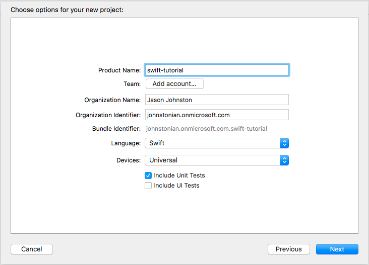

Choose a location for the project and click **Create**. Once Xcode finishes creating the project, close Xcode.

Next, use CocoaPods to install dependencies. For this tutorial, we will need the following:

- [p2 OAuth2 framework](https://github.com/p2/OAuth2)
- [SwiftyJSON](https://github.com/SwiftyJSON/SwiftyJSON)

Open Terminal and change the directory to the location of your `swift-tutorial` project. Run the following command to initialize a Podfile for the project.

```Shell
pod init
```

Next, open the Podfile using the following command.

```Shell
open Podfile
```

Replace the entire contents of the file with:

#### Contents of the `Podfile` file

```Ruby
# Uncomment the next line to define a global platform for your project
# platform :ios, '9.0'

target 'swift-tutorial' do
  # Comment the next line if you're not using Swift and don't want to use dynamic frameworks
  use_frameworks!

  # Pods for swift-tutorial
  pod 'p2.OAuth2'
  pod 'SwiftyJSON'

  target 'swift-tutorialTests' do
    inherit! :search_paths
    # Pods for testing
  end

end
```

Close the Podfile, then run the following command to install the dependencies.

```Shell
pod install
```

Once that command finishes, open the newly created `swift-tutorial.xcworkspace` file in Xcode.

## Designing the app

The app itself will be fairly simple. We'll repurpose the generated **FirstViewController** to show the user's inbox.

1. In the Project navigator, expand **swift-tutorial**->**swift-tutorial**, then select **FirstViewController.swift**. Replace all instances of `FirstViewController` with `MailViewController`.
1. Open the **File inspector** and change the file name to `MailViewController.swift`.
1. Select **Main.storyboard**. In the document outline, expand **First Scene**, then select **First**.

    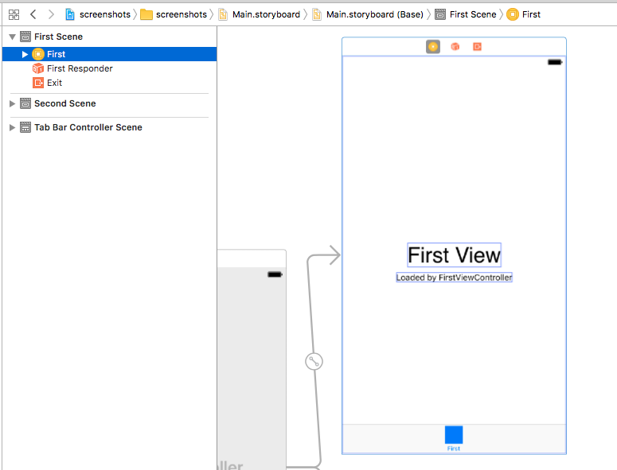
1. Open the **Attributes inspector** and change the **Title** to `Mail`.
1. Open the **Identity inspector** and change the **Class** to `MailViewController`.
1. Expand **View** and delete the **First View** and **Loaded by FirstViewController** labels.
1. Select the **First** bar item at the bottom of the view. On the **Attributes inspector**, change the **Title** to `Mail`. Make sure the **Image** value is `first`.

Now let's add a login button. In the **Object Library** (bottom-right corner), find **Button**. Drag **Button** onto the visual representation of the view. Double-click the button and set the text to `Log In`.

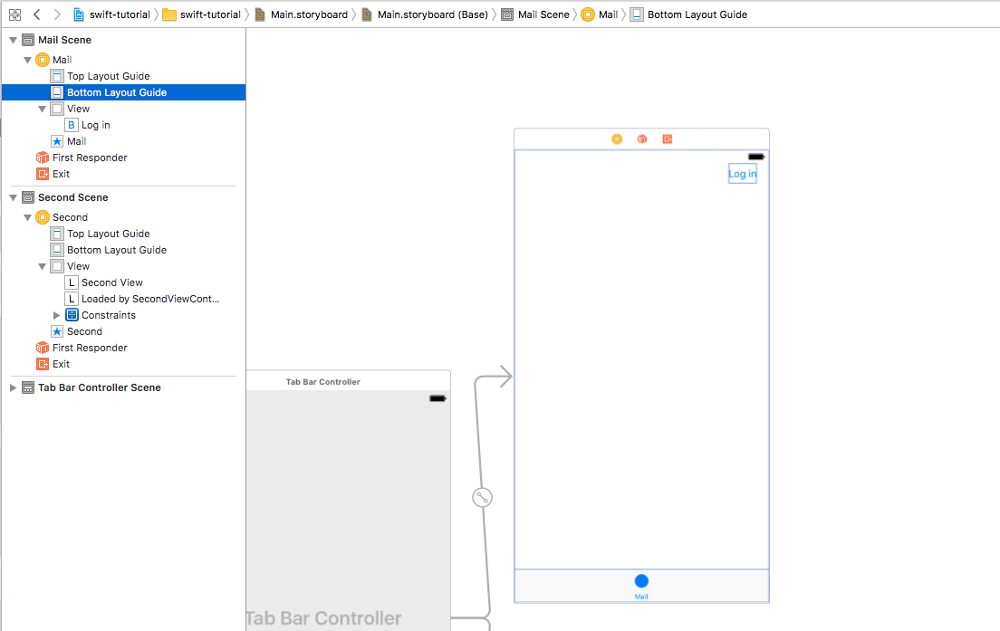

Now select **MailViewController.swift** in the Project navigator. Add a new property to the `MailViewController` class, right before the `viewDidLoad` function:

```Swift
@IBOutlet var logInButton: UIButton!
```

Then add a new method to the class:

#### `logInButtonTapped` function in `MailViewController.swift`

```Swift
@IBAction func logInButtonTapped(sender: AnyObject) {
    NSLog("Hello World")
}
```

In **Main.storyboard**, select **Mail** in the document outline. Select the **Connections inspector** tab on the right-hand side.

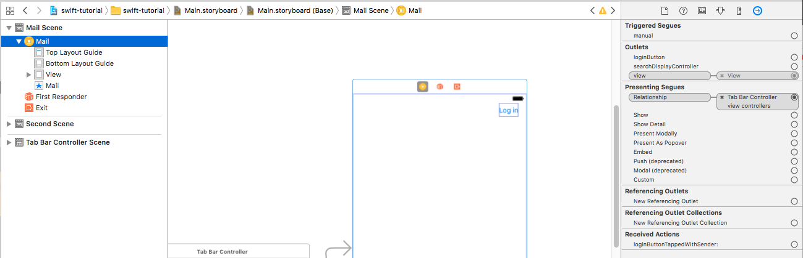

Under **Outlets**, you should see the `loginButton` property we added to the view controller earlier. Drag the small circle next to this property onto the button on the view.

Under **Received Actions**, you should see `logInButtonTappedWithSender`. Drag the small circle next to this method onto the button on the view. In the pop up menu that appears, select **Touch Up Inside**. The **Connections inspector** section should look like this once you are done.

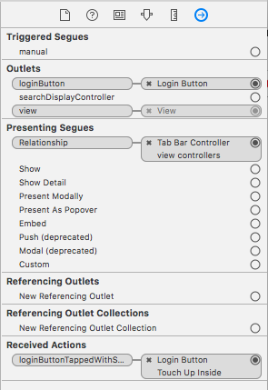

At this point the app should build and run. Tapping the **Log in** button should call the `loginButtonTapped` method, which should print `Hello World` to the output in Xcode.

## Register the app

[!include[App Registration Intro](~/includes/rest/app-registration-intro.md)]

Head over to the [Application Registration Portal](https://apps.dev.microsoft.com/) to quickly get an application ID.

1. Using the **Sign in** link, sign in with either your Microsoft account (Outlook.com), or your work or school account (Office 365).
1. Click the **Add an app** button. Enter `swift-tutorial` for the name and click **Create**.
1. Locate the **Platforms** section, and click **Add Platform**. Choose **Native application**.
1. Replace the value for **Custom Redirect URIs** with `swift-tutorial://oauth2/callback`.
1. Click **Save** to complete the registration. Copy the **Application Id** and save it. We'll need it soon.

Here's what the details of your app registration should look like when you are done.

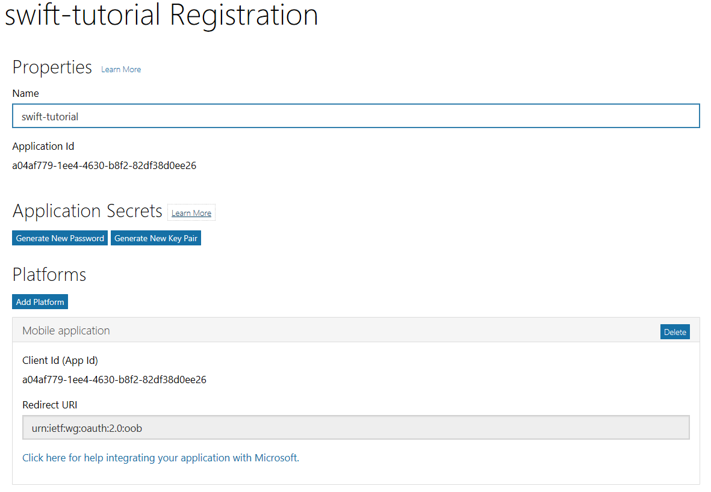

## Implementing OAuth2

Our goal in this section is to make the **Log in** button use OAuth2 to obtain an access token that we can use with the Mail API. We'll use the p2 OAuth2 framework.

Let's start by creating a singleton class that will manage authentication and making API calls. CTRL + Click the **swift-tutorial** folder in Project navigator and select **New File**. Select **Swift file** as the template and click **Next**. Enter `OutlookService` in the **Save As** field and click **Create**.

Open the **OutlookService.swift** file and replace its contents with the following.

#### Contents of the `OutlookService.swift` file

```Swift
import Foundation
import p2_OAuth2

class OutlookService {
    // Configure the OAuth2 framework for Azure
    private static let oauth2Settings = [
        "client_id" : "YOUR APP ID HERE",
        "authorize_uri": "https://login.microsoftonline.com/common/oauth2/v2.0/authorize",
        "token_uri": "https://login.microsoftonline.com/common/oauth2/v2.0/token",
        "scope": "openid profile offline_access User.Read Mail.Read",
        "redirect_uris": ["swift-tutorial://oauth2/callback"],
        "verbose": true,
        ] as OAuth2JSON

    private static var sharedService: OutlookService = {
        let service = OutlookService()
        return service
    }()

    private let oauth2: OAuth2CodeGrant

    private init() {
        oauth2 = OAuth2CodeGrant(settings: OutlookService.oauth2Settings)
        oauth2.authConfig.authorizeEmbedded = true
    }

    class func shared() -> OutlookService {
        return sharedService
    }

    var isLoggedIn: Bool {
        get {
            return oauth2.hasUnexpiredAccessToken() || oauth2.refreshToken != nil
        }
    }

    func handleOAuthCallback(url: URL) -> Void {
        oauth2.handleRedirectURL(url)
    }

    func login(from: AnyObject, callback: @escaping (String? ) -> Void) -> Void {
        oauth2.authorizeEmbedded(from: from) {
            result, error in
            if let unwrappedError = error {
                callback(unwrappedError.description)
            } else {
                if let unwrappedResult = result, let token = unwrappedResult["access_token"] as? String {
                    // Print the access token to debug log
                    NSLog("Access token: \(token)")
                    callback(nil)
                }
            }
        }
    }

    func logout() -> Void {
        oauth2.forgetTokens()
    }
}
```

Replace the value of `clientId` with the application ID you generated in the Application Registration Portal.

Open **AppDelegate.swift** and add a new function to the `AppDelegate` class. This function will handle activation of the app when it is activated by the custom redirect URI during sign in.

#### `application` function in `AppDelegate.swift`

```Swift
func application(_ app: UIApplication, open url: URL, sourceApplication: String?, annotation: Any) -> Bool {
    if url.scheme == "swift-tutorial" {
        let service = OutlookService.shared()
        service.handleOAuthCallback(url: url)
        return true
    }
    else {
        return false
    }
}
```

Now we need to register the custom URI scheme `swift-tutorial` so that our app will be invoked.

1. Control-click the **Info.plist** file and choose **Open As**, then **Source Code**.
1. Go to the end of the file, and add the following code just after the last `</array>` line in the file:

    ```xml
    <key>CFBundleURLTypes</key>
    <array>
        <dict>
            <key>CFBundleURLSchemes</key>
            <array>
                <string>swift-tutorial</string>
            </array>
        </dict>
    </array>
    ```

Switch back to **MailViewController.swift**. Add a member to the `MailViewController` class to hold the shared instance of the `OutlookService` class.

```Swift
let service = OutlookService.shared()
```


Add a function to the `MailViewController` class to change the label on the login button based on the current login state.

#### `setLogInState` function in `MailViewController.swift`

```Swift
func setLogInState(loggedIn: Bool) {
    if (loggedIn) {
        loginButton.setTitle("Log Out", for: UIControlState.normal)
    }
    else {
        loginButton.setTitle("Log In", for: UIControlState.normal)
    }
}
```

Now add code to the `viewDidLoad` function to check the login state and set the button text appropriately. The reason for this is that the p2 OAuth2 framework stores tokens in the user's keychain. When the view loads, there may already be a valid token in the keychain, so the user doesn't have to login again. Add the following after the `super.viewDidLoad()` line.

```Swift
setLogInState(loggedIn: service.isLoggedIn)
```

Finally, let's update the `logInButtonTapped` function to do the login. Replace the existing function with this new one.

#### Updated `loginButtonTapped` function in `MailViewController.swift`

```Swift
@IBAction func loginButtonTapped(sender: AnyObject) {
    if (service.isLoggedIn) {
        // Logout
        service.logout()
        setLogInState(loggedIn: false)
    } else {
        // Login
        service.login(from: self) {
            error in
            if let unwrappedError = error {
                NSLog("Error logging in: \(unwrappedError)")
            } else {
                NSLog("Successfully logged in.")
                setLogInState(loggedIn: true)
            }
        }
    }
}
```

Run the app. Once the app loads in the iOS Simulator, tap the **Log in** button to login. After logging in, you should see a token printed to the output window, and the button should now say **Log out**.

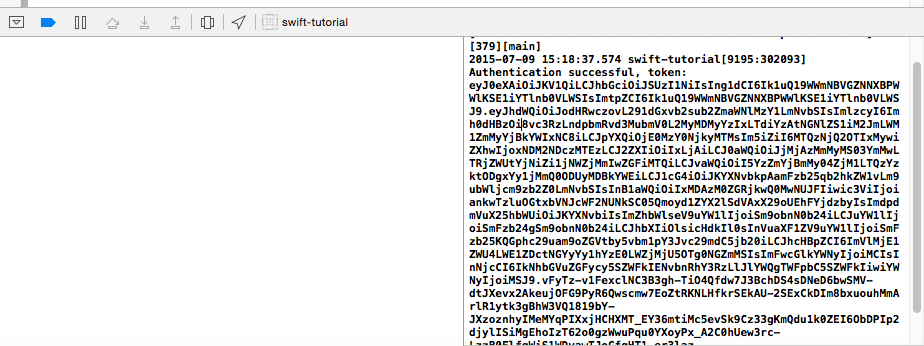

Copy the entire value of the token and head over to https://jwt.io/. If you paste that value in, you should see a JSON representation of an access token. For details and alternative parsers, see [Validating your Office 365 Access Token](https://github.com/jasonjoh/office365-azure-guides/blob/master/ValidatingYourToken.md).

Once you're convinced that the token is what it should be, let's move on to using the Mail API.

## Using the Mail API

Let's start by creating a function that will send an API request and return the response. Switch back to **OutlookService.swift** file and import the SwiftyJSON library.

```Swift
import SwiftyJSON
```

We'll use this library to wrap the results of API calls, making them a little easier to access. Next, add a member to the `OutlookService` class to hold the user's email address.

```Swift
private var userEmail: String
```

We should make sure that we initialize this in the `init` function. Add the following line to the `init` function:

```Swift
userEmail = ""
```

Now add a new function `makeApiCall`.

#### `makeApiCall` function in `OutlookService.swift`

```Swift
func makeApiCall(api: String, params: [String: String]? = nil, callback: @escaping (JSON?) -> Void) -> Void {
    // Build the request URL
    var urlBuilder = URLComponents(string: "https://graph.microsoft.com")!
    urlBuilder.path = api

    if let unwrappedParams = params {
        // Add query parameters to URL
        urlBuilder.queryItems = [URLQueryItem]()
        for (paramName, paramValue) in unwrappedParams {
            urlBuilder.queryItems?.append(
                URLQueryItem(name: paramName, value: paramValue))
        }
    }

    let apiUrl = urlBuilder.url!
    NSLog("Making request to \(apiUrl)")

    var req = oauth2.request(forURL: apiUrl)
    req.addValue("application/json", forHTTPHeaderField: "Accept")

    let loader = OAuth2DataLoader(oauth2: oauth2)

    // Uncomment this line to get verbose request/response info in
    // Xcode output window
    //loader.logger = OAuth2DebugLogger(.trace)

    loader.perform(request: req) {
        response in
        do {
            let dict = try response.responseJSON()
            DispatchQueue.main.async {
                let result = JSON(dict)
                callback(result)
            }
        }
        catch let error {
            DispatchQueue.main.async {
                let result = JSON(error)
                callback(result)
            }
        }
    }
}
```

Let's look at what this function does.

- It builds the API request URL, starting with a base of `https://graph.microsoft.com`, and adding whatever API string is passed in (e.g. `/v1.0/me`).
- If any query parameters are passed in, it appends those to the URL as well (e.g. `$top` or `$select` parameters).
- It creates an `OAuth2DataLoader` object to handle sending the request with authentication. The benefit to doing this is that the `OAuth2DataLoader` object will handle adding the access token to the request, and will automatically handle refreshing the token if needed.
- It wraps the response using the SwiftyJSON library and calls the callback function.

Now let's add a function to get the user's email address. To do that, we'll make an API call to the `/v1.0/me` endpoint, and get the `mail` property from the user object. Add the following function to the `OutlookService` class.

#### `getUserEmail` function in `OutlookService.swift`

```Swift
func getUserEmail(callback: @escaping (String?) -> Void) -> Void {
    // If we don't have the user's email, get it from
    // the API
    if (userEmail.isEmpty) {
        makeApiCall(api: "/v1.0/me") {
            result in
            if let unwrappedResult = result {
                var email = unwrappedResult["mail"].stringValue
                if (email.isEmpty) {
                    // Fallback to userPrincipalName ONLY if mail is empty
                    email = unwrappedResult["userPrincipalName"].stringValue
                }
                self.userEmail = email
                callback(email)
            } else {
                callback(nil)
            }
        }
    } else {
        callback(userEmail)
    }
}
```

Let's test it out! Create a new function in **MailViewController.swift** to load user data.

#### `loadUserData` function in `MailViewController.swift`

```Swift
func loadUserData() {
    service.getUserEmail() {
        email in
        if let unwrappedEmail = email {
            NSLog("Hello \(unwrappedEmail)")
        }
    }
}
```

Update the `loginButtonTapped` function to call `loadUserData` after a successful login.

#### Updated `loginButtonTapped` function in `MailViewController.swift`

```Swift
@IBAction func loginButtonTapped(sender: AnyObject) {
    if (service.isLoggedIn) {
        // Logout
        service.logout()
        setLogInState(loggedIn: false)
    } else {
        // Login
        service.login(from: self) {
            error in
            if let unwrappedError = error {
                NSLog("Error logging in: \(unwrappedError)")
            } else {
                NSLog("Successfully logged in.")
                self.setLogInState(loggedIn: true)
                self.loadUserData()
            }
        }
    }
}
```

Also update the `viewDidLoad` function to call `loadUserData` if we're already logged in.

#### Updated `viewDidLoad` function in `MailViewController.swift`

```Swift
override func viewDidLoad() {
    super.viewDidLoad()
    // Do any additional setup after loading the view, typically from a nib.
    setLogInState(loggedIn: service.isLoggedIn)
    if (service.isLoggedIn) {
        loadUserData()
    }
}
```

Restart the app. After you tap the **Log in** button, you should see a message in the Xcode output window with the user's email address.

Now let's create a function to get the user's inbox messages. Add the following function to the `OutlookService` class.

#### `getInboxMessages` function in `OutlookService.swift`

```Swift
func getInboxMessages(callback: @escaping (JSON?) -> Void) -> Void {
    let apiParams = [
        "$select": "subject,receivedDateTime,from",
        "$orderby": "receivedDateTime DESC",
        "$top": "10"
    ]

    makeApiCall(api: "/v1.0/me/mailfolders/inbox/messages", params: apiParams) {
        result in
        callback(result)
    }
}
```

This function uses the same `makeApiCall` function as the `getUserEmail` function. One big difference is the user of the `params` parameter. These parameters get appended to the API request URL and control how the API behaves. In this case, we:

- Use `$select` to limit which fields are returned in the response. The responses will only contain the `subject`, `receivedDateTime`, and `from` fields.
- Use `$orderby` to sort the results by `receivedDateTime` in descending order.
- Use `$top` to limit the response to at most 10 items.

Now update to the `loadUserData` function in **MailViewController.swift** to call `getInboxMessages` after `getUserEmail` returns.

#### Updated `loadUserData` function in `OutlookService.swift`

```Swift
func loadUserData() {
    service.getUserEmail() {
        email in
        if let unwrappedEmail = email {
            NSLog("Hello \(unwrappedEmail)")

            self.service.getInboxMessages() {
                messages in
                if let unwrappedMessages = messages {
                    for (message) in unwrappedMessages["value"].arrayValue {
                        NSLog(message["subject"].stringValue)
                    }
                }
            }
        }
    }
}
```

Now if you restart the app, you should see a list of message subjects printed to the Xcode output window.

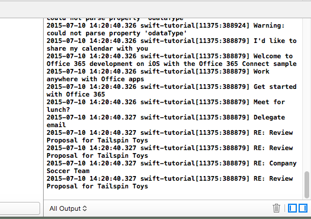

## Displaying the results

Let's add a table view to our app to display the list of messages. Switch to **Main.storyboard**. In the Object library, locate **Table View**. Drag **Table View** onto the **Mail** scene, just below the login button. Then click the **Add New Constraints** button in the lower-right corner of the canvas. Set the left, right, and bottom constraint values to 0 and click **Add 3 Constraints**.

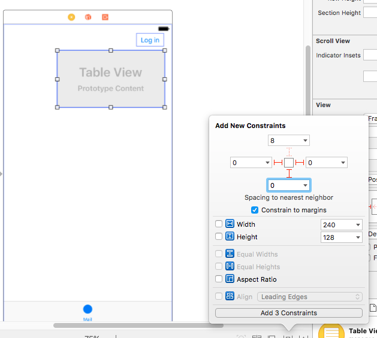

That adds the table view and sets it to cover the entire screen. Now we need to layout how each cell of the table will appear. With the table view selected, click the **Attributes inspector** and set the value of **Prototype Cells** to 1.

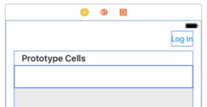

In the Object library, locate **Label**. Drag **Label** onto the prototype cell in the table view, then double-click it and change the text to `From`. Add two more labels, one with text `Received` and one with text `Subject`.

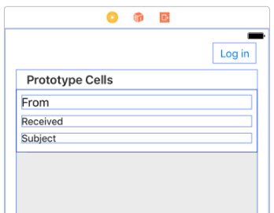

Once you have the labels added, select **Mail** in the Document outline. On the **Editor** menu, choose **Resolve Auto Layout Issues**, then **Add Missing Constraints**, followed by **Reset to Suggested Constraints**.

Now, let's add a custom class for the table view cells.

1. In the Project navigator, CTRL + click the `swift-tutorial` folder and choose **New File**. Select **Swift File** (under iOS/Source) and click **Next**. Enter `MessageCell` in the **Save As** field and click **Create**.
1. Add the following code to create a simple structure to represent a message.

    ```Swift
    import UIKit
    import SwiftyJSON

    struct Message {
        let from: String
        let received: String
        let subject: String
    }
    ```
1. Now add the following code to create a class that inherits from `UITableViewCell`.

    ```Swift
    class MessageCell: UITableViewCell {
        @IBOutlet weak var fromLabel: UILabel!
        @IBOutlet weak var receivedLabel: UILabel!
        @IBOutlet weak var subjectLabel: UILabel!

        var from: String? {
            didSet {
                fromLabel.text = from
            }
        }

        var received: String? {
            didSet {
                receivedLabel.text = received
            }
        }

        var subject: String? {
            didSet {
                subjectLabel.text = subject
            }
        }
    }
    ```
1. Finally, add the following code to create a class that can be used as a table view's datasource.

    ```Swift
    class MessagesDataSource: NSObject {
        let messages: [Message]

        init(messages: [JSON]?) {
            var msgArray = [Message]()

            if let unwrappedMessages = messages {
                for (message) in unwrappedMessages {
                    let newMsg = Message(
                            from: message["from"]["emailAddress"]["name"].stringValue,
                            received: Formatter.dateToString(date: message["receivedDateTime"]),
                            subject: message["subject"].stringValue)

                    msgArray.append(newMsg)
                }
            }

            self.messages = msgArray
        }
    }

    extension MessagesDataSource: UITableViewDataSource {

        func tableView(_ tableView: UITableView, numberOfRowsInSection section: Int) -> Int {
            return messages.count
        }

        func tableView(_ tableView: UITableView, cellForRowAt indexPath: IndexPath) -> UITableViewCell {
            let cell = tableView.dequeueReusableCell(withIdentifier: String(describing: MessageCell.self)) as! MessageCell
            let message = messages[indexPath.row]
            cell.from = message.from
            cell.received = message.received
            cell.subject = message.subject
            return cell
        }
    }
    ```

That code uses a custom `Formatter` class to format the date value returned from the API into a more human-friendly format. Let's implement that class.

1. In the Project navigator, CTRL + click the `swift-tutorial` folder and choose **New File**. Select **Swift File** (under iOS/Source) and click **Next**. Enter `Formatter` in the **Save As** field and click **Create**.
1. Add the following code.

    ```Swift
    import SwiftyJSON

    class Formatter {
        class func dateToString(date: JSON) -> String {
            let graphDateString = date.stringValue
            if (graphDateString.isEmpty) {
                return ""
            }

            let toDateFormatter = DateFormatter()
            toDateFormatter.dateFormat = "yyyy-MM-dd'T'HH:mm:ssZ"

            let dateObj = toDateFormatter.date(from: graphDateString)
            if (dateObj == nil) {
                return ""
            }

            let toStringFormatter = DateFormatter()
            toStringFormatter.dateStyle = DateFormatter.Style.medium
            toStringFormatter.timeStyle = DateFormatter.Style.short
            toStringFormatter.timeZone = TimeZone.current

            return toStringFormatter.string(from: dateObj!)
        }
    }
    ```

Now let's associate this class with the view, and connect the labels to the `IBOutlet` variables in the class.

1. Switch to **Main.storyboard** and select the prototype cell in the table view.
1. On the **Identity inspector**, change the **Class** value to `MessageCell`.
1. On the **Attribute inspector**, set the **Identifier** to `MessageCell`.
1. On the **Connections inspector**, under **Outlets**, you should see the `fromLabel`, `receivedLabel`, and `subjectLabel` properties from the `MessageCell` class. Drag the small circle next to each of these properties onto the corresponding label on the view.

    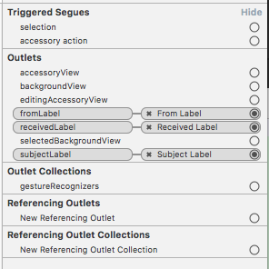

Now let's update the `MailViewController` class to update the view.

1. In **MailViewController.swift**, add the following members to the class.

    ```Swift
    @IBOutlet weak var tableView: UITableView!
    var dataSource: MessagesDataSource?
    ```

1. Replace the existing `loadUserData` with the following, which replaces the `for-in` loop with code to create a new `MessagesDataSource` and refresh the table.

    ```Swift
    func loadUserData() {
        service.getUserEmail() {
            email in
            if let unwrappedEmail = email {
                NSLog("Hello \(unwrappedEmail)")

                self.service.getInboxMessages() {
                    messages in
                    if let unwrappedMessages = messages {
                        self.dataSource = MessagesDataSource(messages: unwrappedMessages["value"].arrayValue)
                        self.tableView.dataSource = self.dataSource
                        self.tableView.reloadData()
                    }
                }
            }
        }
    }
    ```
1. Add the following lines to `viewDidLoad`, after the `super.viewDidLoad()` line.

    ```Swift
    tableView.estimatedRowHeight = 90;
    tableView.rowHeight = UITableViewAutomaticDimension
    ```

The last thing we need to do is connect the `IBOutlet` we added to the view controller to the table view. Switch to **Main.storyboard** and select **Mail** in the Document outline. On the **Connections inspector**, you should see the `tableView` property. Drag the small circle next to it onto the table view.

Now if you run the app, you should get a table of messages that you can scroll through.

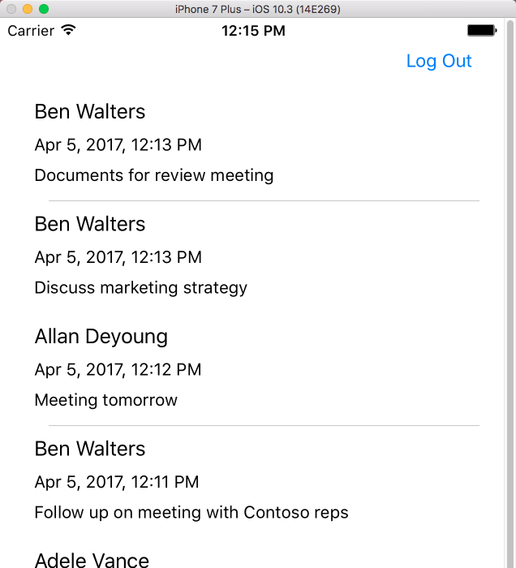

## Adding Calendar and Contacts APIs

Now that you've mastered getting Outlook Mail from the Graph, doing the same for Calendar and Contacts APIs is similar and easy.

> [!TIP]
> If you've followed along with the tutorial, you probably have an access token saved in your keychain. That token will only be valid for the `Mail.Read` scope. In order to call the Calendar or Contacts API, we will need to add new scopes. Be sure sign out of the app to get rid of the saved tokens so that you can start the login process from the beginning to get a new access token.

### For Calendar API:

#### Add a function to get events

1. Switch to **OutlookService.swift**.
1. Update the `scope` value in the `oauth2Settings` dictionary to include the `Calendars.Read` scope.

    ```Swift
    "scope": "openid profile offline_access User.Read Mail.Read Calendars.Read",
    ```
1. Add the following function to the `OutlookService` class.

    ```Swift
    func getEvents(callback: @escaping (JSON?) -> Void) -> Void {
        let apiParams = [
            "$select": "subject,start,end",
            "$orderby": "start/dateTime ASC",
            "$top": "10"
        ]

        makeApiCall(api: "/v1.0/me/events", params: apiParams) {
            result in
            callback(result)
        }
    }
    ```

#### Add a formatter for the start and end times

The `start` and `end` properties on an event are of type [dateTimeTimeZone](/graph/api/resources/datetimetimezone?view=graph-rest-1.0), which is formatted a little differently than other dates. Let's add another function to the `Formatter` class to handle this.

1. Switch to **Formatter.swift**.
1. Add the following function.

    ```Swift
    class func dateTimeTimeZoneToString(date: JSON) -> String {
        let graphTimeZone = date["timeZone"].stringValue
        let graphDateString = date["dateTime"].stringValue
        if (graphDateString.isEmpty) {
            return ""
        }

        let toDateFormatter = DateFormatter()
        toDateFormatter.dateFormat = "yyyy-MM-dd'T'HH:mm:ss.sss"
        toDateFormatter.timeZone = TimeZone(identifier: graphTimeZone)

        let dateObj = toDateFormatter.date(from: graphDateString)
        if (dateObj == nil) {
            return ""
        }

        let toStringFormatter = DateFormatter()
        toStringFormatter.dateStyle = DateFormatter.Style.medium
        toStringFormatter.timeStyle = DateFormatter.Style.short
        toStringFormatter.timeZone = TimeZone.current

        return toStringFormatter.string(from: dateObj!)
    }
    ```

#### Add the Event table cell custom class

1. In the Project navigator, CTRL + click the `swift-tutorial` folder and choose **New File**. Select **Swift File** (under iOS/Source) and click **Next**. Enter `EventCell` in the **Save As** field and click **Create**.
1. Add the following code.

    ```Swift
    import UIKit
    import SwiftyJSON

    struct Event {
        let subject: String
        let start: String
        let end: String
    }

    class EventCell: UITableViewCell {
        @IBOutlet weak var subjectLabel: UILabel!
        @IBOutlet weak var startLabel: UILabel!
        @IBOutlet weak var endLabel: UILabel!

        var subject: String? {
            didSet {
                subjectLabel.text = subject
            }
        }

        var start: String? {
            didSet {
                startLabel.text = start
            }
        }

        var end: String? {
            didSet {
                endLabel.text = end
            }
        }
    }

    class EventsDataSource: NSObject {
        let events: [Event]

        init(events: [JSON]?) {
            var evtArray = [Event]()

            if let unwrappedEvents = events {
                for (event) in unwrappedEvents {
                    let newEvent = Event(
                        subject: event["subject"].stringValue,
                        start: Formatter.dateTimeTimeZoneToString(date: event["start"]),
                        end: Formatter.dateTimeTimeZoneToString(date: event["end"]))

                    evtArray.append(newEvent)
                }
            }

            self.events = evtArray
        }
    }

    extension EventsDataSource: UITableViewDataSource {

        func tableView(_ tableView: UITableView, numberOfRowsInSection section: Int) -> Int {
            return events.count
        }

        func tableView(_ tableView: UITableView, cellForRowAt indexPath: IndexPath) -> UITableViewCell {
            let cell = tableView.dequeueReusableCell(withIdentifier: String(describing: EventCell.self)) as! EventCell
            let event = events[indexPath.row]
            cell.subject = event.subject
            cell.start = event.start
            cell.end = event.end
            return cell
        }
    }
    ```

#### Implement the view controller

1. In the Project navigator, expand **swift-tutorial**->**swift-tutorial**, then select **SecondViewController.swift**.
1. Open the **File inspector** and change the file name to `CalendarViewController.swift`.
1. Replace the file contents with the following.

    ```Swift
    import UIKit

    class CalendarViewController: UIViewController {

        @IBOutlet weak var tableView: UITableView!

        var dataSource:EventsDataSource?

        let service = OutlookService.shared()

        func loadUserData() {
            service.getUserEmail() {
                email in
                if let unwrappedEmail = email {
                    NSLog("Hello \(unwrappedEmail)")

                    self.service.getEvents() {
                        events in
                        if let unwrappedEvents = events {
                            self.dataSource = EventsDataSource(events: unwrappedEvents["value"].arrayValue)
                            self.tableView.dataSource = self.dataSource
                            self.tableView.reloadData()
                        }
                    }
                }
            }
        }

        override func viewDidLoad() {
            super.viewDidLoad()
            // Do any additional setup after loading the view, typically from a nib.
            tableView.estimatedRowHeight = 90;
            tableView.rowHeight = UITableViewAutomaticDimension

            if (service.isLoggedIn) {
                loadUserData()
            }
        }

        override func didReceiveMemoryWarning() {
            super.didReceiveMemoryWarning()
            // Dispose of any resources that can be recreated.
        }
    }
    ```

#### Add the Calendar UI

1. Select **Main.storyboard** in the Project navigator. In the document outline, expand **Second Scene**, then select **Second**.
1. Open the **Attributes inspector** and change the **Title** to `Calendar`.
1. Open the **Identity inspector** and change the **Class** to `CalendarViewController`.
1. Expand **View** and delete the **Second View** and **Loaded by SecondViewController** labels.
1. Select the **Second** bar item at the bottom of the view. On the **Attributes inspector**, change the **Title** to `Calendar`.
1. In the Object library, locate **Table View**. Drag **Table View** onto the **Calendar** scene. Then click the **Add New Constraints** button in the lower-right corner of the canvas. Set the left, right, top, and bottom constraint values to 0 and click **Add 4 Constraints**.
1. With the table view selected, click the **Attributes inspector** and set the value of **Prototype Cells** to 1.
1. In the Object library, locate **Label**. Drag **Label** onto the prototype cell in the table view, then double-click it and change the text to `Subject`. Add two more labels, one with text `Start` and one with text `End`.
1. Once you have the labels added, select **Calendar** in the Document outline. On the **Editor** menu, choose **Resolve Auto Layout Issues**, then **Add Missing Constraints**, followed by **Reset to Suggested Constraints**.
1. Select **Calendar** in the Document outline. On the **Connections inspector**, drag the small circle beside `tableView` (under **Outlets**) to the table view on the storyboard.
1. Select **EventCell** in the Document outline. On the **Connections inspector**, drag the small circle beside `subjectLabel`, `startLabel`, and `endLabel` (under **Outlets**) to their respective labels on the storyboard.

Run the app. Be sure to logout and log back in to acquire the new scope.

### For Contacts API:

#### Add a function to get contacts

1. Switch to **OutlookService.swift**.
1. Update the `scope` value in the `oauth2Settings` dictionary to include the `Contacts.Read` scope.

    ```Swift
    "scope": "openid profile offline_access User.Read Mail.Read Contacts.Read",
    ```
1. Add the following function to the `OutlookService` class.

    ```Swift
    func getContacts(callback: @escaping (JSON?) -> Void) -> Void {
        let apiParams = [
            "$select": "givenName,surname,emailAddresses",
            "$orderby": "givenName ASC",
            "$top": "10"
        ]

        makeApiCall(api: "/v1.0/me/contacts", params: apiParams) {
            result in
            callback(result)
        }
    }
    ```

#### Add the Contact table cell custom class

1. In the Project navigator, CTRL + click the `swift-tutorial` folder and choose **New File**. Select **Swift File** (under iOS/Source) and click **Next**. Enter `ContactCell` in the **Save As** field and click **Create**.
1. Add the following code.

    ```Swift
    import UIKit
    import SwiftyJSON

    struct Contact {
        let givenName: String
        let surname: String
        let email: String
    }

    class ContactCell: UITableViewCell {
        @IBOutlet weak var nameLabel: UILabel!
        @IBOutlet weak var emailLabel: UILabel!

        var givenName: String? {
            didSet {
                nameLabel.text = givenName! + " " + (surname ?? "")
            }
        }

        var surname: String? {
            didSet {
                nameLabel.text = (givenName ?? "") + " " + surname!
            }
        }

        var email: String? {
            didSet {
                emailLabel.text = email
            }
        }
    }

    class ContactsDataSource: NSObject {
        let contacts: [Contact]

        init(contacts: [JSON]?) {
            var ctctArray = [Contact]()

            if let unwrappedContacts = contacts {
                for (contact) in unwrappedContacts {
                    let newContact = Contact(
                        givenName: contact["givenName"].stringValue,
                        surname: contact["surname"].stringValue,
                        email: contact["emailAddresses"][0]["address"].stringValue)

                    ctctArray.append(newContact)
                }
            }

            self.contacts = ctctArray
        }
    }

    extension ContactsDataSource: UITableViewDataSource {

        func tableView(_ tableView: UITableView, numberOfRowsInSection section: Int) -> Int {
            return contacts.count
        }

        func tableView(_ tableView: UITableView, cellForRowAt indexPath: IndexPath) -> UITableViewCell {
            let cell = tableView.dequeueReusableCell(withIdentifier: String(describing: ContactCell.self)) as! ContactCell
            let contact = contacts[indexPath.row]
            cell.givenName = contact.givenName
            cell.surname = contact.surname
            cell.email = contact.email
            return cell
        }
    }
    ```

#### Implement the view controller

1. In the Project navigator, expand **swift-tutorial**->**swift-tutorial**, then select **SecondViewController.swift**.
1. Open the **File inspector** and change the file name to `ContactsViewController.swift`.
1. Replace the file contents with the following.

    ```Swift
    import UIKit

    class ContactsViewController: UIViewController {

        @IBOutlet weak var tableView: UITableView!

        var dataSource: ContactsDataSource?

        let service = OutlookService.shared()

        func loadUserData() {
            service.getUserEmail() {
                email in
                if let unwrappedEmail = email {
                    NSLog("Hello \(unwrappedEmail)")

                    self.service.getContacts() {
                        contacts in
                        if let unwrappedContacts = contacts {
                            self.dataSource = ContactsDataSource(contacts: unwrappedContacts["value"].arrayValue)
                            self.tableView.dataSource = self.dataSource
                            self.tableView.reloadData()
                        }
                    }
                }
            }
        }

        override func viewDidLoad() {
            super.viewDidLoad()
            // Do any additional setup after loading the view, typically from a nib.
            tableView.estimatedRowHeight = 90;
            tableView.rowHeight = UITableViewAutomaticDimension

            if (service.isLoggedIn) {
                loadUserData()
            }
        }

        override func didReceiveMemoryWarning() {
            super.didReceiveMemoryWarning()
            // Dispose of any resources that can be recreated.
        }
    }
    ```

#### Add the Calendar UI

1. Select **Main.storyboard** in the Project navigator. In the document outline, expand **Second Scene**, then select **Second**.
1. Open the **Attributes inspector** and change the **Title** to `Contacts`.
1. Open the **Identity inspector** and change the **Class** to `ContactsViewController`.
1. Expand **View** and delete the **Second View** and **Loaded by SecondViewController** labels.
1. Select the **Second** bar item at the bottom of the view. On the **Attributes inspector**, change the **Title** to `Contacts`.
1. In the Object library, locate **Table View**. Drag **Table View** onto the **Contacts** scene. Then click the **Add New Constraints** button in the lower-right corner of the canvas. Set the left, right, top, and bottom constraint values to 0 and click **Add 4 Constraints**.
1. With the table view selected, click the **Attributes inspector** and set the value of **Prototype Cells** to 1.
1. In the Object library, locate **Label**. Drag **Label** onto the prototype cell in the table view, then double-click it and change the text to `Name`. Add another label with text `Email`.
1. Once you have the labels added, select **Contacts** in the Document outline. On the **Editor** menu, choose **Resolve Auto Layout Issues**, then **Add Missing Constraints**, followed by **Reset to Suggested Constraints**.
1. Select **Contacts** in the Document outline. On the **Connections inspector**, drag the small circle beside `tableView` (under **Outlets**) to the table view on the storyboard.
1. Select **ContactCell** in the Document outline. On the **Connections inspector**, drag the small circle beside `nameLabel` and `emailLabel` (under **Outlets**) to their respective labels on the storyboard.

Run the app. Be sure to logout and log back in to acquire the new scope.
