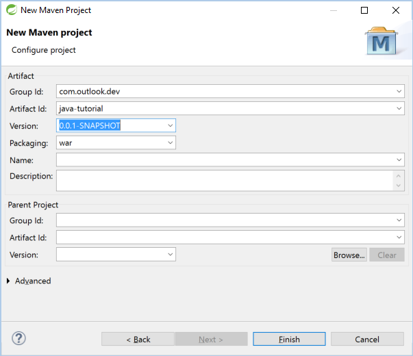
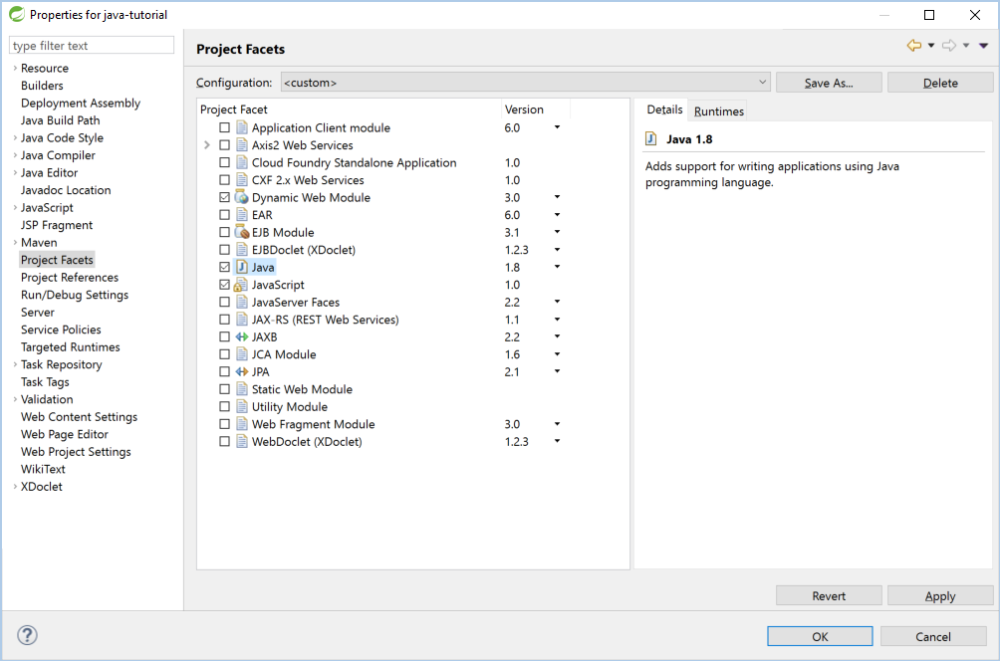

# Write a Java Spring MVC Web app to get Outlook mail

The purpose of this guide is to walk through the process of creating a simple Java Spring MVC app that retrieves messages in Office 365 or Outlook.com. The source code in this <a href="https://github.com/jasonjoh/java-tutorial">repository</a> is what you should end up with if you follow the steps outlined here.

This guide will use the [Microsoft Graph](https://developer.microsoft.com/en-us/graph/) to access Outlook mail. Microsoft recommends using the Microsoft Graph to access Outlook mail, calendar, and contacts. You should use the Outlook APIs directly (via `https://outlook.office.com/api`) only if you require a feature that is not available on the Graph endpoints. For a version of this sample that uses the Outlook APIs, see [this branch](https://github.com/jasonjoh/java-tutorial/tree/outlook-api).

### Before you begin

You need to install the [Java SE Development Kit (JDK)](https://www.oracle.com/technetwork/java/javase/downloads/index-jsp-138363.html#javasejdk). This guide was written with JDK 8 Update 92.

If you want to follow along exactly, download [Spring Tool Suite](https://spring.io/tools/sts). This guide was written with version 3.7.3.RELEASE. You can use any IDE you want, but you might have to do some steps differently.

> [!IMPORTANT]
> You must install the version of Spring Tool Suite (either 64-bit or 32-bit) that corresponds to the version of the JDK you installed. For example, if you install the 64-bit JDK, install the 64-bit version of Spring Tool Suite.

### Spring Tool Suite setup

If this is your first time using Spring Tool Suite, you should complete the following steps to configure it to work with your downloaded JDK, and to make adding dependencies with Maven easier.

1. Launch Spring Tool Suite. On the **Window** menu, choose **Preferences**.

1. Expand **Java** and select **Installed JREs**. Click **Add**.

1. Choose **Standard VM** and click **Next**.

1. Click the **Directory** button next to **JRE home**. Browse to the directory where you installed the JDK. Click **Finish**.

  
1. In the list of **Installed JREs**, make sure that the entry you just added is checked, making it the default. Click **OK**.

1. On the **Window** menu, choose **Show View**, then **Other**. Choose **Maven Repositories** from the list of views and click **OK**.

1. In the **Maven Repositories** window, expand **Global Repositories**. Right-click the **central** item there and choose **Rebuild Index**. This takes a few minutes, so let it complete before continuing.

## Create the app

In Spring Tool Suite, on the **File** menu, choose **New**, then **Other**. In the list of wizards, expand **Maven**, then choose **Maven Project**. Click **Next**.

Check the **Create a simple project (skip archetype selection)** checkbox and click **Next**.

Enter `com.outlook.dev` for **Group Id**, and `java-tutorial` for **Artifact Id**. Change **Packaging** to `war`. Click **Finish**.



In **Project Explorer**, right-click the project and choose **Properties**. Select **Java Build Path**, then select the **Libraries** tab. If the version of the **JRE System Library** does not match the version of the JDK you installed, do the following:

1. Select the **JRE System Library** and click **Remove**. 

1. Click **Add Library**. Choose **JRE System Library** and click **Next**.

1. Select **Workspace default JRE** and click **Finish**.

  
  
1. Click **OK**.

Right-click the project and choose **Properties**. Select **Project Facets**. Change the version of **Dynamic Web Module** to `3.0`. Change the version of **Java** to `1.8`.



Click **OK**. In order to force Spring Tool Suite to recognize the facet changes, we need to close and reopen the project. Right-click the project and choose **Close Project**. Then double-click (or right-click and choose **Open Project**) to reopen the project.

In **Project Explorer** right-click the **Deployment Descriptor: java-tutorial** item and choose **Generate Deployment Descriptor Stub**.

Now let's configure the project to build with Maven and run on a local test server. To do this, let's add some plugins in `pom.xml`. Open `pom.xml`, then click the **pom.xml** tab at the bottom of the window to view the raw XML. Add the following code immediately after the `<packaging>war</packaging>` line:

```xml
<build>
  <plugins>
    <plugin>
      <groupId>org.eclipse.jetty</groupId>
      <artifactId>jetty-maven-plugin</artifactId>
      <version>9.3.8.v20160314</version>
    </plugin>
    <plugin>
      <groupId>org.apache.maven.plugins</groupId>
      <artifactId>maven-compiler-plugin</artifactId>
      <version>3.5.1</version>
      <configuration>
        <source>1.8</source>
        <target>1.8</target>
      </configuration>
    </plugin>
  </plugins>
</build>
```

This code adds the [Jetty server maven plugin](https://www.eclipse.org/jetty/documentation/current/jetty-maven-plugin.html), which runs your project on an embedded Jetty web server at http://localhost:8080. It also adds the Maven compiler plugin.

Save the file. Right-click the project in **Project Explorer** and choose **Maven**, then **Update Project**. Click **OK**.

Now let's make sure it works. Right-click the project and choose **Run as**, then **Maven build**. In the **Goals** field, enter `jetty:run`, then click **Run**. In the **Console** view, you should see output from the Maven build process. Assuming nothing goes wrong, you should eventually see `[INFO] Started Jetty Server`. Open a browser and browse to http://localhost:8080. Because there is no content there, you should see something like this:


### Add Spring and Apache Tiles

Now let's add the [Spring Framework](https://projects.spring.io/spring-framework/) and [Apache Tiles](https://tiles.apache.org/). The Spring Framework will simplify our web app development and give us an MVC-based environment, and Apache Tiles will enable our pages to reuse a standard layout.

In `pom.xml`, add the following lines after the `</build>` line:

```xml
<properties>
  <org.springframework.version>4.2.5.RELEASE</org.springframework.version>
  <apache.tiles.version>3.0.5</apache.tiles.version>
</properties>

<dependencyManagement>
  <dependencies>
    <dependency>
      <groupId>org.springframework</groupId>
      <artifactId>spring-framework-bom</artifactId>
      <version>${org.springframework.version}</version>
      <type>pom</type>
      <scope>import</scope>
    </dependency>
  </dependencies>
</dependencyManagement>

<dependencies>
  <dependency>
    <groupId>javax.servlet</groupId>
    <artifactId>javax.servlet-api</artifactId>
    <version>4.0.0-b01</version>
    <scope>provided</scope>
  </dependency>
  
  <dependency>
    <groupId>javax.servlet.jsp</groupId>
    <artifactId>javax.servlet.jsp-api</artifactId>
    <version>2.3.2-b02</version>
    <scope>provided</scope>
  </dependency>
  
  <dependency>
    <groupId>jstl</groupId>
    <artifactId>jstl</artifactId>
    <version>1.2</version>
  </dependency>
  
  <dependency>
    <groupId>org.springframework</groupId>
    <artifactId>spring-core</artifactId>
  </dependency>

  <dependency>
    <groupId>org.springframework</groupId>
    <artifactId>spring-expression</artifactId>
  </dependency>

  <dependency>
    <groupId>org.springframework</groupId>
    <artifactId>spring-beans</artifactId>
  </dependency>

  <dependency>
    <groupId>org.springframework</groupId>
    <artifactId>spring-aop</artifactId>
  </dependency>

  <dependency>
    <groupId>org.springframework</groupId>
    <artifactId>spring-context</artifactId>
  </dependency>

  <dependency>
    <groupId>org.springframework</groupId>
    <artifactId>spring-context-support</artifactId>
  </dependency>

  <dependency>
    <groupId>org.springframework</groupId>
    <artifactId>spring-tx</artifactId>
  </dependency>

  <dependency>
    <groupId>org.springframework</groupId>
    <artifactId>spring-jdbc</artifactId>
  </dependency>

  <dependency>
    <groupId>org.springframework</groupId>
    <artifactId>spring-orm</artifactId>
  </dependency>

  <dependency>
    <groupId>org.springframework</groupId>
    <artifactId>spring-oxm</artifactId>
  </dependency>

  <dependency>
    <groupId>org.springframework</groupId>
    <artifactId>spring-web</artifactId>
  </dependency>
  
  <dependency>
    <groupId>org.springframework</groupId>
    <artifactId>spring-webmvc</artifactId>
  </dependency>

  <dependency>
    <groupId>org.springframework</groupId>
    <artifactId>spring-webmvc-portlet</artifactId>
  </dependency>
  
  <dependency>
    <groupId>org.apache.tiles</groupId>
    <artifactId>tiles-core</artifactId>
    <version>${apache.tiles.version}</version>
  </dependency>
  
  <dependency>
    <groupId>org.apache.tiles</groupId>
    <artifactId>tiles-jsp</artifactId>
    <version>${apache.tiles.version}</version>
  </dependency>
  
  <dependency>
    <groupId>org.slf4j</groupId>
    <artifactId>slf4j-log4j12</artifactId>
    <version>1.7.21</version>
  </dependency>
</dependencies>
```

Save the file. Right-click the project in **Project Explorer** and choose **Maven**, then **Update Project**. Click **OK**.

Now let's create the basic project structure and make sure that it is working. In **Project Explorer**, expand **Deployed Resources**, then **webapp**, and **WEB-INF**. Open the `web.xml` file, and add the following code after the `</welcome-file-list>` line:

```xml
<servlet>
  <servlet-name>dispatcher</servlet-name>
  <servlet-class>org.springframework.web.servlet.DispatcherServlet</servlet-class>
  <load-on-startup>1</load-on-startup>
</servlet>

<servlet-mapping>
  <servlet-name>dispatcher</servlet-name>
  <url-pattern>*.html</url-pattern>
  <url-pattern>*.htm</url-pattern>
  <url-pattern>*.json</url-pattern>
  <url-pattern>*.xml</url-pattern>
</servlet-mapping>
```

Right-click the **WEB-INF** folder and choose **New**, then **Other**. In the list of wizards, expand **Spring**, then choose **Spring Bean Configuration File** and click **Next**. Name the file `dispatcher-servlet.xml` and click **Finish**. The file should be created and opened for you.

Click the **Namespaces** tab in the bottom toolbar. Select the `context` namespace, then click the **Source** tab.


Add the following code inside the `<beans>` element:

```xml
<context:component-scan base-package="com.outlook.dev.controller"></context:component-scan>

<bean id="tilesConfigurer"
  class="org.springframework.web.servlet.view.tiles3.TilesConfigurer">
  <property name="definitions">
    <list>
      <value>/WEB-INF/defs/pages.xml</value>
    </list>
  </property>
</bean>

<bean id="viewResolver"
  class="org.springframework.web.servlet.view.UrlBasedViewResolver">
  <property name="viewClass"
    value="org.springframework.web.servlet.view.tiles3.TilesView" />
</bean>
```

This tells the Spring Framework where to find the controllers for the app, enables Apache Tiles, and sets where page definitions are stored (in `pages.xml`). Let's create the `pages.xml` file. Right-click the **WEB-INF** folder and choose **New**, then **Folder**. Name the folder `defs` and click **Finish**. Right-click the **defs** folder and choose **New**, then **File**. Name the file `pages.xml` and click **Finish**. Enter the following code in the file and save it.

```xml
<?xml version="1.0" encoding="ISO-8859-1" ?>
<!DOCTYPE tiles-definitions PUBLIC
       "-//Apache Software Foundation//DTD Tiles Configuration 3.0//EN"
       "http://tiles.apache.org/dtds/tiles-config_3_0.dtd">
<tiles-definitions>
  <definition name="common" template="/WEB-INF/layout/base.jsp" />
  
  <definition name="index" extends="common">
    <put-attribute name="title" value="Java Mail API Tutorial" />
    <put-attribute name="body" value="/WEB-INF/jsp/index.jsp" />
    <put-attribute name="current" value="index" />
  </definition>
</tiles-definitions>
```

Now let's create the base layout. Right-click the **WEB-INF** folder and choose **New**, then **Folder**. Name the folder `layout` and click **Finish**. Right-click the **layout** folder and choose **New**, then **JSP File**. Name the file `base.jsp` and click **Finish**. Replace the entire contents of `base.jsp` with the following code:

```jsp
<%@ page language="java" contentType="text/html; charset=UTF-8" pageEncoding="UTF-8"%>
<%@ taglib uri="http://tiles.apache.org/tags-tiles" prefix="tiles" %>
<%@ taglib uri="http://www.springframework.org/tags" prefix="spring" %>
<%@ taglib uri="http://tiles.apache.org/tags-tiles-extras" prefix="tilesx" %>
<%@ taglib uri="http://java.sun.com/jsp/jstl/core" prefix="c" %>
<!DOCTYPE html>
<html>
<head>
  <meta http-equiv="Content-Type" content="text/html; charset=UTF-8">
  <title><tiles:getAsString name="title"></tiles:getAsString></title>
  
  <link rel="stylesheet" href="//maxcdn.bootstrapcdn.com/bootstrap/3.3.6/css/bootstrap.min.css">
  <link rel="stylesheet" href="//maxcdn.bootstrapcdn.com/bootstrap/3.3.6/css/bootstrap-theme.min.css">
  
  <script src="//ajax.aspnetcdn.com/ajax/jQuery/jquery-2.2.3.min.js"></script>
  <script src="//maxcdn.bootstrapcdn.com/bootstrap/3.3.6/js/bootstrap.min.js"></script>
</head>
<body>
  <tilesx:useAttribute name="current" />
  <div class="container">

    <!-- Static navbar -->
    <nav class="navbar navbar-default">
      <div class="container-fluid">
        <div class="navbar-header">
          <button type="button" class="navbar-toggle collapsed"
            data-toggle="collapse" data-target="#navbar" aria-expanded="false"
            aria-controls="navbar">
            <span class="sr-only">Toggle navigation</span> <span
              class="icon-bar"></span> <span class="icon-bar"></span> <span
              class="icon-bar"></span>
          </button>
          <a class="navbar-brand" href="<spring:url value="/" />">Java Outlook Tutorial</a>
        </div>
        <div id="navbar" class="navbar-collapse collapse">
          <ul class="nav navbar-nav">
            <li class="${current == 'index' ? 'active' : '' }">
              <a href="<spring:url value="/" />">Home</a>
            </li>
            <c:if test="${userConnected eq true}">
              <li class="${current == 'mail' ? 'active' : '' }">
                <a href="<spring:url value="/mail.html" />">Mail</a>
              </li>
            </c:if>
          </ul>
          <c:if test="${userConnected eq true}">
            <p class="navbar-text navbar-right">Signed in as ${userName}</p>
            <ul class="nav navbar-nav navbar-right">
              <li>
                <a href="<spring:url value="/logout.html" />">Logout</a>
              </li>
            </ul>
          </c:if>
        </div>
      </div>
    </nav>

    <tiles:insertAttribute name="body" />
  </div>
</body>
</html>
```

Let's create a test page for verification purposes. Right-click the **WEB-INF** folder and choose **New**, then **Folder**. Name the folder `jsp` and click **Finish**. Right-click the **jsp** folder and choose **New**, then **JSP File**. Name the file `index.jsp` and click **Finish**. Replace the entire contents of `index.jsp` with the following code:

```jsp
<%@ page language="java" contentType="text/html; charset=UTF-8" pageEncoding="UTF-8"%>
  
<h1>Hello World</h1>
```

Now let's create an empty HTML file in the root. This is required so that the embedded Jetty server will properly invoke our dispatcher servlet. In **Project Explorer**, expand **src**, then **main**. Right-click the **webapp** folder and choose **New**, then **HTML File**. Name the file `index.html` and click **Finish**. Remove all markup from the file and save it.

Now let's create a controller. Right-click the project and choose **New**, then **Class**. Enter `com.outlook.dev.controller` for the **Package** and `IndexController` for the **Name** and click **Finish**. Replace the entire contents of `IndexController.java` with the following code:

```java
package com.outlook.dev.controller;

import org.springframework.stereotype.Controller;
import org.springframework.web.bind.annotation.RequestMapping;

@Controller
public class IndexController {

  @RequestMapping("/index")
  public String index() {
    // Name of a definition in WEB-INF/defs/pages.xml
    return "index";
  }
}
```

Save all of the files and restart the app. Now if you browse to http://localhost:8080, you should see the following:


Now that we have the environment ready, we're ready to start coding!

## Designing the app

Our app will be very simple. When a user visits the site, they will see a button to log in and view their email. Clicking that button will take them to the Azure login page where they can login with their Office 365 or Outlook.com account and grant access to our app. Finally, they will be redirected back to our app, which will display a list of the most recent email in the user's inbox.

Let's begin by creating the homepage. Open the `index.jsp` you created earlier, and replace the entire contents with the following:

```jsp
<%@ page language="java" contentType="text/html; charset=UTF-8" pageEncoding="UTF-8"%>
<%@ taglib uri="http://www.springframework.org/tags" prefix="spring" %>
<%@ taglib uri="http://java.sun.com/jsp/jstl/core" prefix="c" %>

<c:if test="${error ne null}">
  <div class="alert alert-danger">${error}</div>
</c:if>
<div class="jumbotron">
  <h1>Java Web App Tutorial</h1>
  <p>This sample uses the Mail API to read messages in your inbox.</p>
  <p><a class="btn btn-lg btn-primary" href="<spring:url value="${loginUrl}" />">Click here to login</a></p>
</div>
```

Now we have a login button. It doesn't do anything yet, but that's about to change.

## Register the app

[!include[App Registration Intro](~/includes/rest/app-registration-intro.md)]

Head over to the [Application Registration Portal](https://apps.dev.microsoft.com/) to quickly get an application ID and secret. 

1. Using the **Sign in** link, sign in with either your Microsoft account (Outlook.com), or your work or school account (Office 365).
1. Click the **Add an app** button. Enter `java-tutorial` for the name and click **Create application**. 
1. Locate the **Application Secrets** section, and click the **Generate New Password** button. Copy the password now and save it to a safe place. Once you've copied the password, click **Ok**.
1. Locate the **Platforms** section, and click **Add Platform**. Choose **Web**, then enter `http://localhost:8080/authorize.html` under **Redirect URIs**.
1. Click **Save** to complete the registration. Copy the **Application Id** and save it along with the password you copied earlier. We'll need those values soon.

Here's what the details of your app registration should look like when you are done.


## Implementing OAuth2

Our goal in this section is to make the link on our home page initiate the [OAuth2 Authorization Code Grant flow with Azure AD](https://msdn.microsoft.com/en-us/library/azure/dn645542.aspx).

In **Project Explorer**, expand **Java Resources**. Right-click **src/main/resources** and choose **New**, then **Other**. Expand **General** and choose **File**. Name the file `auth.properties` and click **Finish**. Add the following lines to the file, replacing `YOUR_APP_ID_HERE` with your application ID, and `YOUR_APP_PASSWORD_HERE` with your application password.

```INI
appId=YOUR_APP_ID_HERE
appPassword=YOUR_APP_PASSWORD_HERE
redirectUrl=http://localhost:8080/authorize.html
```

Now let's create a class to handle the authentication work. Right-click the project and choose **New**, then **Class**. Change the value of **Package** to `com.outlook.dev.auth`, and name the class `AuthHelper`, then click **Finish**. Replace the entire contents of the `AuthHelper.java` file with the following code:

```java
package com.outlook.dev.auth;

import java.io.FileNotFoundException;
import java.io.IOException;
import java.io.InputStream;
import java.util.Properties;
import java.util.UUID;

import org.springframework.web.util.UriComponentsBuilder;

public class AuthHelper {
  private static final String authority = "https://login.microsoftonline.com";
  private static final String authorizeUrl = authority + "/common/oauth2/v2.0/authorize";
  
  private static String[] scopes = { 
    "openid", 
    "offline_access",
    "profile", 
    "User.Read",
    "Mail.Read"
  };
  
  private static String appId = null;
  private static String appPassword = null;
  private static String redirectUrl = null;
  
  private static String getAppId() {
    if (appId == null) {
      try {
        loadConfig();
      } catch (Exception e) {
        return null;
      }
    }
    return appId;
  }
  private static String getAppPassword() {
    if (appPassword == null) {
      try {
        loadConfig();
      } catch (Exception e) {
        return null;
      }
    }
    return appPassword;
  }
  
  private static String getRedirectUrl() {
    if (redirectUrl == null) {
      try {
        loadConfig();
      } catch (Exception e) {
        return null;
      }
    }
    return redirectUrl;
  }
  
  private static String getScopes() {
    StringBuilder sb = new StringBuilder();
    for (String scope: scopes) {
      sb.append(scope + " ");
    }
    return sb.toString().trim();
  }
  
  private static void loadConfig() throws IOException {
    String authConfigFile = "auth.properties";
    InputStream authConfigStream = AuthHelper.class.getClassLoader().getResourceAsStream(authConfigFile);
    
    if (authConfigStream != null) {
      Properties authProps = new Properties();
      try {
        authProps.load(authConfigStream);
        appId = authProps.getProperty("appId");
        appPassword = authProps.getProperty("appPassword");
        redirectUrl = authProps.getProperty("redirectUrl");
      } finally {
        authConfigStream.close();
      }
    }
    else {
      throw new FileNotFoundException("Property file '" + authConfigFile + "' not found in the classpath.");
    }
  }
  
  public static String getLoginUrl(UUID state, UUID nonce) {
    
    UriComponentsBuilder urlBuilder = UriComponentsBuilder.fromHttpUrl(authorizeUrl);
    urlBuilder.queryParam("client_id", getAppId());
    urlBuilder.queryParam("redirect_uri", getRedirectUrl());
    urlBuilder.queryParam("response_type", "code id_token");
    urlBuilder.queryParam("scope", getScopes());
    urlBuilder.queryParam("state", state);
    urlBuilder.queryParam("nonce", nonce);
    urlBuilder.queryParam("response_mode", "form_post");
    
    return urlBuilder.toUriString();
  }
}
```

Now let's update the `index` function in `IndexController.java` to use the `AuthHelper` class to generate a login URL. Add the following `import` statements in `IndexController.java`:

```java
import java.util.UUID;
import javax.servlet.http.HttpServletRequest;
import javax.servlet.http.HttpSession;
import org.springframework.ui.Model;
import com.outlook.dev.auth.AuthHelper;
```

Replace the existing `index` function with this updated version:

```java
@RequestMapping("/index")
public String index(Model model, HttpServletRequest request) {
  UUID state = UUID.randomUUID();
  UUID nonce = UUID.randomUUID();
  
  // Save the state and nonce in the session so we can
  // verify after the auth process redirects back
  HttpSession session = request.getSession();
  session.setAttribute("expected_state", state);
  session.setAttribute("expected_nonce", nonce);
  
  String loginUrl = AuthHelper.getLoginUrl(state, nonce);
  model.addAttribute("loginUrl", loginUrl);
  // Name of a definition in WEB-INF/defs/pages.xml
  return "index";
}
```

Now let's create a new controller to handle the redirect back to our app once the user has authenticated. In **Project Explorer**, expand **Java Resources**, then **src/main/java**. Right-click **com.outlook.dev.controller** and choose **New**, then **Class**. Name the class `AuthorizeController` and click **Finish**. Replace the entire contents of the `AuthorizeController.java` file with the following code:

```java
package com.outlook.dev.controller;

import java.util.UUID;

import javax.servlet.http.HttpServletRequest;
import javax.servlet.http.HttpSession;

import org.springframework.stereotype.Controller;
import org.springframework.web.bind.annotation.RequestMapping;
import org.springframework.web.bind.annotation.RequestMethod;
import org.springframework.web.bind.annotation.RequestParam;

@Controller
public class AuthorizeController {

  @RequestMapping(value="/authorize", method=RequestMethod.POST)
  public String authorize(
      @RequestParam("code") String code, 
      @RequestParam("id_token") String idToken,
      @RequestParam("state") UUID state,
      HttpServletRequest request) { {
    // Get the expected state value from the session
    HttpSession session = request.getSession();
    UUID expectedState = (UUID) session.getAttribute("expected_state");
    UUID expectedNonce = (UUID) session.getAttribute("expected_nonce");
    
    // Make sure that the state query parameter returned matches
    // the expected state
    if (state.equals(expectedState)) {
      session.setAttribute("authCode", code);
      session.setAttribute("idToken", idToken);
    }
    else {
      session.setAttribute("error", "Unexpected state returned from authority.");
    }
    return "mail";
  }
}
```

Finally let's create the `mail` view. Right-click the **jsp** (**Deployed Resources**, **webapp**, **WEB-INF**) folder and choose **New**, then **JSP File**. Name the file `mail.jsp` and click **Finish**.  Replace the entire contents of `mail.jsp` with the following:

```jsp
<%@ page language="java" contentType="text/html; charset=UTF-8" pageEncoding="UTF-8"%>
<%@ taglib uri="http://java.sun.com/jsp/jstl/core" prefix="c" %>

<c:if test="${error ne null}">
  <div class="alert alert-danger">Error: ${error}</div>
</c:if>

<pre><code>Auth code: ${authCode}

ID token: ${idToken}

Access token: ${accessToken}</code></pre>
```

For now, the view is simply going to show us the authorization code and ID token, so we can confirm that our sign-in works. We'll update this later once we add more functionality to our app.

Open the `pages.xml` file (**Deployed Resources**, **webapp**, **WEB-INF**, **defs**) and add the following code to the bottom of the file, *before* the `</tiles-definitions>` line:

```xml
<definition name="mail" extends="common">
  <put-attribute name="title" value="My Mail" />
  <put-attribute name="body" value="/WEB-INF/jsp/mail.jsp" />
  <put-attribute name="current" value="mail" />
</definition>
```

Save all of your changes and restart the app. Browse to http://localhost:8080 and click the login button. Sign in with an Office 365 or Outlook.com account. Once you sign in and grant access to your information, the browser should redirect to the app, which displays the authorization code and ID token.


### Exchanging the code for a token ###

The next step is to exchange the authorization code for an access token. In order to do that, we need to parse the ID token and extract some information from it. ID tokens are [JSON web tokens](https://tools.ietf.org/rfc/rfc7519.txt), so we'll need a JSON parser. Let's start by adding a dependency to the [Jackson](http://wiki.fasterxml.com/JacksonHome/) library. In `pom.xml`, add the following lines before the `</dependencies>` line:

```xml
<dependency>
  <groupId>com.fasterxml.jackson.core</groupId>
  <artifactId>jackson-core</artifactId>
  <version>2.7.4</version>
</dependency>

<dependency>
  <groupId>com.fasterxml.jackson.core</groupId>
  <artifactId>jackson-annotations</artifactId>
  <version>2.7.4</version>
</dependency>

<dependency>
  <groupId>com.fasterxml.jackson.core</groupId>
  <artifactId>jackson-databind</artifactId>
  <version>2.7.4</version>
</dependency>
```

Now let's create a class to represent the ID token. Right-click the `com.outlook.dev.auth` package and choose **New**, then **Class**. Name the class `IdToken` and click **Finish**. Replace the entire contents of the `IdToken.java` file with the following code:

```java
package com.outlook.dev.auth;

import java.util.Base64;
import java.util.Date;

import com.fasterxml.jackson.annotation.JsonIgnoreProperties;
import com.fasterxml.jackson.annotation.JsonProperty;
import com.fasterxml.jackson.databind.ObjectMapper;

@JsonIgnoreProperties(ignoreUnknown = true)
public class IdToken {
  // NOTE: This is just a subset of the claims returned in the
  // ID token. For a full listing, see:
  // https://azure.microsoft.com/en-us/documentation/articles/active-directory-v2-tokens/#idtokens
  @JsonProperty("exp")
  private long expirationTime;
  @JsonProperty("nbf")
  private long notBefore;
  @JsonProperty("tid")
  private String tenantId;
  private String nonce;
  private String name;
  private String email;
  @JsonProperty("preferred_username")
  private String preferredUsername;
  @JsonProperty("oid")
  private String objectId;
  
  public static IdToken parseEncodedToken(String encodedToken, String nonce) {
    // Encoded token is in three parts, separated by '.'
    String[] tokenParts = encodedToken.split("\\.");
    
    // The three parts are: header.token.signature
    String idToken = tokenParts[1];
    
    byte[] decodedBytes = Base64.getUrlDecoder().decode(idToken);
    
    ObjectMapper mapper = new ObjectMapper();
    IdToken newToken = null;
    try {
      newToken = mapper.readValue(decodedBytes, IdToken.class);
      if (!newToken.isValid(nonce)) {
        return null;
      }
    } catch (Exception e) {
      e.printStackTrace();
    } 
    return newToken;
  }

  public long getExpirationTime() {
    return expirationTime;
  }

  public void setExpirationTime(long expirationTime) {
    this.expirationTime = expirationTime;
  }

  public long getNotBefore() {
    return notBefore;
  }

  public void setNotBefore(long notBefore) {
    this.notBefore = notBefore;
  }

  public String getTenantId() {
    return tenantId;
  }

  public void setTenantId(String tenantId) {
    this.tenantId = tenantId;
  }

  public String getNonce() {
    return nonce;
  }

  public void setNonce(String nonce) {
    this.nonce = nonce;
  }

  public String getName() {
    return name;
  }

  public void setName(String name) {
    this.name = name;
  }

  public String getEmail() {
    return email;
  }

  public void setEmail(String email) {
    this.email = email;
  }

  public String getPreferredUsername() {
    return preferredUsername;
  }

  public void setPreferredUsername(String preferredUsername) {
    this.preferredUsername = preferredUsername;
  }

  public String getObjectId() {
    return objectId;
  }

  public void setObjectId(String objectId) {
    this.objectId = objectId;
  }
  
  private Date getUnixEpochAsDate(long epoch) {
    // Epoch timestamps are in seconds,
    // but Jackson converts integers as milliseconds.
    // Rather than create a custom deserializer, this helper will do 
    // the conversion.
    return new Date(epoch * 1000);
  }
  
  private boolean isValid(String nonce) {
    // This method does some basic validation
    // For more information on validation of ID tokens, see
    // https://azure.microsoft.com/en-us/documentation/articles/active-directory-v2-tokens/#validating-tokens
    Date now = new Date();
    
    // Check expiration and not before times
    if (now.after(this.getUnixEpochAsDate(this.expirationTime)) ||
        now.before(this.getUnixEpochAsDate(this.notBefore))) {
      // Token is not within it's valid "time"
      return false;
    }
    
    // Check nonce
    if (!nonce.equals(this.getNonce())) {
      // Nonce mismatch
      return false;
    }
    
    return true;
  }
}
```

While we're at it, let's create a similar class to represent the token response expected from the Azure token endpoint. Right-click the `com.outlook.dev.auth` package and choose **New**, then **Class**. Name the class `TokenResponse` and click **Finish**. Replace the entire contents of the `TokenResponse.java` file with the following code:

```java
package com.outlook.dev.auth;

import java.util.Calendar;
import java.util.Date;

import com.fasterxml.jackson.annotation.JsonIgnoreProperties;
import com.fasterxml.jackson.annotation.JsonProperty;

@JsonIgnoreProperties(ignoreUnknown = true)
public class TokenResponse {
  @JsonProperty("token_type")
  private String tokenType;
  private String scope;
  @JsonProperty("expires_in")
  private int expiresIn;
  @JsonProperty("access_token")
  private String accessToken;
  @JsonProperty("refresh_token")
  private String refreshToken;
  @JsonProperty("id_token")
  private String idToken;
  private String error;
  @JsonProperty("error_description")
  private String errorDescription;
  @JsonProperty("error_codes")
  private int[] errorCodes;
  private Date expirationTime;
  
  public String getTokenType() {
    return tokenType;
  }
  public void setTokenType(String tokenType) {
    this.tokenType = tokenType;
  }
  public String getScope() {
    return scope;
  }
  public void setScope(String scope) {
    this.scope = scope;
  }
  public int getExpiresIn() {
    return expiresIn;
  }
  public void setExpiresIn(int expiresIn) {
    this.expiresIn = expiresIn;
    Calendar now = Calendar.getInstance();
    now.add(Calendar.SECOND, expiresIn);
    this.expirationTime = now.getTime();
  }
  public String getAccessToken() {
    return accessToken;
  }
  public void setAccessToken(String accessToken) {
    this.accessToken = accessToken;
  }
  public String getRefreshToken() {
    return refreshToken;
  }
  public void setRefreshToken(String refreshToken) {
    this.refreshToken = refreshToken;
  }
  public String getIdToken() {
    return idToken;
  }
  public void setIdToken(String idToken) {
    this.idToken = idToken;
  }
  public String getError() {
    return error;
  }
  public void setError(String error) {
    this.error = error;
  }
  public String getErrorDescription() {
    return errorDescription;
  }
  public void setErrorDescription(String errorDescription) {
    this.errorDescription = errorDescription;
  }
  public int[] getErrorCodes() {
    return errorCodes;
  }
  public void setErrorCodes(int[] errorCodes) {
    this.errorCodes = errorCodes;
  }
  public Date getExpirationTime() {
    return expirationTime;
  }
}
```

Now let's add a function to the `AuthHelper` class to make the token request. This process involves sending an HTTP POST request to the token issuing endpoint. To do this, we'll use the [Retrofit](https://square.github.io/retrofit/) library. This library will also come in handy once we get to calling the Mail API. In `pom.xml`, add the following lines before the `</dependencies>` line:

```xml
<dependency>
  <groupId>com.squareup.retrofit2</groupId>
  <artifactId>retrofit</artifactId>
  <version>2.0.2</version>
</dependency>
<dependency>
  <groupId>com.squareup.retrofit2</groupId>
  <artifactId>converter-jackson</artifactId>
  <version>2.0.2</version>
</dependency>
<dependency>
  <groupId>com.squareup.okhttp3</groupId>
  <artifactId>logging-interceptor</artifactId>
  <version>3.2.0</version>
</dependency>
```

Let's create an API declaration for the token issuing endpoint. Right-click the `com.outlook.dev.auth` package and choose **New**, then **Interface**. Name the class `TokenService` and click **Finish**. Replace the entire contents of the `TokenService.java` file with the following code:

```java
package com.outlook.dev.auth;

import retrofit2.Call;
import retrofit2.http.Field;
import retrofit2.http.FormUrlEncoded;
import retrofit2.http.POST;
import retrofit2.http.Path;

public interface TokenService {

  @FormUrlEncoded
  @POST("/{tenantid}/oauth2/v2.0/token")
  Call<TokenResponse> getAccessTokenFromAuthCode(
    @Path("tenantid") String tenantId,
    @Field("client_id") String clientId,
    @Field("client_secret") String clientSecret,
    @Field("grant_type") String grantType,
    @Field("code") String code,
    @Field("redirect_uri") String redirectUrl
  );
}
```

Now we can add the function to `AuthHelper`. In `AuthHelper.java`, add the following import statements:

```java
import okhttp3.OkHttpClient;
import okhttp3.logging.HttpLoggingInterceptor;
import retrofit2.Retrofit;
import retrofit2.converter.jackson.JacksonConverterFactory;
```

Also in `AuthHelper.java`, add the following function:

```java
public static TokenResponse getTokenFromAuthCode(String authCode, String tenantId) {
  // Create a logging interceptor to log request and responses
  HttpLoggingInterceptor interceptor = new HttpLoggingInterceptor();
  interceptor.setLevel(HttpLoggingInterceptor.Level.BODY);
  
  OkHttpClient client = new OkHttpClient.Builder()
      .addInterceptor(interceptor).build();
  
  // Create and configure the Retrofit object
  Retrofit retrofit = new Retrofit.Builder()
      .baseUrl(authority)
      .client(client)
      .addConverterFactory(JacksonConverterFactory.create())
      .build();
  
  // Generate the token service
  TokenService tokenService = retrofit.create(TokenService.class);
  
  try {
    return tokenService.getAccessTokenFromAuthCode(tenantId, getAppId(), getAppPassword(), 
        "authorization_code", authCode, getRedirectUrl()).execute().body();
  } catch (IOException e) {
    TokenResponse error = new TokenResponse();
    error.setError("IOException");
    error.setErrorDescription(e.getMessage());
    return error;
  }
}
```

In the `AuthorizeController.java` file, add the following import statements:

```java
import com.outlook.dev.auth.AuthHelper;
import com.outlook.dev.auth.IdToken;
import com.outlook.dev.auth.TokenResponse;
```

Then replace the following lines in the `authorize` function:

```java
session.setAttribute("authCode", code);
session.setAttribute("idToken", idToken);
```

with the following code:

```java
IdToken idTokenObj = IdToken.parseEncodedToken(idToken, expectedNonce.toString());
if (idTokenObj != null) {
  TokenResponse tokenResponse = AuthHelper.getTokenFromAuthCode(code, idTokenObj.getTenantId());
  session.setAttribute("accessToken", tokenResponse.getAccessToken());
  session.setAttribute("userConnected", true);
  session.setAttribute("userName", idTokenObj.getName());
  session.setAttribute("userTenantId", idTokenObj.getTenantId());
} else {
  session.setAttribute("error", "ID token failed validation.");
}
```

Since we're saving the user name and tokens in the session, let's also implement a logout method in our app. Add the following function to the `AuthorizeController` class:

```java
@RequestMapping("/logout")
public String logout(HttpServletRequest request) {
  HttpSession session = request.getSession();
  session.invalidate();
  return "redirect:/index.html";
}
```

Save all of your changes, restart the app, and browse to http://localhost:8080. This time if you log in, you should see an access token. 

### Refreshing the access token

Access tokens returned from Azure are valid for an hour. If you use the token after it has expired, the API calls will return 401 errors. You could ask the user to sign in again, but the better option is to refresh the token silently.

In order to do that, the app must request the `offline_access` scope. We're already requesting that scope, so we don't need to change anything there.

Let's add a function to the `TokenService` interface to refresh the access token. Open the `TokenService.java` file and add the following function.

```java
@FormUrlEncoded
@POST("/{tenantid}/oauth2/v2.0/token")
Call<TokenResponse> getAccessTokenFromRefreshToken(
  @Path("tenantid") String tenantId,
  @Field("client_id") String clientId,
  @Field("client_secret") String clientSecret,
  @Field("grant_type") String grantType,
  @Field("refresh_token") String code,
  @Field("redirect_uri") String redirectUrl
);
```

Now let's add a function to `AuthHelper` to check our current token and refresh it if expired.

```java
public static TokenResponse ensureTokens(TokenResponse tokens, String tenantId) {
  // Are tokens still valid?
  Calendar now = Calendar.getInstance();
  if (now.getTime().before(tokens.getExpirationTime())) {
    // Still valid, return them as-is
    return tokens;
  }
  else {
    // Expired, refresh the tokens
    // Create a logging interceptor to log request and responses
    HttpLoggingInterceptor interceptor = new HttpLoggingInterceptor();
    interceptor.setLevel(HttpLoggingInterceptor.Level.BODY);
    
    OkHttpClient client = new OkHttpClient.Builder()
        .addInterceptor(interceptor).build();
    
    // Create and configure the Retrofit object
    Retrofit retrofit = new Retrofit.Builder()
        .baseUrl(authority)
        .client(client)
        .addConverterFactory(JacksonConverterFactory.create())
        .build();
    
    // Generate the token service
    TokenService tokenService = retrofit.create(TokenService.class);
    
    try {
      return tokenService.getAccessTokenFromRefreshToken(tenantId, getAppId(), getAppPassword(), 
          "refresh_token", tokens.getRefreshToken(), getRedirectUrl()).execute().body();
    } catch (IOException e) {
      TokenResponse error = new TokenResponse();
      error.setError("IOException");
      error.setErrorDescription(e.getMessage());
      return error;
    }
  }
}
```

Now that we can retrive the access token, we're ready to call the Mail API.

## Using the Mail API

Let's start by creating a class that represents a [User entity](https://developer.microsoft.com/en-us/graph/docs/api-reference/v1.0/resources/user). We'll use this to get the email address associated with the user's mailbox.

Right-click the **src/main/java** folder and choose **New**, then **Package**. Name the package `com.outlook.dev.service` and click **Finish**. Right-click the **com.outlook.dev.service** package and choose **New**, then **Class**. Name the class `OutlookUser` and click **Finish**. Replace the entire contents of the `OutlookUser.java` file with the following code:

```java
package com.outlook.dev.service;

import com.fasterxml.jackson.annotation.JsonIgnoreProperties;
import com.fasterxml.jackson.annotation.JsonProperty;

@JsonIgnoreProperties(ignoreUnknown = true)
public class OutlookUser {
  private String id;
  private String mail;
  private String displayName;
  
  public String getId() {
    return id;
  }
  public void setId(String id) {
    this.id = id;
  }
  public String getMail() {
    return mail;
  }
  public void setMail(String emailAddress) {
    this.mail = emailAddress;
  }
  public String getDisplayName() {
    return displayName;
  }
  public void setDisplayName(String displayName) {
    this.displayName = displayName;
  }
}
```

Next let's create a class that represents a [Message entity](https://developer.microsoft.com/en-us/graph/docs/api-reference/v1.0/resources/message). Our class won't cover every field present on a message, just the ones we will use in the app.

Right-click the **com.outlook.dev.service** package and choose **New**, then **Class**. Name the class `Message` and click **Finish**. Replace the entire contents of the `Message.java` file with the following code:

```java
package com.outlook.dev.service;

import java.util.Date;

import com.fasterxml.jackson.annotation.JsonIgnoreProperties;

@JsonIgnoreProperties(ignoreUnknown = true)
public class Message {
  private String id;
  private Date receivedDateTime;
  private Recipient from;
  private Boolean isRead;
  private String subject;
  private String bodyPreview;
  
  public String getId() {
    return id;
  }
  public void setId(String id) {
    this.id = id;
  }
  public Date getReceivedDateTime() {
    return receivedDateTime;
  }
  public void setReceivedDateTime(Date receivedDateTime) {
    this.receivedDateTime = receivedDateTime;
  }
  public Recipient getFrom() {
    return from;
  }
  public void setFrom(Recipient from) {
    this.from = from;
  }
  public Boolean getIsRead() {
    return isRead;
  }
  public void setIsRead(Boolean isRead) {
    this.isRead = isRead;
  }
  public String getSubject() {
    return subject;
  }
  public void setSubject(String subject) {
    this.subject = subject;
  }
  public String getBodyPreview() {
    return bodyPreview;
  }
  public void setBodyPreview(String bodyPreview) {
    this.bodyPreview = bodyPreview;
  }
}
```

We defined the `from` property as type `Recipient`, which isn't defined yet. Let's create the `Recipient` class in the `com.outlook.dev.service` package, to represent the [Recipient entity](https://developer.microsoft.com/en-us/graph/docs/api-reference/v1.0/resources/recipient).

```java
package com.outlook.dev.service;

import com.fasterxml.jackson.annotation.JsonIgnoreProperties;

@JsonIgnoreProperties(ignoreUnknown = true)
public class Recipient {
  private EmailAddress emailAddress;

  public EmailAddress getEmailAddress() {
    return emailAddress;
  }

  public void setEmailAddress(EmailAddress emailAddress) {
    this.emailAddress = emailAddress;
  }
}
```

That class has just one property, of type `EmailAddress`, which we will now define as a new class in the `com.outlook.dev.service` package. We'll use this to represent the [EmailAddress type](https://developer.microsoft.com/en-us/graph/docs/api-reference/v1.0/resources/emailaddress).

```java
package com.outlook.dev.service;

import com.fasterxml.jackson.annotation.JsonIgnoreProperties;

@JsonIgnoreProperties(ignoreUnknown = true)
public class EmailAddress {
  private String name;
  private String address;
  
  public String getName() {
    return name;
  }
  public void setName(String name) {
    this.name = name;
  }
  public String getAddress() {
    return address;
  }
  public void setAddress(String address) {
    this.address = address;
  }
}
```

That completes the `Message` class, however we need one more class to complete the picture. When you do a `GET` request on a collection in the Mail API, the results are returned as a page, with a maximum size. The returned messages are contained in a `value` field, and there are some other OData fields to support paging. So that Retrofit can properly deserialize the response, we need to model the JSON structure. We'll do this by creating a class in the `com.outlook.dev.service` package called `PagedResult`:

```java
package com.outlook.dev.service;

import com.fasterxml.jackson.annotation.JsonProperty;

public class PagedResult<T> {
  @JsonProperty("@odata.nextLink")
  private String nextPageLink;
  private T[] value;
  
  public String getNextPageLink() {
    return nextPageLink;
  }
  public void setNextPageLink(String nextPageLink) {
    this.nextPageLink = nextPageLink;
  }
  public T[] getValue() {
    return value;
  }
  public void setValue(T[] value) {
    this.value = value;
  }
}
```

Now that we have our classes defined, we can define an API declaration using Retrofit. Right-click the **com.outlook.dev.service** package and choose **New**, then **Interface**. Name the interface `OutlookService` and click **Finish**. Replace the entire contents of the `OutlookService.java` file with the following code:

```java
package com.outlook.dev.service;

import retrofit2.Call;
import retrofit2.http.GET;
import retrofit2.http.Path;
import retrofit2.http.Query;

public interface OutlookService {
  
  @GET("/v1.0/me")
  Call<OutlookUser> getCurrentUser();

  @GET("/v1.0/me/mailfolders/{folderid}/messages")
  Call<PagedResult<Message>> getMessages(
    @Path("folderid") String folderId,
    @Query("$orderby") String orderBy,
    @Query("$select") String select,
    @Query("$top") Integer maxResults
  );
}
```

That defines the `getCurrentUser` and `getMessages` functions. The `getCurrentUser` function takes now parameters and returns an `OutlookUser` object. The `getMessages` function returns a `PagedResult` class that contains `Message` objects. The parameters for it are:

- `folderId`: Either the `Id` value of a folder, or one of the well-known folders, like `inbox` or `drafts`.
- `orderBy`: A string that specifies the property to sort on and the direction, `DESC` or `ASC`.
- `select`: A comma-separated list of properties to include in the results.
- `maxResults`: The maximum number of items to return.

To make it easy to use this service, let's create a builder class to instantiate an `OutlookService` object. Create a new class in the `com.outlook.dev.service` package named `OutlookServiceBuilder`. Replace the entire contents of the`OutlookServiceBuilder.java` file with the following code:

```java
package com.outlook.dev.service;

import java.io.IOException;
import java.util.UUID;

import okhttp3.Interceptor;
import okhttp3.OkHttpClient;
import okhttp3.Request;
import okhttp3.Request.Builder;
import okhttp3.Response;
import okhttp3.logging.HttpLoggingInterceptor;
import retrofit2.Retrofit;
import retrofit2.converter.jackson.JacksonConverterFactory;

public class OutlookServiceBuilder {

  public static OutlookService getOutlookService(String accessToken, String userEmail) {
    // Create a request interceptor to add headers that belong on
    // every request
    Interceptor requestInterceptor = new Interceptor() {
      @Override
      public Response intercept(Interceptor.Chain chain) throws IOException {
        Request original = chain.request();
        Builder builder = original.newBuilder()
            .header("User-Agent", "java-tutorial")
            .header("client-request-id", UUID.randomUUID().toString())
            .header("return-client-request-id", "true")
            .header("Authorization", String.format("Bearer %s", accessToken))
            .method(original.method(), original.body());
        
        if (userEmail != null && !userEmail.isEmpty()) {
          builder = builder.header("X-AnchorMailbox", userEmail);
        }
        
        Request request = builder.build();
        return chain.proceed(request);
      }
    };
        
    // Create a logging interceptor to log request and responses
    HttpLoggingInterceptor loggingInterceptor = new HttpLoggingInterceptor();
    loggingInterceptor.setLevel(HttpLoggingInterceptor.Level.BODY);
    
    OkHttpClient client = new OkHttpClient.Builder()
        .addInterceptor(requestInterceptor)
        .addInterceptor(loggingInterceptor)
        .build();
    
    // Create and configure the Retrofit object
    Retrofit retrofit = new Retrofit.Builder()
        .baseUrl("https://graph.microsoft.com")
        .client(client)
        .addConverterFactory(JacksonConverterFactory.create())
        .build();
    
    // Generate the token service
    return retrofit.create(OutlookService.class);
  }
}
```

Now that we have the service, let's create a new controller to use it. Right-click the **com.outlook.dev.controllers** package and choose **New**, then **Class**. Name the class `MailController` and click **Finish**. Replace the entire contents of the `MailController.java` file with the following code:

```java
package com.outlook.dev.controller;

import java.io.IOException;
import java.util.Date;

import javax.servlet.http.HttpServletRequest;
import javax.servlet.http.HttpSession;

import org.springframework.stereotype.Controller;
import org.springframework.ui.Model;
import org.springframework.web.bind.annotation.RequestMapping;
import org.springframework.web.servlet.mvc.support.RedirectAttributes;

import com.outlook.dev.auth.AuthHelper;
import com.outlook.dev.auth.TokenResponse;
import com.outlook.dev.service.Message;
import com.outlook.dev.service.OutlookService;
import com.outlook.dev.service.OutlookServiceBuilder;
import com.outlook.dev.service.PagedResult;

@Controller
public class MailController {

  @RequestMapping("/mail")
  public String mail(Model model, HttpServletRequest request, RedirectAttributes redirectAttributes) {
    HttpSession session = request.getSession();
    TokenResponse tokens = (TokenResponse)session.getAttribute("tokens");
    if (tokens == null) {
      // No tokens in session, user needs to sign in
      redirectAttributes.addFlashAttribute("error", "Please sign in to continue.");
      return "redirect:/index.html";
    }
    
    String tenantId = (String)session.getAttribute("userTenantId");
    
    tokens = AuthHelper.ensureTokens(tokens, tenantId);
    
    String email = (String)session.getAttribute("userEmail");
    
    OutlookService outlookService = OutlookServiceBuilder.getOutlookService(tokens.getAccessToken(), email);
    
    // Retrieve messages from the inbox
    String folder = "inbox";
    // Sort by time received in descending order
    String sort = "receivedDateTime DESC";
		// Only return the properties we care about
		String properties = "receivedDateTime,from,isRead,subject,bodyPreview";
    // Return at most 10 messages
    Integer maxResults = 10;
    
    try {
      PagedResult<Message> messages = outlookService.getMessages(
          folder, sort, properties, maxResults)
          .execute().body();
      model.addAttribute("messages", messages.getValue());
    } catch (IOException e) {
      redirectAttributes.addFlashAttribute("error", e.getMessage());
      return "redirect:/index.html";
    }
    
    return "mail";
  }
}
```

Let's also update the `AuthorizeController` to use the service to get the user's email address. Add the following code to the `authorize` method in `AuthorizeController.java`, immediately after the `session.setAttribute("userName", idTokenObj.getName());` line:

```java
// Get user info
OutlookService outlookService = OutlookServiceBuilder.getOutlookService(tokenResponse.getAccessToken(), null);
OutlookUser user;
try {
  user = outlookService.getCurrentUser().execute().body();
  session.setAttribute("userEmail", user.getMail());
} catch (IOException e) {
  session.setAttribute("error", e.getMessage());
}
```

Now if you save all of your changes, restart the app, then login, you should end up on a rather empty-looking mail page. If you check the **Console** window in Spring Tool Suites, you should be able to verify that the API call worked by looking for the Retrofit logging entries. You should see something like this:

```
--> GET https://graph.microsoft.com/v1.0/me/mailfolders/inbox/messages?$orderby=receivedDateTime%20DESC&$select=receivedDateTime,from,isRead,subject,bodyPreview&$top=10 http/1.1
User-Agent: java-tutorial
client-request-id: 3d42cd86-f74b-40d9-9dd3-031de58fec0f
return-client-request-id: true
X-AnchorMailbox: AllieB@contoso.com
Authorization: Bearer eyJ0eXAiOiJK...
--> END GET
```

That should be followed by a `200 OK` line. If you scroll past the response headers, you should find a response body.

## Displaying the results

Now that we have a working API call, let's replace the current `mail.jsp` with something that can display our list of messages. The controller is already saving the array of `Message` objects into the `Model`, so we just need to access that in the JSP file. Open `mail.jsp` and replace the entire contents with the following code:

```jsp
<%@ page language="java" contentType="text/html; charset=UTF-8" pageEncoding="UTF-8"%>
<%@ taglib uri="http://java.sun.com/jsp/jstl/core" prefix="c" %>

<c:if test="${error ne null}">
  <div class="alert alert-danger">Error: ${error}</div>
</c:if>

<table class="table">
  <caption>Inbox</caption>
  <thead>
    <tr>
      <th><span class="glyphicon glyphicon-envelope"></span></th>
      <th>From</th>
      <th>Subject</th>
      <th>Received</th>
      <th>Preview</th>
    </tr>
  </thead>
  <tbody>
    <c:forEach items="${messages}" var="message">
      <tr class="${message.isRead == true ? '' : 'info'}">
        <td>
          <c:if test="${message.isRead == false}">
            <span class="glyphicon glyphicon-envelope"></span>
          </c:if>
        </td>
        <td><c:out value="${message.from.emailAddress.name}" /></td>
        <td><c:out value="${message.subject}" /></td>
        <td><c:out value="${message.receivedDateTime}" /></td>
        <td><c:out value="${message.bodyPreview}" /></td>
      </tr>
    </c:forEach>
  </tbody>
</table>
```

This uses the `forEach` tag from the JSTL core tag library to iterate through the array of messages and add a table row for each one. Unread messages get an envelope icon and their row highlighted.

Save your changes and refresh the page. You should now see a table of messages.


## Adding Calendar and Contacts APIs

Now that you've mastered calling the Outlook Mail API, doing the same for Calendar and Contacts APIs is similar and easy.

> [!TIP]
> If you've followed along with the tutorial, you probably have an access token saved in your session. That token will only be valid for the `Mail.Read` scope. In order to call the Calendar or Contacts API, we will need to add new scopes. Be sure sign out of the app to get rid of the saved tokens so that you can start the login process from the beginning to get a new access token.

### For Calendar API:

1. Update the `scopes` array in `AuthHelper.java` to include the `Calendars.Read` scope.

    ```java
    private static String[] scopes = { 
      "openid", 
      "offline_access",
      "profile", 
      "User.Read",
      "Mail.Read",
      "Calendars.Read"
    };
    ```

1. Create a class in the `com.outlook.dev.service` package for the [Event entity](https://developer.microsoft.com/en-us/graph/docs/api-reference/v1.0/resources/event).

    ```java
    package com.outlook.dev.service;

    import com.fasterxml.jackson.annotation.JsonIgnoreProperties;
    import com.fasterxml.jackson.annotation.JsonProperty;

    @JsonIgnoreProperties(ignoreUnknown = true)
    public class Event {
      private String id;
      private String subject;
      private Recipient organizer;
      private DateTimeTimeZone start;
      private DateTimeTimeZone end;

      public String getId() {
        return id;
      }
      public void setId(String id) {
        this.id = id;
      }
      public String getSubject() {
        return subject;
      }
      public void setSubject(String subject) {
        this.subject = subject;
      }
      public Recipient getOrganizer() {
        return organizer;
      }
      public void setOrganizer(Recipient organizer) {
        this.organizer = organizer;
      }
      public DateTimeTimeZone getStart() {
        return start;
      }
      public void setStart(DateTimeTimeZone start) {
        this.start = start;
      }
      public DateTimeTimeZone getEnd() {
        return end;
      }
      public void setEnd(DateTimeTimeZone end) {
        this.end = end;
      }
    }
    ```

1. Create a class in the `com.outlook.dev.service` package for the [DateTimeTimeZone type](https://developer.microsoft.com/en-us/graph/docs/api-reference/v1.0/resources/datetimetimezone).

    ```java
    package com.outlook.dev.service;

    import java.util.Date;

    import com.fasterxml.jackson.annotation.JsonIgnoreProperties;
    import com.fasterxml.jackson.annotation.JsonProperty;

    @JsonIgnoreProperties(ignoreUnknown = true)
    public class DateTimeTimeZone {
      private Date dateTime;
      private String timeZone;
      
      public Date getDateTime() {
        return dateTime;
      }
      public void setDateTime(Date dateTime) {
        this.dateTime = dateTime;
      }
      public String getTimeZone() {
        return timeZone;
      }
      public void setTimeZone(String timeZone) {
        this.timeZone = timeZone;
      }
    }
    ```

1. Add a `getEvents` function to the the `OutlookService` interface.

    ```java
    @GET("/v1.0/me/events")
    Call<PagedResult<Event>> getEvents(
          @Query("$orderby") String orderBy,
          @Query("$select") String select,
          @Query("$top") Integer maxResults
    );
    ```

1. Add a controller for viewing events to the `com.outlook.dev.controller` package.

    ```java
    package com.outlook.dev.controller;

    import java.io.IOException;
    import java.util.Date;

    import javax.servlet.http.HttpServletRequest;
    import javax.servlet.http.HttpSession;

    import org.springframework.stereotype.Controller;
    import org.springframework.ui.Model;
    import org.springframework.web.bind.annotation.RequestMapping;
    import org.springframework.web.servlet.mvc.support.RedirectAttributes;

    import com.outlook.dev.auth.AuthHelper;
    import com.outlook.dev.auth.TokenResponse;
    import com.outlook.dev.service.Event;
    import com.outlook.dev.service.OutlookService;
    import com.outlook.dev.service.OutlookServiceBuilder;
    import com.outlook.dev.service.PagedResult;

    @Controller
    public class EventsController {

      @RequestMapping("/events")
      public String events(Model model, HttpServletRequest request, RedirectAttributes redirectAttributes) {
        HttpSession session = request.getSession();
        TokenResponse tokens = (TokenResponse)session.getAttribute("tokens");
        if (tokens == null) {
          // No tokens in session, user needs to sign in
          redirectAttributes.addFlashAttribute("error", "Please sign in to continue.");
          return "redirect:/index.html";
        }
        
        String tenantId = (String)session.getAttribute("userTenantId");
      
        tokens = AuthHelper.ensureTokens(tokens, tenantId);
        
        String email = (String)session.getAttribute("userEmail");
        
        OutlookService outlookService = OutlookServiceBuilder.getOutlookService(tokens.getAccessToken(), email);
        
        // Sort by start time in descending order
        String sort = "start/dateTime DESC";
        // Only return the properties we care about
        String properties = "organizer,subject,start,end";
        // Return at most 10 events
        Integer maxResults = 10;
        
        try {
          PagedResult<Event> events = outlookService.getEvents(
              sort, properties, maxResults)
              .execute().body();
          model.addAttribute("events", events.getValue());
        } catch (IOException e) {
          redirectAttributes.addFlashAttribute("error", e.getMessage());
          return "redirect:/index.html";
        }
        
        return "events";
      }
    }
    ```

1. Add `events.jsp` in the **jsp** folder.

    ```jsp
    <%@ page language="java" contentType="text/html; charset=UTF-8" pageEncoding="UTF-8"%>
    <%@ taglib uri="http://java.sun.com/jsp/jstl/core" prefix="c" %>

    <c:if test="${error ne null}">
      <div class="alert alert-danger">Error: ${error}</div>
    </c:if>

    <table class="table">
      <caption>Calendar</caption>
      <thead>
        <tr>
          <th>Organizer</th>
          <th>Subject</th>
          <th>Start</th>
          <th>End</th>
        </tr>
      </thead>
      <tbody>
        <c:forEach items="${events}" var="event">
          <tr>
            <td><c:out value="${event.organizer.emailAddress.name}" /></td>
            <td><c:out value="${event.subject}" /></td>
            <td><c:out value="${event.start.dateTime}" /></td>
            <td><c:out value="${event.end.dateTime}" /></td>
          </tr>
        </c:forEach>
      </tbody>
    </table>
    ```

1. Add a page definition for `events.jsp` in `pages.xml`.

    ```xml
    <definition name="events" extends="common">
      <put-attribute name="title" value="My Events" />
      <put-attribute name="body" value="/WEB-INF/jsp/events.jsp" />
      <put-attribute name="current" value="events" />
    </definition>
    ```

1. Add a nav bar entry for the events view in `base.jsp`.

    ```jsp
    <li class="${current == 'events' ? 'active' : '' }">
      <a href="<spring:url value="/events.html" />">Events</a>
    </li>
    ```

1. Restart the app.

### For Contacts API:

1. Update the `scopes` array in `AuthHelper.java` to include the `Contacts.Read` scope.

    ```java
    private static String[] scopes = { 
      "openid", 
      "offline_access",
      "profile", 
      "User.Read",
      "Mail.Read",
      "Contacts.Read"
    };
    ```

1. Create a class in the `com.outlook.dev.service` package for the [Contact entity](https://developer.microsoft.com/en-us/graph/docs/api-reference/v1.0/resources/contact).

    ```java
    package com.outlook.dev.service;

    import com.fasterxml.jackson.annotation.JsonIgnoreProperties;
    import com.fasterxml.jackson.annotation.JsonProperty;

    @JsonIgnoreProperties(ignoreUnknown = true)
    public class Contact {
      private String id;
      private String givenName;
      private String surname;
      private String companyName;
      private EmailAddress[] emailAddresses;
      
      public String getId() {
        return id;
      }
      public void setId(String id) {
        this.id = id;
      }
      public String getGivenName() {
        return givenName;
      }
      public void setGivenName(String givenName) {
        this.givenName = givenName;
      }
      public String getSurname() {
        return surname;
      }
      public void setSurname(String surname) {
        this.surname = surname;
      }
      public String getCompanyName() {
        return companyName;
      }
      public void setCompanyName(String companyName) {
        this.companyName = companyName;
      }
      public EmailAddress[] getEmailAddresses() {
        return emailAddresses;
      }
      public void setEmailAddresses(EmailAddress[] emailAddresses) {
        this.emailAddresses = emailAddresses;
      }
    }
    ```

1. Add a `getContacts` function to the the `OutlookService` interface.

    ```java
    @GET("/v1.0/me/contacts")
    Call<PagedResult<Contact>> getContacts(
        @Query("$orderby") String orderBy,
        @Query("$select") String select,
        @Query("$top") Integer maxResults
    );
    ```

1. Add a controller for viewing contacts to the `com.outlook.dev.controller` package.

    ```java
    package com.outlook.dev.controller;

    import java.io.IOException;
    import java.util.Date;

    import javax.servlet.http.HttpServletRequest;
    import javax.servlet.http.HttpSession;

    import org.springframework.stereotype.Controller;
    import org.springframework.ui.Model;
    import org.springframework.web.bind.annotation.RequestMapping;
    import org.springframework.web.servlet.mvc.support.RedirectAttributes;

    import com.outlook.dev.auth.AuthHelper;
    import com.outlook.dev.auth.TokenResponse;
    import com.outlook.dev.service.Contact;
    import com.outlook.dev.service.OutlookService;
    import com.outlook.dev.service.OutlookServiceBuilder;
    import com.outlook.dev.service.PagedResult;

    @Controller
    public class ContactsController {
      @RequestMapping("/contacts")
      public String contacts(Model model, HttpServletRequest request, RedirectAttributes redirectAttributes) {
        HttpSession session = request.getSession();
        TokenResponse tokens = (TokenResponse)session.getAttribute("tokens");
        if (tokens == null) {
          // No tokens in session, user needs to sign in
          redirectAttributes.addFlashAttribute("error", "Please sign in to continue.");
          return "redirect:/index.html";
        }
        
        String tenantId = (String)session.getAttribute("userTenantId");
      
        tokens = AuthHelper.ensureTokens(tokens, tenantId);
        
        String email = (String)session.getAttribute("userEmail");
        
        OutlookService outlookService = OutlookServiceBuilder.getOutlookService(tokens.getAccessToken(), email);
        
        // Sort by given name in ascending order (A-Z)
        String sort = "GivenName ASC";
        // Only return the properties we care about
        String properties = "GivenName,Surname,CompanyName,EmailAddresses";
        // Return at most 10 contacts
        Integer maxResults = 10;
        
        try {
          PagedResult<Contact> contacts = outlookService.getContacts(
              sort, properties, maxResults)
              .execute().body();
          model.addAttribute("contacts", contacts.getValue());
        } catch (IOException e) {
          redirectAttributes.addFlashAttribute("error", e.getMessage());
          return "redirect:/index.html";
        }
        
        return "contacts";
      }
    }
    ```

1. Add `contacts.jsp` in the **jsp** folder.

    ```jsp
    <%@ page language="java" contentType="text/html; charset=UTF-8" pageEncoding="UTF-8"%>
    <%@ taglib uri="http://java.sun.com/jsp/jstl/core" prefix="c" %>

    <c:if test="${error ne null}">
      <div class="alert alert-danger">Error: ${error}</div>
    </c:if>

    <table class="table">
      <caption>Contacts</caption>
      <thead>
        <tr>
          <th>Name</th>
          <th>Company</th>
          <th>Email</th>
        </tr>
      </thead>
      <tbody>
        <c:forEach items="${contacts}" var="contact">
          <tr>
            <td><c:out value="${contact.givenName} ${contact.surname}" /></td>
            <td><c:out value="${contact.companyName}" /></td>
            <td>
              <ul class="list-inline">
                <c:forEach items="${contact.emailAddresses}" var="address">
                  <li><c:out value="${address.address}" /></li>
                </c:forEach>
              </ul>
            </td>
          </tr>
        </c:forEach>
      </tbody>
    </table>
    ```

1. Add a page definition for `events.jsp` in `pages.xml`.

    ```xml
    <definition name="contacts" extends="common">
      <put-attribute name="title" value="My Contacts" />
      <put-attribute name="body" value="/WEB-INF/jsp/contacts.jsp" />
      <put-attribute name="current" value="contacts" />
    </definition>
    ```

1. Add a nav bar entry for the events view in `base.jsp`.

    ```jsp
    <li class="${current == 'contacts' ? 'active' : '' }">
      <a href="<spring:url value="/contacts.html" />">Contacts</a>
    </li>
    ```

1. Restart the app.