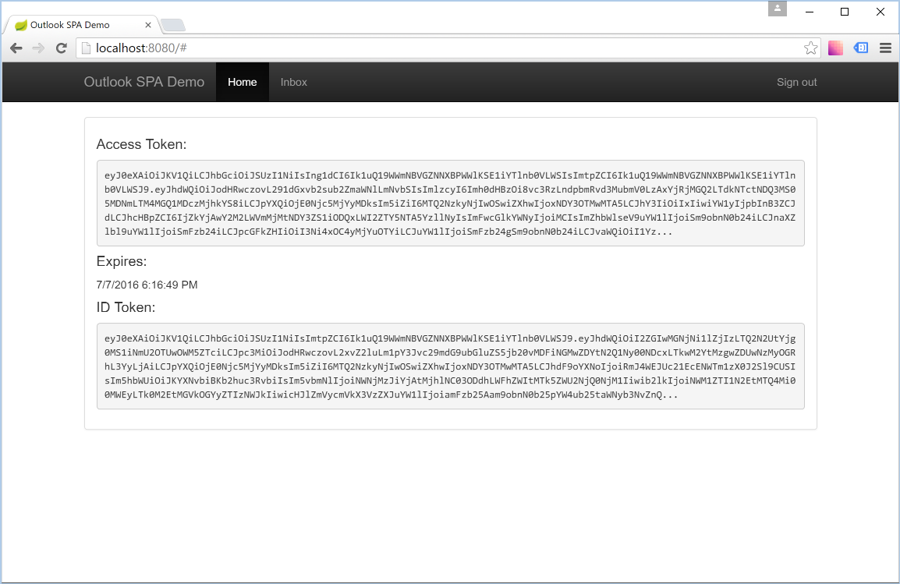

# Write a JavaScript single-page app to get Outlook mail, calendar, and contacts

The purpose of this guide is to walk through the process of creating a simple single-page app that retrieves messages in Office 365 or Outlook.com. The source code in this [repository](https://github.com/jasonjoh/javascript-tutorial) is what you should end up with if you follow the steps outlined here.

This guide will use the [Microsoft Graph](https://developer.microsoft.com/en-us/graph/) to access Outlook mail. Microsoft recommends using the Microsoft Graph to access Outlook mail, calendar, and contacts. You should use the Outlook APIs directly (via `https://outlook.office.com/api`) only if you require a feature that is not available on the Graph endpoints. For a version of this sample that uses the Outlook APIs, see [this branch](https://github.com/jasonjoh/javascript-tutorial/tree/outlook-api).

> [!NOTE]
> This guide uses [http-server](https://www.npmjs.com/package/http-server) to provide a simple command-line HTTP server for development purposes. The `http-server` package requires Node.js and NPM to install and run. However, using `http-server` is not required, you can use any HTTP server for this tutorial.

## Create the app

Create an empty directory where you want to create your app. For the purposes of this guide I will assume the name of the directory is `javascript-tutorial`, but feel free to use any name you like.

Since our app will be client-side JavaScript-based, we need an HTTP server to serve our HTML and JavaScript files. Feel free to use your favorite HTTP server for this guide. To make things simple, this guide will include steps to use [http-server](https://www.npmjs.com/package/http-server) to quickly create a development web server on the command line.

### Setup the web server

Before you begin you'll need to have [Node.js](https://nodejs.org/en/) installed.

1. Open a command prompt and set the current directory to the `javascript-tutorial` directory. 

1. Enter the following command to install `http-server`:

    ```Shell
    npm install http-server -g
    ```

1. Enter the following command to start the server:

    ```Shell
    http-server
    ```

1. Open a browser and browse to `http://localhost:8080`. If the server is working correctly, you should see something like the following:

    

This confirms that the server is working, so we're ready to start coding. You can leave the server running. If you do stop it at some point, be sure to restart it using the `http-server` command in the `javascript-tutorial` directory.

## Designing the app

Our app will be very simple. When a user visits the site, they will see a link to log in and view their email. Clicking that link will take them to the Azure login page where they can login with their Office 365 or Outlook.com account and grant access to our app. Finally, they will be redirected back to our app, which will display a list of the most recent email in the user's inbox.

Let's begin by adding an HTML page to our app. Using your favorite editor, create a file named `index.html` in the `javascript-tutorial` directory, and add the following code.

#### Contents of the `index.html` file

```HTML
<!DOCTYPE html>
<html lang="en">
<head>
  <meta charset="utf-8">
  <meta http-equiv="X-UA-Compatible" content="IE=edge">
  <title>Outlook SPA Demo</title>
  <link href="//ajax.aspnetcdn.com/ajax/bootstrap/3.3.6/css/bootstrap.min.css" rel="stylesheet" />
  <link href="//ajax.aspnetcdn.com/ajax/bootstrap/3.3.6/css/bootstrap-theme.min.css" rel="stylesheet">
  <link href="style.css" rel="stylesheet" type="text/css" />
  
  <script src="//ajax.aspnetcdn.com/ajax/jQuery/jquery-2.2.3.min.js"></script>
  <script src="//ajax.aspnetcdn.com/ajax/bootstrap/3.3.6/bootstrap.min.js"></script>
  <script src="//kjur.github.io/jsrsasign/jsrsasign-latest-all-min.js"></script>
  <script src="//cdnjs.cloudflare.com/ajax/libs/handlebars.js/4.0.5/handlebars.min.js"></script>
  <script src="graph-js-sdk-web.js"></script>
  <script src="outlook-demo.js"></script>
</head>

<body>
  <nav class="navbar navbar-inverse navbar-fixed-top">
    <div class="container">
      <div class="navbar-header">
        <button type="button" class="navbar-toggle collapsed" data-toggle="collapse" data-target="#navbar" aria-expanded="false" aria-controls="navbar">
          <span class="sr-only">Toggle navigation</span>
          <span class="icon-bar"></span>
          <span class="icon-bar"></span>
          <span class="icon-bar"></span>
        </button>
        <a class="navbar-brand" href="#">Outlook SPA Demo</a>
      </div>
      <div id="navbar" class="navbar-collapse collapse">
        <ul class="nav navbar-nav authed-nav">
          <li id='home-nav'><a href="#">Home</a></li>
          <li id='inbox-nav'><a href="#inbox">Inbox</a></li>
        </ul>
        <ul class="nav navbar-nav navbar-right authed-nav">
          <li><a href="#signout">Sign out</a></li>
        </ul>
      </div>
    </div>
  </nav>

  <div class="container main-container">
    <div id="signin-prompt" class="jumbotron page">
      <h1>Outlook SPA Demo</h1>
      <p>This example shows how to get an OAuth token from Azure using the <a href="https://azure.microsoft.com/en-us/documentation/articles/active-directory-v2-protocols-implicit/">implicit grant flow</a> and to use that token to make calls to the Outlook APIs.</p>
      <p>
        <a class="btn btn-lg btn-primary" href="#" role="button" id="connect-button">Connect to Outlook</a>
      </p>
    </div>
    <!-- logged in user welcome -->

    <!-- unsupported browser message -->

    <!-- error message -->

    <!-- inbox display -->

    <!-- token display -->

  </div>
</body>
</html>
```

Save the file and refresh your browser. You should now see the very simple home page for the app. To recap what the code does:

- Adds [Bootstrap](https://getbootstrap.com) for styling and the nav bar.
- Adds [jQuery](https://jquery.com/) for page manipulation.
- Adds the [jsrsasign](https://kjur.github.io/jsrsasign/) library for token validation (more on this later).
- Adds [Handlebars](http://handlebarsjs.com/) for easy templating.
- Adds the [Microsoft Graph JavaScript Client Library](https://github.com/microsoftgraph/msgraph-sdk-javascript) for accessing Outlook mail.
- Adds local files `style.css` and `outlook-demo.js`.

The way the page will work is based on the hash values in the HREF's on the buttons on the page. Clicking this buttons will not load a new page, but will instead invoke JavaScript code to load data and update the page.

Create a new file named `style.css` in the `javascript-tutorial` directory. Add the following code to the file and save it.

#### Contents of the `style.css` file

```CSS
body {
  padding-top: 70px;
}
```

Finally create a new file named `outlook-demo.js` in the `javascript-tutorial` directory. Add the following code to the file and save it.

#### Contents of the `outlook-demo.js` file

```js
$(function() {

  // Check for browser support for sessionStorage
  if (typeof(Storage) === 'undefined') {
    render('#unsupportedbrowser');
    return;
  }

  // Check for browser support for crypto.getRandomValues
  var cryptObj = window.crypto || window.msCrypto; // For IE11
  if (cryptObj === undefined || cryptObj.getRandomValues === 'undefined') {
    render('#unsupportedbrowser');
    return;
  }
  
  render(window.location.hash);

  $(window).on('hashchange', function() {
    render(window.location.hash);
  });
  
  function render(hash) {

    var action = hash.split('=')[0];

    // Hide everything
    $('.main-container .page').hide();

    var isAuthenticated = false;
    
    var pagemap = {
      
      // Welcome page
      '': function() {
        renderWelcome(isAuthenticated);
      },

      // Receive access token

      // Signout

      // Error display

      // Display inbox

      // Shown if browser doesn't support session storage
      '#unsupportedbrowser': function () {
        $('#unsupported').show();
      }
    }
    
    if (pagemap[action]){
      pagemap[action]();
    } else {
      // Redirect to home page
      window.location.hash = '#';
    }
  }

  function setActiveNav(navId) {
    $('#navbar').find('li').removeClass('active');
    $(navId).addClass('active');
  }
  
  function renderWelcome(isAuthed) {
    if (isAuthed) {
      $('#username').text(sessionStorage.userDisplayName);
      $('#logged-in-welcome').show();
      setActiveNav('#home-nav');
    } else {
      $('#connect-button').attr('href', buildAuthUrl());
      $('#signin-prompt').show();
    }
  }

  // OAUTH FUNCTIONS =============================

  // OUTLOOK API FUNCTIONS =======================

  // HELPER FUNCTIONS ============================

});
```

This code creates a `render` method, which selectively shows parts of the page based on the current `#` value in the URL. For each supported hash value, there's a corresponding entry in the `pagemap` object. Right now there the blank value for the home page, and a new value `#unsupportedbrowser`. The very first thing the code does is check for support of the `Storage` interface and the `crypto.getRandomValues` function. The app is going to use the [Web Storage API](https://developer.mozilla.org/en-US/docs/Web/API/Web_Storage_API) to store access tokens, and the `crypto.getRandomValues` function to generate nonce values, so we need to make sure the browser supports them (most modern browsers do).

Assuming your browser supports Web Storage and `crypto.getRandomValues`, at this point refrehsing the page should show the home page as before. If you change the URL in the browser to `http://localhost:8080/#unsupportedbrowser`, you should see the nav bar at the top, but the rest of the page is blank. Let's add in a note to tell the user what happened.

Open `index.html` and locate the following line:

```HTML
<!-- unsupported browser message -->
```

Add the following code immediately after that line.

#### New code in `index.html`

```HTML
<div id="unsupported" class="jumbotron page">
  <h1>Oops....</h1>
  <p>This page requires browser support for <a href="https://developer.mozilla.org/en-US/docs/Web/API/Web_Storage_API">session storage</a> and <a href="https://developer.mozilla.org/en-US/docs/Web/API/RandomSource/getRandomValues"><code>crypto.getRandomValues</code></a>. Unfortunately, your browser does not support one or both features. Please visit this page using a different browser.</p>
</div>
```

Save the change and browse to `http://localhost:8080/#unsupportedbrowser`. You should now see the unsupported browser message.

## Register the app

[!include[App Registration Intro](~/includes/rest/app-registration-intro.md)]

Head over to the [Application Registration Portal](https://apps.dev.microsoft.com/) to quickly get an application ID. 

1. Using the **Sign in** link, sign in with either your Microsoft account (Outlook.com), or your work or school account (Office 365).
1. Click the **Add an app** button. Enter `javascript-tutorial` for the name and click **Create application**. 
1. Locate the **Platforms** section, and click **Add Platform**. Choose **Web**, then enter `http://localhost:8080` under **Redirect URIs**. Make sure that there is a check next to **ALlow Implicit Flow**.
1. Click **Save** to complete the registration. Copy the **Application Id** and save it. We'll need it soon.

Here's what the details of your app registration should look like when you are done.


## Implementing OAuth2

Our goal in this section is to make the link on our home page initiate the [OAuth2 Implicit Grant flow with Azure AD](https://azure.microsoft.com/en-us/documentation/articles/active-directory-v2-protocols-implicit/). This flow is designed for SPA apps, and will allow us to get an access token without needing to exchange a client secret or do extra requests to a token issuing endpoint.

The implicit flow is pretty simple. The user browses to an authentication link hosted by Azure, where they sign in and grant access to our app. Azure redirects back to the app with the result. Assuming the user successfully signed in and granted consent, the result contains an access token and ID token.

Our first step is to generate the authentication link. Open the `outlook-demo.js` file and add the following variables immediately before the `// Check for browser support for sessionStorage` line:

```js
// App configuration
var authEndpoint = 'https://login.microsoftonline.com/common/oauth2/v2.0/authorize?';
var redirectUri = 'http://localhost:8080';
var appId = 'YOUR APP ID HERE';
var scopes = 'openid profile User.Read Mail.Read';
```

Replace the `YOUR APP ID HERE` value with the application ID you generated as part of the app registration process.

Now locate the `// OAUTH FUNCTIONS` line in `outlook-demo.js`. After this line, add the following function.

#### The `buildAuthUrl` function

```js
function buildAuthUrl() {
  // Generate random values for state and nonce
  sessionStorage.authState = guid();
  sessionStorage.authNonce = guid();

  var authParams = {
    response_type: 'id_token token',
    client_id: appId,
    redirect_uri: redirectUri,
    scope: scopes,
    state: sessionStorage.authState,
    nonce: sessionStorage.authNonce,
    response_mode: 'fragment'
  };
  
  return authEndpoint + $.param(authParams);
}
```

Locate the `// HELPER FUNCTIONS` line, and add the following function after it.

#### The `guid` function

```js
function guid() {
  var buf = new Uint16Array(8);
  cryptObj.getRandomValues(buf);
  function s4(num) {
    var ret = num.toString(16);
    while (ret.length < 4) {
      ret = '0' + ret;
    }
    return ret;
  }
  return s4(buf[0]) + s4(buf[1]) + '-' + s4(buf[2]) + '-' + s4(buf[3]) + '-' +
    s4(buf[4]) + '-' + s4(buf[5]) + s4(buf[6]) + s4(buf[7]);
}
```

Now update the `renderWelcome` function to call the `buildAuthUrl` function and set the `href` attribute of the sign in button to the result. Replace this line:

```js
$('#connect-button').attr('href', '#');
```

With:

```js
$('#connect-button').attr('href', buildAuthUrl());
```

Save your changes and browse to `http://localhost:8080`. If you hover over the **Connect to Outlook** button, it should look like:

    https://login.microsoftonline.com/common/oauth2/v2.0/authorize?response_type=id_token+token&client_id=<SOME GUID>&redirect_uri=http%3A%2F%2Flocalhost%3A8080&scope=openid+profile+User.Read+Mail.Read&state=f175f48d-d277-9893-9c8d-dcc2a95ffe16&nonce=593a2b06-d77b-31c2-ae43-e74c0ebeb304&response_mode=fragment

The `<SOME GUID>` portion should match your client ID. Click on the link and you should be presented with a sign in page. Sign in with your Office 365 or Outlook.com account. Your browser should redirect to back to our home page, with no visible change.

The reason there is no change is because we haven't written any code to handle the redirect back from the Azure authentication endpoint. Let's do that now.

### Getting the token

Locate the `render` function in `outlook-demo.js`. Immediately after the `// Receive access token` line, add the following code.

#### New code to receive access token

```js
'#access_token': function() {
  handleTokenResponse(hash);             
},
```

Next, add the following function after the `buildAuthUrl` function.

#### The `handleTokenResponse` function

```js
function handleTokenResponse(hash) {
  // clear tokens
  sessionStorage.removeItem('accessToken');
  sessionStorage.removeItem('idToken');

  var tokenresponse = parseHashParams(hash);

  // Check that state is what we sent in sign in request
  if (tokenresponse.state != sessionStorage.authState) {
    sessionStorage.removeItem('authState');
    sessionStorage.removeItem('authNonce');
    // Report error
    window.location.hash = '#error=Invalid+state&error_description=The+state+in+the+authorization+response+did+not+match+the+expected+value.+Please+try+signing+in+again.';
    return;
  }

  sessionStorage.authState = '';
  sessionStorage.accessToken = tokenresponse.access_token;
  
  // Get the number of seconds the token is valid for,
  // Subract 5 minutes (300 sec) to account for differences in clock settings
  // Convert to milliseconds
  var expiresin = (parseInt(tokenresponse.expires_in) - 300) * 1000;
  var now = new Date();
  var expireDate = new Date(now.getTime() + expiresin);
  sessionStorage.tokenExpires = expireDate.getTime();

  sessionStorage.idToken = tokenresponse.id_token;

  // Redirect to home page
  window.location.hash = '#';   
}
```

This function clears any cached tokens, then parses the token response. It checks that the `state` parameter matches what we originally sent, calculates the expiration time for the token, then saves the tokens in the session. Before we test this code, we need to implement the `parseHashParams` function. Add this function after the `guid` function.

#### The `parseHashParams` function

```js
function parseHashParams(hash) {
  var params = hash.slice(1).split('&');
  
  var paramarray = {};
  params.forEach(function(param) {
    param = param.split('=');
    paramarray[param[0]] = param[1];
  });
  
  return paramarray;
}
```

Now let's update the `render` function to check if the user is authenticated. Replace the `var isAuthenticated = false;` line with the following code.

#### New code in the `render` function

```js
// Check for presence of access token
var isAuthenticated = (sessionStorage.accessToken != null && sessionStorage.accessToken.length > 0);
renderNav(isAuthenticated);
renderTokens();
```

Now, let's add a function to change the nav bar based on if a user is authenticated or not. Add the following function after the `setActiveNav` function.

#### The `renderNav` function

```js
function renderNav(isAuthed) {
  if (isAuthed) {
    $('.authed-nav').show();
  } else {
    $('.authed-nav').hide();
  }
}
```

Let's also add a function to display the tokens, so we can confirm that things are working. Add the following function after the `renderNav` function.

#### The `renderTokens` function

```js
function renderTokens() {
  if (sessionStorage.accessToken) {
    // For demo purposes display the token and expiration
    var expireDate = new Date(parseInt(sessionStorage.tokenExpires));
    $('#token', window.parent.document).text(sessionStorage.accessToken);
    $('#expires-display', window.parent.document).text(expireDate.toLocaleDateString() + ' ' + expireDate.toLocaleTimeString());
    if (sessionStorage.idToken) {
      $('#id-token', window.parent.document).text(sessionStorage.idToken);
    }
    $('#token-display', window.parent.document).show();
  } else {
    $('#token-display', window.parent.document).hide();
  }
}
```

Now we need to add code to `index.html` to support our new `renderTokens` function. Add the following code after the `<!-- token display -->` line in `index.html`.

#### New code in `index.html`

```HTML
<div id="token-display" class="page panel panel-default">
  <div class="panel-body">
    <h4>Access Token:</h4>
    <pre><code id="token"></code></pre>
    <h4>Expires:</h4>
    <p id="expires-display"></p>
    <h4>ID Token:</h4>
    <pre><code id="id-token"></code></pre>
  </div>
</div>
```

Save your changes and refresh your browser. Depending on the state of your session you may have to sign in again. After signing in you should see something simliar to this.



If you're not seeing that, there may be an error returned from the authentication process. Let's add some code to handle an error response. First, add the following after the `// Error display` line in the `render` function:

#### `#error` handler in `render` function

```js
'#error': function () {
  var errorresponse = parseHashParams(hash);
  renderError(errorresponse.error, errorresponse.error_description);
},
```

Then add this function after the `renderToken` function.

#### The `renderError` function

```js
function renderError(error, description) {
  $('#error-name', window.parent.document).text('An error occurred: ' + decodePlusEscaped(error));
  $('#error-desc', window.parent.document).text(decodePlusEscaped(description));
  $('#error-display', window.parent.document).show();
}
```

Add the `decodePlusEscaped` just after the `parseHashParams` function.

#### The `decodePlusEscaped` function

```js
function decodePlusEscaped(value) {
  // decodeURIComponent doesn't handle spaces escaped
  // as '+'
  if (value) {
    return decodeURIComponent(value.replace(/\+/g, ' '));
  } else {
    return '';
  }
}
```

Finally, let's add the HTML code into `index.html` to display the error. Add the following after the `<!-- error message -->` line.

#### New code in `index.html`

```HTML
<div id="error-display" class="page panel panel-danger">
  <div class="panel-heading">
    <h3 class="panel-title" id="error-name"></h3>
  </div>
  <div class="panel-body">
    <pre><code id="error-desc"></code></pre>
  </div>
</div>
```

Now if you refresh your browser, if the authentication process returns an error, it will be displayed.

> [!TIP]
> If you want to test the error display, an easy way to generate an error is to start the sign in process with a new user (one you have not signed into this app with before). When prompted to grant permission to the app, choose **No** or **Cancel**. This will redirect back to the app with an error indicating the user did not grant permission.

Before we improve on this, let's implement the ability to sign out. Since we keep everything in the session, we can just empty the session.

First add the following after the `// Signout` line in the `render` function:

#### `#signout` handler in `render` function

```js
'#signout': function () {
  clearUserState();
  
  // Redirect to home page
  window.location.hash = '#';
},
```

Then add the following function after the `decodePlusEscaped` function.

#### The `clearUserState` function

```js
function clearUserState() {
  // Clear session
  sessionStorage.clear();
}
```

Now save your changes and refresh the browser. You should be able to use the **Sign out** button to sign out.

### Using the ID token

At this point we have an access token, so we could just proceed to calling the Outlook API. However, access tokens are relatively short-lived. After an hour they expire. While we could ask the user to sign in again, that's not a great solution. Ideally we would want to be able to silently request a new token. The implicit grant flow doesn't use refresh tokens, so the way to get a new token is to send another request to the authorization endpoint. To make it silent, we need to include the user's sign-in name, which we can get from the ID token that's included in our initial authorization response. We can also get data like the user's display name, which we can use to personalize the app.

According to the [Azure documentation](https://azure.microsoft.com/en-us/documentation/articles/active-directory-v2-tokens/#validating-tokens) and the [OpenID specification](https://openid.net/specs/openid-connect-core-1_0.html#IDTokenValidation), we MUST validate the token before using it. So our function will do some basic validation as it parses the token.

> [!IMPORTANT]
> This sample won't do all of the required validations listed in the OpenID spec. Most notably, it won't validate the signature on the token. Currently requesting the signing keys from Azure would require a server-side component, so we'll skip that step for the sake of simplicity. However, production apps should not skip this important step!

Add the following function in `outlook-demo.js` after the `handleTokenResponse` function.

#### The `validateIdToken` function

```js
function validateIdToken(callback) {
  // Per Azure docs (and OpenID spec), we MUST validate
  // the ID token before using it. However, full validation
  // of the signature currently requires a server-side component
  // to fetch the public signing keys from Azure. This sample will
  // skip that part (technically violating the OpenID spec) and do
  // minimal validation

  if (null == sessionStorage.idToken || sessionStorage.idToken.length <= 0) {
    callback(false);
  }

  // JWT is in three parts seperated by '.'
  var tokenParts = sessionStorage.idToken.split('.');
  if (tokenParts.length != 3){
    callback(false);
  }

  // Parse the token parts
  var header = KJUR.jws.JWS.readSafeJSONString(b64utoutf8(tokenParts[0]));
  var payload = KJUR.jws.JWS.readSafeJSONString(b64utoutf8(tokenParts[1]));

  // Check the nonce
  if (payload.nonce != sessionStorage.authNonce) {
    sessionStorage.authNonce = '';
    callback(false);
  }

  sessionStorage.authNonce = '';

  // Check the audience
  if (payload.aud != appId) {
    callback(false);
  }

  // Check the issuer
  // Should be https://login.microsoftonline.com/{tenantid}/v2.0
  if (payload.iss !== 'https://login.microsoftonline.com/' + payload.tid + '/v2.0') {
    callback(false);
  }

  // Check the valid dates
  var now = new Date();
  // To allow for slight inconsistencies in system clocks, adjust by 5 minutes
  var notBefore = new Date((payload.nbf - 300) * 1000);
  var expires = new Date((payload.exp + 300) * 1000);
  if (now < notBefore || now > expires) {
    callback(false);
  }

  // Now that we've passed our checks, save the bits of data
  // we need from the token.

  sessionStorage.userDisplayName = payload.name;
  sessionStorage.userSigninName = payload.preferred_username;

  // Per the docs at:
  // https://azure.microsoft.com/en-us/documentation/articles/active-directory-v2-protocols-implicit/#send-the-sign-in-request
  // Check if this is a consumer account so we can set domain_hint properly
  sessionStorage.userDomainType = 
    payload.tid === '9188040d-6c67-4c5b-b112-36a304b66dad' ? 'consumers' : 'organizations';

  callback(true);
}
```

To summarize, the function uses the `jsrsasign` library to parse the token, then validates the nonce, audience, issuer, and valid dates. If those all pass inspection, it then extracts three pieces of data from the token:

- The user's display name, which we'll use to welcome the user after signing in.
- The user's preferred user name, which we will use in silent token requests.
- If the user is a consumer account (Outlook.com) or business account (Office 365), which is also used in silent token requests.

Now let's modify the `handleTokenResponse` function to call this function. Locate the last two lines of the `handleTokenResponse`:

```js
// Redirect to home page
window.location.hash = '#';
```

Replace those lines with the following

```js
validateIdToken(function(isValid) {
  if (isValid) {
    // Re-render token to handle refresh
    renderTokens();
    
    // Redirect to home page
    window.location.hash = '#';
  } else {
    clearUserState();
    // Report error
    window.location.hash = '#error=Invalid+ID+token&error_description=ID+token+failed+validation,+please+try+signing+in+again.';
  }
});
```

Now let's add the HTML code to `index.html` to show a welcome screen. Add the following code after the `<!-- logged in user welcome -->` line:

#### New code in `index.html`

```HTML
<div id="logged-in-welcome" class="jumbotron page">
  <h1>Outlook SPA Demo</h1>
  <p>Welcome <span id="username"></span>! Please use the nav menu to access your Outlook data.</p>
</div>
```

Save your changes and refresh your browser. Now after logging in you should see a welcome message with the user's display name.

### Refreshing the access token

Let's tackle one more OAuth task before moving on to Outlook data: refreshing tokens. Per the [Azure documentation](https://azure.microsoft.com/en-us/documentation/articles/active-directory-v2-protocols-implicit/#refreshing-tokens), the way to do this is with a hidden iframe request. Essentially we will insert an iframe into the page and have it load the Azure authentication endpoint. We'll add a few extra parameters to the URL to make it a silent request.

Add the following function to `outlook-demo.js` after the `validateIdToken` function.

#### The `makeSilentTokenRequest` function

```js
function makeSilentTokenRequest(callback) {
  // Build up a hidden iframe
  var iframe = $('<iframe/>');
  iframe.attr('id', 'auth-iframe');
  iframe.attr('name', 'auth-iframe');
  iframe.appendTo('body');
  iframe.hide();

  iframe.load(function() {
    callback(sessionStorage.accessToken);
  });
  
  iframe.attr('src', buildAuthUrl() + '&prompt=none&domain_hint=' + 
    sessionStorage.userDomainType + '&login_hint=' + 
    sessionStorage.userSigninName);
}
```

Notice that we use the same `buildAuthUrl` function to get the authorization URL, but we add extra query parameters:

- `prompt=none`: We're requesting that no signin prompt be shown. This will cause Azure to either return the tokens with no prompting or return an error indicating why it cannot return tokens.
- `domain_hint=consumers` or `domain_hint=organizations`: Azure needs this information to process the silent request. It basically tells Azure if the account is an Outlook.com account or an Office 365 account.
- `login_hint=<username>`: The user's signin name. Azure needs this to process the silent request.

Now we need a place to use this function. Add the following function after the `makeSilentTokenRequest` function.

#### The `getAccessToken` function

```js
// Helper method to validate token and refresh
// if needed
function getAccessToken(callback) {
  var now = new Date().getTime();
  var isExpired = now > parseInt(sessionStorage.tokenExpires);
  // Do we have a token already?
  if (sessionStorage.accessToken && !isExpired) {
    // Just return what we have
    if (callback) {
      callback(sessionStorage.accessToken);
    }
  } else {
    // Attempt to do a hidden iframe request
    makeSilentTokenRequest(callback);
  }
}
```

We'll use this method anytime we need to use the access token. The function checks if the token is about to expire. If it isn't, then it just returns the token from the session. If it is, then it refreshes the token.

When making a silent token request, if there's something wrong with the user's cookie, the Azure service may return a `login_required` or `interaction_required` error, indicating that the user needs to sign in again. Let's add some code to our `#error` handler to catch those errors and redirect the browser to an interactive login. Replace the existing `#error` handler in the `render` function with the following.

#### New `#error` handler in the `render` function

```js
'#error': function () {
  var errorresponse = parseHashParams(hash);
  if (errorresponse.error === 'login_required' ||
      errorresponse.error === 'interaction_required') {
    // For these errors redirect the browser to the login
    // page.
    window.location = buildAuthUrl();
  } else {
    renderError(errorresponse.error, errorresponse.error_description);
  }
},
```

Finally, let's add code to remove the hidden iframe once it's done its work. Add the following lines to the top of the `handleTokenResponse` function:

```js
// If this was a silent request remove the iframe
$('#auth-iframe').remove();
```

## Using the Mail API ##

Now that we can get an access token, we're in a good position to do something with the Mail API. Let's start by downloading the Microsoft Graph JavaScript Client Library. We already added a reference to it in the HTML, so all we need to do is download it. Go to [https://github.com/microsoftgraph/msgraph-sdk-javascript](https://github.com/microsoftgraph/msgraph-sdk-javascript) and download the source. Copy the `./lib/graph-js-sdk-web.js` into the `javascript-tutorial` directory.

Our first task with this API is to get the user's email address. We'll use this to set the `X-AnchorMailbox` header. Setting this header to the user's email address helps the Outlook servers route the request more efficiently, so it's a good idea to set it! Let's implement a method to get the user's email address from the Outlook API.

> [!NOTE]
> You may wonder why we don't just use the `preferred_username` value from the user's ID token here and save making an extra API request. While in a lot of cases this value may be the same as the user's email address, that isn't true for all accounts. For example, a user could be configured to sign in with a Skype name or a mobile telephone number. By requesting the email address from the API, we can be sure to always have the correct email address.

Add the following function after the `// OUTLOOK API FUNCTIONS` line.

#### The `getUserEmailAddress` function

```js
function getUserEmailAddress(callback) {
  if (sessionStorage.userEmail) {
    return sessionStorage.userEmail;
  } else {
    getAccessToken(function(accessToken) {
      if (accessToken) {
        // Create a Graph client
        var client = MicrosoftGraph.Client.init({
          authProvider: (done) => {
            // Just return the token
            done(null, accessToken);
          }
        });

        // Get the Graph /Me endpoint to get user email address
        client
          .api('/me')
          .get((err, res) => {
            if (err) {
              callback(null, err);
            } else {
              callback(res.mail);
            }
          });
      } else {
        var error = { responseText: 'Could not retrieve access token' };
        callback(null, error);
      }
    });
  }
}
```

This function checks if we have a value stored in the session, and if not, calls the API to get the user's email address. Since this is the first time using the Graph client library, let's test it before proceeding.

Add the following code after the `// Display inbox` line in the `render` function.

#### `#inbox` handler in the `render` function

```js
'#inbox': function () {
  if (isAuthenticated) {
    renderInbox();  
  } else {
    // Redirect to home page
    window.location.hash = '#';
  }
},
```

Now add the following function after the `renderWelcome` function.

#### The `renderInbox` function

```js
function renderInbox() {
  setActiveNav('#inbox-nav');
  $('#inbox-status').text('Loading...');
  $('#message-list').empty();
  $('#inbox').show();
  // Get user's email address
  getUserEmailAddress(function(userEmail, error) {
    if (error) {
      renderError('getUserEmailAddress failed', error.responseText);
    } else {
      $('#inbox-status').text('Your email address is: ' + userEmail);
    }
  });
}
```

Add the following code to `index.html` after the `<!-- inbox display -->` line:

#### New code in `index.html`

```js
<div id="inbox" class="page panel panel-default">
  <div class="panel-heading">
    <h1 class="panel-title">Inbox</h1>
  </div>
  <div id="inbox-status" class="panel-body">
  </div>
  <div class="list-group" id="message-list">
  </div>
</div>
```

Save your changes and refresh your browser. After signing in click the **Inbox** button in the nav bar. If everything works properly, you should see the user's email address displayed on the page. Let's work on getting the user's messages.

Add the following function to `outlook-demo.js` after the `getUserEmailAddress` function.

#### The `getUserInboxMessages` function

```js
function getUserInboxMessages(emailAddress, callback) {
  getAccessToken(function(accessToken) {
    if (accessToken) {
      // Create a Graph client
      var client = MicrosoftGraph.Client.init({
        authProvider: (done) => {
          // Just return the token
          done(null, accessToken);
        }
      });

      // Get the 10 newest messages
      client
        .api('/me/mailfolders/inbox/messages')
        .header('X-AnchorMailbox', emailAddress)
        .top(10)
        .select('subject,from,receivedDateTime,bodyPreview')
        .orderby('receivedDateTime DESC')
        .get((err, res) => {
          if (err) {
            callback(null, err);
          } else {
            callback(res.value);
          }
        });
    } else {
      var error = { responseText: 'Could not retrieve access token' };
      callback(null, error);
    }
  });
}
```

This uses the Graph client that we used in `getUserEmailAddress`, but this time the call is a little more complicated. It uses query parameters to control the results we get back.

- Using the `top` method limits the results to the first 10 messages.
- Using the `select` method controls which fields are returned for each message. In this case we only request the `subject`, `from`, `receivedDateTime`, and `bodyPreview` fields.
- Using the `orderby` method sorts the results by the `receivedDateTime` field in descending order (newest first).

Let's modify the `renderInbox` function to call this. Replace the line `$('#inbox-status').text('Your email address is: ' + userEmail);` with the following code.

```js
getUserInboxMessages(userEmail, function(messages, error){
  $('#inbox-status').text(JSON.stringify(messages));
});
```

Save your changes and refresh your browser. When you click the **Inbox** button you should eventually see an unformatted JSON dump of messages. It isn't pretty, but it verifies that our API call is working. Let's fix the app to display the results in a nicer way.

### Displaying the results

Let's add a [Handlebars](http://handlebarsjs.com/) template to our page to display the messages. Add the following code between the very last `</div>` and the `</body>` tags:

```HTML
<!-- Handlebars template for message list -->
<script id="msg-list-template" type="text/x-handlebars-template">
  {{#each messages}}
  <div class="list-group-item">
    <h3 id="msg-from" class="list-group-item-">{{this.from.emailAddress.name}}</h3>
    <h4 id="msg-subject" class="list-group-item-heading">{{this.subject}}</h4>
    <p id="msg-received" class="list-group-item-heading text-muted"><em>Received: {{formatDate this.receivedDateTime}}</em></p>
    <p id="msg-preview" class="list-group-item-text text-muted"><em>{{this.bodyPreview}}</em></p>
  </div>
  {{/each}}
</script>
```

To make date values look nice, we'll register a Handlebars helper to format dates. Add the following function after the `clearUserState` function in `outlook-demo.js`.

#### The `formatDate` helper

```js
Handlebars.registerHelper("formatDate", function(datetime){
  // Dates from API look like:
  // 2016-06-27T14:06:13Z

  var date = new Date(datetime);
  return date.toLocaleDateString() + ' ' + date.toLocaleTimeString();
});
```

Finally, replace the line `$('#inbox-status').text(JSON.stringify(messages));` in the `renderInbox` function with the following code.

```js
if (error) {
  renderError('getUserInboxMessages failed', error);
} else {
  $('#inbox-status').text('Here are the 10 most recent messages in your inbox.');
  var templateSource = $('#msg-list-template').html();
  var template = Handlebars.compile(templateSource);

  var msgList = template({messages: messages});
  $('#message-list').append(msgList);
}
```

Save your changes and refresh your browser.


## Adding Calendar and Contacts APIs

Now that you've mastered calling the Outlook Mail API, doing the same for Calendar and Contacts APIs is similar and easy.

> [!TIP]
> If you've followed along with the tutorial, you probably have an access token saved in your session cookie. That token will only be valid for the `Mail.Read` scope. In order to call the Calendar or Contacts API, we will need to add new scopes. Be sure sign out of the app to get rid of the session cookie so that you can start the login process from the beginning to get a new access token.

### For Calendar API:

1. Update the `scopes` variable in `outlook-demo.js` to include the `Calendars.Read` scope.

    ```js
    var scopes = 'openid profile User.Read Mail.Read Calendars.Read';
    ```

1. Add a `#calendar` handler in the `render` function.

    ```js
    // Display calendar
    '#calendar': function () {
      if (isAuthenticated) {
        renderCalendar();  
      } else {
        // Redirect to home page
        window.location.hash = '#';
      }
    },
    ```

1. Add a `renderCalendar` function in `outlook-demo.js`.

    ```js
    function renderCalendar() {
      setActiveNav('#calendar-nav');
      $('#calendar-status').text('Loading...');
      $('#event-list').empty();
      $('#calendar').show();
      // Get user's email address
      getUserEmailAddress(function(userEmail, error) {
        if (error) {
          renderError('getUserEmailAddress failed', error.responseText);
        } else {
          getUserEvents(userEmail, function(events, error){
            if (error) {
              renderError('getUserEvents failed', error);
            } else {
              $('#calendar-status').text('Here are the 10 most recently created events on your calendar.');
              var templateSource = $('#event-list-template').html();
              var template = Handlebars.compile(templateSource);

              var eventList = template({events: events});
              $('#event-list').append(eventList);
            }
          });
        }
      });
    }
    ```

1. Add a `getUserEvents` function in `outlook-demo.js`.

    ```js
    function getUserEvents(emailAddress, callback) {
      getAccessToken(function(accessToken) {
        if (accessToken) {
          // Create a Graph client
          var client = MicrosoftGraph.Client.init({
            authProvider: (done) => {
              // Just return the token
              done(null, accessToken);
            }
          });

          // Get the 10 newest events
          client
            .api('/me/events')
            .header('X-AnchorMailbox', emailAddress)
            .top(10)
            .select('subject,start,end,createdDateTime')
            .orderby('createdDateTime DESC')
            .get((err, res) => {
              if (err) {
                callback(null, err);
              } else {
                callback(res.value);
              }
            });
        } else {
          var error = { responseText: 'Could not retrieve access token' };
          callback(null, error);
        }
      });
    }
    ```

1. Add a **Calendar** button to the nav bar in `index.html`.

    ```HTML
    <li id='calendar-nav'><a href="#calendar">Calendar</a></li>
    ```

1. Add a calendar display to `index.html`.

    ```HTML
    <!-- calendar display -->
    <div id="calendar" class="page panel panel-default">
      <div class="panel-heading">
        <h1 class="panel-title">Calendar</h1>
      </div>
      <div id="calendar-status" class="panel-body">
      </div>
      <div class="list-group" id="event-list">
      </div>
    </div>
    ```

1. Add a Handlebars template for the event list to `index.html`.

    ```HTML
    <!-- Handlebars template for event list -->
    <script id="event-list-template" type="text/x-handlebars-template">
      {{#each events}}
      <div class="list-group-item">
        <h4 id="event-subject" class="list-group-item-heading">{{this.subject}}</h4>
        <p id="event-start" class="list-group-item-heading">Start: {{formatDate this.start.dateTime}}</p>
        <p id="event-end" class="list-group-item-heading">End: {{formatDate this.end.dateTime}}</p>
      </div>
      {{/each}}
    </script>
    ```

1. Refresh the browser. After signing in click the **Calendar** button in the nav bar.

### For Contacts API:

1. Update the `scopes` variable in `outlook-demo.js` to include the `Contacts.Read` scope.

    ```js
    var scopes = 'openid profile User.Read Mail.Read Contacts.Read';
    ```

1. Add a `#contacts` handler in the `render` function.

    ```js
    // Display contacts
    '#contacts': function () {
      if (isAuthenticated) {
        renderContacts();  
      } else {
        // Redirect to home page
        window.location.hash = '#';
      }
    },
    ```

1. Add a `renderContacts` function in `outlook-demo.js`.

    ```js
    function renderContacts() {
      setActiveNav('#contacts-nav');
      $('#contacts-status').text('Loading...');
      $('#contact-list').empty();
      $('#contacts').show();
      // Get user's email address
      getUserEmailAddress(function(userEmail, error) {
        if (error) {
          renderError('getUserEmailAddress failed', error.responseText);
        } else {
          getUserContacts(userEmail, function(contacts, error){
            if (error) {
              renderError('getUserContacts failed', error);
            } else {
              $('#contacts-status').text('Here are your first 10 contacts.');
              var templateSource = $('#contact-list-template').html();
              var template = Handlebars.compile(templateSource);

              var contactList = template({contacts: contacts});
              $('#contact-list').append(contactList);
            }
          });
        }
      });
    }
    ```

1. Add a `getUserContacts` function in `outlook-demo.js`.

    ```js
    function getUserContacts(emailAddress, callback) {
      getAccessToken(function(accessToken) {
        if (accessToken) {
          // Create a Graph client
          var client = MicrosoftGraph.Client.init({
            authProvider: (done) => {
              // Just return the token
              done(null, accessToken);
            }
          });

          // Get the first 10 contacts in alphabetical order
          // by given name
          client
            .api('/me/contacts')
            .header('X-AnchorMailbox', emailAddress)
            .top(10)
            .select('givenName,surname,emailAddresses')
            .orderby('givenName ASC')
            .get((err, res) => {
              if (err) {
                callback(null, err);
              } else {
                callback(res.value);
              }
            });
        } else {
          var error = { responseText: 'Could not retrieve access token' };
          callback(null, error);
        }
      });
    }
    ```

1. Add a **Contacts** button to the nav bar in `index.html`.

    ```HTML
    <li id='calendar-nav'><a href="#calendar">Calendar</a></li>
    ```

1. Add a contacts display to `index.html`.

    ```HTML
    <!-- contacts display -->
    <div id="contacts" class="page panel panel-default">
      <div class="panel-heading">
        <h1 class="panel-title">Contacts</h1>
      </div>
      <div id="contacts-status" class="panel-body">
      </div>
      <div class="list-group" id="contact-list">
      </div>
    </div>
    ```

1. Add a Handlebars template for the contact list to `index.html`.

    ```HTML
    <!-- Handlebars template for contact list -->
    <script id="contact-list-template" type="text/x-handlebars-template">
      {{#each contacts}}
      <div class="list-group-item">
        <h4 id="contact-name" class="list-group-item-heading">{{this.givenName}} {{this.surname}}</h4>
        <p id="contact-email" class="list-group-item-heading">Email: {{this.emailAddresses.0.address}}</p>
      </div>
      {{/each}}
    </script>
    ```

1. Refresh the browser. After signing in click the **Contacts** button in the nav bar.