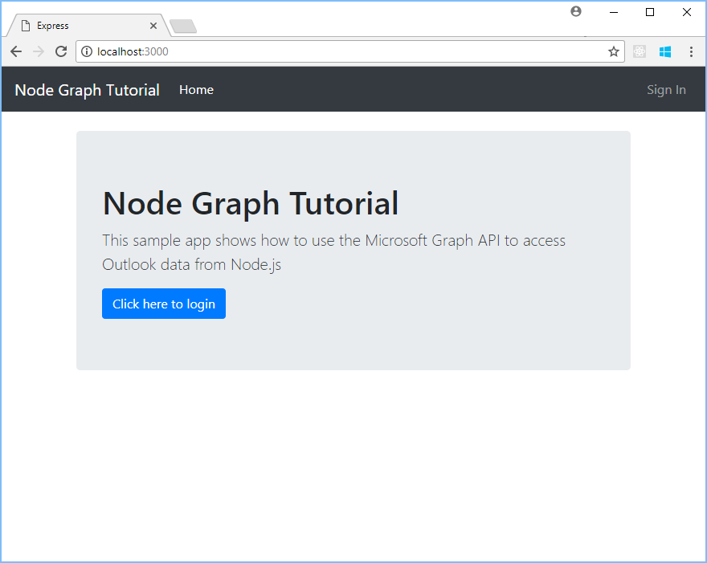
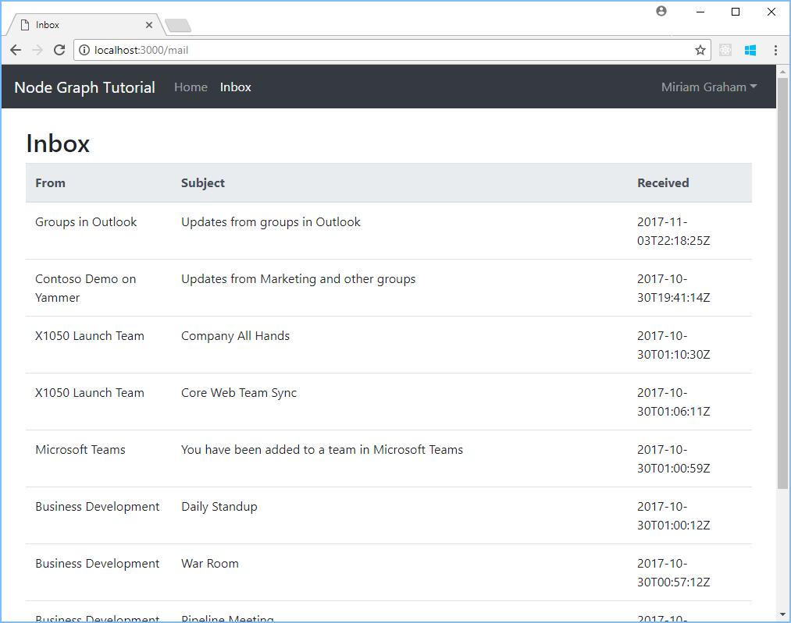

<!-- markdownlint-disable MD025 -->
# Write a Node.js app to get Outlook mail, calendar, and contacts
<!-- markdownlint-enable MD025 -->

The purpose of this guide is to walk through the process of creating a simple Node.js app that retrieves messages in Office 365 or Outlook.com. The source code in this [repository](https://github.com/jasonjoh/node-tutorial) is what you should end up with if you follow the steps outlined here.

This guide will use [Microsoft Graph](/graph/overview) to access Outlook mail. Microsoft recommends using Microsoft Graph to access Outlook mail, calendar, and contacts. You should use the Outlook APIs directly (via `https://outlook.office.com/api`) only if you require a feature that is not available on the Graph endpoints. For a version of this sample that uses the Outlook APIs, see [this branch](https://github.com/jasonjoh/node-tutorial/tree/outlook-api).

This guide assumes that you already have Node.js installed and working on your development machine.

## Create the app

Let's dive right in! The first  step is to install the [Express generator](https://expressjs.com/en/starter/generator.html). We'll use this to handle all the scaffolding for our app. Open your command prompt or shell to a directory where you'd like to create your app and run the following command:

```Shell
npm install -g express-generator
```

Now run the following command to create an Express app that uses [Handlebars](https://handlebarsjs.com/) as the rendering engine:

```Shell
express --hbs node-tutorial
```

This will create a new sub-directory called `node-tutorial` and create the file structure for the app. Change the current directory for your shell to the `node-tutorial` directory and run the following command to install dependencies.

```Shell
npm install
```

At this point, you should have a working app. Run the following command in the `node-tutorial` directory.

```Shell
npm start
```

Open your browser and navigate to `http://localhost:3000`. You should see a "Welcome to Express" message.

Now that we've confirmed that the app is working, we're ready to start making it do something.

## Designing the app

Our app will be very simple. When a user visits the site, they will see a button to log in and view their email. Clicking that button will take them to the Azure login page where they can login with their Office 365 or Outlook.com account and grant access to our app. Finally, they will be redirected back to our app, which will display a list of the most recent email in the user's inbox.

Let's begin by adding some basic styling to the app with [Bootstrap](https://getbootstrap.com/). Open the `./views/layout.hbs` file and replace the entire contents with the following.

```html
<!DOCTYPE html>
<html>
  <head>
    <meta charset="utf-8">
    <meta name="viewport" content="width=device-width, initial-scale=1, shrink-to-fit=no">
    <title>{{title}}</title>
    <!-- Bootstrap core CSS -->
    <link rel="stylesheet" href="https://maxcdn.bootstrapcdn.com/bootstrap/4.0.0/css/bootstrap.min.css" integrity="sha384-Gn5384xqQ1aoWXA+058RXPxPg6fy4IWvTNh0E263XmFcJlSAwiGgFAW/dAiS6JXm" crossorigin="anonymous">
    <link rel='stylesheet' href='/stylesheets/style.css' />
  </head>
  <body>
    <!-- Nav bar -->
    <nav class="navbar navbar-expand-md navbar-dark bg-dark mb-4">
      <a class="navbar-brand" href="/">Node Graph Tutorial</a>
      <button class="navbar-toggler" type="button" data-toggle="collapse" data-target="#navbarCollapse" aria-controls="navbarCollapse" aria-expanded="false" aria-label="Toggle navigation">
        <span class="navbar-toggler-icon"></span>
      </button>
      <div class="collapse navbar-collapse" id="navbarCollapse">
        <ul class="navbar-nav mr-auto">
          <li class="nav-item{{#if active.home}} active{{/if}}">
            <a class="nav-link" href="/">Home</a>
          </li>
          {{#if user}}
            <li class="nav-item{{#if active.inbox}} active{{/if}}">
              <a class="nav-link" href="/mail">Inbox</a>
            </li>
          {{/if}}
        </ul>
        <ul class="navbar-nav justify-content-end">
          {{#if user}}
            <li class="nav-item dropdown">
              <a class="nav-link dropdown-toggle" data-toggle="dropdown" href="#" role="button" aria-haspopup="true" aria-expanded="false">{{user}}</a>
              <div class="dropdown-menu">
                  <a class="dropdown-item" href="/authorize/signout">Sign Out</a>
              </div>
            </li>
          {{else}}
            <li class="nav-item">
              <a class="nav-link" href="{{signInUrl}}">Sign In</a>
            </li>
          {{/if}}
        </ul>
      </div>
    </nav>

    <!-- Main body -->
    <main role="main" class="container">
      {{{body}}}

      <!-- Debug output -->
      {{#if debug}}
        <div class="card">
          <div class="card-body">
            <h5 class="card-title">Debug</h5>
            <pre class="bg-light border p-3"><code>{{debug}}</code></pre>
          </div>
        </div>
      {{/if}}
    </main>

    <!-- Bootstrap core JavaScript
    ================================================== -->
    <script src="https://code.jquery.com/jquery-3.2.1.slim.min.js" integrity="sha384-KJ3o2DKtIkvYIK3UENzmM7KCkRr/rE9/Qpg6aAZGJwFDMVNA/GpGFF93hXpG5KkN" crossorigin="anonymous"></script>
    <script src="https://cdnjs.cloudflare.com/ajax/libs/popper.js/1.12.9/umd/popper.min.js" integrity="sha384-ApNbgh9B+Y1QKtv3Rn7W3mgPxhU9K/ScQsAP7hUibX39j7fakFPskvXusvfa0b4Q" crossorigin="anonymous"></script>
    <script src="https://maxcdn.bootstrapcdn.com/bootstrap/4.0.0/js/bootstrap.min.js" integrity="sha384-JZR6Spejh4U02d8jOt6vLEHfe/JQGiRRSQQxSfFWpi1MquVdAyjUar5+76PVCmYl" crossorigin="anonymous"></script>
  </body>
</html>
```

This adds Bootstrap and its dependencies into the layout for every page in the app, and creates a basic nav bar. Now let's update the home page. Open the `./views/index.hbs` file and replace its entire contents with the following.

```html
<div class="jumbotron">
  <h1>Node Graph Tutorial</h1>
  <p class="lead">This sample app shows how to use the Microsoft Graph API to access Outlook data from Node.js</p>
  {{#if user}}
    <p>Welcome {{user}}!</p>
  {{else}}
    <a class="btn btn-primary btn-large" href="{{signInUrl}}">Click here to login</a>
  {{/if}}
</div>
```

The default CSS created by the Express generator conflicts with Bootstrap, so let's remove it for now. Open the `./public/stylesheets/style.css` file and replace its entire contents with the following.

```css
pre {
  word-wrap: break-word;
  white-space: pre-wrap;
}
```

If you refresh the page now, it should look very different.



The sign-in button doesn't do anything yet, so let's move on to changing that.

## Register the app

[!include[App Registration Intro](~/includes/rest/app-registration-intro.md)]

1. Open a browser and navigate to the [Azure Active Directory admin center](https://aad.portal.azure.com). Login using a **personal account** (aka: Microsoft Account) or **Work or School Account**.

1. Select **Azure Active Directory** in the left-hand navigation, then select **App registrations (Preview)** under **Manage**.

1. Select **New registration**. On the **Register an application** page, set the values as follows.

    - Set **Name** to `Node.js Outlook Tutorial`.
    - Set **Supported account types** to **Accounts in any organizational directory and personal Microsoft accounts**.
    - Under **Redirect URI**, set the first drop-down to `Web` and set the value to `http://localhost:3000/authorize`.

1. Choose **Register**. On the **Node.js Outlook Tutorial** page, copy the value of the **Application (client) ID** and save it, you will need it in the next step.

1. Select **Authentication** under **Manage**. Locate the **Implicit grant** section and enable **ID tokens**. Choose **Save**.

1. Select **Certificates & secrets** under **Manage**. Select the **New client secret** button. Enter a value in **Description** and select one of the options for **Expires** and choose **Add**.

1. Copy the client secret value before you leave this page. You will need it in the next step.

    > [!IMPORTANT]
    > This client secret is never shown again, so make sure you copy it now.

## Implementing OAuth2

Our goal in this section is to make the button on our home page initiate the [OAuth2 Authorization Code Grant flow with Azure AD](/azure/active-directory/develop/active-directory-v2-protocols-oauth-code). We'll use the [simple-oauth2 library](https://github.com/andreareginato/simple-oauth2) to handle our OAuth requests, and the [dotenv library](https://github.com/motdotla/dotenv) to load our app ID and secret from an ENV file. At your command prompt, enter the following command.

```Shell
npm install dotenv simple-oauth2 --save
```

Create a new file called `.env` in the `node-tutorial` folder, and add the following in the file.

```text
APP_ID=YOUR APP ID HERE
APP_PASSWORD=YOUR APP PASSWORD HERE
APP_SCOPES=openid profile User.Read Mail.Read
REDIRECT_URI=http://localhost:3000/authorize
```

The first thing we do here is define our client ID and secret. We also define a redirect URI and an array of scopes. The scope array includes the `openid`, `User.Read`, and `Mail.Read` scopes, since we will only read the user's mail. Replace the `YOUR APP ID HERE` with the application ID and `YOUR APP PASSWORD HERE` with the password you generated in step 3 and save your changes.

Now let's add code to load this file when the app starts. This will make the values in the file available in `process.env` at runtime. Open `./app.js` and add the following line just before the `var indexRouter = require('./routes/index');` line.

```js
require('dotenv').config();
```

Now the library is installed and ready to use. Create a new directory in the `node-tutorial` directory called `helpers`, then create a new file called `auth.js` in that directory. We'll start here by defining a function to generate the login URL.

### Contents of the `./helpers/auth.js` file

```js
const credentials = {
  client: {
    id: process.env.APP_ID,
    secret: process.env.APP_PASSWORD,
  },
  auth: {
    tokenHost: 'https://login.microsoftonline.com',
    authorizePath: 'common/oauth2/v2.0/authorize',
    tokenPath: 'common/oauth2/v2.0/token'
  }
};
const oauth2 = require('simple-oauth2').create(credentials);

function getAuthUrl() {
  const returnVal = oauth2.authorizationCode.authorizeURL({
    redirect_uri: process.env.REDIRECT_URI,
    scope: process.env.APP_SCOPES
  });
  console.log(`Generated auth url: ${returnVal}`);
  return returnVal;
}

exports.getAuthUrl = getAuthUrl;
```

Modify the route in the `./routes/index.js` file to use the `getAuthUrl` function to generate a sign-in URL. You'll need to require the `auth.js` file to gain access to this function.

### Updated contents of the `./routes/index.js` file

```js
var express = require('express');
var router = express.Router();
var authHelper = require('../helpers/auth');

/* GET home page. */
router.get('/', function(req, res, next) {
  let parms = { title: 'Home', active: { home: true } };

  parms.signInUrl = authHelper.getAuthUrl();
  parms.debug = parms.signInUrl;
  res.render('index', parms);
});

module.exports = router;
```

Save your changes and browse to `http://localhost:3000`. If you hover over the link (or look at the value in the debug box at the bottom of the page), it should look like:

  `https://login.microsoftonline.com/common/oauth2/authorize?redirect_uri=http%3A%2F%2Flocalhost%3A8000%2Fauthorize&scope=openid+User.Read+Mail.Read&response_type=code&client_id=<SOME GUID>`

The `<SOME GUID>` portion should match your client ID. Click on the link and  you should be presented with a sign in page. Sign in with your Office 365 or Outlook.com account. Your browser should redirect to back to our app, and you should see a lovely error:

``` http
404 Not Found
```

The reason we're seeing the error is because we haven't implemented a route to handle the `/authorize` path we provided as our redirect URI. Let's fix that error now.

### Exchanging the code for a token

First, let's add a new file for our auth-related routes. Create a file called `authorize.js` in the `./routes` directory and add the following code.

> [!NOTE]
> While you're creating that file, you can also delete `users.js` which is not needed for this tutorial. This is optional.

#### Contents of `./routes/authorize.js`

```js
var express = require('express');
var router = express.Router();
var authHelper = require('../helpers/auth');

/* GET /authorize. */
router.get('/', function(req, res, next) {
  // Get auth code
  const code = req.query.code;

  // If code is present, use it
  if (code) {
    res.render('index', { title: 'Home', debug: `Auth code: ${code}` });
  } else {
    // Otherwise complain
    res.render('error', { title: 'Error', message: 'Authorization error', error: { status: 'Missing code parameter' } });
  }
});

module.exports = router;
```

Now let's add this file to the app's routes. Open the `./app.js` file and add the following line after the `var indexRouter = require('./routes/index');` line.

```js
var authorize = require('./routes/authorize');
```

Then add the following line after the `app.use('/', indexRouter);` line.

```js
app.use('/authorize', authorize);
```

> [!NOTE]
> If you deleted the `./routes/users.js` file, be sure to remove the following lines from `./app.js. to avoid errors.
>
> ```js
> var usersRouter = require('./routes/users');
> app.use('/users', usersRouter);
> ```

Restart the Node server and refresh your browser (or repeat the sign-in process). Now instead of an error, you should see the value of the authorization code printed on the screen. We're getting closer, but that's still not very useful. Let's actually do something with that code.

Let's add another helper function to `./helpers/auth.js` called `getTokenFromCode`.

#### `getTokenFromCode` in `./helpers/auth.js`

```js
async function getTokenFromCode(auth_code) {
  let result = await oauth2.authorizationCode.getToken({
    code: auth_code,
    redirect_uri: process.env.REDIRECT_URI,
    scope: process.env.APP_SCOPES
  });

  const token = oauth2.accessToken.create(result);
  console.log('Token created: ', token.token);
  return token.token.access_token;
}

exports.getTokenFromCode = getTokenFromCode;
```

Let's make sure that works. Modify the `authorize` function in `./routes/authorize.js` file to use this helper function and display the return value.

#### Updated route in `./routes/authorize.js`

```js
router.get('/', async function(req, res, next) {
  // Get auth code
  const code = req.query.code;

  // If code is present, use it
  if (code) {
    let token;

    try {
      token = await authHelper.getTokenFromCode(code);
      res.render('index', { title: 'Home', debug: `Access token: ${token}` });
    } catch (error) {
      res.render('error', { title: 'Error', message: 'Error exchanging code for token', error: error });
    }
  } else {
    // Otherwise complain
    res.render('error', { title: 'Error', message: 'Authorization error', error: { status: 'Missing code parameter' } });
  }
});
```

If you save your changes, restart the server, and go through the sign-in process again, you should now see long string of seemingly nonsensical characters in the debug window. If everything's gone according to plan, that should be an access token.

Now let's change our code to store the token in a session cookie instead of displaying it. While we're at it, let's also make use of the identity token to get the logged on user's name. The identity token is a JSON web token (JWT), so let's install the [jsonwebtoken library](https://github.com/auth0/node-jsonwebtoken) to parse it. Open your shell and run the following.

```Shell
npm install jsonwebtoken --save
```

Add the following line to the top of `./helpers/auth.js`:

```js
const jwt = require('jsonwebtoken');
```

Now let's update the `getTokenFromCode` method so that it will save the token and user name in the session. To do that we need access to the cookies, so update the method to take an additional parameter, the Express Response object.

#### Updated `getTokenFromCode` in `./helpers/auth.js`

```js
async function getTokenFromCode(auth_code, res) {
  let result = await oauth2.authorizationCode.getToken({
    code: auth_code,
    redirect_uri: process.env.REDIRECT_URI,
    scope: process.env.APP_SCOPES
  });

  const token = oauth2.accessToken.create(result);
  console.log('Token created: ', token.token);

  saveValuesToCookie(token, res);

  return token.token.access_token;
}
```

Then add the `saveValuesToCookie` method in `./helpers/auth.js`.

#### `saveValuesToCookie` in `./helpers/auth.js`

```js
function saveValuesToCookie(token, res) {
  // Parse the identity token
  const user = jwt.decode(token.token.id_token);

  // Save the access token in a cookie
  res.cookie('graph_access_token', token.token.access_token, {maxAge: 3600000, httpOnly: true});
  // Save the user's name in a cookie
  res.cookie('graph_user_name', user.name, {maxAge: 3600000, httpOnly: true});
}
```

Now update the route in `./routes/authorize.js` to pass the Express response object to `getTokenFromCode` and redirect back to the home page.

<!-- markdownlint-disable MD024 -->
#### Updated route in `./routes/authorize.js`
<!-- markdownlint-enable MD024 -->

```js
router.get('/', async function(req, res, next) {
  // Get auth code
  const code = req.query.code;

  // If code is present, use it
  if (code) {
    try {
      await authHelper.getTokenFromCode(code, res);
      // Redirect to home
      res.redirect('/');
    } catch (error) {
      res.render('error', { title: 'Error', message: 'Error exchanging code for token', error: error });
    }
  } else {
    // Otherwise complain
    res.render('error', { title: 'Error', message: 'Authorization error', error: { status: 'Missing code parameter' } });
  }
});
```

Now let's make the home page actually reflect the fact that the user is signed in. Update the route in `./routes/index.js` to check if there's a token and user name in session cookies and react accordingly.

#### Updated route in `./routes/index.js`

```js
router.get('/', function(req, res, next) {
  let parms = { title: 'Home', active: { home: true } };

  const accessToken = req.cookies.graph_access_token;
  const userName = req.cookies.graph_user_name;

  if (accessToken && userName) {
    parms.user = userName;
    parms.debug = `User: ${userName}\nAccess Token: ${accessToken}`;
  } else {
    parms.signInUrl = authHelper.getAuthUrl();
    parms.debug = parms.signInUrl;
  }

  res.render('index', parms);
});
```

Restart the app. Now if you sign-in, you should get redirected back to the home page with the signed-in user's name displayed in the nav bar and the body of the page.

### Signing out

Since we're now saving the user's token in a session cookie, let's provide a method to sign out. Let's add a new method `clearCookies` in `./helpers/auth.js`.

#### `clearCookies` in `./helpers/auth.js`

```js
function clearCookies(res) {
  // Clear cookies
  res.clearCookie('graph_access_token', {maxAge: 3600000, httpOnly: true});
  res.clearCookie('graph_user_name', {maxAge: 3600000, httpOnly: true});
}

exports.clearCookies = clearCookies;
```

Add a new route in `./routes/authorize.js` that calls this method.

```js
/* GET /authorize/signout */
router.get('/signout', function(req, res, next) {
  authHelper.clearCookies(res);

  // Redirect to home
  res.redirect('/');
});
```

After restarting the app, you should now be able to sign in and out using the menu in the top right-hand corner.

### Refreshing the access token

Access tokens returned from Azure are valid for an hour. If you use the token after it has expired, the API calls will return 401 errors. You could ask the user to sign in again, but the better option is to refresh the token silently.

In order to do that, the app must request the `offline_access` scope. Add this scope to the `APP_SCOPES` value in `.env`.

```text
APP_SCOPES=openid profile offline_access User.Read Mail.Read
```

This will cause the token response from Azure to include a refresh token. Let's update the `saveValuesToCookie` method in `./helpers/auth.js` to save the refresh token and the expiration time in a session cookie.

#### Updated `saveValuesToCookie` in `./helpers/auth.js`

```js
function saveValuesToCookie(token, res) {
  // Parse the identity token
  const user = jwt.decode(token.token.id_token);

  // Save the access token in a cookie
  res.cookie('graph_access_token', token.token.access_token, {maxAge: 3600000, httpOnly: true});
  // Save the user's name in a cookie
  res.cookie('graph_user_name', user.name, {maxAge: 3600000, httpOnly: true});
  // Save the refresh token in a cookie
  res.cookie('graph_refresh_token', token.token.refresh_token, {maxAge: 7200000, httpOnly: true});
  // Save the token expiration time in a cookie
  res.cookie('graph_token_expires', token.token.expires_at.getTime(), {maxAge: 3600000, httpOnly: true});
}
```

Let's also update `clearCookies` to remove these new values.

#### Updated `clearCookies` in `./helpers/auth.js`

```js
function clearCookies(res) {
  // Clear cookies
  res.clearCookie('graph_access_token', {maxAge: 3600000, httpOnly: true});
  res.clearCookie('graph_user_name', {maxAge: 3600000, httpOnly: true});
  res.clearCookie('graph_refresh_token', {maxAge: 7200000, httpOnly: true});
  res.clearCookie('graph_token_expires', {maxAge: 3600000, httpOnly: true});
}
```

Now let's add a helper function in `./helpers/auth.js` to retrieve the cached token, check if it is expired, and refresh it if so.

#### `getAccessToken` in `./helpers/auth.js`

```js
async function getAccessToken(cookies, res) {
  // Do we have an access token cached?
  let token = cookies.graph_access_token;

  if (token) {
    // We have a token, but is it expired?
    // Expire 5 minutes early to account for clock differences
    const FIVE_MINUTES = 300000;
    const expiration = new Date(parseFloat(cookies.graph_token_expires - FIVE_MINUTES));
    if (expiration > new Date()) {
      // Token is still good, just return it
      return token;
    }
  }

  // Either no token or it's expired, do we have a
  // refresh token?
  const refresh_token = cookies.graph_refresh_token;
  if (refresh_token) {
    const newToken = await oauth2.accessToken.create({refresh_token: refresh_token}).refresh();
    saveValuesToCookie(newToken, res);
    return newToken.token.access_token;
  }

  // Nothing in the cookies that helps, return empty
  return null;
}

exports.getAccessToken = getAccessToken;
```

Finally, let's update the route in `./routes/index.js` to use this function.

<!-- markdownlint-disable MD024 -->
#### Updated route in `./routes/index.js`
<!-- markdownlint-enable MD024 -->

```js
router.get('/', async function(req, res, next) {
  let parms = { title: 'Home', active: { home: true } };

  const accessToken = await authHelper.getAccessToken(req.cookies, res);
  const userName = req.cookies.graph_user_name;

  if (accessToken && userName) {
    parms.user = userName;
    parms.debug = `User: ${userName}\nAccess Token: ${accessToken}`;
  } else {
    parms.signInUrl = authHelper.getAuthUrl();
    parms.debug = parms.signInUrl;
  }

  res.render('index', parms);
});
```

## Using the Mail API

Now that we can get an access token, we're in a good position to do something with the Mail API.

To use the Microsoft Graph API, install the [Microsoft Graph JavaScript Client Library](https://github.com/microsoftgraph/msgraph-sdk-javascript) from the command line.

```Shell
npm install @microsoft/microsoft-graph-client --save
npm install isomorphic-fetch --save
```

Let's start by creating a `mail` route. Create a file called `mail.js` in the `./routes` directory and add the following code.

### Contents of `./routes/mail.js`

```js
var express = require('express');
var router = express.Router();
var authHelper = require('../helpers/auth');
var graph = require('@microsoft/microsoft-graph-client');
require('isomorphic-fetch');

/* GET /mail */
router.get('/', async function(req, res, next) {
  let parms = { title: 'Inbox', active: { inbox: true } };

  const accessToken = await authHelper.getAccessToken(req.cookies, res);
  const userName = req.cookies.graph_user_name;

  if (accessToken && userName) {
    parms.user = userName;

    // Initialize Graph client
    const client = graph.Client.init({
      authProvider: (done) => {
        done(null, accessToken);
      }
    });

    try {
      // Get the 10 newest messages from inbox
      const result = await client
      .api('/me/mailfolders/inbox/messages')
      .top(10)
      .select('subject,from,receivedDateTime,isRead')
      .orderby('receivedDateTime DESC')
      .get();

      parms.debug = `Graph request returned: ${JSON.stringify(result, null, 2)}`;
    } catch (err) {
      parms.message = 'Error retrieving messages';
      parms.error = { status: `${err.code}: ${err.message}` };
      parms.debug = JSON.stringify(err.body, null, 2);
      res.render('error', parms);
    }

  } else {
    // Redirect to home
    res.redirect('/');
  }

  res.render('index', parms);
});

module.exports = router;
```

To summarize the new code:

- It creates a Graph client object and initializes it to use the access token.
- It calls the `/me/mailfolders/inbox/messages` API to get inbox messages, and uses other methods to control the request:
  - It uses the `top` method with a value of `10` to limit the results to the first 10.
  - It uses the `select` method to only request the `subject`, `from`, `receivedDateTime`, and `isRead` properties.
  - It uses the `orderby` method with a value of `receivedDateTime DESC` to get the newest messages first.

Now let's add this new route to the app. Open the `./app.js` file and make the following changes:

- Add `var mail = require('./routes/mail');` after the `var authorize = require('./routes/authorize');` line.
- Add `app.use('/mail', mail);` after the `app.use('/authorize', authorize);` line.

Save your changes and restart the app. Browse to the home page and sign in. Click the **Inbox** nav bar item. You should see a JSON response in the Debug window listing the messages returned by the API.

### Displaying the results

Now that we can get messages from the API, let's add a view to the app to display them properly. Create a file called `mail.hbs` in the `./views` folder and add the following code.

```html
<h2>Inbox</h2>
<table class="table">
  <thead class="thead-light">
    <th scope="col">From</th>
    <th scope="col">Subject</th>
    <th scope="col">Received</th>
  </thead>
  <tbody>
    {{#each messages}}
      <tr class="{{#unless this.isRead}}table-primary{{/unless}}">
        <td title="{{this.from.emailAddress.address}}">{{this.from.emailAddress.name}}</td>
        <td>{{this.subject}}</td>
        <td>{{this.receivedDateTime}}</td>
      </tr>
    {{/each}}
  </tbody>
</table>
```

Now modify the route in `./routes/mail.js` to pass the array of messages in the `messages` parameter, and to render the new mail view rather than reuse the home page.

#### Updated route in `./routes/mail.js`

```js
router.get('/', async function(req, res, next) {
  let parms = { title: 'Inbox', active: { inbox: true } };

  const accessToken = await authHelper.getAccessToken(req.cookies, res);
  const userName = req.cookies.graph_user_name;

  if (accessToken && userName) {
    parms.user = userName;

    // Initialize Graph client
    const client = graph.Client.init({
      authProvider: (done) => {
        done(null, accessToken);
      }
    });

    try {
      // Get the 10 newest messages from inbox
      const result = await client
      .api('/me/mailfolders/inbox/messages')
      .top(10)
      .select('subject,from,receivedDateTime,isRead')
      .orderby('receivedDateTime DESC')
      .get();

      parms.messages = result.value;
      res.render('mail', parms);
    } catch (err) {
      parms.message = 'Error retrieving messages';
      parms.error = { status: `${err.code}: ${err.message}` };
      parms.debug = JSON.stringify(err.body, null, 2);
      res.render('error', parms);
    }

  } else {
    // Redirect to home
    res.redirect('/');
  }
});
```

Restart the server, sign in, and click the **Inbox** nav item. You should see a formatted table of the results.



## Adding Calendar and Contacts APIs

Now that you've mastered calling the Outlook Mail API, doing the same for Calendar and Contacts APIs is similar and easy.

> [!TIP]
> If you've followed along with the tutorial, you probably have an access token saved in your session cookie. That token will only be valid for the `Mail.Read` scope. In order to call the Calendar or Contacts API, we will need to add new scopes. Be sure to sign out so that you can start the login process from the beginning to get a new access token.

<!-- markdownlint-disable MD026 -->
### For Calendar API:
<!-- markdownlint-enable MD026 -->

1. Update the `APP_SCOPES` value in `.env` to include the `Calendars.Read` scope.

    ```text
    APP_SCOPES=openid profile offline_access User.Read Mail.Read Calendars.Read
    ```

1. Add a `calendar` route in `./app.js`.

    ```js
    var calendar = require('./routes/calendar');
    app.use('/calendar', calendar);
    ```

1. Add a **Calendar** nav bar item in `./views/layout.hbs`, just after the existing **Inbox** item.

    ```html
    {{#if user}}
      <li class="nav-item{{#if active.inbox}} active{{/if}}">
        <a class="nav-link" href="/mail">Inbox</a>
      </li>
      <li class="nav-item{{#if active.calendar}} active{{/if}}">
        <a class="nav-link" href="/calendar">Calendar</a>
      </li>
    {{/if}}
    ```

1. Add a `calendar.js` file in the `./routes/` folder and add the following code.

    ```js
    var express = require('express');
    var router = express.Router();
    var authHelper = require('../helpers/auth');
    var graph = require('@microsoft/microsoft-graph-client');

    /* GET /calendar */
    router.get('/', async function(req, res, next) {
      let parms = { title: 'Calendar', active: { calendar: true } };

      const accessToken = await authHelper.getAccessToken(req.cookies, res);
      const userName = req.cookies.graph_user_name;

      if (accessToken && userName) {
        parms.user = userName;

        // Initialize Graph client
        const client = graph.Client.init({
          authProvider: (done) => {
            done(null, accessToken);
          }
        });

        // Set start of the calendar view to today at midnight
        const start = new Date(new Date().setHours(0,0,0));
        // Set end of the calendar view to 7 days from start
        const end = new Date(new Date(start).setDate(start.getDate() + 7));

        try {
          // Get the first 10 events for the coming week
          const result = await client
          .api(`/me/calendarView?startDateTime=${start.toISOString()}&endDateTime=${end.toISOString()}`)
          .top(10)
          .select('subject,start,end,attendees')
          .orderby('start/dateTime DESC')
          .get();

          parms.events = result.value;
          res.render('calendar', parms);
        } catch (err) {
          parms.message = 'Error retrieving events';
          parms.error = { status: `${err.code}: ${err.message}` };
          parms.debug = JSON.stringify(err.body, null, 2);
          res.render('error', parms);
        }

      } else {
        // Redirect to home
        res.redirect('/');
      }
    });

    module.exports = router;
    ```

1. Add a `calendar.hbs` file in the `./views/` folder and add the following code.

    ```html
    <h2>Calendar</h2>
    <table class="table">
      <thead class="thead-light">
        <th scope="col">Subject</th>
        <th scope="col">Start</th>
        <th scope="col">End</th>
        <th scope="col">Attendees</th>
      </thead>
      <tbody>
        {{#each events}}
          <tr>
            <td>{{this.subject}}</td>
            <td>{{this.start.dateTime}} ({{this.start.timeZone}})</td>
            <td>{{this.end.dateTime}} ({{this.end.timeZone}})</td>
            <td>
              <ul class="list-unstyled">
                {{#each this.attendees}}
                  <li class="border p-1" title="{{this.emailAddress.address}}">
                    {{this.emailAddress.name}}
                  </li>
                {{/each}}
              </ul>
            </td>
          </tr>
        {{/each}}
      </tbody>
    </table>
    ```

1. Restart the app. After signing in, click the **Calendar** nav item.

<!-- markdownlint-disable MD026 -->
### For Contacts API:
<!-- markdownlint-enable MD026 -->

1. Update the `APP_SCOPES` value in `.env` to include the `Contacts.Read` scope.

    ```text
    APP_SCOPES=openid profile offline_access User.Read Mail.Read Contacts.Read
    ```

1. Add a `contacts` route in `./app.js`.

    ```js
    var contacts = require('./routes/contacts');
    app.use('/contacts', contacts);
    ```

1. Add a **Contacts** nav bar item in `./views/layout.hbs`, just after the existing **Inbox** item.

    ```html
    {{#if user}}
      <li class="nav-item{{#if active.inbox}} active{{/if}}">
        <a class="nav-link" href="/mail">Inbox</a>
      </li>
      <li class="nav-item{{#if active.contacts}} active{{/if}}">
        <a class="nav-link" href="/contacts">Contacts</a>
      </li>
    {{/if}}
    ```

1. Add a `contacts.js` file in the `./routes/` folder and add the following code.

    ```js
    var express = require('express');
    var router = express.Router();
    var authHelper = require('../helpers/auth');
    var graph = require('@microsoft/microsoft-graph-client');

    /* GET /contacts */
    router.get('/', async function(req, res, next) {
      let parms = { title: 'Contacts', active: { contacts: true } };

      const accessToken = await authHelper.getAccessToken(req.cookies, res);
      const userName = req.cookies.graph_user_name;

      if (accessToken && userName) {
        parms.user = userName;

        // Initialize Graph client
        const client = graph.Client.init({
          authProvider: (done) => {
            done(null, accessToken);
          }
        });

        try {
          // Get the first 10 contacts in alphabetical order
          // by given name
          const result = await client
          .api('/me/contacts')
          .top(10)
          .select('givenName,surname,emailAddresses')
          .orderby('givenName ASC')
          .get();

          parms.contacts = result.value;
          res.render('contacts', parms);
        } catch (err) {
          parms.message = 'Error retrieving contacts';
          parms.error = { status: `${err.code}: ${err.message}` };
          parms.debug = JSON.stringify(err.body, null, 2);
          res.render('error', parms);
        }

      } else {
        // Redirect to home
        res.redirect('/');
      }
    });

    module.exports = router;
    ```

1. Add a `contacts.hbs` file in the `./views/` folder and add the following code.

    ```html
    <h2>Contacts</h2>
    <table class="table">
      <thead class="thead-light">
        <th scope="col">First name</th>
            <th scope="col">Last name</th>
            <th scope="col">Email addresses</th>
      </thead>
      <tbody>
        {{#each contacts}}
          <tr>
            <td>{{this.givenName}}</td>
            <td>{{this.surname}}</td>
            <td>
              <ul class="list-unstyled">
                {{#each this.emailAddresses}}
                  <li class="border p-1">
                    {{this.address}}
                  </li>
                {{/each}}
              </ul>
            </td>
          </tr>
        {{/each}}
      </tbody>
    </table>
    ```

1. Restart the app. After signing in, click the **Contacts** nav item.
