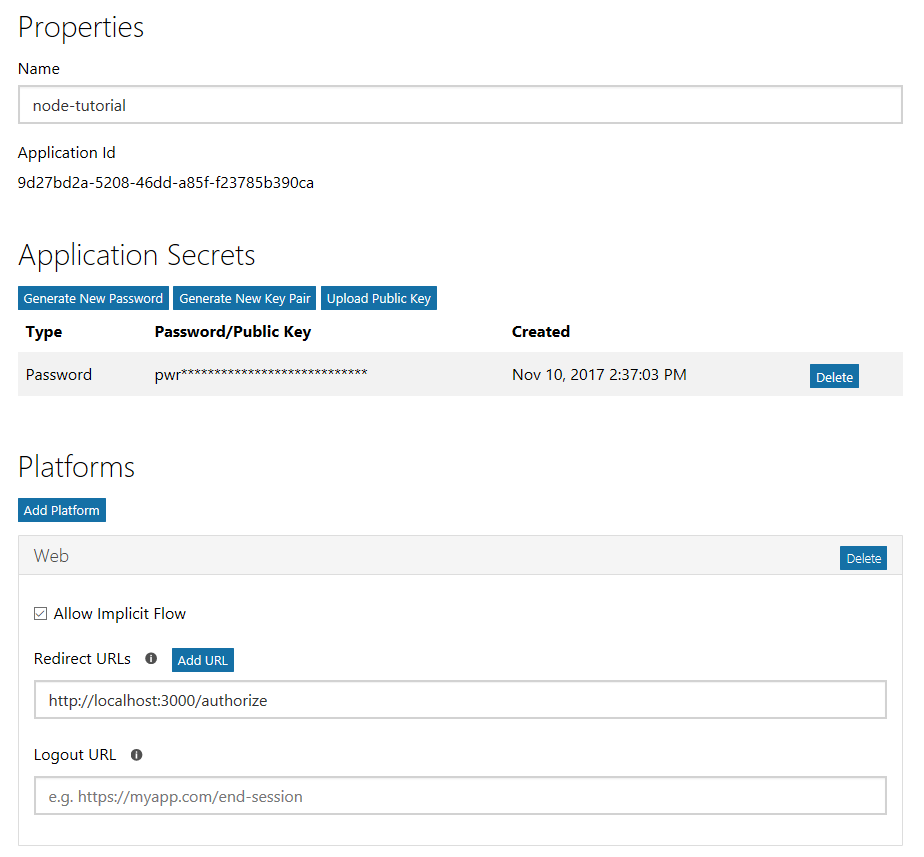
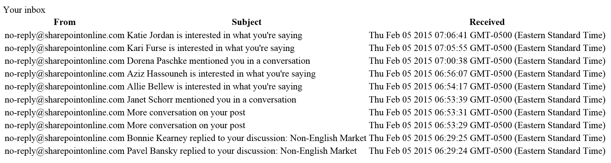

# Write a Node.js app to get Outlook mail

The purpose of this guide is to walk through the process of creating a simple Node.js app that retrieves messages in Office 365 or Outlook.com. The source code in this [repository](https://github.com/jasonjoh/node-tutorial) is what you should end up with if you follow the steps outlined here.

This guide will use the [Microsoft Graph](https://developer.microsoft.com/en-us/graph/) to access Outlook mail. Microsoft recommends using the Microsoft Graph to access Outlook mail, calendar, and contacts. You should use the Outlook APIs directly (via `https://outlook.office.com/api`) only if you require a feature that is not available on the Graph endpoints. For a version of this sample that uses the Outlook APIs, see [this branch](https://github.com/jasonjoh/node-tutorial/tree/outlook-api).

This guide assumes that you already have Node.js installed and working on your development machine. 

## Create the app

Let's dive right in! Create an empty directory where you want to create your new Node.js app. For the purposes of this guide I will assume the name of the directory is `node-tutorial`, but feel free to use any name you like.

Open a command prompt in the `node-tutorial` directory, and run the following command:

```Shell
npm init
```

Press **ENTER** at all the prompts to accept the defaults. When you are done, you should have a basic `package.json` file. Using your favorite JavaScript editor, open this file and replace the existing `scripts` value with the following:

```json
"scripts": {
  "start": "node index.js"
},
```

Create a new file called `server.js`. Paste the following code into `server.js` and save it.

#### Contents of the `.\server.js` file

```js
var http = require('http');
var url = require('url');

function start(route, handle) {
  function onRequest(request, response) {
    var pathName = url.parse(request.url).pathname;
    console.log('Request for ' + pathName + ' received.');
    route(handle, pathName, response, request);
  }
  
  var port = 8000;
  http.createServer(onRequest).listen(port);
  console.log('Server has started. Listening on port: ' + port + '...');
}

exports.start = start;
```

If you're familiar with Node.js, this is nothing new for you. If you're new to it, this is basic code to allow Node to run a web server listening on port 8000. When requests come in, it sends them to the `route` function, which we need to implement!

Create a new file called `router.js`, and add the following code.

#### Contents of the `.\router.js` file

```js
function route(handle, pathname, response, request) {
  console.log('About to route a request for ' + pathname);
  if (typeof handle[pathname] === 'function') {
    return handle[pathname](response, request);
  } else {
    console.log('No request handler found for ' + pathname);
    response.writeHead(404 ,{'Content-Type': 'text/plain'});
    response.write('404 Not Found');
    response.end();
  }
}

exports.route = route;
```

This code looks up a function to call based on the requested path. It uses the `handle` array, which we haven't defined yet. Create a new file called `index.js`, and add the following code.

#### Contents of the `.\index.js` file

```js
var server = require('./server');
var router = require('./router');

var handle = {};
handle['/'] = home;

server.start(router.route, handle);

function home(response, request) {
  console.log('Request handler \'home\' was called.');
  response.writeHead(200, {'Content-Type': 'text/html'});
  response.write('<p>Hello world!</p>');
  response.end();
}
```

At this point, you should have a working app. Open a command prompt to the directory where your files are located, and enter the following command.

```Shell
npm start
```

You should get a confirmation saying `Server has started.` Open your browser and navigate to [http://localhost:8000](http://localhost:8000). You should see "Hello world!".

Now that we've confirmed that the app is working, we're ready to do some real work.

## Designing the app

Our app will be very simple. When a user visits the site, they will see a link to log in and view their email. Clicking that link will take them to the Azure login page where they can login with their Office 365 or Outlook.com account and grant access to our app. Finally, they will be redirected back to our app, which will display a list of the most recent email in the user's inbox.

Let's begin by replacing the "Hello world!" message with a signon link. To do that, we'll modify the `home` function in `index.js`. Open this file in your favorite text editor. Update the `home` function to match the following.

#### Updated `home` function

```js
function home(response, request) {
  console.log('Request handler \'home\' was called.');
  response.writeHead(200, {'Content-Type': 'text/html'});
  response.write('<p>Please <a href='#'>sign in</a> with your Office 365 or Outlook.com account.</p>');
  response.end();
}
```

As you can see, our home page will be very simple. For now, the link doesn't do anything, but we'll fix that soon.

## Register the app

[!include[App Registration Intro](~/includes/rest/app-registration-intro.md)]

Head over to the [Application Registration Portal](https://apps.dev.microsoft.com/) to quickly get an application ID and secret. 

1. Using the **Sign in** link, sign in with either your Microsoft account (Outlook.com), or your work or school account (Office 365).
1. Click the **Add an app** button. Enter `node-tutorial` for the name and click **Create application**. 
1. Locate the **Application Secrets** section, and click the **Generate New Password** button. Copy the password now and save it to a safe place. Once you've copied the password, click **Ok**.
1. Locate the **Platforms** section, and click **Add Platform**. Choose **Web**, then enter `http://localhost:8000/authorize` under **Redirect URIs**.
1. Click **Save** to complete the registration. Copy the **Application Id** and save it along with the password you copied earlier. We'll need those values soon.

Here's what the details of your app registration should look like when you are done.



## Implementing OAuth2

Our goal in this section is to make the link on our home page initiate the [OAuth2 Authorization Code Grant flow with Azure AD](https://msdn.microsoft.com/en-us/library/azure/dn645542.aspx). To make things easier, we'll use the [simple-oauth2 library](https://github.com/andreareginato/simple-oauth2) to handle our OAuth requests. At your command prompt, enter the following command.

```Shell
npm install simple-oauth2 --save
```

Now the library is installed and ready to use. Create a new file called `authHelper.js`. We'll start here by defining a function to generate the login URL.

#### Contents of the `.\authHelper.js` file

```js
var credentials = {
  client: {
    id: 'YOUR APP ID HERE',
    secret: 'YOUR APP PASSWORD HERE',
  },
  auth: {
    tokenHost: 'https://login.microsoftonline.com',
    authorizePath: 'common/oauth2/v2.0/authorize',
    tokenPath: 'common/oauth2/v2.0/token'
  }
};
var oauth2 = require('simple-oauth2')(credentials);

var redirectUri = 'http://localhost:8000/authorize';

// The scopes the app requires
var scopes = [ 'openid',
               'User.Read',
               'Mail.Read' ];
    
function getAuthUrl() {
  var returnVal = oauth2.authorizationCode.authorizeURL({
    redirect_uri: redirectUri,
    scope: scopes.join(' ')
  });
  console.log('Generated auth url: ' + returnVal);
  return returnVal;
}

exports.getAuthUrl = getAuthUrl;
```

The first thing we do here is define our client ID and secret. We also define a redirect URI and an array of scopes. The scope array includes the `openid`, `User.Read`, and `Mail.Read` scopes, since we will only read the user's mail. Replace the `YOUR APP ID HERE` with the application ID and `YOUR APP PASSWORD HERE` with the password you generated in step 3 and save your changes.

### Back to coding ###

Now that we have actual values for the client ID and secret, let's put the `simple-oauth` library to work. Modify the `home` function in the `index.js` file to use the `getAuthUrl` function to fill in the link. You'll need to require the `authHelper` file to gain access to this function.

#### Updated contents of the `.\index.js` file

```js
var server = require('./server');
var router = require('./router');
var authHelper = require('./authHelper');

var handle = {};
handle['/'] = home;

server.start(router.route, handle);

function home(response, request) {
  console.log('Request handler \'home\' was called.');
  response.writeHead(200, {'Content-Type': 'text/html'});
  response.write('<p>Please <a href="' + authHelper.getAuthUrl() + '">sign in</a> with your Office 365 or Outlook.com account.</p>');
  response.end();
}
```

Save your changes and browse to [http://localhost:8000](http://localhost:8000). If you hover over the link, it should look like:

    https://login.microsoftonline.com/common/oauth2/authorize?redirect_uri=http%3A%2F%2Flocalhost%3A8000%2Fauthorize&scope=openid+User.Read+Mail.Read&response_type=code&client_id=<SOME GUID>

The `<SOME GUID>` portion should match your client ID. Click on the link and  you should be presented with a sign in page. Sign in with your Office 365 or Outlook.com account. Your browser should redirect to back to our app, and you should see a lovely error:

``` http
404 Not Found
```

The reason we're seeing the error is because we haven't implemented a route to handle the `/authorize` path we hard-coded as our redirect URI. Let's fix that error now.

### Exchanging the code for a token

First, let's add a route for the `/authorize` path to the `handle` array in `index.js`.

#### Updated handle array in `.\index.js`####

```js
var handle = {};
handle['/'] = home;
handle['/authorize'] = authorize;
```

The added line tells our router that when a GET request comes in for `/authorize`, invoke the `authorize` function. So to make this work, we need to implement that function. Add the following function to `index.js`.

#### `authorize` function in the `.\index.js` file

```js
var url = require('url');
function authorize(response, request) {
  console.log('Request handler \'authorize\' was called.');
  
  // The authorization code is passed as a query parameter
  var url_parts = url.parse(request.url, true);
  var code = url_parts.query.code;
  console.log('Code: ' + code);
  response.writeHead(200, {'Content-Type': 'text/html'});
  response.write('<p>Received auth code: ' + code + '</p>');
  response.end();
}
```

Restart the Node server and refresh your browser (or repeat the sign-in process). Now instead of an error, you should see the value of the authorization code printed on the screen. We're getting closer, but that's still not very useful. Let's actually do something with that code.

Let's add another helper function to `authHelper.js` called `getTokenFromCode`.

#### `getTokenFromCode` in the `.\authHelper.js` file

```js
function getTokenFromCode(auth_code, callback, response) {
  var token;
  oauth2.authorizationCode.getToken({
    code: auth_code,
    redirect_uri: redirectUri,
    scope: scopes.join(' ')
  }, function (error, result) {
    if (error) {
      console.log('Access token error: ', error.message);
      callback(response, error, null);
    } else {
      token = oauth2.accessToken.create(result);
      console.log('Token created: ', token.token);
      callback(response, null, token);
    }
  });
}

exports.getTokenFromCode = getTokenFromCode;
```

### Getting the user's email address ###

Our first use of the access token will be to get the user's email address from the Outlook API. You'll see why we want this soon.

In order to use the Outlook API, install the [Microsoft Graph JavaScript Client Library](https://github.com/microsoftgraph/msgraph-sdk-javascript) from the command line.

```Shell
npm install @microsoft/microsoft-graph-client es6-promise --save
```

Then require the `microsoft-graph-client` library by adding the following line to `index.js`.

```js
var microsoftGraph = require("@microsoft/microsoft-graph-client");
```

Add a new function `getUserEmail` to `index.js`.

#### `getUserEmail` in the `.\index.js` file ####

```js
function getUserEmail(token, callback) {
  // Create a Graph client
  var client = microsoftGraph.Client.init({
    authProvider: (done) => {
      // Just return the token
      done(null, token);
    }
  });

  // Get the Graph /Me endpoint to get user email address
  client
    .api('/me')
    .get((err, res) => {
      if (err) {
        callback(err, null);
      } else {
        callback(null, res.mail);
      }
    });
}
```

Let's make sure that works. Modify the `authorize` function in the `index.js` file to use these helper functions and display the return values. Note that `getToken` function is asynchronous, so we need to implement a callback function to receive the results.

#### Updated `authorize` function in `.\index.js`

```js
function authorize(response, request) {
  console.log('Request handler \'authorize\' was called.');
  
  // The authorization code is passed as a query parameter
  var url_parts = url.parse(request.url, true);
  var code = url_parts.query.code;
  console.log('Code: ' + code);
  authHelper.getTokenFromCode(code, tokenReceived, response);
}
```

#### Callback function `tokenReceived` in `.\index.js`

```js
function tokenReceived(response, error, token) {
  if (error) {
    console.log('Access token error: ', error.message);
    response.writeHead(200, {'Content-Type': 'text/html'});
    response.write('<p>ERROR: ' + error + '</p>');
    response.end();
  } else {
    getUserEmail(token.token.access_token, function(error, email) {
      if (error) {
        console.log('getUserEmail returned an error: ' + error);
        response.write('<p>ERROR: ' + error + '</p>');
        response.end();
      } else if (email) {
        response.writeHead(200, {'Content-Type': 'text/html'});
        response.write('<p>Email: ' + email + '</p>');
        response.write('<p>Access token: ' + token.token.access_token + '</p>');
        response.end();
      }
    });
  }
}
```

If you save your changes, restart the server, and go through the sign-in process again, you should now see the user's email and a long string of seemingly nonsensical characters. If everything's gone according to plan, that should be an access token.

Now let's change our code to store the token and email in a session cookie instead of displaying them.

#### New version of `tokenReceived` function ####

```js
function tokenReceived(response, error, token) {
  if (error) {
    console.log('Access token error: ', error.message);
    response.writeHead(200, {'Content-Type': 'text/html'});
    response.write('<p>ERROR: ' + error + '</p>');
    response.end();
  } else {
    getUserEmail(token.token.access_token, function(error, email){
      if (error) {
        console.log('getUserEmail returned an error: ' + error);
        response.write('<p>ERROR: ' + error + '</p>');
        response.end();
      } else if (email) {
        var cookies = ['node-tutorial-token=' + token.token.access_token + ';Max-Age=3600',
                       'node-tutorial-email=' + email + ';Max-Age=3600'];
        response.setHeader('Set-Cookie', cookies);
        response.writeHead(302, {'Location': 'http://localhost:8000/mail'});
        response.end();
      }
    }); 
  }
}
```

Let's also add a helper function to read cookie values.

#### `getValueFromCookie` in `.\index.js`

```js
function getValueFromCookie(valueName, cookie) {
  if (cookie.indexOf(valueName) !== -1) {
    var start = cookie.indexOf(valueName) + valueName.length + 1;
    var end = cookie.indexOf(';', start);
    end = end === -1 ? cookie.length : end;
    return cookie.substring(start, end);
  }
}
```

### Refreshing the access token

Access tokens returned from Azure are valid for an hour. If you use the token after it has expired, the API calls will return 401 errors. You could ask the user to sign in again, but the better option is to refresh the token silently.

In order to do that, the app must request the `offline_access` scope. Add this scope to the `scopes` array in `authHelper.js`:

```js
// The scopes the app requires
var scopes = [ 'openid',
               'offline_access',
               'User.Read',
               'Mail.Read' ];
```

This will cause the token response from Azure to include a refresh token. Let's update the `tokenReceived` function to save the refresh token and the expiration time in a session cookie.

#### New version of `tokenReceived` function ####

```js
function tokenReceived(response, error, token) {
  if (error) {
    console.log('Access token error: ', error.message);
    response.writeHead(200, {'Content-Type': 'text/html'});
    response.write('<p>ERROR: ' + error + '</p>');
    response.end();
  } else {
    getUserEmail(token.token.access_token, function(error, email){
      if (error) {
        console.log('getUserEmail returned an error: ' + error);
        response.write('<p>ERROR: ' + error + '</p>');
        response.end();
      } else if (email) {
        var cookies = ['node-tutorial-token=' + token.token.access_token + ';Max-Age=4000',
                       'node-tutorial-refresh-token=' + token.token.refresh_token + ';Max-Age=4000',
                       'node-tutorial-token-expires=' + token.token.expires_at.getTime() + ';Max-Age=4000',
                       'node-tutorial-email=' + email + ';Max-Age=4000'];
        response.setHeader('Set-Cookie', cookies);
        response.writeHead(302, {'Location': 'http://localhost:8000/mail'});
        response.end();
      }
    }); 
  }
}
```

Now let's add a helper function in `index.js` to retrieve the cached token, check if it is expired, and refresh it if so.

#### `getAccessToken` in the `.\index.js` file ####

```js
function getAccessToken(request, response, callback) {
  var expiration = new Date(parseFloat(getValueFromCookie('node-tutorial-token-expires', request.headers.cookie)));

  if (expiration <= new Date()) {
    // refresh token
    console.log('TOKEN EXPIRED, REFRESHING');
    var refresh_token = getValueFromCookie('node-tutorial-refresh-token', request.headers.cookie);
    authHelper.refreshAccessToken(refresh_token, function(error, newToken){
      if (error) {
        callback(error, null);
      } else if (newToken) {
        var cookies = ['node-tutorial-token=' + newToken.token.access_token + ';Max-Age=4000',
                       'node-tutorial-refresh-token=' + newToken.token.refresh_token + ';Max-Age=4000',
                       'node-tutorial-token-expires=' + newToken.token.expires_at.getTime() + ';Max-Age=4000'];
        response.setHeader('Set-Cookie', cookies);
        callback(null, newToken.token.access_token);
      }
    });
  } else {
    // Return cached token
    var access_token = getValueFromCookie('node-tutorial-token', request.headers.cookie);
    callback(null, access_token);
  }
}
```

Finally, let's add the `refreshAccessToken` function to `authHelper.js`.

#### `refreshAccessToken` in the `.\authHelper.js` file ####

```js
function refreshAccessToken(refreshToken, callback) {
  var tokenObj = oauth2.accessToken.create({refresh_token: refreshToken});
  tokenObj.refresh(callback);
}

exports.refreshAccessToken = refreshAccessToken;
```

## Using the Mail API ##

Now that we can get an access token, we're in a good position to do something with the Mail API. Let's start by creating a `mail` route and function. Open the `index.js` file and update the `handle` array.

#### Updated handle array in `.\index.js`

```js
var handle = {};
handle['/'] = home;
handle['/authorize'] = authorize;
handle['/mail'] = mail;
```

Then add the `mail` function.

#### `mail` function in `.\index.js`

```js
function mail(response, request) {
  getAccessToken(request, response, function(error, token) {
    console.log('Token found in cookie: ', token);
    var email = getValueFromCookie('node-tutorial-email', request.headers.cookie);
    console.log('Email found in cookie: ', email);
    if (token) {
      response.writeHead(200, {'Content-Type': 'text/html'});
      response.write('<p>Token retrieved from cookie: ' + token + '</p>');
      response.end();
    } else {
      response.writeHead(200, {'Content-Type': 'text/html'});
      response.write('<p> No token found in cookie!</p>');
      response.end();
    }
  });
}
```

For now all this does is read the token back from the cookie and display it. Save your changes, restart the server, and go through the signon process again. You should see the token displayed. Now that we know we have access to the token in the `mail` function, we're ready to call the Mail API. Update the `mail` function to query the inbox.

#### New version of the `mail` function in `./index.js`

```js
function mail(response, request) {
  getAccessToken(request, response, function(error, token) {
    console.log('Token found in cookie: ', token);
    var email = getValueFromCookie('node-tutorial-email', request.headers.cookie);
    console.log('Email found in cookie: ', email);
    if (token) {
      response.writeHead(200, {'Content-Type': 'text/html'});
      response.write('<div><h1>Your inbox</h1></div>');

      // Create a Graph client
      var client = microsoftGraph.Client.init({
        authProvider: (done) => {
          // Just return the token
          done(null, token);
        }
      });

      // Get the 10 newest messages
      client
        .api('/me/mailfolders/inbox/messages')
        .header('X-AnchorMailbox', email)
        .top(10)
        .select('subject,from,receivedDateTime,isRead')
        .orderby('receivedDateTime DESC')
        .get((err, res) => {
          if (err) {
            console.log('getMessages returned an error: ' + err);
            response.write('<p>ERROR: ' + err + '</p>');
            response.end();
          } else {
            console.log('getMessages returned ' + res.value.length + ' messages.');
            response.write('<table><tr><th>From</th><th>Subject</th><th>Received</th></tr>');
            res.value.forEach(function(message) {
              console.log('  Subject: ' + message.subject);
              var from = message.from ? message.from.emailAddress.name : 'NONE';
              response.write('<tr><td>' + from + 
                '</td><td>' + (message.isRead ? '' : '<b>') + message.subject + (message.isRead ? '' : '</b>') +
                '</td><td>' + message.receivedDateTime.toString() + '</td></tr>');
            });
            
            response.write('</table>');
            response.end();
          }
        });
    } else {
      response.writeHead(200, {'Content-Type': 'text/html'});
      response.write('<p> No token found in cookie!</p>');
      response.end();
    }
  });
}
```

To summarize the new code in the `mail` function:

- It creates a Graph client object and initializes it to use the access token passed to the function.
- It sets the `X-AnchorMailbox` header on the request, which enables the API endpoint to route API calls to the appropriate backend mailbox server more efficiently. This is why we went to the trouble to get the user's email earlier.
- It calls the `/me/mailfolders/inbox/messages` API to get inbox messages, and uses other methods to control the request:
    - It uses the `top` method with a value of `10` to limit the results to the first 10.
    - It uses the `select` method to only request the `subject`, `from`, `receivedDateTime`, and `isRead` properties.
    - It uses the `orderby` method with a value of `receivedDateTime desc` to get the newest messages first.
- It loops over the results and prints out the sender, the subject, and the date/time the message was received.

### Displaying the results

Save the changes and sign in to the app. You should now see a simple table of messages in your inbox.



## Adding Calendar and Contacts APIs

Now that you've mastered calling the Outlook Mail API, doing the same for Calendar and Contacts APIs is similar and easy.

> [!TIP]
> If you've followed along with the tutorial, you probably have an access token saved in your session cookie. That token will only be valid for the `Mail.Read` scope. In order to call the Calendar or Contacts API, we will need to add new scopes. Be sure to restart your browser to get rid of the session cookie so that you can start the login process from the beginning to get a new access token.

### For Calendar API:

1. Update the `scopes` array in `authHelper.js` to include the `Calendars.Read` scope.

    ```js
    // The scopes the app requires
    var scopes = [ 'openid',
                   'offline_access',
                   'User.Read',
                   'Mail.Read',
                   'Calendars.Read' ];
    ```

1. Add a `calendar` route in `index.js`.

    ```js
    handle['/calendar'] = calendar;
    ```

1. Add a `calendar` function in `index.js`. Copy the code from the `mail` function, replacing the calls to the Mail API with the following code.

    ```js
    response.writeHead(200, {'Content-Type': 'text/html'});
    response.write('<div><h1>Your calendar</h1></div>');

    // Create a Graph client
    var client = microsoftGraph.Client.init({
      authProvider: (done) => {
        // Just return the token
        done(null, token);
      }
    });

    // Get the 10 events with the greatest start date
    client
      .api('/me/events')
      .header('X-AnchorMailbox', email)
      .top(10)
      .select('subject,start,end')
      .orderby('start/dateTime DESC')
      .get((err, res) => {
        if (err) {
          console.log('getEvents returned an error: ' + err);
          response.write('<p>ERROR: ' + err + '</p>');
          response.end();
        } else {
          console.log('getEvents returned ' + res.value.length + ' events.');
          response.write('<table><tr><th>Subject</th><th>Start</th><th>End</th><th>Attendees</th></tr>');
          res.value.forEach(function(event) {
            console.log('  Subject: ' + event.subject);
            response.write('<tr><td>' + event.subject + 
              '</td><td>' + event.start.dateTime.toString() +
              '</td><td>' + event.end.dateTime.toString() + '</td></tr>');
          });
          
          response.write('</table>');
          response.end();
        }
      });
    ```

1. Restart the app. After signing in, browse to `http://localhost:8000/calendar`.

### For Contacts API:

1. Update the `scopes` array in `authHelper.js` to include the `Contacts.Read` scope.

    ```js
    // The scopes the app requires
    var scopes = [ 'openid',
                   'offline_access',
                   'User.Read',
                   'Mail.Read',
                   'Contacts.Read' ];
    ```

1. Add a `contacts` route in `index.js`.

    ```js
    handle['/contacts'] = contacts;
    ```

1. Add a `contacts` function in `index.js`. Copy the code from the `mail` function, replacing the calls to the Mail API with the following code.

    ```js
    response.writeHead(200, {'Content-Type': 'text/html'});
    response.write('<div><h1>Your contacts</h1></div>');

    // Create a Graph client
    var client = microsoftGraph.Client.init({
      authProvider: (done) => {
        // Just return the token
        done(null, token);
      }
    });

    // Get the first 10 contacts in alphabetical order
    // by given name
    client
      .api('/me/contacts')
      .header('X-AnchorMailbox', email)
      .top(10)
      .select('givenName,surname,emailAddresses')
      .orderby('givenName ASC')
      .get((err, res) => {
        if (err) {
          console.log('getContacts returned an error: ' + err);
          response.write('<p>ERROR: ' + err + '</p>');
          response.end();
        } else {
          console.log('getContacts returned ' + res.value.length + ' contacts.');
          response.write('<table><tr><th>First name</th><th>Last name</th><th>Email</th></tr>');
          res.value.forEach(function(contact) {
            var email = contact.emailAddresses[0] ? contact.emailAddresses[0].address : 'NONE';
            response.write('<tr><td>' + contact.givenName + 
              '</td><td>' + contact.surname +
              '</td><td>' + email + '</td></tr>');
          });
          
          response.write('</table>');
          response.end();
        }
      });
    ```

1. Restart the app. After signing in, browse to `http://localhost:8000/contacts`.