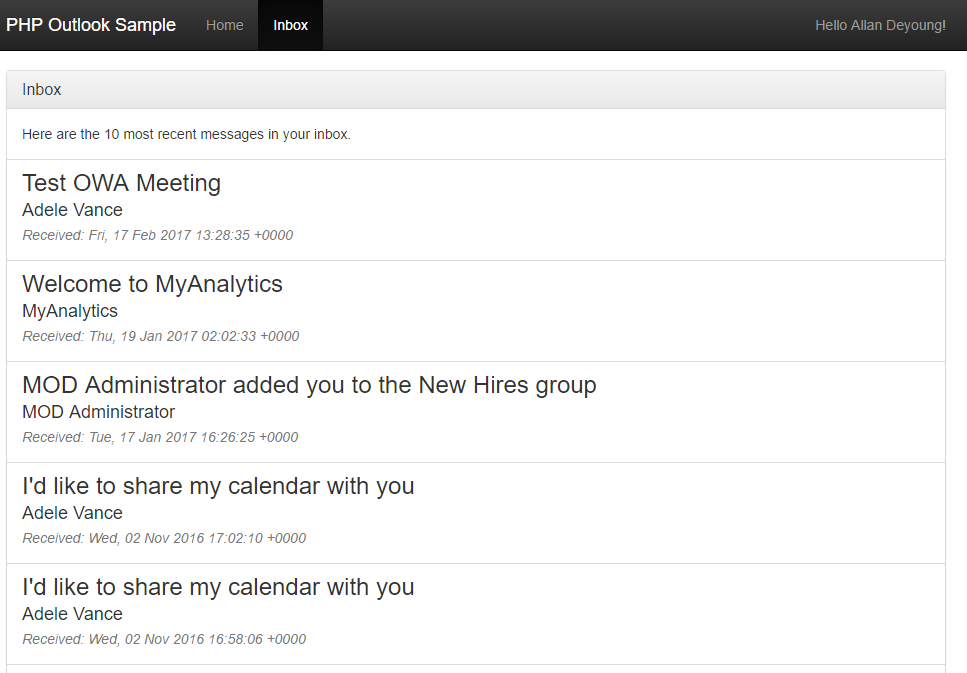

# Write a PHP app to get Outlook mail, calendar, and contacts

The purpose of this guide is to walk through the process of creating a simple PHP app that retrieves messages in Office 365 or Outlook.com. The source code in this [repository](https://github.com/jasonjoh/php-tutorial) is what you should end up with if you follow the steps outlined here.

This guide will use [Microsoft Graph](/graph/overview) to access Outlook mail. Microsoft recommends using Microsoft Graph to access Outlook mail, calendar, and contacts. You should use the Outlook APIs directly (via `https://outlook.office.com/api`) only if you require a feature that is not available on the Graph endpoints. For a version of this sample that uses the Outlook APIs, see [this branch](https://github.com/jasonjoh/php-tutorial/tree/outlook-api).

This guide assumes that you already have PHP installed and working on your development machine. The tutorial was created using PHP 5.6.30.

## Create the app

Let's dive right in! To start, we're going to use [PHP 7.1](https://secure.php.net/downloads.php), [Composer](https://getcomposer.org/) and [Laravel](https://laravel.com) to quickly create our PHP app. If you don't already have these tools installed, please install them before proceeding.

On your development machine, open your command prompt or shell to a directory where you want to create your new project. Enter the following command to create the project.

```Shell
laravel new php-tutorial
```

This will create new `php-tutorial` directory, scaffold the project, and download dependencies. Once the command completes, let's make sure that everything is working. Change your current directory to the `php-tutorial` directory, and run the following command to start the Laravel development server.

```Shell
php artisan serve
```

Open your brower and browse to `http://localhost:8000`. You should see a default Laravel start page.

## Designing the app

Our app will be very simple. When a user visits the site, they will see a link to log in and view their email. Clicking that link will take them to the Azure login page where they can login with their Office 365 or Outlook.com account and grant access to our app. Finally, they will be redirected back to our app, which will display a list of the most recent email in the user's inbox.

Let's begin by creating a layout. Create a new file named `layout.blade.php` in  the `./php-tutorial/resources/views` directory and add the following code.

#### Contents of the `./php-tutorial/resources/views/layout.blade.php` file

```PHP
<!DOCTYPE html>
<html>
  <head>
    <title>PHP Outlook Sample</title>
    <link rel="stylesheet" href="https://maxcdn.bootstrapcdn.com/bootstrap/3.3.7/css/bootstrap.min.css" integrity="sha384-BVYiiSIFeK1dGmJRAkycuHAHRg32OmUcww7on3RYdg4Va+PmSTsz/K68vbdEjh4u" crossorigin="anonymous">
    <link rel="stylesheet" href="https://maxcdn.bootstrapcdn.com/bootstrap/3.3.7/css/bootstrap-theme.min.css" integrity="sha384-rHyoN1iRsVXV4nD0JutlnGaslCJuC7uwjduW9SVrLvRYooPp2bWYgmgJQIXwl/Sp" crossorigin="anonymous">
    <link rel="stylesheet" href="{{ asset('/css/app.css') }}">
  </head>
  <body>
    <nav class="navbar navbar-inverse navbar-fixed-top">
      <div class="container">
        <div class="navbar-header">
          <button type="button" class="navbar-toggle collapsed" data-toggle="collapse" data-target="#navbar" aria-expanded="false" aria-controls="navbar">
            <span class="sr-only">Toggle navigation</span>
            <span class="icon-bar"></span>
            <span class="icon-bar"></span>
            <span class="icon-bar"></span>
          </button>
          <a class="navbar-brand" href="#">PHP Outlook Sample</a>
        </div>
        <div id="navbar" class="navbar-collapse collapse">
          <ul class="nav navbar-nav">
            <li class="<?php echo ($_SERVER['REQUEST_URI'] == '/' ? 'active' : '');?>"><a href="/">Home</a></li>
            <li class="<?php echo ($_SERVER['REQUEST_URI'] == '/mail' ? 'active' : '');?>"><a href="/mail">Inbox</a></li>
          </ul>
          <?php if(isset($username)) { ?>
          <ul class="nav navbar-nav navbar-right">
            <li><p class="navbar-text">Hello <?php echo $username ?>!</p></li>
          </ul>
          <?php } ?>
        </div><!--/.nav-collapse -->
      </div>
    </nav>

    <div class="container" role="main">
      @yield('content')
    </div>

    <script src="https://maxcdn.bootstrapcdn.com/bootstrap/3.3.7/js/bootstrap.min.js" integrity="sha384-Tc5IQib027qvyjSMfHjOMaLkfuWVxZxUPnCJA7l2mCWNIpG9mGCD8wGNIcPD7Txa" crossorigin="anonymous"></script>
  </body>
</html>
```

This just gives us a basic HTML structure and adds [Bootstrap](https://getbootstrap.com/) for styling.

Now let's remove the default CSS code from `./php-tutorial/public/css/app.css` and add some basic styling so we're just using Bootstrap's defaults. Open the file and it's entire contents with the following.

#### Contents of the `./php-tutorial/public/css/app.css` file

```css
body {
  padding-top: 70px;
  padding-bottom: 30px;
}
```

Now we'll modify the existing home page to use this layout. Open the `./php-tutorial/resources/views/welcome.blade.php` file and replace it's contents with the following code.

#### Contents of the `./php-tutorial/resources/views/welcome.blade.php` file

```PHP
@extends('layout')

@section('content')
<div class="jumbotron">
  <h1>PHP Outlook Sample</h1>
  <p>This example shows how to get an OAuth token from Azure using the <a href="https://docs.microsoft.com/azure/active-directory/develop/active-directory-v2-protocols-oauth-code" target="_blank">authorization code grant flow</a> and to use that token to make calls to the Outlook APIs in the <a href="https://docs.microsoft.com/en-us/graph/overview" target="_blank">Microsoft Graph</a>.</p>
  <p>
    <a class="btn btn-lg btn-primary" href="/signin" role="button" id="connect-button">Connect to Outlook</a>
  </p>
</div>
@endsection
```

The **Connect to Outlook** button doesn't do anything yet, but we'll fix that soon.

## Register the app

[!include[App Registration Intro](~/includes/rest/app-registration-intro.md)]

Head over to the [Application Registration Portal](https://apps.dev.microsoft.com/) to quickly get an application ID and secret.

1. Using the **Sign in** link, sign in with either your Microsoft account (Outlook.com), or your work or school account (Office 365).
1. Click the **Add an app** button. Enter `php-tutorial` for the name and click **Create application**.
1. Locate the **Application Secrets** section, and click the **Generate New Password** button. Copy the password now and save it to a safe place. Once you've copied the password, click **Ok**.
1. Locate the **Platforms** section, and click **Add Platform**. Choose **Web**, then enter `http://localhost:8000/authorize` under **Redirect URIs**.
1. Click **Save** to complete the registration. Copy the **Application Id** and save it along with the password you copied earlier. We'll need those values soon.

Here's what the details of your app registration should look like when you are done.


## Implementing OAuth2

Our goal in this section is to make the button on our home page initiate the [OAuth2 Authorization Code Grant flow with Azure AD](/azure/active-directory/develop/active-directory-v2-protocols-oauth-code).

We'll use the [League OAuth 2 Client](https://github.com/thephpleague/oauth2-client) to handle our authorization and token requests. Let's install that before proceeding.

Open the `./php-tutorial/composer.json` file and locate the `require` entry. Update this entry to add `"league/oauth2-client": "^2.0"` and save the file.

#### Updated `require` entry in `./php-tutorial/composer.json`

```json
"require": {
    "php": ">=5.6.4",
    "laravel/framework": "5.4.*",
    "laravel/tinker": "~1.0",
    "league/oauth2-client": "^2.0"
},
```

Run the following command from your command prompt/shell in the `php-tutorial` directory.

```Shell
composer update
```

This will install the OAuth 2 client and dependencies into your `./php-tutorial/vendors` folder.

Once composer is done downloading the required libraries, let's create a new controller to contain all of our OAuth functions. Create a new file in the `./php-tutorial/app/Http/Controllers` directory called `AuthController.php`. Add the following code.

#### Contents of the `./php-tutorial/app/Http/Controllers/AuthController.php` file

```PHP
<?php

namespace App\Http\Controllers;

use App\Http\Controllers\Controller;

class AuthController extends Controller
{
  public function signin()
  {
    if (session_status() == PHP_SESSION_NONE) {
      session_start();
    }

    // Initialize the OAuth client
    $oauthClient = new \League\OAuth2\Client\Provider\GenericProvider([
      'clientId'                => env('OAUTH_APP_ID'),
      'clientSecret'            => env('OAUTH_APP_PASSWORD'),
      'redirectUri'             => env('OAUTH_REDIRECT_URI'),
      'urlAuthorize'            => env('OAUTH_AUTHORITY').env('OAUTH_AUTHORIZE_ENDPOINT'),
      'urlAccessToken'          => env('OAUTH_AUTHORITY').env('OAUTH_TOKEN_ENDPOINT'),
      'urlResourceOwnerDetails' => '',
      'scopes'                  => env('OAUTH_SCOPES')
    ]);

    // Output the authorization endpoint
    echo 'Auth URL: '.$oauthClient->getAuthorizationUrl();
    exit();
  }
}
```

Now we need to configure a route to our new controller method. Open the `./php-tutorial/routes/web.php` file and add the following line at the bottom of the file.

#### New entry in `./php-tutorial/routes/web.php`

```PHP
Route::get('/signin', 'AuthController@signin');
```

Now let's configure the app. We'll use environment variables to hold all of the OAuth details. Open the `./php-tutorial/.env` file and add the following lines at the bottom.

#### New entries in `./php-tutorial/.env`

```text
OAUTH_APP_ID=YOUR_APP_ID_HERE
OAUTH_APP_PASSWORD=YOUR_APP_PASSWORD_HERE
OAUTH_REDIRECT_URI=http://localhost:8000/authorize
OAUTH_SCOPES='openid profile offline_access User.Read Mail.Read'
OAUTH_AUTHORITY=https://login.microsoftonline.com/common
OAUTH_AUTHORIZE_ENDPOINT=/oauth2/v2.0/authorize
OAUTH_TOKEN_ENDPOINT=/oauth2/v2.0/token
```

Replace `YOUR_APP_ID_HERE` and `YOUR_APP_PASSWORD_HERE` with the application ID and password you obtained from the App Registration Tool and save the file.

Save all your changes and restart the Laravel development server (`php artisan serve`). Browse to `http://localhost:8000` and click on the **Connect to Outlook** button. You should see the authorization URL printed to the page, which should look something like this.

```http
https://login.microsoftonline.com/common/oauth2/v2.0/authorize?state=48b0ad0b3b443a543cf823f98db760c4&scope=openid%20profile%20offline_access%20User.Read%20Mail.Read&response_type=code&approval_prompt=auto&redirect_uri=http%3A%2F%2Flocalhost%3A8000%2Foauth&client_id=<YOUR_CLIENT_ID>
```

Now let's update the app to actually navigate to that URL so the user can sign in and grant access to the app. We'll also add another controller method to receive the redirect back from the Azure authorization endpoint. First, replace the existing `signin` method in `./php-tutorial/app/Http/Controllers/AuthController.php` with this one.

```PHP
public function signin()
{
  if (session_status() == PHP_SESSION_NONE) {
    session_start();
  }

  // Initialize the OAuth client
  $oauthClient = new \League\OAuth2\Client\Provider\GenericProvider([
    'clientId'                => env('OAUTH_APP_ID'),
    'clientSecret'            => env('OAUTH_APP_PASSWORD'),
    'redirectUri'             => env('OAUTH_REDIRECT_URI'),
    'urlAuthorize'            => env('OAUTH_AUTHORITY').env('OAUTH_AUTHORIZE_ENDPOINT'),
    'urlAccessToken'          => env('OAUTH_AUTHORITY').env('OAUTH_TOKEN_ENDPOINT'),
    'urlResourceOwnerDetails' => '',
    'scopes'                  => env('OAUTH_SCOPES')
  ]);

  // Generate the auth URL
  $authorizationUrl = $oauthClient->getAuthorizationUrl();

  // Save client state so we can validate in response
  $_SESSION['oauth_state'] = $oauthClient->getState();

  // Redirect to authorization endpoint
  header('Location: '.$authorizationUrl);
  exit();
}
```

Instead of printing the URL to the response, it saves the client state to the session and uses the `Location` header to redirect the browser.

Now, let's add an `authorize` method to receive the redirect back from Azure and extract the authorization code from the response. Add the following method in `./php-tutorial/app/Http/Controllers/AuthController.php`.

#### New `gettoken` method in `./php-tutorial/app/Http/Controllers/AuthController.php`

```PHP
public function gettoken()
{
  if (session_status() == PHP_SESSION_NONE) {
    session_start();
  }

  // Authorization code should be in the "code" query param
  if (isset($_GET['code'])) {
    echo 'Auth code: '.$_GET['code'];
    exit();
  }
  elseif (isset($_GET['error'])) {
    exit('ERROR: '.$_GET['error'].' - '.$_GET['error_description']);
  }
}
```

Add a new route in `./php-tutorial/routes/web.php`

#### New entry in `./php-tutorial/routes/web.php`

```PHP
Route::get('/authorize', 'AuthController@gettoken');
```

Save your changes and browse to `http://localhost:8000`. This time when you click on the **Connect to Outlook** button you should be redirected to the login page. If you enter your Office 365 or Outlook.com account information and accept the requested permissions, the app will display the authorization code. Now let's do something with it.

### Exchanging the code for a token

Let's update the `gettoken` method to use the OAuth 2 client to make a token request. First we'll verify that the state included in the redirect matches the one we saved in the session after generating the authorization URL, then we'll make the actual token request using the authorization code. Replace the existing `gettoken` with this new one.

#### Updated `gettoken` function in `./php-tutorial/app/Http/Controllers/AuthController.php`

```PHP
public function gettoken()
{
  if (session_status() == PHP_SESSION_NONE) {
    session_start();
  }

  // Authorization code should be in the "code" query param
  if (isset($_GET['code'])) {
    // Check that state matches
    if (empty($_GET['state']) || ($_GET['state'] !== $_SESSION['oauth_state'])) {
      exit('State provided in redirect does not match expected value.');
    }

    // Clear saved state
    unset($_SESSION['oauth_state']);

    // Initialize the OAuth client
    $oauthClient = new \League\OAuth2\Client\Provider\GenericProvider([
      'clientId'                => env('OAUTH_APP_ID'),
      'clientSecret'            => env('OAUTH_APP_PASSWORD'),
      'redirectUri'             => env('OAUTH_REDIRECT_URI'),
      'urlAuthorize'            => env('OAUTH_AUTHORITY').env('OAUTH_AUTHORIZE_ENDPOINT'),
      'urlAccessToken'          => env('OAUTH_AUTHORITY').env('OAUTH_TOKEN_ENDPOINT'),
      'urlResourceOwnerDetails' => '',
      'scopes'                  => env('OAUTH_SCOPES')
    ]);

    try {
      // Make the token request
      $accessToken = $oauthClient->getAccessToken('authorization_code', [
        'code' => $_GET['code']
      ]);

      echo 'Access token: '.$accessToken->getToken();
    }
    catch (League\OAuth2\Client\Provider\Exception\IdentityProviderException $e) {
      exit('ERROR getting tokens: '.$e->getMessage());
    }
    exit();
  }
  elseif (isset($_GET['error'])) {
    exit('ERROR: '.$_GET['error'].' - '.$_GET['error_description']);
  }
}
```

Save your changes and go through the login process in your app again. This time you should see the access token displayed.

### Refreshing the access token

Access tokens returned from Azure are valid for an hour. If you use the token after it has expired, the API calls will return 401 errors. You could ask the user to sign in again, but the better option is to refresh the token silently. So let's work on storing the tokens and refreshing them if needed before we proceed.

First, let's create a new class to manage storing and retrieving the token. Since this is a sample, we'll keep it simple and store everything in the session. For production scenarios, it would be way better to store the refresh token in a secure database.

Create a new folder in the `./php-tutorial/app` directory called `TokenStore`. In this new folder, create a file called `TokenCache.php` and add the following code.

#### Contents of the `./php-tutorial/app/TokenStore/TokenCache.php` file

```PHP
<?php

namespace App\TokenStore;

class TokenCache {
  public function storeTokens($access_token, $refresh_token, $expires) {
    $_SESSION['access_token'] = $access_token;
    $_SESSION['refresh_token'] = $refresh_token;
    $_SESSION['token_expires'] = $expires;
  }

  public function clearTokens() {
    unset($_SESSION['access_token']);
    unset($_SESSION['refresh_token']);
    unset($_SESSION['token_expires']);
  }

  public function getAccessToken() {
    // Check if tokens exist
    if (empty($_SESSION['access_token']) ||
        empty($_SESSION['refresh_token']) ||
        empty($_SESSION['token_expires'])) {
      return '';
    }

    // Check if token is expired
    //Get current time + 5 minutes (to allow for time differences)
    $now = time() + 300;
    if ($_SESSION['token_expires'] <= $now) {
      // Token is expired (or very close to it)
      // so let's refresh

      // Initialize the OAuth client
      $oauthClient = new \League\OAuth2\Client\Provider\GenericProvider([
        'clientId'                => env('OAUTH_APP_ID'),
        'clientSecret'            => env('OAUTH_APP_PASSWORD'),
        'redirectUri'             => env('OAUTH_REDIRECT_URI'),
        'urlAuthorize'            => env('OAUTH_AUTHORITY').env('OAUTH_AUTHORIZE_ENDPOINT'),
        'urlAccessToken'          => env('OAUTH_AUTHORITY').env('OAUTH_TOKEN_ENDPOINT'),
        'urlResourceOwnerDetails' => '',
        'scopes'                  => env('OAUTH_SCOPES')
      ]);

      try {
        $newToken = $oauthClient->getAccessToken('refresh_token', [
          'refresh_token' => $_SESSION['refresh_token']
        ]);

        // Store the new values
        $this->   storeTokens($newToken->getToken(), $newToken->getRefreshToken(),
          $newToken->getExpires());

        return $newToken->getToken();
      }
      catch (League\OAuth2\Client\Provider\Exception\IdentityProviderException $e) {
        return '';
      }
    }
    else {
      // Token is still valid, just return it
      return $_SESSION['access_token'];
    }
  }
}
```

This adds three new functions. The `storeTokens` function will save the values in the session. The `clearTokens` function will remove them. The `getAccessToken` function will check expiration of the current access token and refresh it if necessary.

Now let's update the `gettoken` method to use this new class to store the values and redirect to `/mail` in our app. Replace the existing `gettoken` with this new version.

#### Updated `gettoken` function in `./php-tutorial/app/Http/Controllers/AuthController.php`

```PHP
public function gettoken()
{
  if (session_status() == PHP_SESSION_NONE) {
    session_start();
  }

  // Authorization code should be in the "code" query param
  if (isset($_GET['code'])) {
    // Check that state matches
    if (empty($_GET['state']) || ($_GET['state'] !== $_SESSION['oauth_state'])) {
      exit('State provided in redirect does not match expected value.');
    }

    // Clear saved state
    unset($_SESSION['oauth_state']);

    // Initialize the OAuth client
    $oauthClient = new \League\OAuth2\Client\Provider\GenericProvider([
      'clientId'                => env('OAUTH_APP_ID'),
      'clientSecret'            => env('OAUTH_APP_PASSWORD'),
      'redirectUri'             => env('OAUTH_REDIRECT_URI'),
      'urlAuthorize'            => env('OAUTH_AUTHORITY').env('OAUTH_AUTHORIZE_ENDPOINT'),
      'urlAccessToken'          => env('OAUTH_AUTHORITY').env('OAUTH_TOKEN_ENDPOINT'),
      'urlResourceOwnerDetails' => '',
      'scopes'                  => env('OAUTH_SCOPES')
    ]);

    try {
      // Make the token request
      $accessToken = $oauthClient->getAccessToken('authorization_code', [
        'code' => $_GET['code']
      ]);

      // Save the access token and refresh tokens in session
      // This is for demo purposes only. A better method would
      // be to store the refresh token in a secured database
      $tokenCache = new \App\TokenStore\TokenCache;
      $tokenCache->storeTokens($accessToken->getToken(), $accessToken->getRefreshToken(),
        $accessToken->getExpires());

      // Redirect back to mail page
      return redirect()->route('mail');
    }
    catch (League\OAuth2\Client\Provider\Exception\IdentityProviderException $e) {
      exit('ERROR getting tokens: '.$e->getMessage());
    }
    exit();
  }
  elseif (isset($_GET['error'])) {
    exit('ERROR: '.$_GET['error'].' - '.$_GET['error_description']);
  }
}
```

Before we move on, let's implement a very simple `/mail` route to test our `TokenCache` class. First, create a new controller for our mail view. Create a new file in the `./php-tutorial/app/Http/Controllers` directory called `OutlookController.php`. Add the following code.

#### Contents of the `./php-tutorial/app/Http/Controllers/OutlookController.php` file

```PHP
<?php

namespace App\Http\Controllers;

use App\Http\Controllers\Controller;

class OutlookController extends Controller
{
  public function mail()
  {
    if (session_status() == PHP_SESSION_NONE) {
      session_start();
    }

    $tokenCache = new \App\TokenStore\TokenCache;

    echo 'Token: '.$tokenCache->getAccessToken();
  }
}
```

Open the `./php-tutorial/routes/web.php` file and add the following line at the bottom of the file.

#### New entry in `./php-tutorial/routes/web.php`

```PHP
Route::get('/mail', 'OutlookController@mail')->name('mail');
```

Save your changes, browse to `http://localhost:8000` and sign in again. This time, the app should redirect to `https://localhost:8000/mail` and display the token, verifying that our token cache is working across controllers. Now that we have an access token and we can refresh if needed, we're ready to use the Mail API.

## Using the Mail API

We're going to use the [Microsoft Graph SDK for PHP](https://github.com/microsoftgraph/msgraph-sdk-php) to make all of our Outlook API Calls, so let's start by installing it.

Open the `./php-tutorial/composer.json` file and locate the `require` entry. Update this entry to add `"microsoft/microsoft-graph": "1.0.*"` and save the file.

#### Updated `require` entry in `./php-tutorial/composer.json`

```json
"require": {
    "php": ">=5.6.4",
    "laravel/framework": "5.4.*",
    "laravel/tinker": "~1.0",
    "league/oauth2-client": "^2.0",
    "microsoft/microsoft-graph": "1.0.*"
},
```

Run the following command from your command prompt/shell in the `php-tutorial` directory.

```Shell
composer update
```

Now let's modify the `mail` function. Our first use of the Graph SDK here will be to get the user's name, just to verify that we can call the Microsoft Graph API.

Add the following lines just after the `use App\Http\Controllers\Controller;` line in `OutlookController.php`.

```PHP
use Microsoft\Graph\Graph;
use Microsoft\Graph\Model;
```

Replace the existing `mail` function with the following code.

#### Updated `mail` function in `./php-tutorial/app/Http/Controllers/OutlookController.php`

```PHP
public function mail()
{
  if (session_status() == PHP_SESSION_NONE) {
    session_start();
  }

  $tokenCache = new \App\TokenStore\TokenCache;

  $graph = new Graph();
  $graph->setAccessToken($tokenCache->getAccessToken());

  $user = $graph->createRequest('GET', '/me')
                ->setReturnType(Model\User::class)
                ->execute();

  echo 'User: '.$user->getDisplayName();
}
```

Save your changes and refresh the mail view. You should see the authenticated user's name. (If not, start over at `http://localhost:8000` and login again.)

Now let's add code to retrieve the user's messages. Replace the existing `mail` function with the following.

#### Updated `mail` function in `./php-tutorial/app/Http/Controllers/OutlookController.php`

```PHP
public function mail()
{
  if (session_status() == PHP_SESSION_NONE) {
    session_start();
  }

  $tokenCache = new \App\TokenStore\TokenCache;

  $graph = new Graph();
  $graph->setAccessToken($tokenCache->getAccessToken());

  $user = $graph->createRequest('GET', '/me')
                ->setReturnType(Model\User::class)
                ->execute();

  echo 'User: '.$user->getDisplayName().'<br/>';

  $messageQueryParams = array (
    // Only return Subject, ReceivedDateTime, and From fields
    "\$select" => "subject,receivedDateTime,from",
    // Sort by ReceivedDateTime, newest first
    "\$orderby" => "receivedDateTime DESC",
    // Return at most 10 results
    "\$top" => "10"
  );

  $getMessagesUrl = '/me/mailfolders/inbox/messages?'.http_build_query($messageQueryParams);
  $messages = $graph->createRequest('GET', $getMessagesUrl)
                    ->setReturnType(Model\Message::class)
                    ->execute();

  foreach($messages as $msg) {
    echo 'Message: '.$msg->getSubject().'<br/>';
  }
}
```

To summarize the new code in the `mail` function:

- It creates a Graph client object and initializes it to use the access token passed to the function.
- It calls the `/me/mailfolders/inbox/messages` API to get inbox messages, and uses other methods to control the request:
  - It uses the `top` method with a value of `10` to limit the results to the first 10.
  - It uses the `select` method to only request the `subject`, `from`, `receivedDateTime`, and `isRead` properties.
  - It uses the `orderby` method with a value of `receivedDateTime desc` to get the newest messages first.
- It loops over the results and prints out the subject.

If you restart the app now, you should get a very rough listing of the results array. Let's add a little HTML and PHP to display the results in a nicer way.

## Displaying the results

We'll add a basic view to our app to render the messages. Create a new file in the `./php-tutorial/resources/views` folder called `mail.blade.php` and add the following code.

#### Contents of the `./php-tutorial/resources/views/mail.blade.php` file

```PHP
@extends('layout')

@section('content')
<div id="inbox" class="panel panel-default">
  <div class="panel-heading">
    <h1 class="panel-title">Inbox</h1>
  </div>
  <div class="panel-body">
    Here are the 10 most recent messages in your inbox.
  </div>
  <div class="list-group">
    <?php if (isset($messages)) {
      foreach($messages as $message) { ?>
    <div class="list-group-item">
      <h3 class="list-group-item-heading"><?php echo $message->getSubject() ?></h3>
      <h4 class="list-group-item-heading"><?php echo $message->getFrom()->getEmailAddress()->getName() ?></h4>
      <p class="list-group-item-heading text-muted"><em>Received: <?php echo $message->getReceivedDateTime()->format(DATE_RFC2822) ?></em></p>
    </div>
    <?php  }
    } ?>
  </div>
</div>
@endsection
```

Now update the `mail` function to return this view.

#### Updated `mail` function in `./php-tutorial/app/Http/Controllers/OutlookController.php`

```PHP
public function mail()
{
  if (session_status() == PHP_SESSION_NONE) {
    session_start();
  }

  $tokenCache = new \App\TokenStore\TokenCache;

  $graph = new Graph();
  $graph->setAccessToken($tokenCache->getAccessToken());

  $user = $graph->createRequest('GET', '/me')
                ->setReturnType(Model\User::class)
                ->execute();

  $messageQueryParams = array (
    // Only return Subject, ReceivedDateTime, and From fields
    "\$select" => "subject,receivedDateTime,from",
    // Sort by ReceivedDateTime, newest first
    "\$orderby" => "receivedDateTime DESC",
    // Return at most 10 results
    "\$top" => "10"
  );

  $getMessagesUrl = '/me/mailfolders/inbox/messages?'.http_build_query($messageQueryParams);
  $messages = $graph->createRequest('GET', $getMessagesUrl)
                    ->setReturnType(Model\Message::class)
                    ->execute();

  return view('mail', array(
    'username' => $user->getDisplayName(),
    'messages' => $messages
  ));
}
```

Save your changes and refresh the mail page. You should now get a nicely rendered list of messages.



## Adding Calendar and Contacts APIs

Now that you've mastered calling the Outlook Mail API, doing the same for Calendar and Contacts APIs is similar and easy.

> [!TIP]
> If you've followed along with the tutorial, you probably have an access token saved in your session cookie. That token will only be valid for the `Mail.Read` scope. In order to call the Calendar or Contacts API, we will need to add new scopes. Be sure to restart your browser to get rid of the session cookie so that you can start the login process from the beginning to get a new access token.

### For Calendar API:

1. Update the `OAUTH_SCOPES` value in `.\php-tutorial\.env` to include the `Calendars.Read` scope.

    > [!NOTE]
    > Be sure to restart the development server after changing this file!

    ```text
    OAUTH_SCOPES='openid profile offline_access User.Read Mail.Read Calendars.Read'
    ```

1. Add a new function `calendar` to the `OutlookController` class in `./php-tutorial/app/Http/Controllers/OutlookController.php`.

    ```PHP
    public function calendar()
    {
      if (session_status() == PHP_SESSION_NONE) {
        session_start();
      }

      $tokenCache = new \App\TokenStore\TokenCache;

      $graph = new Graph();
      $graph->setAccessToken($tokenCache->getAccessToken());

      $user = $graph->createRequest('GET', '/me')
                    ->setReturnType(Model\User::class)
                    ->execute();

      $eventsQueryParams = array (
        // // Only return Subject, Start, and End fields
        "\$select" => "subject,start,end",
        // Sort by Start, oldest first
        "\$orderby" => "Start/DateTime",
        // Return at most 10 results
        "\$top" => "10"
      );

      $getEventsUrl = '/me/events?'.http_build_query($eventsQueryParams);
      $events = $graph->createRequest('GET', $getEventsUrl)
                      ->setReturnType(Model\Event::class)
                      ->execute();

      return view('calendar', array(
        'username' => $user->getDisplayName(),
        'events' => $events
      ));
    }
    ```

1. Add a route for `/calendar` to `./php-tutorial/routes/web.php`.

    ```PHP
    Route::get('/calendar', 'OutlookController@calendar')->name('calendar');
    ```

1. Add a new file called `calendar.blade.php` in `./php-tutorial/resources/views`. Add the following code.

    ```PHP
    @extends('layout')

    @section('content')
    <div id="inbox" class="panel panel-default">
      <div class="panel-heading">
        <h1 class="panel-title">Calendar</h1>
      </div>
      <div class="panel-body">
        Here are the 10 oldest events in your calendar.
      </div>
      <div class="list-group">
        <?php if (isset($events)) {
          foreach($events as $event) { ?>
        <div class="list-group-item">
          <h3 class="list-group-item-heading"><?php echo $event->getSubject() ?></h3>
          <p class="list-group-item-heading text-muted">Start: <?php echo (new DateTime($event->getStart()->getDateTime()))->format(DATE_RFC2822) ?></p>
          <p class="list-group-item-heading text-muted">End: <?php echo (new DateTime($event->getEnd()->getDateTime()))->format(DATE_RFC822) ?></p>
        </div>
        <?php  }
        } ?>
      </div>
    </div>
    @endsection
    ```

1. Add a nav bar item in `./php-tutorial/resources/views/layout.blade.php` just after the entry for **Inbox**.

    ```PHP
    <li class="<?php echo ($_SERVER['REQUEST_URI'] == '/calendar' ? 'active' : '');?>"><a href="/calendar">Calendar</a></li>
    ```

1. Restart the app. After signing in, click the **Calendar** item on the nav bar.

### For Contacts API:

1. Update the `OAUTH_SCOPES` value in `.\php-tutorial\.env` to include the `Contacts.Read` scope.

    > [!NOTE]
    > Be sure to restart the development server after changing this file!

    ```text
    OAUTH_SCOPES='openid profile offline_access User.Read Mail.Read Contacts.Read'
    ```

1. Add a new function `contacts` to the `OutlookController` class in `./php-tutorial/app/Http/Controllers/OutlookController.php`.

    ```PHP
    public function contacts()
    {
      if (session_status() == PHP_SESSION_NONE) {
        session_start();
      }

      $tokenCache = new \App\TokenStore\TokenCache;

      $graph = new Graph();
      $graph->setAccessToken($tokenCache->getAccessToken());

      $user = $graph->createRequest('GET', '/me')
                    ->setReturnType(Model\User::class)
                    ->execute();

      $contactsQueryParams = array (
        // // Only return givenName, surname, and emailAddresses fields
        "\$select" => "givenName,surname,emailAddresses",
        // Sort by given name
        "\$orderby" => "givenName ASC",
        // Return at most 10 results
        "\$top" => "10"
      );

      $getContactsUrl = '/me/contacts?'.http_build_query($contactsQueryParams);
      $contacts = $graph->createRequest('GET', $getContactsUrl)
                        ->setReturnType(Model\Contact::class)
                        ->execute();

      return view('contacts', array(
        'username' => $user->getDisplayName(),
        'contacts' => $contacts
      ));
    }
    ```

1. Add a route for `/contacts` to `./php-tutorial/routes/web.php`.

    ```PHP
    Route::get('/contacts', 'OutlookController@contacts')->name('contacts');
    ```

1. Add a new file called `contacts.blade.php` in `./php-tutorial/resources/views`. Add the following code.

    ```PHP
    @extends('layout')

    @section('content')
    <div id="inbox" class="panel panel-default">
      <div class="panel-heading">
        <h1 class="panel-title">Contacts</h1>
      </div>
      <div class="panel-body">
        Here are your first 10 contacts.
      </div>
      <div class="list-group">
        <?php if (isset($contacts)) {
          foreach($contacts as $contact) { ?>
        <div class="list-group-item">
          <h3 class="list-group-item-heading"><?php echo $contact->getGivenName().' '.$contact->getSurname() ?></h3>
          <p class="list-group-item-heading"><?php echo $contact->getEmailAddresses()[0]['address']?></p>
        </div>
        <?php  }
        } ?>
      </div>
    </div>
    @endsection
    ```

1. Add a nav bar item in `./php-tutorial/resources/views/layout.blade.php` just after the entry for **Inbox**.

    ```PHP
    <li class="<?php echo ($_SERVER['REQUEST_URI'] == '/contacts' ? 'active' : '');?>"><a href="/contacts">Contacts</a></li>
    ```

1. Restart the app. After signing in, click the **Contacts** item on the nav bar.
