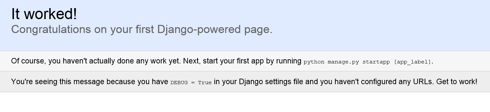

# Write a Python app to get Outlook mail, calendar, and contacts

The purpose of this guide is to walk through the process of creating a simple Python web app that retrieves messages in Office 365 or Outlook.com. The source code in this [repository](https://github.com/jasonjoh/python_tutorial) is what you should end up with if you follow the steps outlined here.

This guide will use [Microsoft Graph](/graph/overview) to access Outlook mail. Microsoft recommends using Microsoft Graph to access Outlook mail, calendar, and contacts. You should use the Outlook APIs directly (via `https://outlook.office.com/api`) only if you require a feature that is not available on the Graph endpoints. For a version of this sample that uses the Outlook APIs, see [this branch](https://github.com/jasonjoh/python_tutorial/tree/outlook-api).

This guide assumes that you already have [Python](https://www.python.org/) and [Django](https://www.djangoproject.com/) installed and working on your development machine. This sample was created using Python version 3.6.3 and Django 2.0.2.

## Create the app

Let's dive right in! Open a command prompt and set the current directory to a location where you want to store your code. Run the following command to create a new Django project.

```Shell
django-admin.py startproject python_tutorial
```

This creates a new subdirectory called `python_tutorial`. Change your command prompt's current directory to this new subdirectory and run the following command to verify that everything is working.

```Shell
python manage.py runserver
```

Once the server starts, open a web browser and browse to `http://localhost:8000/`. You should see a success message.



As the success message suggests, let's add an app to our new project. On the command prompt, run the following command.

```Shell
python manage.py startapp tutorial
```

This creates a new subdirectory under the `python_tutorial` directory and a number of files.

Open the `.\python_tutorial\settings.py` file and add the new `tutorial` app to the `INSTALLED_APPS` setting.

#### New value of `INSTALLED_APPS` in `.\python_tutorial\settings.py`

```python
INSTALLED_APPS = (
    'django.contrib.admin',
    'django.contrib.auth',
    'django.contrib.contenttypes',
    'django.contrib.sessions',
    'django.contrib.messages',
    'django.contrib.staticfiles',
    'tutorial',
)
```

Save your changes. From the command line, run the following command to initialize the database for the app.

```Shell
python manage.py migrate
```

Let's add a bit of code to the app just to make sure that it is working. Open the `.\tutorial\views.py` file and add the following code.

#### `home` function in the `.\tutorial\views.py` file

```python
from django.http import HttpResponse, HttpResponseRedirect

def home(request):
  return HttpResponse("Welcome to the tutorial.")
```

Create a new file in the `tutorial` directory called `urls.py`. Add the following code to this file.

#### Contents of the `.\tutorial\urls.py` file

```python
from django.conf.urls import url
from tutorial import views

app_name = 'tutorial'
urlpatterns = [
  # The home view ('/tutorial/')
  url(r'^$', views.home, name='home'),
  # Explicit home ('/tutorial/home/')
  url(r'^home/$', views.home, name='home'),
]
```

Finally, open the `.\python_tutorial\urls.py` file and replace the contents with the following.

### New contents of `.\python_tutorial\urls.py` ###

```python
from django.conf.urls import url, include
from django.contrib import admin
from tutorial import views

urlpatterns = [
    # Invoke the home view in the tutorial app by default
    url(r'^$', views.home, name='home'),
    # Defer any URLS to the /tutorial directory to the tutorial app
    url(r'^tutorial/', include('tutorial.urls', namespace='tutorial')),
    url(r'^admin/', admin.site.urls),
]
```

If you're familiar with Django development, this isn't anything new for you. If not, all we've done here is tell Django how to route requests to the tutorial app. Django looks first in the `.\python_tutorial\urls.py` file. The new lines we added there tell it to redirect requests to the root to the `home` view in the tutorial app, and also tells it to send any requests to `/tutorial/*` to the tutorial app.

The entries in the `.\tutorial\urls.py` file tell Django to send requests to either `/tutorial` or `/tutorial/home` to the `home` view. Finally, the `home` function in `.\tutorial\views.py` returns a simple HTTP response.

If you save all of your changes and navigate to `http://localhost:8000` you should see "Welcome to the tutorial." Now that we've confirmed that the app is working, we're ready to do some real work.

## Designing the app

Our app will be very simple. When a user visits the site, they will see a link to log in and view their email. Clicking that link will take them to the Azure login page where they can login with their Office 365 or Outlook.com account and grant access to our app. Finally, they will be redirected back to our app, which will display a list of the most recent email in the user's inbox.

Let's begin by replacing the static message with something nicer. Start by creating a new subdirectory in the `tutorial` directory called `templates`. In the `templates` directory, create a new subdirectory called `tutorial`. Finally, create a new file in this directory called `layout.html`, and add the following code. This will be a layout used by all pages in the app to add [Bootstrap](https://getbootstrap.com/docs/3.3/getting-started/) for basic layout and styling, and a simple nav bar.

#### Contents of the `.\tutorial\templates\tutorial\layout.html` file

```HTML
<!DOCTYPE html>
<html>
<head>
  <title>Python Outlook API Sample</title>
  <!-- Latest compiled and minified CSS -->
  <link rel="stylesheet" href="https://maxcdn.bootstrapcdn.com/bootstrap/3.3.7/css/bootstrap.min.css" integrity="sha384-BVYiiSIFeK1dGmJRAkycuHAHRg32OmUcww7on3RYdg4Va+PmSTsz/K68vbdEjh4u" crossorigin="anonymous">

  <!-- Optional theme -->
  <link rel="stylesheet" href="https://maxcdn.bootstrapcdn.com/bootstrap/3.3.7/css/bootstrap-theme.min.css" integrity="sha384-rHyoN1iRsVXV4nD0JutlnGaslCJuC7uwjduW9SVrLvRYooPp2bWYgmgJQIXwl/Sp" crossorigin="anonymous">
</head>
<body style="padding-top: 70px;">
  <nav class="navbar navbar-inverse navbar-fixed-top">
    <div class="container">
      <div class="navbar-header">
        <button type="button" class="navbar-toggle collapsed" data-toggle="collapse" data-target="#navbar" aria-expanded="false" aria-controls="navbar">
          <span class="sr-only">Toggle navigation</span>
          <span class="icon-bar"></span>
          <span class="icon-bar"></span>
          <span class="icon-bar"></span>
        </button>
        <a class="navbar-brand" href="/">Python Outlook Sample</a>
      </div>
      <div id="navbar" class="navbar-collapse collapse">
        <ul class="nav navbar-nav authed-nav">
          <li id='home-nav'><a href="/">Home</a></li>
          <li id='inbox-nav'><a href="/tutorial/mail">Inbox</a></li>
          <li id='calendar-nav'><a href="/tutorial/events">Calendar</a></li>
          <li id='contacts-nav'><a href="/tutorial/contacts">Contacts</a></li>
        </ul>
      </div>
    </div>
  </nav>

  <div class="container main-container">
    
  </div>

</body>
</html>
```

Now let's create a simple homepage to show a **Connect to Outlook** button. Create a file called `home.html` in the `.\tutorial\templates\tutorial` directory and add the following code.

#### Contents of the `.\tutorial\templates\tutorial\home.html` file

```HTML


<div class="jumbotron">
  <h1>Python Outlook Sample</h1>
  <p>This example shows how to get an OAuth token from Azure using the <a href="https://docs.microsoft.com/azure/active-directory/develop/active-directory-v2-protocols-oauth-code" target="_blank">authorization code grant flow</a> and to use that token to make calls to the Outlook APIs.</p>
  <p>
    <a class="btn btn-lg btn-primary" href="{{signin_url}}" role="button" id="connect-button">Connect to Outlook</a>
  </p>
</div>

```

Finally, let's modify the `home` function in `.\tutorial\views.py` to use this new view. Update the `home` function to match the following.

#### Updated `home` function

```python
def home(request):
  sign_in_url = '#'
  context = { 'signin_url': sign_in_url }
  return render(request, 'tutorial/home.html', context)
```

As you can see, our home page will be very simple. For now, the link doesn't do anything, but we'll fix that soon.

## Register the app

[!include[App Registration Intro](~/includes/rest/app-registration-intro.md)]

Head over to the [Application Registration Portal](https://apps.dev.microsoft.com/) to quickly get an application ID and secret.

1. Using the **Sign in** link, sign in with either your Microsoft account (Outlook.com), or your work or school account (Office 365).
1. Click the **Add an app** button. Enter `python-tutorial` for the name and click **Create application**.
1. Locate the **Application Secrets** section, and click the **Generate New Password** button. Copy the password now and save it to a safe place. Once you've copied the password, click **Ok**.
1. Locate the **Platforms** section, and click **Add Platform**. Choose **Web**, then enter `http://localhost:8000/tutorial/gettoken/` under **Redirect URIs**.
1. Click **Save** to complete the registration. Copy the **Application Id** and save it along with the password you copied earlier. We'll need those values soon.

Here's what the details of your app registration should look like when you are done.


## Implementing OAuth2

Our goal in this section is to make the link on our home page initiate the [OAuth2 Authorization Code Grant flow with Azure AD](https://msdn.microsoft.com/library/azure/dn645542.aspx). To make things easier, we'll use the [Requests: HTTP for Humans](http://docs.python-requests.org/en/latest/) library to handle all of our HTTP requests. At your command prompt, enter the following command.

```Shell
pip install requests
```

Now the library is installed and ready to use. Create a new file in the `tutorial` directory called `authhelper.py`. We'll start here by defining a function to generate the login URL.

#### Contents of the `.\tutorial\authhelper.py` file

```python
from urllib.parse import quote, urlencode
import base64
import json
import time

# Client ID and secret
client_id = 'YOUR APP ID HERE'
client_secret = 'YOUR APP PASSWORD HERE'

# Constant strings for OAuth2 flow
# The OAuth authority
authority = 'https://login.microsoftonline.com'

# The authorize URL that initiates the OAuth2 client credential flow for admin consent
authorize_url = '{0}{1}'.format(authority, '/common/oauth2/v2.0/authorize?{0}')

# The token issuing endpoint
token_url = '{0}{1}'.format(authority, '/common/oauth2/v2.0/token')

# The scopes required by the app
scopes = [ 'openid',
           'User.Read',
           'Mail.Read' ]

def get_signin_url(redirect_uri):
  # Build the query parameters for the signin url
  params = { 'client_id': client_id,
             'redirect_uri': redirect_uri,
             'response_type': 'code',
             'scope': ' '.join(str(i) for i in scopes)
            }

  signin_url = authorize_url.format(urlencode(params))

  return signin_url
```

Replace the `YOUR APP ID HERE` and `YOUR APP PASSWORD HERE` placeholders with the values you generated in step 3 and save your changes.

Now that we have actual values for the client ID and secret, let's put our new function to work. Modify the `home` function in the `.\tutorial\views.py` file to use the `get_signin_url` function to fill in the link. That function takes a parameter, `redirect_uri`. This value is used to set the URL in our app where Azure will redirect after signin is complete. Let's go ahead and create a placeholder view to act as our redirect target called `gettoken`.

#### Updated contents of `.\tutorial\views.py`

```python
from django.shortcuts import render
from django.http import HttpResponse, HttpResponseRedirect
from django.urls import reverse
from tutorial.authhelper import get_signin_url

# Create your views here.

def home(request):
  redirect_uri = request.build_absolute_uri(reverse('tutorial:gettoken'))
  sign_in_url = get_signin_url(redirect_uri)
  return HttpResponse('<a href="' + sign_in_url +'">Click here to sign in and view your mail</a>')

def gettoken(request):
  return HttpResponse('gettoken view')
```

The view doesn't do much now, but we'll change that soon. Add this new view to the `.\tutorials\urls.py` file.

#### Updated contents of the `.\tutorials\urls.py` file

```python
from django.conf.urls import url
from tutorial import views

app_name = 'tutorial'
urlpatterns = [
  # The home view ('/tutorial/')
  url(r'^$', views.home, name='home'),
  # Explicit home ('/tutorial/home/')
  url(r'^home/$', views.home, name='home'),
  # Redirect to get token ('/tutorial/gettoken/')
  url(r'^gettoken/$', views.gettoken, name='gettoken'),
]
```

Save your changes and browse to `http://localhost:8000`. If you hover over the link, it should look like:

```http
https://login.microsoftonline.com/common/oauth2/v2.0/authorize?scope=openid+User.Read+Mail.Read&response_type=code&client_id=<SOME GUID>&redirect_uri=http%3A%2F%2Flocalhost%3A8000%2Ftutorial%2Fgettoken%2F
```

The `<SOME GUID>` portion should match your client ID. Click on the link and you should be presented with a sign in page. Sign in with your Office 365 or Outlook.com account. Your browser should redirect to back to the `gettoken` view. The view doesn't do anything yet, so let's fix that now.

### Exchanging the code for a token ###

The first thing we need to do is extract the authorization code from the request. When Azure redirects to our `gettoken` function, it includes a `code` query parameter, which contains the authorization code. Update the `gettoken` function to get this parameter's value and display it.

#### Updated `gettoken` function in `.\tutorial\views.py`

```python
def gettoken(request):
  auth_code = request.GET['code']
  return HttpResponse('Authorization code: {0}'.format(auth_code))
```

Save your changes and repeat the signin process in the app. Now instead of a static message, you should see the value of the authorization code printed on the screen. We're getting closer, but that's still not very useful. Let's actually do something with that code.

First import the `requests` library by adding the following line to the top of `.\tutorial\authhelper.py`.

```python
import requests
```

Now add another helper function to `authhelper.py` called `get_token_from_code`.

#### `get_token_from_code` in the `.\tutorial\authhelper.py` file

```python
def get_token_from_code(auth_code, redirect_uri):
  # Build the post form for the token request
  post_data = { 'grant_type': 'authorization_code',
                'code': auth_code,
                'redirect_uri': redirect_uri,
                'scope': ' '.join(str(i) for i in scopes),
                'client_id': client_id,
                'client_secret': client_secret
              }

  r = requests.post(token_url, data = post_data)

  try:
    return r.json()
  except:
    return 'Error retrieving token: {0} - {1}'.format(r.status_code, r.text)
```

### Getting the user ###

Our first use of the access token will be to get the user's display name from Microsoft Graph, just to make sure that our access token works.

Create a new file in the `tutorial` directory called `outlookservice.py`. We'll implement all of our Outlook API functions in this file. We'll start by creating a generic method for sending API requests called `make_api_call`.

#### Contents of `./tutorial/outlookservice.py` ####

```python
import requests
import uuid
import json

graph_endpoint = 'https://graph.microsoft.com/v1.0{0}'

# Generic API Sending
def make_api_call(method, url, token, payload = None, parameters = None):
  # Send these headers with all API calls
  headers = { 'User-Agent' : 'python_tutorial/1.0',
              'Authorization' : 'Bearer {0}'.format(token),
              'Accept' : 'application/json' }

  # Use these headers to instrument calls. Makes it easier
  # to correlate requests and responses in case of problems
  # and is a recommended best practice.
  request_id = str(uuid.uuid4())
  instrumentation = { 'client-request-id' : request_id,
                      'return-client-request-id' : 'true' }

  headers.update(instrumentation)

  response = None

  if (method.upper() == 'GET'):
      response = requests.get(url, headers = headers, params = parameters)
  elif (method.upper() == 'DELETE'):
      response = requests.delete(url, headers = headers, params = parameters)
  elif (method.upper() == 'PATCH'):
      headers.update({ 'Content-Type' : 'application/json' })
      response = requests.patch(url, headers = headers, data = json.dumps(payload), params = parameters)
  elif (method.upper() == 'POST'):
      headers.update({ 'Content-Type' : 'application/json' })
      response = requests.post(url, headers = headers, data = json.dumps(payload), params = parameters)

  return response
```

This function uses the `requests` library to send API requests. It sets a standard set of headers on each requests, including client instrumentation.

Now let's create a function to make us of the `make_api_call` function to get the user. Add a function called `get_me` to `outlookservice.py`.

#### The `get_me` function in `./tutorial/outlookservice.py` ####

```python
def get_me(access_token):
  get_me_url = graph_endpoint.format('/me')

  # Use OData query parameters to control the results
  #  - Only return the displayName and mail fields
  query_parameters = {'$select': 'displayName,mail'}

  r = make_api_call('GET', get_me_url, access_token, "", parameters = query_parameters)

  if (r.status_code == requests.codes.ok):
    return r.json()
  else:
    return "{0}: {1}".format(r.status_code, r.text)
```

Let's make sure that works. Modify the `gettoken` function in `views.py` to use these helper functions and display the return values.

#### Updated `gettoken` function in `.\tutorial\views.py` ####

```python
# Add import statement to include new function
from tutorial.outlookservice import get_me

def gettoken(request):
  auth_code = request.GET['code']
  redirect_uri = request.build_absolute_uri(reverse('tutorial:gettoken'))
  token = get_token_from_code(auth_code, redirect_uri)
  access_token = token['access_token']
  user = get_me(access_token)

  # Save the token in the session
  request.session['access_token'] = access_token
  return HttpResponse('User: {0}, Access token: {1}'.format(user['displayName'], access_token))
```

If you save your changes, restart the server, and go through the sign-in process again, you should now see a long string of seemingly nonsensical characters. If everything's gone according to plan, that should be an access token.

### Refreshing the access token

Access tokens returned from Azure are valid for an hour. If you use the token after it has expired, the API calls will return 401 errors. You could ask the user to sign in again, but the better option is to refresh the token silently.

In order to do that, the app must request the `offline_access` scope. Add this scope to the `scopes` array in `authhelper.py`:

```python
# The scopes required by the app
scopes = [ 'openid',
           'offline_access',
           'User.Read',
           'Mail.Read' ]
```

This will cause the token response from Azure to include a refresh token. Let's update `gettoken` in `views.py` to save the refresh token and the expiration time in the session.

#### Updated `gettoken` function in `.\tutorial\views.py` ####

```python
# Add import statement to include new function
from tutorial.outlookservice import get_me

def gettoken(request):
  auth_code = request.GET['code']
  redirect_uri = request.build_absolute_uri(reverse('tutorial:gettoken'))
  token = get_token_from_code(auth_code, redirect_uri)
  access_token = token['access_token']
  user = get_me(access_token)
  refresh_token = token['refresh_token']
  expires_in = token['expires_in']

  # expires_in is in seconds
  # Get current timestamp (seconds since Unix Epoch) and
  # add expires_in to get expiration time
  # Subtract 5 minutes to allow for clock differences
  expiration = int(time.time()) + expires_in - 300

  # Save the token in the session
  request.session['access_token'] = access_token
  request.session['refresh_token'] = refresh_token
  request.session['token_expires'] = expiration
  return HttpResponse('User: {0}, Access token: {1}'.format(user['displayName'], access_token))
```

Now let's create a function to refresh the access token. Add the following function to `authhelper.py`.

#### The `get_token_from_refresh_token` function in `./tutorial/authhelper.py` ####

```python
def get_token_from_refresh_token(refresh_token, redirect_uri):
  # Build the post form for the token request
  post_data = { 'grant_type': 'refresh_token',
                'refresh_token': refresh_token,
                'redirect_uri': redirect_uri,
                'scope': ' '.join(str(i) for i in scopes),
                'client_id': client_id,
                'client_secret': client_secret
              }

  r = requests.post(token_url, data = post_data)

  try:
    return r.json()
  except:
    return 'Error retrieving token: {0} - {1}'.format(r.status_code, r.text)
```

Finally let's create a helper function to retrieve the access token. The function will check the expiration time, and if the token is expired, will refresh it. Otherwise it will just return the access token from the session. Add the following function to `authhelper.py`.

#### The `get_access_token` function in `./tutorial/authhelper.py` ####

```python
def get_access_token(request, redirect_uri):
  current_token = request.session['access_token']
  expiration = request.session['token_expires']
  now = int(time.time())
  if (current_token and now < expiration):
    # Token still valid
    return current_token
  else:
    # Token expired
    refresh_token = request.session['refresh_token']
    new_tokens = get_token_from_refresh_token(refresh_token, redirect_uri)

    # Update session
    # expires_in is in seconds
    # Get current timestamp (seconds since Unix Epoch) and
    # add expires_in to get expiration time
    # Subtract 5 minutes to allow for clock differences
    expiration = int(time.time()) + new_tokens['expires_in'] - 300

    # Save the token in the session
    request.session['access_token'] = new_tokens['access_token']
    request.session['refresh_token'] = new_tokens['refresh_token']
    request.session['token_expires'] = expiration

    return new_tokens['access_token']
```

Let's import `get_access_token` in `views.py` so we can make use of it.

```python
from tutorial.authhelper import get_signin_url, get_token_from_code, get_access_token
```

## Using the Mail API

Now that we can get an access token, we're in a good position to do something with the Mail API. Let's start by creating a `mail` view in `views.py`.

#### `mail` function in `.\tutorial\views.py`

```python
def mail(request):
  access_token = get_access_token(request, request.build_absolute_uri(reverse('tutorial:gettoken')))
  # If there is no token in the session, redirect to home
  if not access_token:
    return HttpResponseRedirect(reverse('tutorial:home'))
  else:
    return HttpResponse('Access token found in session: {0}'.format(access_token))
```

Update the `urls.py` file to include an entry for the new view.

#### Updated contents of `.\tutorial\urls.py`

```python
from django.conf.urls import url
from tutorial import views

app_name = 'tutorial'
urlpatterns = [
  # The home view ('/tutorial/')
  url(r'^$', views.home, name='home'),
  # Explicit home ('/tutorial/home/')
  url(r'^home/$', views.home, name='home'),
  # Redirect to get token ('/tutorial/gettoken/')
  url(r'^gettoken/$', views.gettoken, name='gettoken'),
  # Mail view ('/tutorial/mail/')
  url(r'^mail/$', views.mail, name='mail'),
]
```

Update the `gettoken` function to redirect to the `mail` view after saving the token in the session.

#### Updated `gettoken` function in `.\tutorial\views.py`

```python
def gettoken(request):
  auth_code = request.GET['code']
  redirect_uri = request.build_absolute_uri(reverse('tutorial:gettoken'))
  token = get_token_from_code(auth_code, redirect_uri)
  access_token = token['access_token']
  user = get_me(access_token)
  refresh_token = token['refresh_token']
  expires_in = token['expires_in']

  # expires_in is in seconds
  # Get current timestamp (seconds since Unix Epoch) and
  # add expires_in to get expiration time
  # Subtract 5 minutes to allow for clock differences
  expiration = int(time.time()) + expires_in - 300

  # Save the token in the session
  request.session['access_token'] = access_token
  request.session['refresh_token'] = refresh_token
  request.session['token_expires'] = expiration
  return HttpResponseRedirect(reverse('tutorial:mail'))
```

For now all this does is read the token back from the cookie and display it. Save your changes, restart the server, and go through the signon process again. You should see the token displayed. Now that we know we have access to the token in the `mail` function, we're ready to call the Mail API.

Now let's add a function that will use the `make_api_call` function to implement a request to retrieve messages from the inbox. Create a new function in `outlookservice.py` called `get_my_messages`.

#### The `get_my_messages` function in `./tutorial/outlookservice.py`

```python
def get_my_messages(access_token):
  get_messages_url = graph_endpoint.format('/me/mailfolders/inbox/messages')

  # Use OData query parameters to control the results
  #  - Only first 10 results returned
  #  - Only return the ReceivedDateTime, Subject, and From fields
  #  - Sort the results by the ReceivedDateTime field in descending order
  query_parameters = {'$top': '10',
                      '$select': 'receivedDateTime,subject,from',
                      '$orderby': 'receivedDateTime DESC'}

  r = make_api_call('GET', get_messages_url, access_token, parameters = query_parameters)

  if (r.status_code == requests.codes.ok):
    return r.json()
  else:
    return "{0}: {1}".format(r.status_code, r.text)
```

Now we can modify the `mail` function to call this function and retrieve email. First, import the `get_my_messages` function by adding the following line to the top of `views.py`.

```python
from tutorial.outlookservice import get_me, get_my_messages
```

Then update the `mail` function to call the new function.

#### New version of the `mail` function in `./tutorial/views.py`

```python
def mail(request):
  access_token = get_access_token(request, request.build_absolute_uri(reverse('tutorial:gettoken')))
  # If there is no token in the session, redirect to home
  if not access_token:
    return HttpResponseRedirect(reverse('tutorial:home'))
  else:
    messages = get_my_messages(access_token)
    return HttpResponse('Messages: {0}'.format(messages))
```

If you save the changes and sign into the app, you should now see a raw listing of the JSON response.

## Displaying the results ##

While the current listing of messages confirms that the API calls are working, we can use Django templates to display the results in a more user-friendly fashion.

Create a new file in the `./tutorial/templates/tutorial` directory called `mail.html`, and add the following code.

#### Contents of the `./tutorial/templates/tutorial/mail.html` file

```HTML


<h1>Your Email</h1>
<table class="table">
  <tr>
    <th>From</th>
    <th>Subject</th>
    <th>Received</th>
  </tr>

  
    <tr>
      <td>{{ message.from.emailAddress.name }}</td>
      <td>{{ message.subject }}</td>
      <td>{{ message.receivedDateTime }}</td>
    </tr>
  
</table>

```

Update the `mail` function in `views.py` to use this new template.

#### Updated `mail` function in `./tutorial/views.py`

```python
def mail(request):
  access_token = get_access_token(request, request.build_absolute_uri(reverse('tutorial:gettoken')))
  # If there is no token in the session, redirect to home
  if not access_token:
    return HttpResponseRedirect(reverse('tutorial:home'))
  else:
    messages = get_my_messages(access_token)
    context = { 'messages': messages['value'] }
    return render(request, 'tutorial/mail.html', context)
```

Save the changes and sign in to the app. You should now see a simple table of messages in your inbox.


## Adding Calendar and Contacts APIs

Now that you've mastered calling the Outlook Mail API, doing the same for Calendar and Contacts APIs is similar and easy.

> [!TIP]
> If you've followed along with the tutorial, you probably have an access token saved in your session cookie. That token will only be valid for the `Mail.Read` scope. In order to call the Calendar or Contacts API, we will need to add new scopes. Be sure to restart your browser to get rid of the session cookie so that you can start the login process from the beginning to get a new access token.

### For Calendar API:

1. Update the `scopes` array in `authhelper.py` to include the `Calendars.Read` scope.

    ```python
    # The scopes required by the app
    scopes = [ 'openid',
               'offline_access',
               'User.Read',
               'Mail.Read',
               'Calendars.Read' ]
    ```

1. Add a new function to `outlookservice.py` called `get_my_events`.

    ```python
    def get_my_events(access_token):
      get_events_url = graph_endpoint.format('/me/events')

      # Use OData query parameters to control the results
      #  - Only first 10 results returned
      #  - Only return the Subject, Start, and End fields
      #  - Sort the results by the Start field in ascending order
      query_parameters = {'$top': '10',
                          '$select': 'subject,start,end',
                          '$orderby': 'start/dateTime ASC'}

      r = make_api_call('GET', get_events_url, access_token, parameters = query_parameters)

      if (r.status_code == requests.codes.ok):
        return r.json()
      else:
        return "{0}: {1}".format(r.status_code, r.text)
    ```

1. In `views.py`, import the `get_my_events` function.

    ```python
    from tutorial.outlookservice import get_my_events
    ```

1. Add a new view to `views.py` called `events`.

    ```python
    def events(request):
      access_token = get_access_token(request, request.build_absolute_uri(reverse('tutorial:gettoken')))
      # If there is no token in the session, redirect to home
      if not access_token:
        return HttpResponseRedirect(reverse('tutorial:home'))
      else:
        events = get_my_events(access_token)
        context = { 'events': events['value'] }
        return render(request, 'tutorial/events.html', context)
    ```

1. Add the new view to `./tutorial/urls.py`.

    ```python
    # Events view ('/tutorial/events/')
    url(r'^events/$', views.events, name='events'),
    ```

1. Add a new template `events.html` in the `./tutorial/templates/tutorial directory`.

    ```HTML
    
    
    <h1>Your Events</h1>
    <table class="table">
      <tr>
        <th>Subject</th>
        <th>Start</th>
        <th>End</th>
      </tr>

      
        <tr>
          <td>{{ event.subject }}</td>
          <td>{{ event.start.dateTime }} ({{ event.start.timeZone }})</td>
          <td>{{ event.end.dateTime }} ({{ event.end.timeZone }})</td>
        </tr>
      
    </table>
    
    ```

1. Save all changes. After signing into the app, browse to `http://localhost:8000/tutorial/events`.

### For Contacts API:

1. Update the `scopes` array in `authhelper.py` to include the `Contacts.Read` scope.

    ```python
    # The scopes required by the app
    scopes = [ 'openid',
               'offline_access',
               'User.Read',
               'Mail.Read',
               'Contacts.Read' ]
    ```

1. Add a new function to `outlookservice.py` called `get_my_contacts`.

    ```python
    def get_my_contacts(access_token):
      get_contacts_url = graph_endpoint.format('/me/contacts')

      # Use OData query parameters to control the results
      #  - Only first 10 results returned
      #  - Only return the GivenName, Surname, and EmailAddresses fields
      #  - Sort the results by the GivenName field in ascending order
      query_parameters = {'$top': '10',
                          '$select': 'givenName,surname,emailAddresses',
                          '$orderby': 'givenName ASC'}

      r = make_api_call('GET', get_contacts_url, access_token, parameters = query_parameters)

      if (r.status_code == requests.codes.ok):
        return r.json()
      else:
        return "{0}: {1}".format(r.status_code, r.text)
    ```

1. In `views.py`, import the `get_my_contacts` function.

    ```python
    from tutorial.outlookservice import get_my_contacts
    ```

1. Add a new view to `views.py` called `contacts`.

    ```python
    def contacts(request):
      access_token = get_access_token(request, request.build_absolute_uri(reverse('tutorial:gettoken')))
      # If there is no token in the session, redirect to home
      if not access_token:
        return HttpResponseRedirect(reverse('tutorial:home'))
      else:
        contacts = get_my_contacts(access_token)
        context = { 'contacts': contacts['value'] }
        return render(request, 'tutorial/contacts.html', context)
    ```

1. Add the new view to `./tutorial/urls.py`.

    ```python
    # Contacts view ('/tutorial/contacts/')
    url(r'^contacts/$', views.contacts, name='contacts'),
    ```

1. Add a new template `contacts.html` in the `./tutorial/templates/tutorial directory`.

    ```HTML
    
    
    <h1>Your Contacts</h1>
    <table class="table">
      <tr>
        <th>First Name</th>
        <th>Last Name</th>
        <th>Email Address</th>
      </tr>

      
        <tr>
          <td>{{ contact.givenName }}</td>
          <td>{{ contact.surname }}</td>
          <td>{{ contact.emailAddresses.0.address }}</td>
        </tr>
      
    </table>
    
    ```

1. Save all changes. After signing into the app, browse to `http://localhost:8000/tutorial/contacts`.