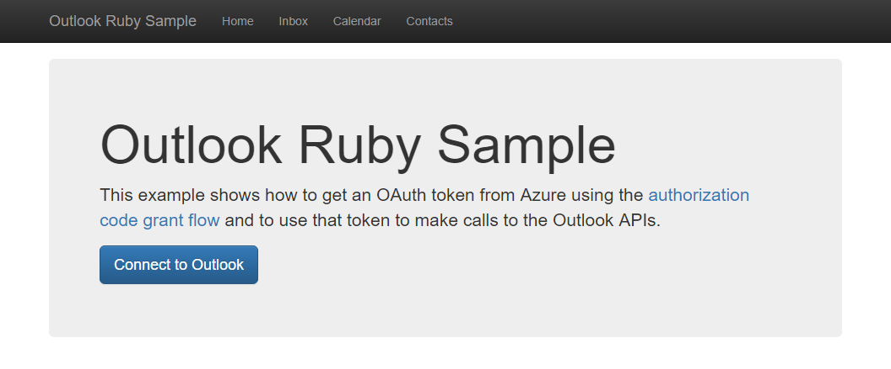

# Write a Ruby on Rails app to get Outlook mail, calendar, and contacts

The purpose of this guide is to walk through the process of creating a simple Ruby on Rails app that accesses a user's data in Office 365 or Outlook.com. The source code in [this repository](https://github.com/jasonjoh/o365-tutorial) is what you should end up with if you follow the steps outlined here.

This guide will use the [Microsoft Graph](https://developer.microsoft.com/en-us/graph/) to access Outlook mail. Microsoft recommends using the Microsoft Graph to access Outlook mail, calendar, and contacts. You should use the Outlook APIs directly (via `https://outlook.office.com/api`) only if you require a feature that is not available on the Graph endpoints. For a version of this sample that uses the Outlook APIs, see [this branch](https://github.com/jasonjoh/o365-tutorial/tree/outlook-api).

This guide assumes that you already have Ruby on Rails installed and working on your development machine.

## Create the app

From your command line, change your directory to a directory where you want to create your new Ruby on Rails app. Run the following command to create an app called `o365-tutorial`.

> [!NOTE]
> Feel free to change the name to whatever you want. For the purposes of this guide I will assume the name of the app is `o365-tutorial`.

```Shell
rails new o365-tutorial
```

If you're familiar with Ruby on Rails, this is nothing new for you. If you're new to it, you'll notice that command creates an `o365-tutorial` sub-directory, which contains a number of files and directories. Most of these aren't important for our purposes, so don't worry too much about them.

On the command line, change your directory to the `o365-tutorial` sub-directory. Let's take a quick detour to verify that the app was created successfully. Run the following command:

```Shell
rails server
```

Open a browser and navigate to `http://localhost:3000`. You should see the default Ruby on Rails welcome page.


Now that we've confirmed that Ruby on Rails is working, we're ready to do some real work.

## Designing the app

Our app will be very simple. When a user visits the site, they will see a link to log in and view their email. Clicking that link will take them to the Azure login page where they can login with their Office 365 or Outlook.com account and grant access to our app. Finally, they will be redirected back to our app, which will display a list of the most recent email in the user's inbox.

First let's modify the layout used by all pages in the app to add [Bootstrap](http://getbootstrap.com/getting-started/#examples) for basic layout and styling, and a simple nav bar. Open the `.\o365-tutorial\app\views\layouts\application.html.erb` file in your favorite editor and replace its contents with the following code.

#### Contents of the `.\o365-tutorial\app\views\layouts\application.html.erb` file

```erb
<!DOCTYPE html>
<html>
<head>
  <title>O365Tutorial</title>
  <!-- Latest compiled and minified CSS -->
  <link rel="stylesheet" href="https://maxcdn.bootstrapcdn.com/bootstrap/3.3.7/css/bootstrap.min.css" integrity="sha384-BVYiiSIFeK1dGmJRAkycuHAHRg32OmUcww7on3RYdg4Va+PmSTsz/K68vbdEjh4u" crossorigin="anonymous">

  <!-- Optional theme -->
  <link rel="stylesheet" href="https://maxcdn.bootstrapcdn.com/bootstrap/3.3.7/css/bootstrap-theme.min.css" integrity="sha384-rHyoN1iRsVXV4nD0JutlnGaslCJuC7uwjduW9SVrLvRYooPp2bWYgmgJQIXwl/Sp" crossorigin="anonymous">
  <%= stylesheet_link_tag    'application', media: 'all', 'data-turbolinks-track' => true %>
  <%= javascript_include_tag 'application', 'data-turbolinks-track' => true %>
  <%= csrf_meta_tags %>
</head>
<body>
  <nav class="navbar navbar-inverse navbar-fixed-top">
    <div class="container">
      <div class="navbar-header">
        <button type="button" class="navbar-toggle collapsed" data-toggle="collapse" data-target="#navbar" aria-expanded="false" aria-controls="navbar">
          <span class="sr-only">Toggle navigation</span>
          <span class="icon-bar"></span>
          <span class="icon-bar"></span>
          <span class="icon-bar"></span>
        </button>
        <a class="navbar-brand" href="#">Outlook Ruby Sample</a>
      </div>
      <div id="navbar" class="navbar-collapse collapse">
        <ul class="nav navbar-nav authed-nav">
          <li id='home-nav'><a href="/">Home</a></li>
          <li id='inbox-nav'><a href="/mail/index">Inbox</a></li>
          <li id='calendar-nav'><a href="/calendar/index">Calendar</a></li>
          <li id='contacts-nav'><a href="/contacts/index">Contacts</a></li>
        </ul>
      </div>
    </div>
  </nav>

  <div class="container main-container">
<%= yield %>
  </div>

</body>
</html>
```

Let's also add a little change to the application's CSS file to accomodate the nav bar we added. Open the `.\o365-tutorial\app\assets\stylesheets\application.css` file and add the following code.

#### New code in the `.\o365-tutorial\app\assets\stylesheets\application.css` file

```css
body {
  padding-top: 70px;
}
```

Now let's replace the default welcome page with a page of our own. To do that, we'll create a new controller for the home page. On the command line, run the following command:

```Shell
rails generate controller Home
```

Once that command is complete, create a new file in the `.\o365-tutorial\app\views\home` directory called `index.html.erb`. Paste in the following code.

#### Contents of the `.\o365-tutorial\app\views\home\index.html.erb` file

```erb
<div class="jumbotron">
  <h1>Outlook Ruby Sample</h1>
  <p>This example shows how to get an OAuth token from Azure using the <a href="https://docs.microsoft.com/en-us/azure/active-directory/develop/active-directory-v2-protocols-oauth-code" target="_blank">authorization code grant flow</a> and to use that token to make calls to the Outlook APIs.</p>
  <p>
    <a class="btn btn-lg btn-primary" href="<%= @login_url %>" role="button" id="connect-button">Connect to Outlook</a>
  </p>
</div>
```

As you can see, our home page will be very simple. For now, the link doesn't do anything, but we'll fix that soon. First we need to tell Rails to invoke this action. To do that, we need to define a route. Open the `.\o365-tutorial\config\routes.rb` file, and set the default route (or "root") to the `index` action of the `home` controller we just created.

#### Contents of the `.\o365-tutorial\config\routes.rb` file

```ruby
Rails.application.routes.draw do
  root 'home#index'
end
```

Save your changes. Now browsing to `http://localhost:3000` should look like:



## Register the app

[!include[App Registration Intro](~/includes/rest/app-registration-intro.md)]

Head over to the [Application Registration Portal](https://apps.dev.microsoft.com/) to quickly get an application ID and secret. 

1. Using the **Sign in** link, sign in with either your Microsoft account (Outlook.com), or your work or school account (Office 365).
1. Click the **Add an app** button. Enter `o365-tutorial` for the name and click **Create application**. 
1. Locate the **Application Secrets** section, and click the **Generate New Password** button. Copy the password now and save it to a safe place. Once you've copied the password, click **Ok**.
1. Locate the **Platforms** section, and click **Add Platform**. Choose **Web**, then enter `http://localhost:3000/authorize` under **Redirect URIs**.
1. Click **Save** to complete the registration. Copy the **Application Id** and save it along with the password you copied earlier. We'll need those values soon.

Here's what the details of your app registration should look like when you are done.


## Implementing OAuth2

Our goal in this section is to make the link on our home page initiate the [OAuth2 Authorization Code Grant flow with Azure AD](https://msdn.microsoft.com/en-us/library/azure/dn645542.aspx). To make things easier, we'll use the [oauth2 gem](https://github.com/intridea/oauth2) to handle our OAuth requests. We'll also use the [activerecord-session_store gem](https://github.com/rails/activerecord-session_store) to store our sessions in a database. Open the `./o365-tutorial/GemFile` and add the following lines anywhere in that file:

```ruby
gem 'oauth2'
gem 'activerecord-session_store'
```

Save the file and run the following command (restart the rails server afterwards):

```Shell
bundle install
```

Now let's configure the app to use the `activerecord-session_store` gem for session storage. The reason for this is that the default cookie store is limited to 4KB of data, which isn't enough for us to store the tokens we'll get back from Azure.

Open the `.\o365-tutorial\config\initializers\session_store.rb` file. Replace the text `:cookie_store` with `:active_record_store`.

On the command line, enter the following commands to generate the session database.

```Shell
rails generate active_record:session_migration
rails db:migrate
```

Because of the nature of the OAuth2 flow, it makes sense to create a controller to handle the redirects from Azure. Run the following command to generate a controller named `Auth`:

```Shell
rails generate controller Auth
```

Open the `.\o365-tutorial\app\helpers\auth_helper.rb` file. We'll start here by defining a function to generate the login URL.

#### Contents of the `.\o365-tutorial\app\helpers\auth_helper.rb` file

```ruby
module AuthHelper

  # App's client ID. Register the app in Application Registration Portal to get this value.
  CLIENT_ID = '<YOUR APP ID HERE>'
  # App's client secret. Register the app in Application Registration Portal to get this value.
  CLIENT_SECRET = '<YOUR APP PASSWORD HERE>'

  # Scopes required by the app
  SCOPES = [ 'openid',
             'profile',
             'User.Read',
             'Mail.Read' ]
  
  REDIRECT_URI = 'http://localhost:3000/authorize' # Temporary!

  # Generates the login URL for the app.
  def get_login_url
    client = OAuth2::Client.new(CLIENT_ID,
                                CLIENT_SECRET,
                                :site => 'https://login.microsoftonline.com',
                                :authorize_url => '/common/oauth2/v2.0/authorize',
                                :token_url => '/common/oauth2/v2.0/token')
                              
    login_url = client.auth_code.authorize_url(:redirect_uri => REDIRECT_URI, :scope => SCOPES.join(' '))
  end
end
```

The first thing we do here is define our client ID and secret, and the permission scopes our app requires. We also define a redirect URI as a hard-coded value. We'll improve on that in a bit, but it will serve our purpose for now. 

Replace the `<YOUR APP ID HERE>` and `<YOUR APP PASSWORD HERE>` placeholders with the values you generated in step 3 and save your changes.

Now that we've implemented the `get_login_url` function, let's put it to work. Open the `.\o365-tutorial\app\controllers\home_controller.rb` file and replace its contents with the following code:

#### Updated contents of the `.\o365-tutorial\app\controllers\home_controller.rb` file

```ruby
class HomeController < ApplicationController
  include AuthHelper
  
  def index
    # Display the login link.
    @login_url = get_login_url
  end
end
```

Save your changes and browse to `http://localhost:3000`. If you hover over the link, it should look like:

    https://login.microsoftonline.com/common/oauth2/v2.0/authorize?client_id=<SOME GUID>&redirect_uri=http%3A%2F%2Flocalhost%3A3000%2Fauthorize&response_type=code&scope=openid+profile+User.Read+Mail.Read

The `<SOME GUID>` portion should match your client ID. Click on the link and you should be presented with a sign in page. Sign in with your Office 365 account. Your browser should redirect to back to our app, and you should see a lovely error:

```
No route matches [GET] "/authorize"
```

If you scroll down on Rails' error page, you can see the request parameters, which include the authorization code.

```
Parameters:
{"code"=>"M2ff0cb19-ec9d-db94-c5ab-4c634e319315"}
```

The reason we're seeing the error is because we haven't implemented a route to handle the `/authorize` path we hard-coded as our redirect URI. However, Rails has shown us that we're getting the authorization code back in the request, so we're on the right track! Let's fix that error now.

### Exchanging the code for a token

First, let's add a route for the `/authorize` path to `routes.rb`.

#### Updated contents of the `.\o365-tutorial\config\routes.rb` file

```ruby
Rails.application.routes.draw do
  root 'application#home'
  get 'authorize' => 'auth#gettoken'
end
```

The added line tells Rails that when a GET request comes in for `/authorize`, invoke the `gettoken` action on the `auth` controller. So to make this work, we need to implement that action. Open the `.\o365-tutorial\app\controllers\auth_controller.rb` file and define the `gettoken` action.

#### Contents of the `.\o365-tutorial\app\controllers\auth_controller.rb` file

```ruby
class AuthController < ApplicationController

  def gettoken
    render text: params[:code]
  end
end
```

Let's make one last refinement before we try this new code. Now that we have a route for the redirect URI, we can remove the hard-coded constant in `auth_helper.rb`, and instead use the Rails name for the route: `authorize_url`.

#### Updated contents of the `.\o365-tutorial\app\helpers\auth_helper.rb` file

```ruby
module AuthHelper

  # App's client ID. Register the app in Application Registration Portal to get this value.
  CLIENT_ID = '<YOUR APP ID HERE>'
  # App's client secret. Register the app in Application Registration Portal to get this value.
  CLIENT_SECRET = '<YOUR APP PASSWORD HERE>'

  # Scopes required by the app
  SCOPES = [ 'openid',
             'profile',
             'User.Read',
             'Mail.Read' ]

  # Generates the login URL for the app.
  def get_login_url
    client = OAuth2::Client.new(CLIENT_ID,
                                CLIENT_SECRET,
                                :site => "https://login.microsoftonline.com",
                                :authorize_url => "/common/oauth2/v2.0/authorize",
                                :token_url => "/common/oauth2/v2.0/token")
                              
    login_url = client.auth_code.authorize_url(:redirect_uri => authorize_url, :scope => SCOPES.join(' '))
  end
end
```

Refresh your browser (or repeat the sign-in process). Now instead of a Rails error page, you should see the value of the authorization code printed on the screen. We're getting closer, but that's still not very useful. Let's actually do something with that code.

Let's add another helper function to `auth_helper.rb` called `get_token_from_code`.

#### `get_token_from_code` in the `.\o365-tutorial\app\helpers\auth_helper.rb` file

```ruby
# Exchanges an authorization code for a token
def get_token_from_code(auth_code)
  client = OAuth2::Client.new(CLIENT_ID,
                              CLIENT_SECRET,
                              :site => 'https://login.microsoftonline.com',
                              :authorize_url => '/common/oauth2/v2.0/authorize',
                              :token_url => '/common/oauth2/v2.0/token')

  token = client.auth_code.get_token(auth_code,
                                     :redirect_uri => authorize_url,
                                     :scope => SCOPES.join(' '))
end
```

Let's make sure that works. Modify the `gettoken` action in the `auth_controller.rb` file to use this helper function and display the return value.

#### Updated contents of the `.\o365-tutorial\app\controllers\auth_controller.rb` file

```ruby
class AuthController < ApplicationController

  def gettoken
  token = get_token_from_code params[:code]
  render text: "TOKEN: #{token.token}"
  end
end
```

If you save your changes and go through the sign-in process again, you should now see a long string of seemingly nonsensical characters. If everything's gone according to plan, that should be an access token.

Now let's change our code to store the token in a session cookie instead of displaying it.

#### New version of `gettoken` action

```ruby
def gettoken
  token = get_token_from_code params[:code]
  session[:azure_token] = token.to_hash
  render text: "Access token saved in session cookie."
end
```

### Refreshing the access token

Access tokens returned from Azure are valid for an hour. If you use the token after it has expired, the API calls will return 401 errors. You could ask the user to sign in again, but the better option is to refresh the token silently.

In order to do that, the app must request the `offline_access` scope. Add this scope to the `SCOPES` array in `auth_helper.rb`:

```ruby
# Scopes required by the app
SCOPES = [ 'openid',
           'profile',
           'offline_access',
           'User.Read',
           'Mail.Read' ]
```

This will cause the token response from Azure to include a refresh token. Now let's add a helper method in `auth_helper.rb` to retrieve the cached token, check if it is expired, and refresh it if so.

#### `get_access_token` in the `.\o365-tutorial\app\helpers\auth_helper.rb` file ####

```ruby
# Gets the current access token
def get_access_token
  # Get the current token hash from session
  token_hash = session[:azure_token]

  client = OAuth2::Client.new(CLIENT_ID,
                              CLIENT_SECRET,
                              :site => 'https://login.microsoftonline.com',
                              :authorize_url => '/common/oauth2/v2.0/authorize',
                              :token_url => '/common/oauth2/v2.0/token')

  token = OAuth2::AccessToken.from_hash(client, token_hash)

  # Check if token is expired, refresh if so
  if token.expired?
    new_token = token.refresh!
    # Save new token
    session[:azure_token] = new_token.to_hash
    access_token = new_token.token
  else
    access_token = token.token
  end
end
```

## Using the Mail API ##

Now that we can get an access token, we're in a good position to do something with the Mail API. Let's start by installing the [Microsoft Graph Client Library for Ruby](https://github.com/microsoftgraph/msgraph-sdk-ruby). We'll be using this gem for all of our Outlook-related requests.

Open up the `Gemfile` file and add this line anywhere in the file:

```ruby
gem 'microsoft_graph'
```

Save the file, run `bundle install`, and restart the server. 

Now let's create a controller for mail operations.

```ruby
rails generate controller Mail index
```

This is slightly different than how we generated the `Auth` controller. This time we passed the name of an action, `index`. Rails automatically adds a route for this action, and generates a view template.

Now we can modify the `gettoken` action one last time to redirect to the index action in the Mail controller.

#### New version of `gettoken` action

```ruby
def gettoken
  token = get_token_from_code params[:code]
  session[:azure_token] = token.to_hash
  redirect_to mail_index_url
end
```

Now going through the sign-in process in the app lands you at `http://localhost:3000/mail/index`. Of course that page doesn't do anything, so let's fix that.

Open the `.\o365-tutorial\app\controllers\mail_controller.rb` file and define the `index` action:

#### Contents of the `.\o365-tutorial\app\controllers\mail_controller.rb` file

```ruby
class MailController < ApplicationController

  include AuthHelper

  def index
    token = get_access_token

    if token
      # If a token is present in the session, get messages from the inbox
      callback = Proc.new do |r| 
        r.headers['Authorization'] = "Bearer #{token}"
      end

      graph = MicrosoftGraph.new(base_url: 'https://graph.microsoft.com/v1.0',
                                 cached_metadata_file: File.join(MicrosoftGraph::CACHED_METADATA_DIRECTORY, 'metadata_v1.0.xml'),
                                 &callback)

      @messages = graph.me.mail_folders.find('inbox').messages.order_by('receivedDateTime desc')
    else
      # If no token, redirect to the root url so user
      # can sign in.
      redirect_to root_url
    end
  end
end
```

To summarize the code in the `index` action:

- It creates a Graph client.
- It issues a GET request to the URL for inbox messages, with the following characteristics:
    - It uses the `order_by` method to sort the results by `receivedDateTime`.
    - It sets the `Authorization` header to use the access token from Azure.
- It saves the return collection to the `@messages` variable. This variable will be available to the view template.

## Displaying the results

Now we need to modify the view template associated with the `index` action to use the `@messages` variable. Open the `.\o365-tutorial\app\views\mail\index.html.erb` file, and replace its contents with the following:

#### Contents of the `.\o365-tutorial\app\views\mail\index.html.erb` file

```erb
<h1>My messages</h1>
<table class="table">
  <tr>
    <th>From</th>
    <th>Subject</th>
    <th>Received</th>
  </tr>
  <% @messages.each do |message| %>
    <tr>
      <td><%= message.from.email_address.name %></td>
      <td><%= message.subject %></td>
      <td><%= message.received_date_time %></td>
    </tr>
  <% end %>
</table>
```

The template is a fairly simple HTML table. It uses embedded Ruby to iterate through the results in the `@messages` variable we set in the `index` action and create a table row for each message. The syntax to access the values of each message is straightforward.

Save the changes and sign in to the app. You should now see a simple table of messages in your inbox.


## Adding Calendar and Contacts APIs

Now that you've mastered calling the Outlook Mail API, doing the same for Calendar and Contacts APIs is similar and easy.

> [!TIP]
> If you've followed along with the tutorial, you probably have an access token saved in your session cookie. That token will only be valid for the `Mail.Read` scope. In order to call the Calendar or Contacts API, we will need to add new scopes. Be sure to restart your browser to get rid of the session cookie so that you can start the login process from the beginning to get a new access token.

### For Calendar API:

1. Update the `SCOPES` array in `auth_helper.rb` to include the `Calendars.Read` scope.

    ```ruby 
    # Scopes required by the app
    SCOPES = [ 'openid',
               'profile',
               'offline_access',
               'User.Read',
               'Mail.Read',
               'Calendars.Read' ]
    ```

1. Generate a `Calendar` controller.

    ```Shell
    rails generate controller Calendar index
    ```

1. Open the `.\o365-tutorial\app\controllers\calendar_controller.rb` file and add the following code.

    ```ruby
    class CalendarController < ApplicationController

      include AuthHelper
      
      def index
        token = get_access_token
        if token
          # If a token is present in the session, get events from the calendar
          callback = Proc.new do |r| 
            r.headers['Authorization'] = "Bearer #{token}"
          end

          graph = MicrosoftGraph.new(base_url: 'https://graph.microsoft.com/v1.0',
                                    cached_metadata_file: File.join(MicrosoftGraph::CACHED_METADATA_DIRECTORY, 'metadata_v1.0.xml'),
                                    &callback)

          @events = graph.me.events.order_by('start/dateTime asc')
        else
          # If no token, redirect to the root url so user
          # can sign in.
          redirect_to root_url
        end
      end
    end
    ```

1. Open the `.\o365-tutorial\app\views\calendar\index.html.erb` file and add the following code.

    ```erb
    <h1>My events</h1>
    <table class="table">
      <tr>
        <th>Subject</th>
        <th>Start</th>
        <th>End</th>
      </tr>
      <% @events.each do |event| %>
        <tr>
          <td><%= event.subject %></td>
          <td><%= event.start.date_time %></td>
          <td><%= event.end.date_time %></td>
        </tr>
      <% end %>
    </table>
    ```

### For Contacts API:

1. Update the `SCOPES` array in `auth_helper.rb` to include the `Calendars.Read` scope.

    ```ruby 
    # Scopes required by the app
    SCOPES = [ 'openid',
               'profile',
               'offline_access',
               'User.Read',
               'Mail.Read',
               'Contacts.Read' ]
    ```

1. Generate a `Contacts` controller.

    ```Shell
    rails generate controller Contacts index
    ```

1. Open the `.\o365-tutorial\app\controllers\contacts_controller.rb` file and add the following code.

    ```ruby
    class ContactsController < ApplicationController

      include AuthHelper
      
      def index
        token = get_access_token
        if token
          # If a token is present in the session, get contacts
          callback = Proc.new do |r| 
            r.headers['Authorization'] = "Bearer #{token}"
          end

          graph = MicrosoftGraph.new(base_url: 'https://graph.microsoft.com/v1.0',
                                    cached_metadata_file: File.join(MicrosoftGraph::CACHED_METADATA_DIRECTORY, 'metadata_v1.0.xml'),
                                    &callback)

          @contacts = graph.me.contacts.order_by('givenName asc')
        else
          # If no token, redirect to the root url so user
          # can sign in.
          redirect_to root_url
        end
      end
    end
    ```

1. Open the `.\o365-tutorial\app\views\contacts\index.html.erb` file and add the following code.

    ```erb
    <h1>My contacts</h1>
    <table class="table">
      <tr>
        <th>First Name</th>
        <th>Last Name</th>
        <th>Email</th>
      </tr>
      <% @contacts.each do |contact| %>
        <tr>
          <td><%= contact.given_name %></td>
          <td><%= contact.surname %></td>
          <td><%= contact.email_addresses[0].address %></td>
        </tr>
      <% end %>
    </table>
    ```
